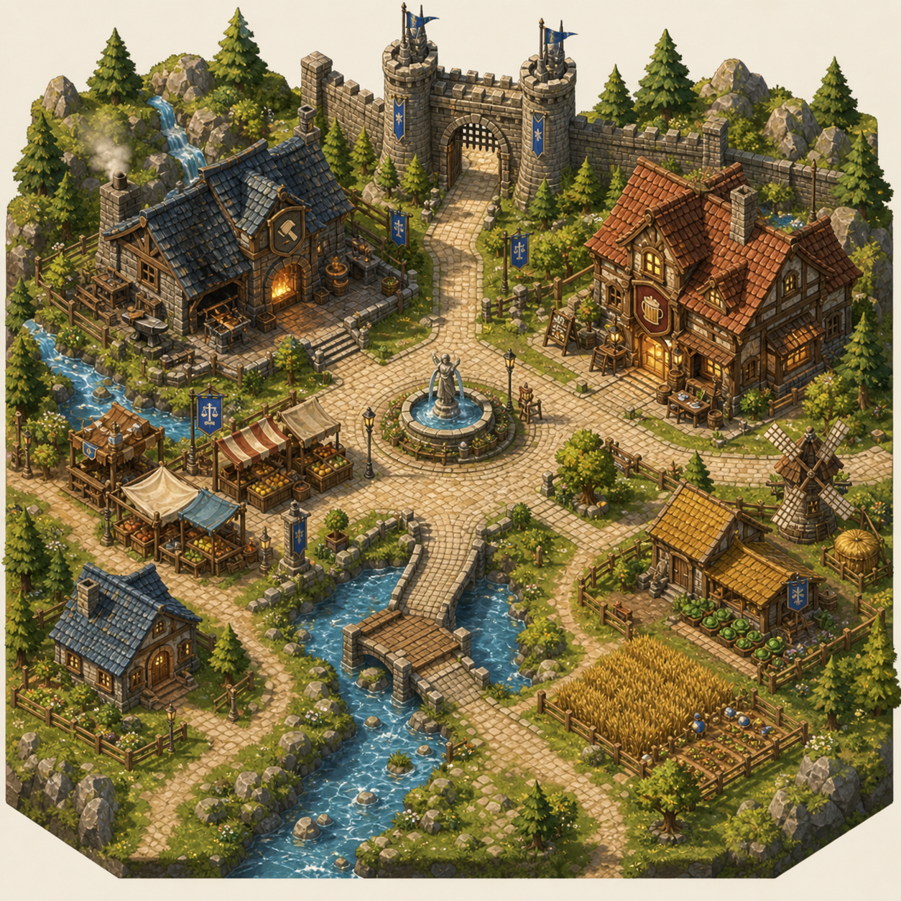
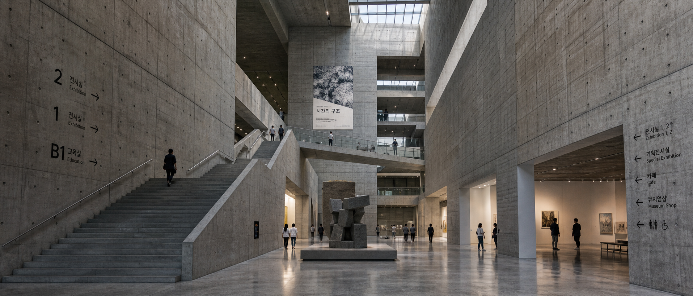
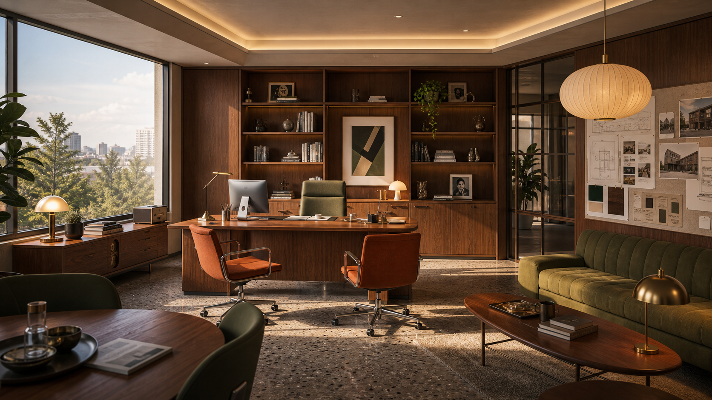
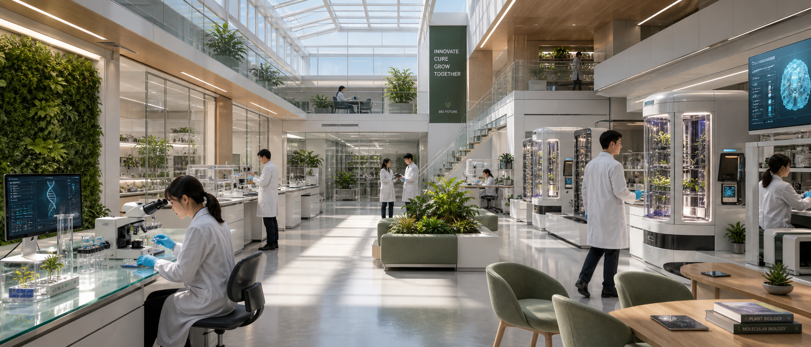
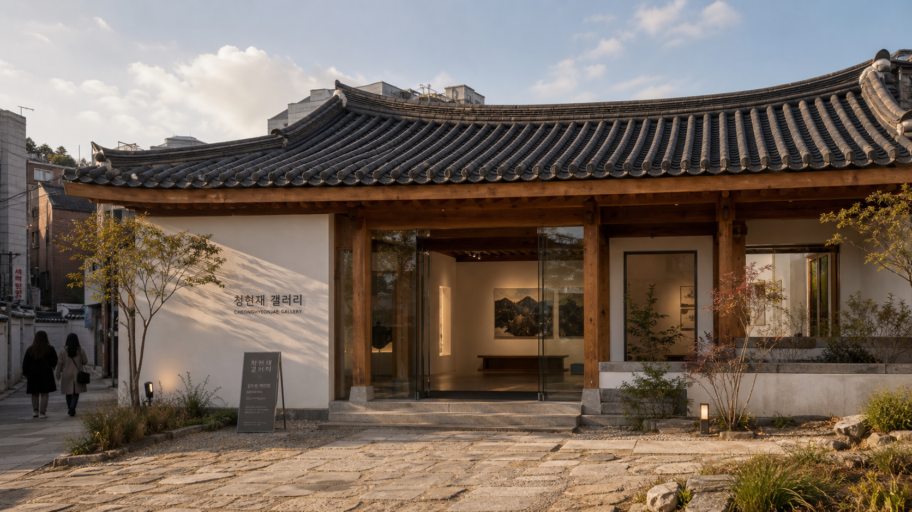
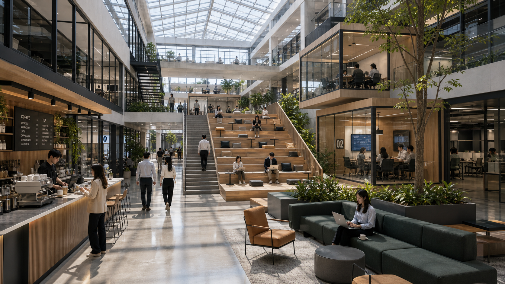
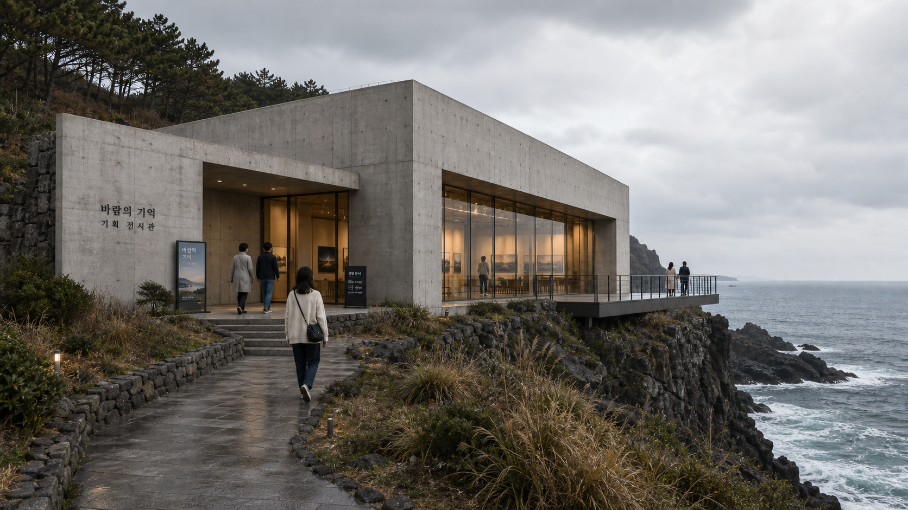
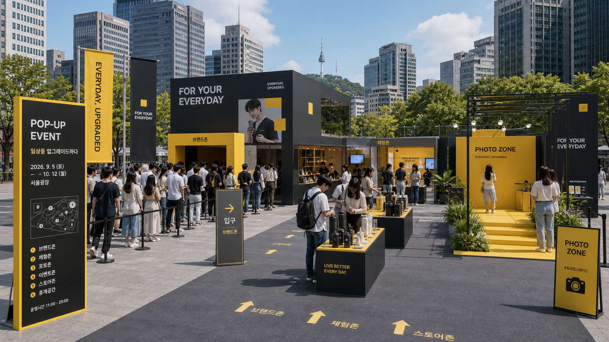

# 🏛️ 건물 사진

파일: `gallery-architecture-and-interior.md` · 10개 · 사이트 갤러리(index)의 실제 한국어 프롬프트

이 파일은 사이트 갤러리에 실제로 실린 완성 프롬프트를 담습니다. 공통 작성 규칙은 [`gpt-image-prompt-craft.md`](gpt-image-prompt-craft.md)와 함께 봅니다.

---

## 1. 아이소메트릭 미니 카페 거리


- 카테고리: 건물 사진
- 사이즈: Isometric · square · 1024x1024

```text
결과물 유형:
아이소메트릭 미니어처 디오라마 렌더링. 주제는 "아이소메트릭 미니 카페 거리"입니다. 완성 이미지는 동네 골목의 구조와 사용 목적을 동시에 설명해야 하며, 사람이 이동하고 머무를 수 있는 크기감이 보여야 합니다.

주 피사체:
한국의 동네 카페 골목을 축소한 아이소메트릭 미니어처 거리 블록. 2~3층 벽돌·스투코 건물들이 붙어 있고, 옥상마다 화분과 작은 나무를 올린 옥상 정원이 있습니다. 좌측 모서리에는 파란 차양과 크림색 파라솔, 야외 테이블을 갖춘 코너 카페가 있고 그 앞에 블랙보드 입간판이 놓여 있습니다. 우측 건물 하나는 한옥 기와지붕을 얹었습니다. 카페 야외석에 앉은 손님 2명, 골목을 걷는 보행자들, 계단을 오르는 사람까지 약 일곱 명의 한국인이 45도 시점 안에 흩어져 있고, 우측에는 게시판 옆에 자전거가 세워져 있습니다.

구도와 비율:
1:1 정사각형, 45도 아이소메트릭 부감. 블록 전체가 육각형 받침대 지반 위에 떠 있는 미니어처 형태로, 동선, 출입구, 카페와 상점의 위치 관계가 한눈에 읽히게 배치합니다. 앉거나 걷는 사람과 가구를 스케일 기준으로 넣어 공간의 크기를 판단할 수 있게 합니다.

맥락과 배경:
깔끔한 미니어처 질감, 부드러운 그림자, 파스텔·웜뉴트럴 색상, 격자 보도블록 위에 정돈된 공간감을 사용합니다. 크림색 무지 배경 위에 블록만 떠 있어 시선이 골목 구조에 집중되고, 불필요한 장식으로 시선을 빼앗지 않습니다.

스타일과 매체:
실무용 공간 시각화 성격의 아이소메트릭 디오라마 렌더링. 벽돌·유리·기와·차양 같은 재료, 채광, 사용 목적이 실제 공간처럼 읽히는 정돈된 렌더링을 사용합니다.

빛과 디테일:
조명: 부드러운 확산광과 은은한 그림자로 미니어처 질감을 살리고, 상점 유리창 안쪽에서 새어나오는 따뜻한 실내 조명을 표현합니다. 벽돌 벽, 유리창, 기와지붕, 보도블록에 빛이 다르게 닿는 느낌을 살립니다.
카메라 시점: 45도 아이소메트릭 부감 한 가지로 고정하고 원근을 끝까지 유지합니다.
디테일: 문 폭, 계단, 통로, 야외 테이블과 파라솔, 화분과 옥상 정원, 표면 재료, 자전거와 게시판을 실제 사용 가능한 수준으로 정리합니다.

정확성 조건:
문, 통로, 계단, 가구, 차양의 위치가 실제로 사용할 수 있게 보여야 합니다. 불가능한 원근감, 막힌 동선, 과도한 장식은 피합니다. 간판과 게시판의 문자는 판독 가능한 실제 텍스트로 새기지 말고 흐릿한 형태로만 남겨, 의미 없는 글자를 지어내지 않습니다.
```

---

## 2. 아이소메트릭 판타지 마을 지도



- 카테고리: 건물 사진
- 사이즈: Isometric · square · 1024x1024

```text
결과물 유형:
아이소메트릭 마을 일러스트, 판타지 게임용 안내 지도. 주제는 "아이소메트릭 판타지 마을 지도"입니다. 완성 이미지는 마을의 구조와 각 시설의 용도를 동시에 설명해야 하며, 건물과 길의 크기 관계로 사람이 오갈 만한 규모감이 보여야 합니다.

주 피사체:
판타지 게임용 아이소메트릭 마을 지도. 상단 중앙에 두 개의 탑과 파란 깃발이 달린 돌 성문과 성벽, 좌상단에 불 켜진 화덕과 망치 문양 간판을 단 대장간과 그 뒤 폭포, 우측에 붉은 기와 지붕과 맥주잔 간판을 단 여관, 중앙에 석상이 선 분수, 좌측에 줄무늬 차양의 과일 시장, 화면을 관통하는 강과 돌다리, 우하단에 밀밭과 채소밭을 가진 농장, 우측의 풍차, 좌하단의 파란 지붕 집을 45도 시점 한 화면에 배치합니다. 실제 인물은 등장하지 않고 분수 위 석상 하나만 세웁니다.

구도와 비율:
1:1 정사각형, 고정 아이소메트릭 조감. 동선, 성문 출입구, 중심 광장, 주변 시설의 위치 관계가 한눈에 읽히게 배치합니다. 건물과 길의 폭, 다리와 계단으로 마을의 크기를 판단할 수 있게 하고, 화면은 크림색 여백 위에 팔각으로 모서리가 잘린 지도 판형으로 앉힙니다.

맥락과 배경:
따뜻한 색감, 돌길과 건물의 관계, 침엽수와 바위, 마을 전체를 잇는 이동 경로가 보이게 만듭니다. 강물과 폭포, 파란 깃발(저울 문양)이 배경을 채우되, 주 피사체를 설명하는 근거로만 쓰고 불필요한 장식으로 시선을 빼앗지 않습니다.

스타일과 매체:
손으로 그린 듯한 게임 아트풍 아이소메트릭 마을 일러스트. 지붕 기와, 돌벽, 나무 울타리, 물결 같은 재료 질감이 또렷하게 읽히는 정돈된 렌더링을 사용합니다.

빛과 디테일:
조명: 따뜻한 낮 빛으로 돌길과 건물, 침엽수와 바위, 마을 전체의 이동 경로가 선명하게 보이게 하고, 대장간 화덕과 여관 창문에는 따뜻한 실내광이 새어 나오게 합니다. 지붕과 벽, 길바닥 재료에 빛이 다르게 닿는 느낌을 살립니다.
카메라 시점: 45도 아이소메트릭 조감을 화면 끝까지 일관되게 유지합니다.
디테일: 성문, 돌다리, 계단, 시장 좌판, 밀밭, 풍차, 분수 석상, 간판 문양을 실제 마을처럼 정리합니다.

정확성 조건:
성문, 돌다리, 길, 계단, 광장의 위치가 실제로 오갈 수 있게 이어지도록 보여야 합니다. 간판은 글자가 아니라 아이콘(망치, 맥주잔, 저울)으로 표기하고, 읽을 수 없는 가짜 문자는 넣지 않습니다. 불가능한 원근감, 막힌 동선, 과도한 장식은 피합니다.
```

---

## 3. 브루탈리즘 콘크리트 박물관 아트리움



- 카테고리: 건물 사진
- 사이즈: Architecture & Interior · wide · 2520x1080

```text
결과물 유형:
건축 사진 렌더링. 주제는 "브루탈리즘 콘크리트 박물관 아트리움"입니다. 완성 이미지는 공간의 구조와 사용 목적을 동시에 설명해야 하며, 사람이 이동하고 머무를 수 있는 크기감이 보여야 합니다.

주 피사체:
브루탈리즘 콘크리트 박물관의 거대한 아트리움. 왼쪽에는 폭 넓은 기념비적 계단이 위층으로 이어지고, 중앙 바닥에는 낮은 받침대 위에 거친 표면의 대형 추상 석조 조각이 놓입니다. 높은 천장, 노출 콘크리트 벽, 천창, 상층 통로와 여러 층의 개구부가 함께 보이며, 계단과 바닥과 상층 통로에 흩어진 여러 명의 관람객이 스케일 기준으로 배치됩니다. 중심 피사체의 형태, 위치, 행동이 먼저 읽히고 보조 요소는 주제를 설명하는 단서로만 사용합니다.

구도와 비율:
21:9 와이드 건축 사진. 사람 눈높이에서 아트리움 전체를 담아 계단, 중앙 조각, 상층 통로, 좌우 콘크리트 벽의 안내 표식과 우측 전시실 개구부가 한눈에 읽히게 배치합니다. 계단을 오르내리는 사람과 바닥을 걷는 사람을 스케일 기준으로 넣어 공간의 크기를 판단할 수 있게 합니다.

맥락과 배경:
차가운 자연광, 거친 콘크리트 질감, 큰 스케일 대비, 조용한 전시 공간 분위기를 사용합니다. 천창에서 들어오는 빛이 콘크리트 표면과 광택 있는 바닥에 부드럽게 번지고, 우측에는 그림이 걸린 전시실 개구부가 이어집니다. 배경은 주 피사체를 설명하는 근거가 되어야 하며, 불필요한 장식으로 시선을 빼앗지 않습니다.

스타일과 매체:
실무용 건축 사진 렌더링. 구조, 재료, 채광, 사용 목적이 실제 공간처럼 읽히는 정돈된 사실적 렌더링을 사용합니다.

빛과 디테일:
조명: 차가운 자연광, 거친 콘크리트 질감, 큰 스케일 대비, 조용한 전시 공간 분위기를 사용합니다. 천장, 벽, 바닥 재료에 빛이 다르게 닿는 느낌을 살립니다.
카메라 시점: 사람 눈높이의 넓은 건축 사진 시점을 선택하고 원근을 끝까지 유지합니다.
디테일: 계단, 난간, 통로, 표면 재료, 벽면 안내 표식을 실제 사용 가능한 수준으로 정리합니다.

정확성 조건:
좌측 콘크리트 벽에는 위에서부터 "2 전시실 Exhibition", "1 전시실 Exhibition", "B1 교육실 Education" 안내 표식이 화살표와 함께 표시되고, 우측 벽에는 "전시실 1, 2 / Exhibition 1, 2", "기획전시실 / Special Exhibition", "카페 / Cafe", "뮤지엄샵 / Museum Shop"과 화장실·장애인 픽토그램이 화살표와 함께 표시됩니다. 중앙 상층부에는 현수막 "시간의 구조"가 걸립니다. 문, 통로, 계단, 안내 표식의 위치가 실제로 사용할 수 있게 보여야 하며, 불가능한 원근감, 막힌 동선, 과도한 장식, 의미 없는 간판 문자는 피합니다.
```

---

## 4. 미드센추리 모던 사무실



- 카테고리: 건물 사진
- 사이즈: Architecture & Interior · landscape · 1920x1080

```text
결과물 유형:
실내 공간 렌더링, 건축·인테리어 시각화. 주제는 "미드센추리 모던 사무실"입니다. 완성 이미지는 임원 집무실의 구조와 사용 목적을 동시에 설명해야 하며, 사람이 이동하고 머무를 수 있는 크기감이 보여야 합니다.

주 피사체:
미드센추리 모던 스타일의 임원 집무실 렌더. 중앙에 큰 원목 임원 책상과 그 위 데스크톱 컴퓨터, 황동 데스크 램프를 두고, 책상 뒤에는 녹색 가죽 하이백 회전 의자, 책상 앞에는 러스트 오렌지색 가죽 회전 의자 두 개를 배치합니다. 배경 벽에는 책과 액자, 식물, 소품이 놓인 원목 붙박이 책장 벽을 세웁니다. 중심 피사체의 형태, 위치, 배치가 먼저 읽히고 보조 요소는 주제를 설명하는 단서로만 사용합니다.

구도와 비율:
16:9 가로형 실내 사진 시점. 왼쪽에는 도시 스카이라인과 나무가 보이는 큰 통창, 오른쪽에는 낮은 녹색 벨벳 소파와 원목 타원형 커피 테이블을 두어 공간의 좌우 깊이가 한눈에 읽히게 배치합니다. 책상·의자·가구를 스케일 기준으로 넣어 공간의 크기를 판단할 수 있게 합니다.

맥락과 배경:
따뜻한 목재 질감, 절제된 색상(우드톤, 오렌지, 올리브 그린), 잡지 인테리어 화보 같은 정돈된 구도를 사용합니다. 창가 원목 콘솔 위 램프와 화분, 오른쪽 벽의 건축 도면·사진·재료 스와치가 붙은 무드보드가 배경을 채웁니다. 배경은 주 피사체를 설명하는 근거가 되어야 하며, 불필요한 장식으로 시선을 빼앗지 않습니다.

스타일과 매체:
실무용 인테리어 시각화. 구조, 재료, 채광, 사용 목적이 실제 공간처럼 읽히는 정돈된 포토리얼 렌더링을 사용합니다.

빛과 디테일:
조명: 왼쪽 통창에서 들어오는 따뜻한 자연광과 천장 코브 조명, 넬슨 스타일 버블 펜던트, 황동 테이블 램프가 어우러진 따뜻한 색온도를 사용합니다. 천장, 원목 벽, 테라조 바닥 재료에 빛이 다르게 닿는 느낌을 살립니다.
카메라 시점: 사람 눈높이의 넓은 실내 건축 사진 시점을 사용하고 원근을 끝까지 유지합니다.
디테일: 가구 배치, 표면 재료, 책장 소품, 창밖 풍경, 무드보드 질감을 실제 공간 수준으로 정리합니다.

정확성 조건:
책상, 의자, 소파, 책장, 통로의 위치가 실제로 사용할 수 있게 보여야 합니다. 인물은 등장하지 않습니다. 불가능한 원근감, 막힌 동선, 과도한 장식, 읽히는 간판 문자나 의미 없는 글자는 피합니다.
```

---

## 5. 바이오필릭 바이오테크 연구실



- 카테고리: 건물 사진
- 사이즈: Architecture & Interior · wide · 2520x1080

```text
결과물 유형:
건축 인테리어 사진. 주제는 "바이오필릭 바이오테크 연구실"입니다. 완성 이미지는 사람이 실제로 이동하고 머무는 실내 공간의 구조와 사용 목적을 동시에 설명해야 하며, 여러 명이 동시에 일하는 크기감이 보여야 합니다.

주 피사체:
식물과 첨단 장비가 공존하는 넓은 바이오테크 연구실 내부. 흰 가운을 입은 아시아계 연구원 약 아홉 명이 각자 다른 작업을 합니다. 왼쪽 앞에는 여성 연구원이 앉아 현미경을 보고, 중앙에서는 두 연구원이 태블릿을 들고 대화하며, 오른쪽에서는 남성 연구원이 발광하는 유리 배양 챔버 앞에 서 있습니다. 유리 실험대, 시험관, 녹색 벽, 발광하는 원통형 배양 장치가 함께 배치되고, 보조 요소는 연구실이라는 주제를 설명하는 단서로만 사용합니다.

구도와 비율:
21:9 와이드 건축 인테리어 사진. 사람 눈높이 시점으로 중앙 통로가 안쪽으로 뻗어 깊이가 읽히게 배치합니다. 왼쪽 실험대 열, 중앙 라운지, 오른쪽 배양 챔버 열의 위치 관계가 한눈에 들어오고, 상층 메자닌에도 인물이 보여 공간의 층과 규모를 판단할 수 있게 합니다.

맥락과 배경:
깨끗한 흰색과 녹색, 금속과 유리 재질, 유리 채광 천장에서 쏟아지는 자연광, 실험실의 기능성이 보이게 합니다. 왼쪽 벽면 전체를 덮은 녹색 리빙월, 곳곳의 화분, 녹색 라운지 의자와 오른쪽 앞의 원목 테이블이 바이오필릭 분위기를 만듭니다. 배경은 주 피사체를 설명하는 근거가 되어야 하며, 불필요한 장식으로 시선을 빼앗지 않습니다.

스타일과 매체:
실무용 건축 인테리어 사진. 구조, 재료, 채광, 사용 목적이 실제 공간처럼 읽히는 정돈된 사실적 렌더링을 사용합니다.

빛과 디테일:
조명: 유리 채광 천장에서 들어오는 밝은 자연광이 반들거리는 바닥에 반사되고, 오른쪽 배양 챔버는 보라·청색 그로우 라이트로 은은하게 빛납니다. 천장, 벽, 바닥 재료에 빛이 다르게 닿는 느낌을 살립니다.
카메라 시점: 사람 눈높이의 넓은 건축 사진 시점을 사용하고 원근을 끝까지 유지합니다.
디테일: 통로, 가구 배치, 표면 재료, 모니터의 DNA 그래픽, 시험관과 실험 기구를 실제 사용 가능한 수준으로 정리합니다.

정확성 조건:
중앙 상단의 녹색 세로 배너에는 "INNOVATE", "CURE", "GROW", "TOGETHER"와 그 아래 "BIO FUTURE"가 읽히게 하고, 오른쪽 앞 원목 테이블 위 책등에는 "PLANT BIOLOGY"와 "MOLECULAR BIOLOGY"가 보이게 합니다. 통로와 가구, 사이니지의 위치가 실제로 사용할 수 있게 보여야 하며, 불가능한 원근감, 막힌 동선, 뜻 없는 간판 문자는 피합니다.
```

---

## 6. 고딕 대성당 내부


- 카테고리: 건물 사진
- 사이즈: Architecture & Interior · tall · 1536x2048

```text
결과물 유형:
사실적 실내 건축 사진. 주제는 "고딕 대성당 내부"입니다. 완성 이미지는 웅장한 성당 신랑(nave) 공간의 구조와 압도적인 수직감을 실제 촬영한 사진처럼 담아야 하며, 사람이 그 안을 걷고 머무는 크기감이 드러나야 합니다.

주 피사체:
고딕 대성당 내부의 중앙 통로를 정면으로 바라본 웅장한 공간. 하늘로 치솟는 뾰족 아치와 리브 볼트 천장, 좌우로 늘어선 거대한 석조 기둥, 중앙 안쪽의 큰 장미창과 세로로 긴 스테인드글라스, 그 아래 금빛 고딕 제단이 대칭 구도로 놓입니다. 전경 중앙에는 베이지색 재킷을 입고 크로스백을 멘 방문객 한 명이 제단 쪽으로 걸어가고, 원경 제단 근처에 여러 방문객의 작은 실루엣이 흩어져 있어 공간의 스케일을 보여줍니다.

구도와 비율:
3:4 세로형, 사람 눈높이에서 중앙 통로를 정면으로 응시하는 완전 대칭 구도. 소실점은 안쪽 제단과 장미창에 모이며, 좌우 기둥 열과 나무 신도석이 원근으로 뻗어 깊이감을 만듭니다. 전경의 인물을 스케일 기준으로 삼아 공간의 거대함을 판단할 수 있게 합니다.

맥락과 배경:
좌우 벽에는 금빛 십자 문양이 새겨진 짙은 붉은색 세로 배너가 대칭으로 걸려 있고, 양옆으로 촛불이 켜진 촛대들이 늘어섭니다. 바닥은 검고 흰 체크무늬 대리석이며 좌우로 짙은 색 나무 신도석이 규칙적으로 배열됩니다. 배경은 주 피사체를 설명하는 근거가 되며 불필요한 장식으로 시선을 빼앗지 않습니다.

스타일과 매체:
사실적 건축 실내 사진. 석재 질감, 스테인드글라스의 색광, 목재와 대리석 표면이 실제 공간처럼 읽히는 자연스러운 사진 톤을 사용합니다.

빛과 디테일:
조명: 오른쪽 상단에서 비스듬히 쏟아지는 뚜렷한 빛기둥(god ray)이 통로를 가로지르고, 스테인드글라스를 통과한 푸른 색광이 어두운 석조 실내에 스며듭니다. 전체는 어둡고 장엄하며 조용한 분위기이고, 천장·벽·바닥 재료에 빛이 다르게 닿습니다.
카메라 시점: 사람 눈높이의 넓은 건축 사진 시점으로 중앙 통로를 정면 대칭으로 잡고 원근을 끝까지 유지합니다.
디테일: 기둥의 세로 홈, 볼트 천장의 리브, 장미창과 스테인드글라스의 문양, 촛대의 불꽃, 배너의 금빛 자수, 대리석 바닥의 반사와 인물의 그림자를 사실적으로 정리합니다.

정확성 조건:
인물 수는 전경에 걷는 방문객 한 명과 원경 제단 근처의 여러 방문객 실루엣으로 정확히 유지합니다. 좌우 붉은 배너, 촛대, 기둥, 신도석은 완전 대칭으로 배치합니다. 화면 어디에도 문자·간판·표지판·로고를 넣지 않습니다. 불가능한 원근감이나 과장된 왜곡은 피하고 실제 성당 사진처럼 자연스럽게 유지합니다.
```

---

## 7. 한옥 리노베이션 갤러리 외관



- 카테고리: 건물 사진
- 사이즈: Events & Experience · landscape · 1920x1080

```text
결과물 유형:
건물 사진 또는 건축 시각화. 주제는 "한옥 리노베이션 갤러리 외관"입니다. 완성 이미지는 건축 매체에 실리는 외관 사진처럼 보여야 하며, 기존 한옥 구조와 현대 갤러리 기능이 함께 읽혀야 합니다.

주 피사체:
서울의 오래된 한옥을 현대 미술 갤러리로 리노베이션한 외관. 완만하게 휜 검은 기와지붕, 굵은 목재 기둥과 보, 흰 회벽, 넓은 유리 미닫이 출입구, 은은한 조경을 한 화면에 배치합니다. 흰 회벽에는 "청현재 갤러리"와 그 아래 "CHEONGHYEONJAE GALLERY" 문구가 붙어 있고, 입구 앞에는 갤러리 이름과 전시 안내가 적힌 검은 A자형 스탠드 안내판이 놓여 있습니다. 건물의 입구와 지붕선이 가장 먼저 읽히고, 왼쪽 골목을 걸어가는 여성 2명(뒷모습)은 건물 규모를 보여주는 보조 요소로만 둡니다.

구도와 비율:
16:9 가로형 화면. 사람 눈높이보다 약간 낮은 건축 사진 시점으로 촬영합니다. 건물 정면은 화면 중앙에 두고, 지붕선과 마당의 수평선을 안정적으로 맞춥니다. 전경에는 넓은 돌 포장 마당과 낮은 식재를 두어 입구로 시선이 이어지게 합니다.

맥락과 배경:
조용한 서울 골목 안의 갤러리. 전통 목재와 현대 유리, 회벽의 질감이 대비되도록 구성합니다. 왼쪽 뒤편으로 도심의 낮은 건물들이 흐릿하게 보이지만, 주 피사체인 한옥 갤러리가 배경에 묻히지 않게 합니다.

스타일과 매체:
현실적인 건축 사진 스타일. 건물의 재료, 구조, 입구, 조경, 빛의 방향이 실제 사용 가능한 공간처럼 보이도록 정돈합니다. 잡지 건축 화보처럼 절제된 색감과 깨끗한 원근을 사용합니다.

빛과 디테일:
조명: 늦은 오후의 부드러운 황금빛 자연광. 기와의 곡선, 목재 결, 흰 회벽의 미세한 질감, 유리문의 반사가 자연스럽게 보이도록 합니다.
카메라 시점: 28mm 렌즈 느낌의 넓은 건축 사진 시점. 수직선이 과하게 기울지 않게 하고 건물의 실제 비례를 유지합니다.
디테일: 기와 끝선, 목재 기둥의 결, 문지방, 돌 포장 바닥, 벽면 글자판, 식재 그림자, 유리 안쪽에 걸린 산수화 프레임과 전시 벤치, 따뜻한 전시 조명을 선명하게 표현합니다.

정확성 조건:
건물 구조와 입구가 실제로 사용할 수 있게 보여야 합니다. 흰 회벽의 문구는 "청현재 갤러리"와 "CHEONGHYEONJAE GALLERY"로 또렷하게 읽히고, 입구 앞 검은 안내판의 한글 글자도 자연스럽게 보이도록 합니다. 불가능한 지붕 구조, 뒤틀린 기둥, 막힌 동선, 과도한 전통 장식, 실제 상업 브랜드 로고는 피합니다.
```

---

## 8. 도심 공유 오피스 아트리움



- 카테고리: 건물 사진
- 사이즈: 준비 중 · 빈 카드

```text
결과물 유형:
실내 건축 사진. 주제는 "도심 공유 오피스 아트리움"입니다. 완성 이미지는 공간의 구조와 사용 목적을 동시에 설명해야 하며, 사람이 이동하고 머무를 수 있는 크기감이 실제 사진처럼 보여야 합니다.

주 피사체:
서울 도심 공유 오피스의 중앙 아트리움. 높은 유리 천장(스카이라이트), 중앙의 목재 계단식 좌석과 계단, 오른쪽의 유리벽 회의실 박스(하나에 "02" 표식), 왼쪽의 카페 카운터와 바리스타, 노트북으로 일하거나 걷는 여러 명의 한국인 직장인을 배치합니다. 중심 피사체의 형태, 위치, 행동이 먼저 읽히고 보조 요소는 주제를 설명하는 단서로만 사용합니다.

구도와 비율:
16:9 가로형, 사람 눈높이의 넓은 건축 사진 시점. 동선, 출입구, 중심 시설, 주변 요소의 위치 관계가 한눈에 읽히게 배치합니다. 사람이나 가구를 스케일 기준으로 넣어 공간의 크기를 판단할 수 있게 합니다.

맥락과 배경:
밝은 자연광, 식물, 목재와 금속 재료, 2~3개 층이 열린 현대적인 업무 공간의 개방감을 표현합니다. 배경은 주 피사체를 설명하는 근거가 되어야 하며, 불필요한 장식으로 시선을 빼앗지 않습니다.

스타일과 매체:
사실적인 실내 건축 사진. 구조, 재료, 채광, 사용 목적이 실제 공간처럼 읽히는 정돈된 렌더링을 사용합니다.

빛과 디테일:
조명: 유리 천장에서 쏟아지는 밝은 자연광이 반들거리는 콘크리트 바닥에 반사되고, 식물과 목재, 금속 표면에 빛이 다르게 닿는 느낌을 살립니다.
카메라 시점: 사람 눈높이의 넓은 건축 사진 시점을 사용하고 원근을 끝까지 유지합니다.
디테일: 계단, 통로, 계단식 좌석, 소파와 라운지 가구, 카페 카운터의 커피 머신, 유리 회의실을 실제 사용 가능한 수준으로 정리합니다.

정확성 조건:
문, 통로, 계단, 가구, 안내 표식의 위치가 실제로 사용할 수 있게 보여야 합니다. 왼쪽 카페 메뉴판에는 "COFFEE", "TEA" 제목과 ESPRESSO, AMERICANO, LATTE, CAPPUCCINO, VANILLA LATTE, COLD BREW 같은 실제 커피 메뉴 문구가 읽히게 하고, 오른쪽 회의실 박스에는 "02" 표식이 보이게 합니다. 불가능한 원근감, 막힌 동선, 과도한 장식은 피합니다.
```

---

## 9. 해안가 작은 전시관



- 카테고리: 건물 사진
- 사이즈: 준비 중 · 빈 카드

```text
결과물 유형:
사실적 건축 사진. 주제는 "해안가 작은 전시관"입니다. 완성 이미지는 절벽 위에 놓인 콘크리트 전시관 한 채가 실제로 존재하는 장소처럼 읽혀야 하며, 사람이 그 앞을 걷고 안팎에 머무는 크기감이 자연스럽게 드러나야 합니다.

주 피사체:
한국 해안 절벽 위에 세워진 작은 콘크리트 전시관. 낮고 평평한 지붕, 노출 콘크리트 매스, 큰 통유리창, 바다 쪽으로 뻗은 난간 있는 전망 데크, 캐노피가 드리운 전시장 입구를 갖춥니다. 콘크리트 정면 벽에는 큰 글씨로 "바람의 기억", 그 아래 작은 글씨로 "기획 전시관"이 새겨져 있고, 입구 옆 세로 배너에도 "바람의 기억"이 적혀 있습니다. 인물은 여러 명입니다. 돌길을 따라 입구로 걸어오는 크로스백을 멘 여성, 입구 계단 옆의 한국인 커플, 유리창 너머 실내 전시장을 둘러보는 관람객, 오른쪽 데크에서 바다를 바라보는 두 사람을 배치합니다.

구도와 비율:
16:9 가로형, 사람 눈높이의 넓은 건축 사진 시점. 왼쪽 하단에서 완만히 올라가는 돌 포장길이 입구로 이어지고, 건물 매스는 화면 중앙에서 오른쪽으로 뻗으며 데크가 바다 위 절벽 끝에 걸칩니다. 걷는 사람과 계단, 난간을 스케일 기준으로 넣어 공간의 실제 크기를 판단할 수 있게 합니다.

맥락과 배경:
흐린 해안빛, 낮게 깔린 회색 구름, 거친 검은 바위, 파도가 이는 바다, 언덕을 덮은 소나무 숲, 단정한 노출 콘크리트 매스를 강조합니다. 배경은 전시관이 놓인 해안 절벽이라는 맥락을 설명하는 근거가 되어야 하며, 불필요한 장식으로 시선을 빼앗지 않습니다.

스타일과 매체:
사실적 건축 사진. 노출 콘크리트의 질감, 유리 반사, 젖은 돌길, 자연광의 밀도가 실제 촬영본처럼 읽히는 정돈된 이미지를 사용합니다.

빛과 디테일:
조명: 흐린 해안의 확산광으로 외부는 차분한 회색톤을 유지하되, 유리창 너머 실내 전시장에서는 따뜻한 웜톤 조명이 새어 나와 외부의 서늘함과 대비를 이룹니다. 콘크리트 벽, 유리, 젖은 바닥 재료에 빛이 다르게 닿는 느낌을 살립니다.
카메라 시점: 사람 눈높이의 넓은 건축 사진 시점을 사용하고 자연스러운 원근을 끝까지 유지합니다.
디테일: 문 폭, 진입 계단, 돌 포장 통로, 데크 난간, 노출 콘크리트와 유리 표면, 입구 안내 배너와 입간판을 실제 사용 가능한 수준으로 정리합니다.

정확성 조건:
벽면의 "바람의 기억"과 "기획 전시관", 입구 배너의 "바람의 기억" 글자가 또렷하고 자연스럽게 보여야 합니다. 문, 통로, 계단, 데크, 난간의 위치가 실제로 사용할 수 있게 보여야 하며, 불가능한 원근감, 막힌 동선, 과도한 장식, 왜곡된 한글 글자는 피합니다.
```

---

## 10. 야외 브랜드 팝업 공간



- 카테고리: 건물 사진
- 사이즈: 준비 중 · 빈 카드

```text
결과물 유형:
공간 렌더링, 실무용 건축 시각화입니다. 주제는 "야외 브랜드 팝업 공간"입니다. 완성 이미지는 공간의 구조와 사용 목적을 동시에 설명해야 하며, 사람이 이동하고 머무를 수 있는 크기감이 보여야 합니다.

주 피사체:
서울광장에 설치된 검정과 노랑 색상의 야외 브랜드 팝업 공간. 모듈형 부스, 제품 체험 테이블(검정 텀블러와 소품이 놓임), 한국인 방문객의 긴 대기 줄, 세로형 안내 배너와 사인, 노란색 포토존, 바닥에 노란 화살표로 표시된 동선을 한 화면에 배치합니다. 중심 피사체의 형태, 위치, 행동이 먼저 읽히고 보조 요소는 주제를 설명하는 단서로만 사용합니다.

구도와 비율:
16:9 가로형, 사람 눈높이의 넓은 건축 사진 시점입니다. 동선, 출입구, 중심 시설, 주변 요소의 위치 관계가 한눈에 읽히게 배치합니다. 다수의 방문객과 가구를 스케일 기준으로 넣어 공간의 크기를 판단할 수 있게 합니다.

맥락과 배경:
밝은 낮 조명, 브랜드 색상 포인트(검정·노랑), 동선이 명확한 이벤트 공간 디자인을 사용합니다. 배경에는 서울 도심의 고층 빌딩군과 멀리 남산타워, 녹지가 보입니다. 배경은 주 피사체를 설명하는 근거가 되어야 하며, 불필요한 장식으로 시선을 빼앗지 않습니다.

스타일과 매체:
실무용 공간 시각화. 구조, 재료, 채광, 사용 목적이 실제 공간처럼 읽히는 정돈된 렌더링을 사용합니다.

빛과 디테일:
조명: 맑은 낮의 자연광, 브랜드 색상 포인트, 동선이 명확한 이벤트 공간 디자인을 사용합니다. 천장, 벽, 바닥 재료에 빛이 다르게 닿는 느낌을 살리고 지면에 인물과 부스의 그림자를 떨어뜨립니다.
카메라 시점: 사람 눈높이의 넓은 건축 사진 시점을 유지하고 원근을 끝까지 지킵니다.
디테일: 부스 출입구 폭, 통로, 가구 배치, 표면 재료, 안내 표식을 실제 사용 가능한 수준으로 정리합니다.

정확성 조건:
문, 통로, 가구, 안내 표식의 위치가 실제로 사용할 수 있게 보여야 합니다. 불가능한 원근감, 막힌 동선, 과도한 장식은 피합니다. 이미지 안에 보이는 문구는 다음을 그대로 표기합니다: 왼쪽 대형 사인 "POP-UP EVENT", "일상을 업그레이드하다", "2026. 9. 5 (토) ~ 10. 12 (월)", "서울광장", "운영시간 11:00-20:00"과 존 목록 "1 브랜드존 2 체험존 3 포토존 4 이벤트존 5 스토어존 6 휴게공간". 세로 배너 "EVERYDAY, UPGRADED.", 부스 벽면 "FOR YOUR EVERYDAY", 입구 사인 "입구 브랜드존"과 오른쪽 화살표, "브랜드존", "체험존", 체험 테이블 앞 "LIVE BETTER EVERY DAY", 오른쪽 "PHOTO ZONE"과 "#일상업그레이드", 바닥 화살표 옆 "브랜드존", "체험존", "스토어존". 목록에 없는 브랜드명이나 문구는 새로 지어내지 않습니다.
```
