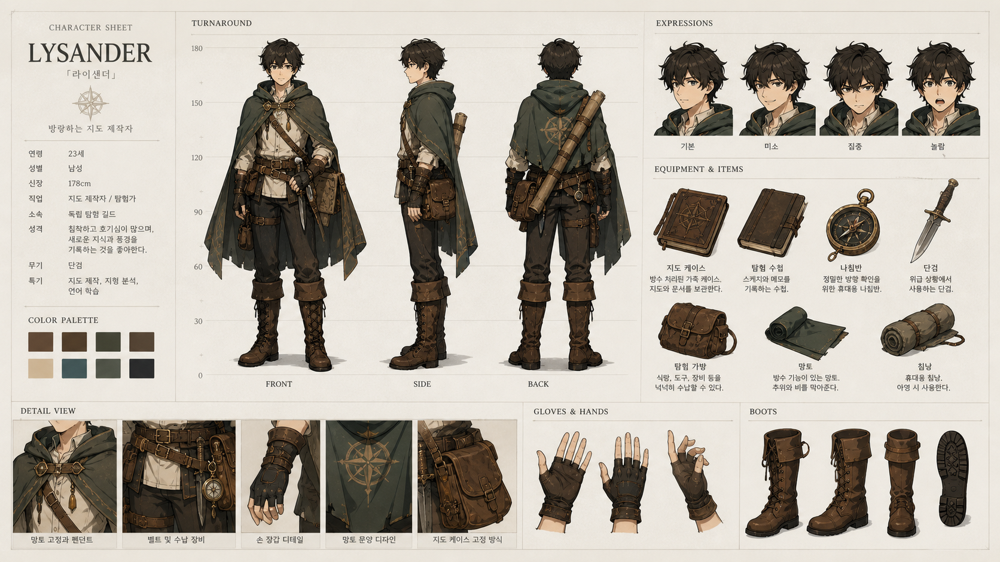

# 🎨 일러스트

파일: `gallery-character-design.md` · 2개 · 사이트 갤러리(index)의 실제 한국어 프롬프트

이 파일은 사이트 갤러리에 실제로 실린 완성 프롬프트를 담습니다. 공통 작성 규칙은 [`craft.md`](craft.md)와 함께 봅니다.

---

## 1. 공식 캐릭터 설정 시트



- 카테고리: 일러스트
- 사이즈: Character Design · landscape · 1920x1080

```text
결과물 유형:
완성형 캐릭터 설정 시트 일러스트. 주제는 "공식 캐릭터 설정 시트"입니다. 하나의 매체로 끝까지 제작된 애니메이션/망가풍 컬러 아트워크처럼 보여야 하며, 여러 뷰와 소품이 하나의 도큐먼트 레이아웃으로 정리되어야 합니다. 주 피사체의 형태가 장식보다 먼저 읽혀야 합니다.

주 피사체:
원작이 없는 신규 캐릭터의 공식 설정 시트. 망토를 두른 흑발 남성 탐험가 겸 지도 제작자 한 명(약 23세, 신장 178cm)이 주 피사체입니다. 낡은 진녹색 후드 망토, 흰 셔츠, 다수의 벨트와 파우치, 무릎까지 오는 갈색 가죽 부츠, 손가락 없는 장갑을 착용합니다. 화면 상단에는 정면·측면·후면 전신 턴어라운드 3포즈, 우측 상단에는 표정 네 가지, 우측 중단에는 장비 아이템, 하단에는 디테일 컷, 장갑, 부츠가 배치됩니다. 중심 피사체가 먼저 읽히고 보조 요소는 주제를 설명하는 단서로만 사용합니다.

구도와 비율:
16:9 가로형 완성형 캐릭터 아트워크. 좌측에 캐릭터 정보 패널, 중앙에 전신 턴어라운드, 우측에 표정과 장비, 아래 띠에 디테일 컷을 두는 그리드 레이아웃입니다. 주 피사체의 실루엣을 먼저 읽히게 배치하고, 각 칸의 크기와 간격을 일정하게 맞추며 얇은 구분선으로 영역을 나눕니다.

맥락과 배경:
따뜻한 아이보리 톤의 깨끗한 종이 배경, 얇은 구분선, 일관된 얼굴과 의상, 제작 자료처럼 읽히는 시트형 레이아웃을 사용합니다. 턴어라운드 옆에는 0에서 180까지의 신장 눈금선이 들어갑니다. 좌측에는 8칸짜리 갈색·크림·틸·짙은 남색 계열 컬러 팔레트가 놓입니다. 배경은 주 피사체를 설명하는 근거가 되어야 하며 불필요한 장식으로 시선을 빼앗지 않습니다.

스타일과 매체:
애니메이션/망가풍의 채색 일러스트. 또렷한 라인아트, 부드러운 셀 음영, 갈색과 진녹색 위주의 절제된 컬러가 하나의 제작 방식으로 통일되어야 합니다. 서로 다른 매체 질감을 섞지 않습니다.

빛과 디테일:
조명: 깨끗한 종이 배경 위 균일하고 부드러운 조명. 형태가 무너지지 않도록 그림자와 하이라이트를 절제합니다.
카메라 시점: 턴어라운드는 정면·측면·후면을 같은 높이로 맞추고, 표정과 장비 아이템은 정면 고정 뷰로 또렷하게 보여줍니다.
디테일: 손, 얼굴, 망토 주름, 벨트와 버클, 나침반 문양, 파우치, 부츠 끈, 장갑의 반복 규칙을 또렷하게 표현합니다.

정확성 조건:
주 피사체가 장식에 묻히지 않아야 합니다. 손, 얼굴, 패턴, 글자 왜곡을 피합니다. 이미지에 다음 텍스트를 정확히 표기합니다: 상단 좌측 "CHARACTER SHEET", 대형 제목 "LYSANDER"와 그 아래 "「라이샌더」", 소개 문구 "방랑하는 지도 제작자". 좌측 스탯 표에는 "연령 23세", "성별 남성", "신장 178cm", "직업 지도 제작자 / 탐험가", "소속 독립 탐험 길드", "성격", "무기 단검", "특기" 항목을 넣습니다. 섹션 제목은 "TURNAROUND", "EXPRESSIONS", "EQUIPMENT & ITEMS", "COLOR PALETTE", "DETAIL VIEW", "GLOVES & HANDS", "BOOTS"로 적고, 턴어라운드 하단에 "FRONT", "SIDE", "BACK", 표정 라벨에 "기본", "미소", "집중", "놀람"을 표기합니다. 원작이 없는 신규 캐릭터로 만듭니다.
```

---

## 2. 엘프 궁수 스케치북 설정 시트


- 카테고리: 일러스트
- 사이즈: Character Design · portrait · 1536x2048

```text
결과물 유형:
완성형 캐릭터 콘셉트 시트 일러스트. 주제는 "엘프 궁수 스케치북 설정 시트"입니다. 한 장의 스케치북 페이지처럼 끝까지 제작된 작품으로 보여야 하며, 중앙 전신 캐릭터의 형태가 주변 설명 요소보다 먼저 읽혀야 합니다.

주 피사체:
숲의 여성 엘프 궁수 1인을 다각도로 정리한 스케치북형 캐릭터 콘셉트 시트. 같은 캐릭터를 여러 컷으로 전개합니다. 좌상단에 "엘프 궁수" 제목과 설정 소개문, 종족·직업·성격·나이·신장·주요 능력 스탯 목록. 중앙에 활을 든 전신 정면 포즈, 우상단에 활을 당기는 액션 포즈. 좌측 얼굴 클로즈업과 귀 장식 주석, 우측 "표정 디자인" 네 컷(기본·미소·집중·경계). 하단에는 손 디테일, 의상 디테일 네 칸, 장비 구성(장궁·화살통·부적·허리 가방·단검·망토 클로스), 컬러 팔레트 스와치, 전신 삼면도(정면·측면·후면), 실루엣, 캐릭터 메모를 배치합니다. 페이지 왼쪽 가장자리에는 스케치북 스프링 제본 링이 보입니다.

구도와 비율:
3:4 세로형. 중앙 전신 실루엣을 먼저 읽히게 배치하고, 주변 컷과 라벨은 캐릭터의 형태·장비·색을 설명하는 역할에 머물게 합니다. 각 섹션의 칸 크기와 간격을 스케치북 배열답게 자연스럽게 정리합니다.

맥락과 배경:
연필 선과 옅은 수채 채색, 낡은 크림빛 종이 질감, 초록과 갈색 중심의 자연 팔레트를 사용합니다. 배경은 주 피사체를 설명하는 근거가 되어야 하며, 불필요한 장식으로 시선을 빼앗지 않습니다.

스타일과 매체:
선택한 매체의 질감이 분명한 완성형 일러스트. 선, 색면, 질감, 장식, 여백, 손글씨풍 라벨이 하나의 제작 방식으로 통일되어야 합니다.

빛과 디테일:
조명: 연필 선과 옅은 수채 채색, 낡은 종이 질감을 살립니다. 형태가 무너지지 않도록 그림자와 하이라이트를 절제합니다.
카메라 시점: 캐릭터 삼면도는 정면·측면·후면을 같은 높이로 맞추고, 메인 전신과 액션 컷은 각각 주 피사체가 가장 잘 읽히는 시점으로 고정합니다.
디테일: 손, 얼굴, 옷 주름, 가죽 갑옷, 부츠 끈, 나뭇잎 부적, 화살통의 반복 규칙을 또렷하게 표현합니다.

정확성 조건:
주 피사체가 장식에 묻히지 않아야 합니다. 손, 얼굴, 패턴 왜곡을 피하고 서로 다른 매체 질감을 섞지 않습니다. 이미지에 보이는 한글 텍스트를 자연스럽게 배치합니다. 제목 "엘프 궁수", 스탯 "종족 : 엘프", "직업 : 궁수 (레인저)", "성격 : 침착함 / 관찰력 / 자유로움", "나이 : 120세 (엘프 기준)", "신장 : 175cm", "주요 능력 : 활솔, 추적, 자연 감지", 섹션 제목 "표정 디자인", "장비 구성", "손 디테일", "의상 디테일", "전신 삼면도", "실루엣", "컬러 팔레트", "캐릭터 메모", 표정 라벨 "기본", "미소", "집중", "경계", 삼면도 라벨 "정면", "측면", "후면", 팔레트 라벨 "숲색", "이끼", "갈색", "가죽색", "크림", "회색", "은색"을 정확히 표기합니다. 원작이 없는 신규 캐릭터로 만듭니다.
```
