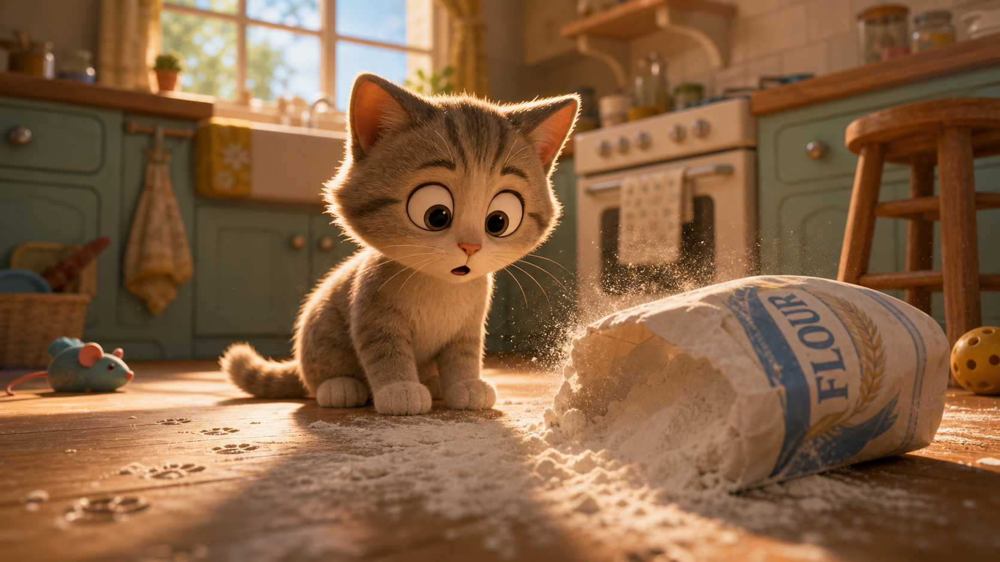
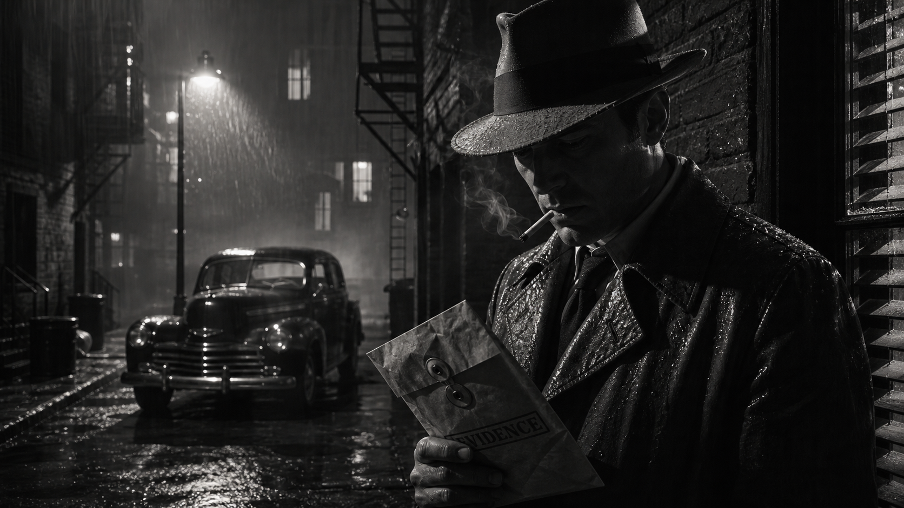
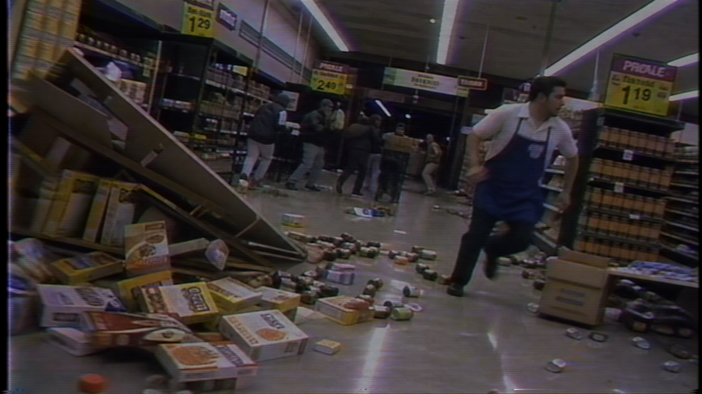

# 🎬 시네마틱

파일: `gallery-cinematic-and-animation.md` · 4개 · 사이트 갤러리(index)의 실제 한국어 프롬프트

이 파일은 사이트 갤러리에 실제로 실린 완성 프롬프트를 담습니다. 공통 작성 규칙은 [`craft.md`](craft.md)와 함께 봅니다.

---

## 1. 입체 애니메이션 고양이 장면



- 카테고리: 시네마틱
- 사이즈: landscape · 1920x1080

```text
결과물 유형:
영화 스틸 또는 스토리보드용 시네마틱 프레임. 주제는 "입체 애니메이션 고양이 장면"입니다. 완성 이미지는 한 편의 영화에서 뽑은 단일 프레임처럼 보여야 하며, 장면의 전후 사건을 암시하는 시각 단서가 있어야 합니다.

주 피사체:
작은 회색 태비 새끼 고양이가 주방 바닥에 넘어져 쏟아진 밀가루 봉지를 보고 놀라는 입체(3D) 애니메이션 장면. 고양이는 눈을 크게 뜨고 입을 벌린 채 화면 중앙 왼쪽에 앉아 있고, 오른쪽에는 하얀 밀가루가 쏟아진 봉지가 넘어져 있습니다. 봉지 표면에는 파란색과 금색 밀 문양과 함께 "FLOUR" 글자가 보입니다. 바닥에는 밀가루 위로 고양이 발자국이 찍혀 있어 방금 벌어진 사건을 암시합니다. 중심 피사체의 형태, 위치, 행동이 먼저 읽히고 보조 요소는 주제를 설명하는 단서로만 사용합니다.

구도와 비율:
16:9 가로형 영화 스틸 또는 스토리보드용 시네마틱 프레임. 낮은 시점에서 바닥 가까이 잡아 고양이의 놀란 표정과 쏟아진 밀가루가 한 사건으로 읽히게 합니다. 전경에는 감정의 단서(발자국과 흩날리는 밀가루), 중경에는 고양이와 봉지, 배경에는 주방과 창문 빛으로 시간과 장소를 배치합니다.

맥락과 배경:
뒤쪽에는 세이지 그린 주방 수납장, 오븐, 나무 스툴, 왼쪽 창문으로 들어오는 따뜻한 햇빛이 보입니다. 왼쪽 바닥에는 장난감 쥐, 오른쪽에는 노란 공이 놓여 있습니다. 배경은 주 피사체를 설명하는 근거가 되어야 하며, 불필요한 장식으로 시선을 빼앗지 않습니다.

스타일과 매체:
픽사풍 3D 입체 애니메이션 영화 스틸. 색 보정, 렌즈감, 피사계 심도, 장면 중심 미장센을 따뜻하고 부드러운 한 가지 방향으로 통일합니다.

빛과 디테일:
조명: 창문에서 들어오는 부드러운 역광이 고양이의 털 가장자리와 흩날리는 밀가루 입자를 감싸고, 따뜻한 주방 조명이 전체를 채웁니다. 명암 대비가 고양이의 놀란 감정과 장면의 긴장을 설명하게 만듭니다.
카메라 시점: 낮은 각도의 와이드 프레임을 장면 전체에 유지합니다.
디테일: 부드러운 털, 둥근 눈, 밀가루 입자와 발자국, 나뭇결 바닥, 공기감이 장면의 시간대와 맞아야 합니다.

정확성 조건:
인물은 등장하지 않으며 고양이 한 마리만 주 피사체입니다. 봉지의 "FLOUR" 글자는 또렷하게, 그 외 실존 브랜드 로고나 깨진 글자는 피합니다. 고양이의 시선, 빛의 방향, 쏟아진 밀가루와 발자국이 같은 사건을 설명해야 하며 장면 밖 설명문처럼 보이면 안 됩니다.
```

---

## 2. 1940년대 누아르 영화 스틸



- 카테고리: 시네마틱
- 사이즈: landscape · 1920x1080

```text
결과물 유형:
영화 스틸 또는 스토리보드용 시네마틱 프레임. 주제는 "1940년대 누아르 영화 스틸"입니다. 완성 이미지는 한 편의 영화에서 뽑은 단일 프레임처럼 보여야 하며, 장면의 전후 사건을 암시하는 시각 단서가 있어야 합니다.

주 피사체:
비 내리는 밤 골목에서 페도라와 트렌치코트 차림의 탐정이 손에 든 증거 봉투를 아래로 내려다보는 흑백 누아르 장면. 탐정은 화면 오른쪽 전경에 밝게 조명되어 가장 먼저 읽히고, 입에는 연기가 피어오르는 담배를 물고 있으며, 손에 쥔 종이 봉투 표면에는 "EVIDENCE" 도장 글자가 보입니다. 왼쪽 중경에는 오래된 클래식 자동차와 젖어 반들거리는 포장도로가 놓입니다. 중심 피사체의 형태, 위치, 행동이 먼저 읽히고 보조 요소는 주제를 설명하는 단서로만 사용합니다.

구도와 비율:
16:9 가로형 영화 스틸 또는 스토리보드용 시네마틱 프레임. 한 장면의 감정이 바로 읽히도록 주 피사체의 시선, 여백, 배경 단서를 정리합니다. 전경에는 감정의 단서, 중경에는 행동, 배경에는 시간과 장소를 배치합니다.

맥락과 배경:
강한 명암 대비, 담배 연기, 오른쪽 창의 블라인드 그림자, 젖은 코트 질감, 가로등 불빛과 비, 필름 그레인을 사용합니다. 배경의 벽돌 골목, 비상계단, 켜진 창은 주 피사체를 설명하는 근거가 되어야 하며, 불필요한 장식으로 시선을 빼앗지 않습니다.

스타일과 매체:
영화 스틸 또는 스토리보드에 맞는 시네마틱 연출. 흑백 색조, 렌즈감, 피사계 심도, 장면 중심 미장센을 한 가지 방향으로 통일합니다.

빛과 디테일:
조명: 강한 명암 대비, 담배 연기, 블라인드 그림자, 젖은 코트 질감, 가로등 역광, 필름 그레인을 사용합니다. 명암 대비가 인물의 감정과 장면의 긴장을 설명하게 만듭니다.
카메라 시점: 인물 반신을 오른쪽에 크게 담고 골목을 왼쪽으로 열어 놓는 와이드 구도를 장면 전체에 유지합니다.
디테일: 모자와 코트에 맺힌 물방울, 담배 연기, 봉투의 구겨진 질감과 "EVIDENCE" 글자, 배경 소품, 공기감, 필름 그레인이 장면의 시간대와 맞아야 합니다.

정확성 조건:
증거 봉투에는 "EVIDENCE" 글자만 또렷하게 보이고, 실존 영화 로고, 크레딧, 깨진 글자는 피합니다. 인물의 시선, 빛의 방향, 배경 단서가 같은 사건을 설명해야 하며 장면 밖 설명문처럼 보이면 안 됩니다.
```

---

## 3. 여섯 컷 전문 영화 스토리보드


- 카테고리: 시네마틱
- 사이즈: 정사각형 · 1024x1024

```text
결과물 유형:
landscape 가로형 2x3 여섯 컷 분할 영화 스토리보드 시트. 주제는 "여섯 컷 전문 영화 스토리보드"입니다. 한 편의 도시 옥상 야간 추격 시퀀스를 여섯 개의 컷으로 나눠 보여주며, 각 컷에는 상단 영문 컷 제목, 좌하단 카메라 아이콘과 영문 CAM 지시, 그 옆 한글 캡션이 함께 들어갑니다.

주 피사체:
비 내린 도시 옥상을 배경으로 한 야간 추격의 두 남자, 즉 앞서 달아나는 주인공과 뒤쫓는 추격자를 여섯 컷으로 정리한 흑백 스토리보드. 컷 1 와이드로 옥상을 가로지르는 두 인물, 컷 2 주인공 얼굴 클로즈업과 뒤따르는 추격자, 컷 3 손에 든 작은 원통형 장치의 익스트림 클로즈업, 컷 4 난간을 박차고 다른 옥상으로 뛰는 점프, 컷 5 옥상 끝에 손끝만 걸린 추락 위기, 컷 6 두 사람이 대치하는 마지막 장면으로 구성합니다. 각 컷마다 중심 인물의 자세와 시선이 먼저 읽히고, 화살표와 카메라 방향이 동선을 보조합니다.

구도와 비율:
1:1 정사각형 화면을 가로 3칸, 세로 2칸의 여섯 컷으로 균등 분할합니다. 각 컷 프레임은 손그림 느낌의 검은 테두리 박스로 구획하고, 그 아래에 카메라 아이콘, 영문 CAM 표기, 한글 캡션을 정렬합니다. 컷마다 전경에 감정·소품, 중경에 행동, 배경에 야간 도시 스카이라인을 배치해 사건의 전후가 흐름으로 읽히게 합니다.

맥락과 배경:
검은 펜 선과 회색 톤 명암, 크로스해칭, 방향을 알리는 흰색·검은색 화살표, 깔끔한 컷 구분선을 사용합니다. 배경은 비에 젖어 반사가 있는 옥상, 물탱크와 환기구, 멀리 불 켜진 고층 빌딩 야경으로 채워 추격의 시간대와 장소를 설명합니다.

스타일과 매체:
흑백 회색조 연필·펜 드로잉 기반의 만화/애니메이션풍 시네마틱 스토리보드. 컬러나 사진 질감이 아니라 손그림 명암과 거친 선으로 통일하며, 역동적인 액션 라인과 속도감이 전체를 관통합니다.

빛과 디테일:
조명: 검은 펜 선과 회색 톤 명암으로 야간의 어두운 옥상과 젖은 바닥의 반사광을 표현합니다. 명암 대비가 인물의 긴장과 추격의 급박함을 설명하게 합니다.
카메라 시점: 컷마다 다른 앵글을 명시합니다. 컷1 하이 와이드/살짝 내려보기, 컷2 핸드헬드/트래킹, 컷3 익스트림 클로즈업/얕은 심도, 컷4 로우 앵글/와이드, 컷5 하이 앵글/내려보기, 컷6 오버 더 숄더/와이드.
디테일: 젖은 의상 주름, 흩날리는 머리카락, 손에 쥔 장치, 바람에 날리는 종이, 빗물 반사가 각 컷의 순간과 맞아야 합니다.

정확성 조건:
각 컷 상단 제목은 "01. WIDE SHOT - ESTABLISH", "02. CLOSE UP - CHASE", "03. INSERT - OBJECT", "04. ACTION - JUMP", "05. CRISIS - FALLING", "06. CLIMAX - SHOWDOWN"으로 표기합니다. 카메라 아이콘 옆 CAM 표기는 순서대로 "CAM: HIGH WIDE / SLIGHT DOWN", "CAM: HANDHELD / TRACKING", "CAM: ECU / SHALLOW FOCUS", "CAM: LOW ANGLE / WIDE", "CAM: HIGH ANGLE / DOWN", "CAM: OVER THE SHOULDER / WIDE"입니다. 하단 한글 캡션은 각각 "도시 야경. 두 남자가 옥상 위를 가로질러 도주한다.", "테이의 주인공 클로즈업. 뒤에서 추격자가 빠르게 따라온다.", "주인공이 가방에서 작은 장치를 꺼낸다. 탈출에 사용할 계획.", "난간을 박차고 다른 옥상으로 점프한다.", "착지 실패! 손끝만 간신히 걸린다. 추격이 다가온다.", "두 사람이 대치한다. 바람에 종이가 흩날리며 긴장감이 고조된다." 입니다. 실존 영화 로고나 크레딧, 깨진 글자는 넣지 않습니다.
```

---

## 4. 비디오테이프 질감의 식료품점 소동



- 카테고리: 시네마틱
- 사이즈: landscape · 1920x1080

```text
결과물 유형:
영화 스틸 또는 스토리보드용 시네마틱 프레임. 주제는 "비디오테이프 질감의 식료품점 소동"입니다. 완성 이미지는 한 편의 영화에서 뽑은 단일 프레임처럼 보여야 하며, 장면의 전후 사건을 암시하는 시각 단서가 있어야 합니다.

주 피사체:
1990년대 캠코더로 찍힌 듯한 밤 식료품점 소동 장면. 전경 우측에 흰 반팔 셔츠와 청색 앞치마를 입은 남성 직원 한 명이 오른쪽으로 황급히 달려 나가고, 화면 왼쪽에는 넘어져 비스듬히 쓰러진 진열대와 바닥에 쏟아진 시리얼 박스, 통조림, 잡화가 어지럽게 흩어져 있습니다. 중경 통로에는 여러 명의 손님이 뒤엉켜 움직이는 무리가 보입니다. 형광등 아래 넓은 통로를 비스듬히 잡습니다. 달리는 직원의 형태, 위치, 행동이 먼저 읽히고 쓰러진 진열대와 손님 무리는 소동을 설명하는 단서로 사용합니다.

구도와 비율:
16:9 가로형 영화 스틸 또는 스토리보드용 시네마틱 프레임. 한 장면의 감정이 바로 읽히도록 달리는 직원의 동선, 여백, 배경 단서를 정리합니다. 전경에는 쏟아진 상품과 쓰러진 매대라는 감정의 단서, 중경에는 사람들의 행동, 배경에는 야간 매장이라는 시간과 장소를 배치합니다.

맥락과 배경:
낮은 해상도 느낌, 색 번짐, 스캔라인, 비디오테이프 노이즈, 형광등 깜빡임, 과장된 움직임을 표현합니다. 배경은 소동을 설명하는 근거가 되어야 하며, 불필요한 장식으로 시선을 빼앗지 않습니다.

스타일과 매체:
영화 스틸 또는 스토리보드에 맞는 시네마틱 연출. 색 보정, 렌즈감, 피사계 심도, 장면 중심 미장센을 한 가지 방향으로 통일합니다.

빛과 디테일:
조명: 낮은 해상도 느낌, 색 번짐, 비디오테이프 노이즈, 형광등 깜빡임, 과장된 움직임을 표현합니다. 형광등 명암 대비가 인물의 다급함과 장면의 긴장을 설명하게 만듭니다.
카메라 시점: 통로를 비스듬히 담는 와이드 앵글을 장면 전체에 유지합니다.
디테일: 앞치마 주름, 다급한 표정, 바닥에 흩어진 상품, 공기감, 필름 그레인이 장면의 시간대와 맞아야 합니다.

정확성 조건:
매대 안내판과 가격표에는 "1 29", "2 49", "1 19" 같은 숫자와 스페인어풍 매장 문구가 자연스러운 소품 텍스트로 흐릿하게 보일 수 있습니다. 실존 영화 로고, 자막, 크레딧은 넣지 않습니다. 인물의 동작, 빛의 방향, 배경 단서가 같은 소동을 설명해야 하며 장면 밖 설명문처럼 보이면 안 됩니다.
```
