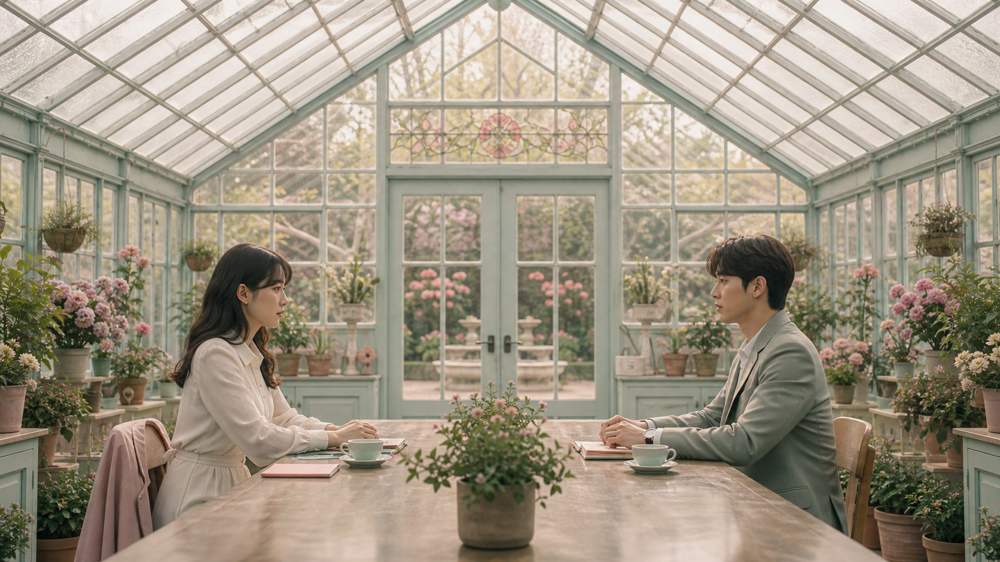
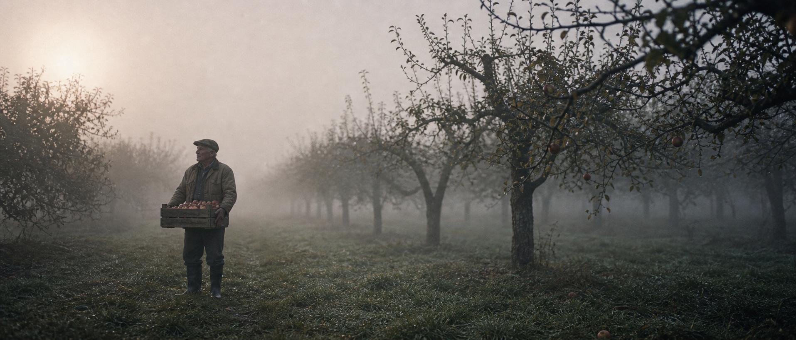
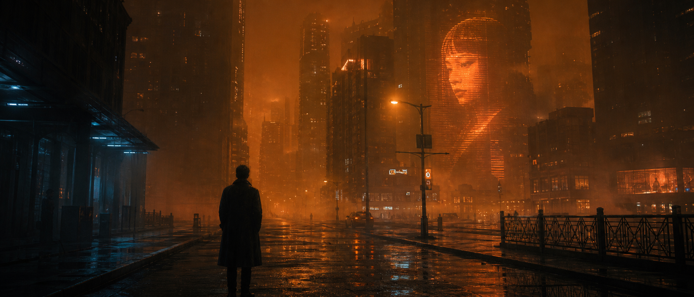
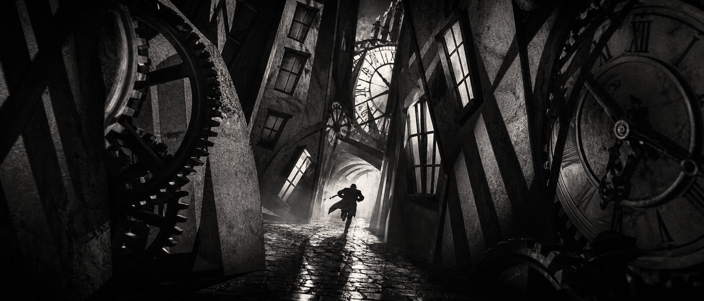

# 🎬 시네마틱

파일: `gallery-cinematic-film-references.md` · 5개 · 사이트 갤러리(index)의 실제 한국어 프롬프트

이 파일은 사이트 갤러리에 실제로 실린 완성 프롬프트를 담습니다. 공통 작성 규칙은 [`craft.md`](craft.md)와 함께 봅니다.

---

## 1. 대칭 구도의 파스텔 온실 장면



- 카테고리: 시네마틱
- 사이즈: Cinematic Film References · landscape · 1920x1080

```text
결과물 유형:
가로형 영화 스틸 또는 스토리보드용 시네마틱 프레임. 주제는 "대칭 구도의 파스텔 온실 장면"입니다. 완성 이미지는 한 편의 영화에서 뽑은 단일 프레임처럼 보여야 하며, 장면의 전후 사건을 암시하는 시각 단서가 있어야 합니다.

주 피사체:
파스텔 색 온실 중앙에서 두 인물(왼쪽에 크림색 블라우스 차림의 여성, 오른쪽에 세이지색 정장 차림의 남성)이 긴 목재 테이블을 사이에 두고 마주 앉아 서로를 응시하는 대칭 구도 장면. 카메라는 정중앙에 고정하고, 박공 유리 천장의 꼭짓점, 화분 화단, 테이블, 배경의 양문형 유리문이 완벽하게 좌우 균형을 이룹니다. 테이블 중앙에는 작은 화분 하나가 놓이고 좌우 인물 앞에 파스텔 찻잔이 하나씩 대칭으로 배치됩니다. 중심 피사체의 형태, 위치, 행동이 먼저 읽히고 보조 요소는 주제를 설명하는 단서로만 사용합니다.

구도와 비율:
16:9 가로형 영화 스틸 또는 스토리보드용 시네마틱 프레임. 눈높이 와이드 정면 대칭 앵글로 좌우가 거울처럼 균형을 이루게 하고, 한 장면의 감정이 바로 읽히도록 두 인물의 시선, 여백, 배경 단서를 정리합니다. 전경에는 감정의 단서, 중경에는 마주 앉은 두 인물의 행동, 배경에는 유리문 너머 정원이라는 시간과 장소를 배치합니다.

맥락과 배경:
부드러운 분홍과 민트 톤, 자연광, 양쪽 벽을 따라 대칭으로 늘어선 화분 화단과 걸이 화분, 정돈된 소품, 얇은 그림자와 고요한 분위기를 사용합니다. 박공 유리창에는 장미 문양 스테인드글라스가, 배경 유리문 너머에는 정원과 분수가 보입니다. 배경은 주 피사체를 설명하는 근거가 되어야 하며, 불필요한 장식으로 시선을 빼앗지 않습니다.

스타일과 매체:
영화 스틸 또는 스토리보드에 맞는 시네마틱 연출. 색 보정, 렌즈감, 피사계 심도, 장면 중심 미장센을 한 가지 방향으로 통일합니다.

빛과 디테일:
조명: 부드러운 분홍과 민트 톤, 유리 천장을 통과하는 자연광, 정돈된 소품, 얇은 그림자와 고요한 분위기를 사용합니다. 명암 대비가 인물의 감정과 장면의 긴장을 설명하게 만듭니다.
카메라 시점: 정면 대칭 와이드 앵글을 장면 전체에 유지합니다.
디테일: 의상 주름, 표정, 배경 화분과 소품, 공기감, 필름 그레인이 장면의 시간대와 맞아야 합니다.

정확성 조건:
실존 영화 로고, 자막, 크레딧, 깨진 글자는 피합니다. 화면에 판독 가능한 문구는 두지 않습니다. 인물의 시선, 빛의 방향, 배경 단서가 같은 사건을 설명해야 하며 장면 밖 설명문처럼 보이면 안 됩니다.
```

---

## 2. 검은 기념비와 사막 공상과학 장면


- 카테고리: 시네마틱
- 사이즈: Cinematic Film References · wide · 2520x1080

```text
결과물 유형:
와이드 시네마틱 영화 스틸 또는 스토리보드용 프레임(약 16:9, 2048x1152). 주제는 "검은 기념비와 사막 공상과학 장면"입니다. 완성 이미지는 한 편의 영화에서 뽑은 단일 프레임처럼 보여야 하며, 장면의 전후 사건을 암시하는 시각 단서가 있어야 합니다.

주 피사체:
거대한 검은 기념비 앞에 작은 탐사자 한 명이 홀로 서 있는 사막 공상과학 장면. 기념비는 아래로 갈수록 넓어지는 사다리꼴 거석으로, 중앙이 세로로 쪼개진 좁은 틈을 이루고 하단 중앙에는 거대한 원형 링 구조와 넓은 계단이 있습니다. 흰색 우주복 차림의 탐사자는 화면 하단 중앙에 아주 작게 서서 기념비를 마주보며 긴 그림자를 드리우고, 기념비는 중앙에 압도적으로 크게 배치하고 주변은 넓은 모래 평원으로 비웁니다. 중심 피사체의 형태, 위치, 행동이 먼저 읽히고 보조 요소는 주제를 설명하는 단서로만 사용합니다.

구도와 비율:
21:9 와이드 영화 스틸 또는 스토리보드용 시네마틱 프레임. 한 장면의 감정이 바로 읽히도록 주 피사체의 시선, 여백, 배경 단서를 정리합니다. 전경에는 발자국과 탐사자의 실루엣, 중경에는 기념비 좌우를 감싸는 작은 오벨리스크와 왼쪽의 로버 차량 및 작은 로켓/타워 실루엣, 배경에는 지평선을 두른 산맥과 낮은 태양을 배치합니다.

맥락과 배경:
먼지 낀 뿌연 하늘, 왼쪽 지평선에 낮게 걸려 강하게 빛나는 태양, 따뜻한 황금빛 석양 대기, 미세한 모래 입자와 흩날리는 먼지를 표현합니다. 배경은 주 피사체를 설명하는 근거가 되어야 하며, 불필요한 장식으로 시선을 빼앗지 않습니다.

스타일과 매체:
영화 스틸 또는 스토리보드에 맞는 시네마틱 연출. 따뜻한 앰버 톤의 색 보정, 렌즈감, 피사계 심도, 장면 중심 미장센을 한 가지 방향으로 통일합니다.

빛과 디테일:
조명: 왼쪽에서 들어오는 낮고 따뜻한 역광, 먼지로 부드러워진 하이라이트, 어두운 거석 표면에 얹히는 은은한 림 라이트, 미세한 모래 입자를 표현합니다. 명암 대비가 인물의 고독과 기념비의 위압감을 설명하게 만듭니다.
카메라 시점: 눈높이에 가까운 와이드 정면 샷을 장면 전체에 유지합니다.
디테일: 우주복 질감, 발자국, 거석 표면의 마모와 균열, 원형 링의 정밀한 결, 공기감, 필름 그레인이 장면의 시간대와 맞아야 합니다.

정확성 조건:
탐사자는 정확히 한 명이며 기념비를 마주보고 서 있어야 합니다. 실존 영화 로고, 자막, 크레딧, 깨진 글자는 피합니다. 인물의 시선, 빛의 방향, 배경 단서가 같은 사건을 설명해야 하며 장면 밖 설명문처럼 보이면 안 됩니다.
```

---

## 3. 안개 낀 과수원의 느린 영화 장면



- 카테고리: 시네마틱
- 사이즈: Cinematic Film References · wide · 2520x1080

```text
결과물 유형:
영화 스틸 또는 스토리보드용 시네마틱 프레임. 주제는 "안개 낀 과수원의 느린 영화 장면"입니다. 완성 이미지는 한 편의 영화에서 뽑은 단일 프레임처럼 보여야 하며, 장면의 전후 사건을 암시하는 시각 단서가 있어야 합니다.

주 피사체:
이른 아침 안개 낀 과수원에서 노인이 사과 상자를 들고 멈춰 선 장면. 인물은 화면 왼쪽 중경에 작게, 오른쪽에는 안개 속으로 사라지는 나무 줄이 이어집니다. 중심 피사체의 형태, 위치, 행동이 먼저 읽히고 보조 요소는 주제를 설명하는 단서로만 사용합니다.

구도와 비율:
21:9 와이드 영화 스틸 또는 스토리보드용 시네마틱 프레임. 한 장면의 감정이 바로 읽히도록 주 피사체의 시선, 여백, 배경 단서를 정리합니다. 전경에는 감정의 단서, 중경에는 행동, 배경에는 시간과 장소를 배치합니다.

맥락과 배경:
차분한 회색빛, 젖은 풀, 낡은 작업복, 부드러운 자연광과 긴 정적을 표현합니다. 배경은 주 피사체를 설명하는 근거가 되어야 하며, 불필요한 장식으로 시선을 빼앗지 않습니다.

스타일과 매체:
영화 스틸 또는 스토리보드에 맞는 시네마틱 연출. 색 보정, 렌즈감, 피사계 심도, 장면 중심 미장센을 한 가지 방향으로 통일합니다.

빛과 디테일:
조명: 차분한 회색빛, 젖은 풀, 낡은 작업복, 부드러운 자연광과 긴 정적을 표현합니다. 명암 대비가 인물의 감정과 장면의 긴장을 설명하게 만듭니다.
카메라 시점: 와이드, 클로즈업, 낮은 각도, 정면 대칭 중 하나를 선택해 장면 전체에 유지합니다.
디테일: 의상 주름, 표정, 배경 소품, 공기감, 필름 그레인이 장면의 시간대와 맞아야 합니다.

정확성 조건:
실존 영화 로고, 자막, 크레딧, 깨진 글자는 피합니다. 인물의 시선, 빛의 방향, 배경 단서가 같은 사건을 설명해야 하며 장면 밖 설명문처럼 보이면 안 됩니다.
```

---

## 4. 주황 안개 속 네오 누아르 장면



- 카테고리: 시네마틱
- 사이즈: Cinematic Film References · wide · 2520x1080

```text
결과물 유형:
영화 스틸 또는 스토리보드용 시네마틱 프레임. 주제는 "주황 안개 속 네오 누아르 장면"입니다. 완성 이미지는 한 편의 영화에서 뽑은 단일 프레임처럼 보여야 하며, 장면의 전후 사건을 암시하는 시각 단서가 있어야 합니다.

주 피사체:
주황빛 안개가 깔린 미래 도시 거리에서 롱코트 차림의 형사가 홀로 서 있는 장면. 형사는 화면 중앙 하단 전경에 뒷모습 실루엣으로 서 있고, 그 앞쪽 오른편 고층 건물 외벽에는 거대한 여성 얼굴의 홀로그램 광고가 주황빛으로 투사되어 있습니다. 뒤쪽에는 높은 건물과 젖은 도로가 층층이 원근으로 물러납니다. 중심 피사체의 형태, 위치, 행동이 먼저 읽히고 홀로그램 얼굴과 도시 풍경은 주제를 설명하는 단서로만 사용합니다.

구도와 비율:
21:9 와이드 영화 스틸 또는 스토리보드용 시네마틱 프레임. 한 장면의 감정이 바로 읽히도록 주 피사체의 시선, 여백, 배경 단서를 정리합니다. 전경에는 감정의 단서, 중경에는 젖은 대로와 가로등, 배경에는 시간과 장소를 배치합니다.

맥락과 배경:
오렌지 조명, 푸른 그림자, 네온 반사, 빗물, 깊은 원근감과 누아르 분위기를 사용합니다. 배경은 주 피사체를 설명하는 근거가 되어야 하며, 불필요한 장식으로 시선을 빼앗지 않습니다.

스타일과 매체:
영화 스틸 또는 스토리보드에 맞는 시네마틱 연출. 색 보정, 렌즈감, 피사계 심도, 장면 중심 미장센을 한 가지 방향으로 통일합니다.

빛과 디테일:
조명: 오렌지 조명, 푸른 그림자, 네온 반사, 빗물, 깊은 원근감과 누아르 분위기를 사용합니다. 명암 대비가 인물의 감정과 장면의 긴장을 설명하게 만듭니다.
카메라 시점: 와이드 앵글, 눈높이 정면 대칭 구도를 장면 전체에 유지합니다.
디테일: 젖은 노면의 반사, 안개에 번지는 가로등 빛, 홀로그램 얼굴의 스캔라인 질감, 공기감, 필름 그레인이 장면의 시간대와 맞아야 합니다.

정확성 조건:
실존 영화 로고, 자막, 크레딧, 읽을 수 있는 글자는 넣지 않습니다. 화면에는 판독 가능한 텍스트가 없어야 하며, 인물의 시선, 빛의 방향, 홀로그램과 배경 단서가 같은 사건을 설명해야 하고 장면 밖 설명문처럼 보이면 안 됩니다.
```

---

## 5. 시계 장치 골목의 표현주의 누아르



- 카테고리: 시네마틱
- 사이즈: Cinematic Film References · wide · 2520x1080

```text
결과물 유형:
2048x1152 기반에 상하 레터박스를 더한 와이드 시네마스코프 영화 스틸 또는 스토리보드용 프레임. 주제는 "시계 장치 골목의 표현주의 누아르"입니다. 완성 이미지는 한 편의 영화에서 뽑은 단일 프레임처럼 보여야 하며, 장면의 전후 사건을 암시하는 시각 단서가 있어야 합니다.

주 피사체:
기울어진 건물과 거대한 시계 장치가 뒤엉킨 좁은 골목에서 코트 자락을 날리며 관객 반대편 심연으로 도망치는 실루엣 인물 한 명의 표현주의 누아르 장면. 인물은 오직 한 명이며, 왜곡된 원근의 골목 중앙, 젖은 자갈길이 빛을 반사하는 지점 위에 작게 배치됩니다. 좌측 벽면의 거대한 톱니바퀴와 우측 벽면의 거대한 시계 문자판, 정면 안쪽의 대형 시계탑이 인물을 사방에서 압박합니다. 중심 인물의 형태, 위치, 도주 동작이 먼저 읽히고 보조 요소는 주제를 설명하는 단서로만 사용합니다.

구도와 비율:
상하 레터박스를 포함한 21:9 와이드 시네마스코프 프레임. 한 장면의 감정이 바로 읽히도록 인물의 위치, 소실점을 향한 여백, 배경 단서를 정리합니다. 전경 자갈길과 반사광에는 긴장의 단서, 중경 인물에는 도주 행동, 배경 시계탑과 아치에는 시간과 장소를 배치합니다.

맥락과 배경:
검은색과 회색 중심의 강한 명암, 거대한 톱니바퀴와 시계 문자판 실루엣, 아치형 통로, 기울어진 창문들, 긴 그림자, 비현실적인 각도를 사용합니다. 배경은 주 피사체를 설명하는 근거가 되어야 하며, 불필요한 장식으로 시선을 빼앗지 않습니다.

스타일과 매체:
표현주의 흑백 누아르 영화 스틸에 맞는 시네마틱 연출. 무채색 색 보정, 강한 렌즈 왜곡감, 깊은 피사계 심도, 소실점 중심 미장센을 한 가지 방향으로 통일합니다.

빛과 디테일:
조명: 검은색과 회색 중심의 극단적 명암, 골목 안쪽에서 뿜어 나오는 역광, 톱니바퀴와 시계 실루엣, 젖은 자갈에 반사되는 하이라이트, 긴 그림자, 비현실적인 각도를 사용합니다. 명암 대비가 인물의 감정과 장면의 긴장을 설명하게 만듭니다.
카메라 시점: 골목 소실점을 향한 낮은 정면 대칭 와이드 앵글을 장면 전체에 유지합니다.
디테일: 코트 자락의 움직임, 실루엣의 윤곽, 낡은 벽의 질감, 안개 낀 공기감, 필름 그레인이 장면의 시간대와 맞아야 합니다.

정확성 조건:
실존 영화 로고, 자막, 크레딧, 깨진 글자는 피합니다. 다만 시계 문자판의 로마 숫자("XII", "IX" 등)는 시계 장치 장면을 설명하는 배경 요소로 자연스럽게 허용됩니다. 인물의 도주 방향, 역광의 방향, 시계 장치 배경 단서가 같은 사건을 설명해야 하며 장면 밖 설명문처럼 보이면 안 됩니다.
```
