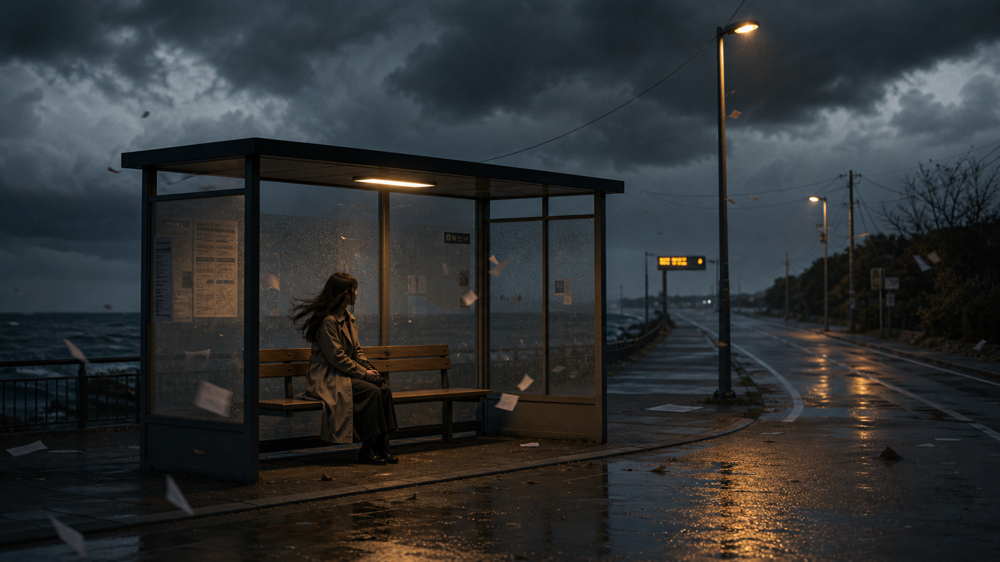

# 🎬 시네마틱

파일: `gallery-cinematic.md` · 10개 · 사이트 갤러리(index)의 실제 한국어 프롬프트

이 파일은 사이트 갤러리에 실제로 실린 완성 프롬프트를 담습니다. 공통 작성 규칙은 [`gpt-image-prompt-craft.md`](gpt-image-prompt-craft.md)와 함께 봅니다.

---

## 1. 입체 애니메이션 고양이 장면


- 카테고리: 시네마틱
- 사이즈: landscape · 1920x1080

```text
결과물 유형:
영화 스틸 또는 스토리보드용 시네마틱 프레임. 주제는 "입체 애니메이션 고양이 장면"입니다. 완성 이미지는 한 편의 영화에서 뽑은 단일 프레임처럼 보여야 하며, 장면의 전후 사건을 암시하는 시각 단서가 있어야 합니다.

주 피사체:
작은 회색 태비 새끼 고양이가 주방 바닥에 넘어져 쏟아진 밀가루 봉지를 보고 놀라는 입체(3D) 애니메이션 장면. 고양이는 눈을 크게 뜨고 입을 벌린 채 화면 중앙 왼쪽에 앉아 있고, 오른쪽에는 하얀 밀가루가 쏟아진 봉지가 넘어져 있습니다. 봉지 표면에는 파란색과 금색 밀 문양과 함께 "FLOUR" 글자가 보입니다. 바닥에는 밀가루 위로 고양이 발자국이 찍혀 있어 방금 벌어진 사건을 암시합니다. 중심 피사체의 형태, 위치, 행동이 먼저 읽히고 보조 요소는 주제를 설명하는 단서로만 사용합니다.

구도와 비율:
16:9 가로형 영화 스틸 또는 스토리보드용 시네마틱 프레임. 낮은 시점에서 바닥 가까이 잡아 고양이의 놀란 표정과 쏟아진 밀가루가 한 사건으로 읽히게 합니다. 전경에는 감정의 단서(발자국과 흩날리는 밀가루), 중경에는 고양이와 봉지, 배경에는 주방과 창문 빛으로 시간과 장소를 배치합니다.

맥락과 배경:
뒤쪽에는 세이지 그린 주방 수납장, 오븐, 나무 스툴, 왼쪽 창문으로 들어오는 따뜻한 햇빛이 보입니다. 왼쪽 바닥에는 장난감 쥐, 오른쪽에는 노란 공이 놓여 있습니다. 배경은 주 피사체를 설명하는 근거가 되어야 하며, 불필요한 장식으로 시선을 빼앗지 않습니다.

스타일과 매체:
픽사풍 3D 입체 애니메이션 영화 스틸. 색 보정, 렌즈감, 피사계 심도, 장면 중심 미장센을 따뜻하고 부드러운 한 가지 방향으로 통일합니다.

빛과 디테일:
조명: 창문에서 들어오는 부드러운 역광이 고양이의 털 가장자리와 흩날리는 밀가루 입자를 감싸고, 따뜻한 주방 조명이 전체를 채웁니다. 명암 대비가 고양이의 놀란 감정과 장면의 긴장을 설명하게 만듭니다.
카메라 시점: 낮은 각도의 와이드 프레임을 장면 전체에 유지합니다.
디테일: 부드러운 털, 둥근 눈, 밀가루 입자와 발자국, 나뭇결 바닥, 공기감이 장면의 시간대와 맞아야 합니다.

정확성 조건:
인물은 등장하지 않으며 고양이 한 마리만 주 피사체입니다. 봉지의 "FLOUR" 글자는 또렷하게, 그 외 실존 브랜드 로고나 깨진 글자는 피합니다. 고양이의 시선, 빛의 방향, 쏟아진 밀가루와 발자국이 같은 사건을 설명해야 하며 장면 밖 설명문처럼 보이면 안 됩니다.
```

---

## 2. 1940년대 누아르 영화 스틸


- 카테고리: 시네마틱
- 사이즈: landscape · 1920x1080

```text
결과물 유형:
영화 스틸 또는 스토리보드용 시네마틱 프레임. 주제는 "1940년대 누아르 영화 스틸"입니다. 완성 이미지는 한 편의 영화에서 뽑은 단일 프레임처럼 보여야 하며, 장면의 전후 사건을 암시하는 시각 단서가 있어야 합니다.

주 피사체:
비 내리는 밤 골목에서 페도라와 트렌치코트 차림의 탐정이 손에 든 증거 봉투를 아래로 내려다보는 흑백 누아르 장면. 탐정은 화면 오른쪽 전경에 밝게 조명되어 가장 먼저 읽히고, 입에는 연기가 피어오르는 담배를 물고 있으며, 손에 쥔 종이 봉투 표면에는 "EVIDENCE" 도장 글자가 보입니다. 왼쪽 중경에는 오래된 클래식 자동차와 젖어 반들거리는 포장도로가 놓입니다. 중심 피사체의 형태, 위치, 행동이 먼저 읽히고 보조 요소는 주제를 설명하는 단서로만 사용합니다.

구도와 비율:
16:9 가로형 영화 스틸 또는 스토리보드용 시네마틱 프레임. 한 장면의 감정이 바로 읽히도록 주 피사체의 시선, 여백, 배경 단서를 정리합니다. 전경에는 감정의 단서, 중경에는 행동, 배경에는 시간과 장소를 배치합니다.

맥락과 배경:
강한 명암 대비, 담배 연기, 오른쪽 창의 블라인드 그림자, 젖은 코트 질감, 가로등 불빛과 비, 필름 그레인을 사용합니다. 배경의 벽돌 골목, 비상계단, 켜진 창은 주 피사체를 설명하는 근거가 되어야 하며, 불필요한 장식으로 시선을 빼앗지 않습니다.

스타일과 매체:
영화 스틸 또는 스토리보드에 맞는 시네마틱 연출. 흑백 색조, 렌즈감, 피사계 심도, 장면 중심 미장센을 한 가지 방향으로 통일합니다.

빛과 디테일:
조명: 강한 명암 대비, 담배 연기, 블라인드 그림자, 젖은 코트 질감, 가로등 역광, 필름 그레인을 사용합니다. 명암 대비가 인물의 감정과 장면의 긴장을 설명하게 만듭니다.
카메라 시점: 인물 반신을 오른쪽에 크게 담고 골목을 왼쪽으로 열어 놓는 와이드 구도를 장면 전체에 유지합니다.
디테일: 모자와 코트에 맺힌 물방울, 담배 연기, 봉투의 구겨진 질감과 "EVIDENCE" 글자, 배경 소품, 공기감, 필름 그레인이 장면의 시간대와 맞아야 합니다.

정확성 조건:
증거 봉투에는 "EVIDENCE" 글자만 또렷하게 보이고, 실존 영화 로고, 크레딧, 깨진 글자는 피합니다. 인물의 시선, 빛의 방향, 배경 단서가 같은 사건을 설명해야 하며 장면 밖 설명문처럼 보이면 안 됩니다.
```

---

## 3. 여섯 컷 전문 영화 스토리보드


- 카테고리: 시네마틱
- 사이즈: 정사각형 · 1024x1024

```text
결과물 유형:
landscape 가로형 2x3 여섯 컷 분할 영화 스토리보드 시트. 주제는 "여섯 컷 전문 영화 스토리보드"입니다. 한 편의 도시 옥상 야간 추격 시퀀스를 여섯 개의 컷으로 나눠 보여주며, 각 컷에는 상단 영문 컷 제목, 좌하단 카메라 아이콘과 영문 CAM 지시, 그 옆 한글 캡션이 함께 들어갑니다.

주 피사체:
비 내린 도시 옥상을 배경으로 한 야간 추격의 두 남자, 즉 앞서 달아나는 주인공과 뒤쫓는 추격자를 여섯 컷으로 정리한 흑백 스토리보드. 컷 1 와이드로 옥상을 가로지르는 두 인물, 컷 2 주인공 얼굴 클로즈업과 뒤따르는 추격자, 컷 3 손에 든 작은 원통형 장치의 익스트림 클로즈업, 컷 4 난간을 박차고 다른 옥상으로 뛰는 점프, 컷 5 옥상 끝에 손끝만 걸린 추락 위기, 컷 6 두 사람이 대치하는 마지막 장면으로 구성합니다. 각 컷마다 중심 인물의 자세와 시선이 먼저 읽히고, 화살표와 카메라 방향이 동선을 보조합니다.

구도와 비율:
1:1 정사각형 화면을 가로 3칸, 세로 2칸의 여섯 컷으로 균등 분할합니다. 각 컷 프레임은 손그림 느낌의 검은 테두리 박스로 구획하고, 그 아래에 카메라 아이콘, 영문 CAM 표기, 한글 캡션을 정렬합니다. 컷마다 전경에 감정·소품, 중경에 행동, 배경에 야간 도시 스카이라인을 배치해 사건의 전후가 흐름으로 읽히게 합니다.

맥락과 배경:
검은 펜 선과 회색 톤 명암, 크로스해칭, 방향을 알리는 흰색·검은색 화살표, 깔끔한 컷 구분선을 사용합니다. 배경은 비에 젖어 반사가 있는 옥상, 물탱크와 환기구, 멀리 불 켜진 고층 빌딩 야경으로 채워 추격의 시간대와 장소를 설명합니다.

스타일과 매체:
흑백 회색조 연필·펜 드로잉 기반의 만화/애니메이션풍 시네마틱 스토리보드. 컬러나 사진 질감이 아니라 손그림 명암과 거친 선으로 통일하며, 역동적인 액션 라인과 속도감이 전체를 관통합니다.

빛과 디테일:
조명: 검은 펜 선과 회색 톤 명암으로 야간의 어두운 옥상과 젖은 바닥의 반사광을 표현합니다. 명암 대비가 인물의 긴장과 추격의 급박함을 설명하게 합니다.
카메라 시점: 컷마다 다른 앵글을 명시합니다. 컷1 하이 와이드/살짝 내려보기, 컷2 핸드헬드/트래킹, 컷3 익스트림 클로즈업/얕은 심도, 컷4 로우 앵글/와이드, 컷5 하이 앵글/내려보기, 컷6 오버 더 숄더/와이드.
디테일: 젖은 의상 주름, 흩날리는 머리카락, 손에 쥔 장치, 바람에 날리는 종이, 빗물 반사가 각 컷의 순간과 맞아야 합니다.

정확성 조건:
각 컷 상단 제목은 "01. WIDE SHOT - ESTABLISH", "02. CLOSE UP - CHASE", "03. INSERT - OBJECT", "04. ACTION - JUMP", "05. CRISIS - FALLING", "06. CLIMAX - SHOWDOWN"으로 표기합니다. 카메라 아이콘 옆 CAM 표기는 순서대로 "CAM: HIGH WIDE / SLIGHT DOWN", "CAM: HANDHELD / TRACKING", "CAM: ECU / SHALLOW FOCUS", "CAM: LOW ANGLE / WIDE", "CAM: HIGH ANGLE / DOWN", "CAM: OVER THE SHOULDER / WIDE"입니다. 하단 한글 캡션은 각각 "도시 야경. 두 남자가 옥상 위를 가로질러 도주한다.", "테이의 주인공 클로즈업. 뒤에서 추격자가 빠르게 따라온다.", "주인공이 가방에서 작은 장치를 꺼낸다. 탈출에 사용할 계획.", "난간을 박차고 다른 옥상으로 점프한다.", "착지 실패! 손끝만 간신히 걸린다. 추격이 다가온다.", "두 사람이 대치한다. 바람에 종이가 흩날리며 긴장감이 고조된다." 입니다. 실존 영화 로고나 크레딧, 깨진 글자는 넣지 않습니다.
```

---

## 4. 비디오테이프 질감의 식료품점 소동


- 카테고리: 시네마틱
- 사이즈: landscape · 1920x1080

```text
결과물 유형:
영화 스틸 또는 스토리보드용 시네마틱 프레임. 주제는 "비디오테이프 질감의 식료품점 소동"입니다. 완성 이미지는 한 편의 영화에서 뽑은 단일 프레임처럼 보여야 하며, 장면의 전후 사건을 암시하는 시각 단서가 있어야 합니다.

주 피사체:
1990년대 캠코더로 찍힌 듯한 밤 식료품점 소동 장면. 전경 우측에 흰 반팔 셔츠와 청색 앞치마를 입은 남성 직원 한 명이 오른쪽으로 황급히 달려 나가고, 화면 왼쪽에는 넘어져 비스듬히 쓰러진 진열대와 바닥에 쏟아진 시리얼 박스, 통조림, 잡화가 어지럽게 흩어져 있습니다. 중경 통로에는 여러 명의 손님이 뒤엉켜 움직이는 무리가 보입니다. 형광등 아래 넓은 통로를 비스듬히 잡습니다. 달리는 직원의 형태, 위치, 행동이 먼저 읽히고 쓰러진 진열대와 손님 무리는 소동을 설명하는 단서로 사용합니다.

구도와 비율:
16:9 가로형 영화 스틸 또는 스토리보드용 시네마틱 프레임. 한 장면의 감정이 바로 읽히도록 달리는 직원의 동선, 여백, 배경 단서를 정리합니다. 전경에는 쏟아진 상품과 쓰러진 매대라는 감정의 단서, 중경에는 사람들의 행동, 배경에는 야간 매장이라는 시간과 장소를 배치합니다.

맥락과 배경:
낮은 해상도 느낌, 색 번짐, 스캔라인, 비디오테이프 노이즈, 형광등 깜빡임, 과장된 움직임을 표현합니다. 배경은 소동을 설명하는 근거가 되어야 하며, 불필요한 장식으로 시선을 빼앗지 않습니다.

스타일과 매체:
영화 스틸 또는 스토리보드에 맞는 시네마틱 연출. 색 보정, 렌즈감, 피사계 심도, 장면 중심 미장센을 한 가지 방향으로 통일합니다.

빛과 디테일:
조명: 낮은 해상도 느낌, 색 번짐, 비디오테이프 노이즈, 형광등 깜빡임, 과장된 움직임을 표현합니다. 형광등 명암 대비가 인물의 다급함과 장면의 긴장을 설명하게 만듭니다.
카메라 시점: 통로를 비스듬히 담는 와이드 앵글을 장면 전체에 유지합니다.
디테일: 앞치마 주름, 다급한 표정, 바닥에 흩어진 상품, 공기감, 필름 그레인이 장면의 시간대와 맞아야 합니다.

정확성 조건:
매대 안내판과 가격표에는 "1 29", "2 49", "1 19" 같은 숫자와 스페인어풍 매장 문구가 자연스러운 소품 텍스트로 흐릿하게 보일 수 있습니다. 실존 영화 로고, 자막, 크레딧은 넣지 않습니다. 인물의 동작, 빛의 방향, 배경 단서가 같은 소동을 설명해야 하며 장면 밖 설명문처럼 보이면 안 됩니다.
```

---

## 5. 대칭 구도의 파스텔 온실 장면


- 카테고리: 시네마틱
- 사이즈: Cinematic Film References · landscape · 1920x1080

```text
결과물 유형:
가로형 영화 스틸 또는 스토리보드용 시네마틱 프레임. 주제는 "대칭 구도의 파스텔 온실 장면"입니다. 완성 이미지는 한 편의 영화에서 뽑은 단일 프레임처럼 보여야 하며, 장면의 전후 사건을 암시하는 시각 단서가 있어야 합니다.

주 피사체:
파스텔 색 온실 중앙에서 두 인물(왼쪽에 크림색 블라우스 차림의 여성, 오른쪽에 세이지색 정장 차림의 남성)이 긴 목재 테이블을 사이에 두고 마주 앉아 서로를 응시하는 대칭 구도 장면. 카메라는 정중앙에 고정하고, 박공 유리 천장의 꼭짓점, 화분 화단, 테이블, 배경의 양문형 유리문이 완벽하게 좌우 균형을 이룹니다. 테이블 중앙에는 작은 화분 하나가 놓이고 좌우 인물 앞에 파스텔 찻잔이 하나씩 대칭으로 배치됩니다. 중심 피사체의 형태, 위치, 행동이 먼저 읽히고 보조 요소는 주제를 설명하는 단서로만 사용합니다.

구도와 비율:
16:9 가로형 영화 스틸 또는 스토리보드용 시네마틱 프레임. 눈높이 와이드 정면 대칭 앵글로 좌우가 거울처럼 균형을 이루게 하고, 한 장면의 감정이 바로 읽히도록 두 인물의 시선, 여백, 배경 단서를 정리합니다. 전경에는 감정의 단서, 중경에는 마주 앉은 두 인물의 행동, 배경에는 유리문 너머 정원이라는 시간과 장소를 배치합니다.

맥락과 배경:
부드러운 분홍과 민트 톤, 자연광, 양쪽 벽을 따라 대칭으로 늘어선 화분 화단과 걸이 화분, 정돈된 소품, 얇은 그림자와 고요한 분위기를 사용합니다. 박공 유리창에는 장미 문양 스테인드글라스가, 배경 유리문 너머에는 정원과 분수가 보입니다. 배경은 주 피사체를 설명하는 근거가 되어야 하며, 불필요한 장식으로 시선을 빼앗지 않습니다.

스타일과 매체:
영화 스틸 또는 스토리보드에 맞는 시네마틱 연출. 색 보정, 렌즈감, 피사계 심도, 장면 중심 미장센을 한 가지 방향으로 통일합니다.

빛과 디테일:
조명: 부드러운 분홍과 민트 톤, 유리 천장을 통과하는 자연광, 정돈된 소품, 얇은 그림자와 고요한 분위기를 사용합니다. 명암 대비가 인물의 감정과 장면의 긴장을 설명하게 만듭니다.
카메라 시점: 정면 대칭 와이드 앵글을 장면 전체에 유지합니다.
디테일: 의상 주름, 표정, 배경 화분과 소품, 공기감, 필름 그레인이 장면의 시간대와 맞아야 합니다.

정확성 조건:
실존 영화 로고, 자막, 크레딧, 깨진 글자는 피합니다. 화면에 판독 가능한 문구는 두지 않습니다. 인물의 시선, 빛의 방향, 배경 단서가 같은 사건을 설명해야 하며 장면 밖 설명문처럼 보이면 안 됩니다.
```

---

## 6. 검은 기념비와 사막 공상과학 장면


- 카테고리: 시네마틱
- 사이즈: Cinematic Film References · wide · 2520x1080

```text
결과물 유형:
와이드 시네마틱 영화 스틸 또는 스토리보드용 프레임(약 16:9, 2048x1152). 주제는 "검은 기념비와 사막 공상과학 장면"입니다. 완성 이미지는 한 편의 영화에서 뽑은 단일 프레임처럼 보여야 하며, 장면의 전후 사건을 암시하는 시각 단서가 있어야 합니다.

주 피사체:
거대한 검은 기념비 앞에 작은 탐사자 한 명이 홀로 서 있는 사막 공상과학 장면. 기념비는 아래로 갈수록 넓어지는 사다리꼴 거석으로, 중앙이 세로로 쪼개진 좁은 틈을 이루고 하단 중앙에는 거대한 원형 링 구조와 넓은 계단이 있습니다. 흰색 우주복 차림의 탐사자는 화면 하단 중앙에 아주 작게 서서 기념비를 마주보며 긴 그림자를 드리우고, 기념비는 중앙에 압도적으로 크게 배치하고 주변은 넓은 모래 평원으로 비웁니다. 중심 피사체의 형태, 위치, 행동이 먼저 읽히고 보조 요소는 주제를 설명하는 단서로만 사용합니다.

구도와 비율:
21:9 와이드 영화 스틸 또는 스토리보드용 시네마틱 프레임. 한 장면의 감정이 바로 읽히도록 주 피사체의 시선, 여백, 배경 단서를 정리합니다. 전경에는 발자국과 탐사자의 실루엣, 중경에는 기념비 좌우를 감싸는 작은 오벨리스크와 왼쪽의 로버 차량 및 작은 로켓/타워 실루엣, 배경에는 지평선을 두른 산맥과 낮은 태양을 배치합니다.

맥락과 배경:
먼지 낀 뿌연 하늘, 왼쪽 지평선에 낮게 걸려 강하게 빛나는 태양, 따뜻한 황금빛 석양 대기, 미세한 모래 입자와 흩날리는 먼지를 표현합니다. 배경은 주 피사체를 설명하는 근거가 되어야 하며, 불필요한 장식으로 시선을 빼앗지 않습니다.

스타일과 매체:
영화 스틸 또는 스토리보드에 맞는 시네마틱 연출. 따뜻한 앰버 톤의 색 보정, 렌즈감, 피사계 심도, 장면 중심 미장센을 한 가지 방향으로 통일합니다.

빛과 디테일:
조명: 왼쪽에서 들어오는 낮고 따뜻한 역광, 먼지로 부드러워진 하이라이트, 어두운 거석 표면에 얹히는 은은한 림 라이트, 미세한 모래 입자를 표현합니다. 명암 대비가 인물의 고독과 기념비의 위압감을 설명하게 만듭니다.
카메라 시점: 눈높이에 가까운 와이드 정면 샷을 장면 전체에 유지합니다.
디테일: 우주복 질감, 발자국, 거석 표면의 마모와 균열, 원형 링의 정밀한 결, 공기감, 필름 그레인이 장면의 시간대와 맞아야 합니다.

정확성 조건:
탐사자는 정확히 한 명이며 기념비를 마주보고 서 있어야 합니다. 실존 영화 로고, 자막, 크레딧, 깨진 글자는 피합니다. 인물의 시선, 빛의 방향, 배경 단서가 같은 사건을 설명해야 하며 장면 밖 설명문처럼 보이면 안 됩니다.
```

---

## 7. 안개 낀 과수원의 느린 영화 장면


- 카테고리: 시네마틱
- 사이즈: Cinematic Film References · wide · 2520x1080

```text
결과물 유형:
영화 스틸 또는 스토리보드용 시네마틱 프레임. 주제는 "안개 낀 과수원의 느린 영화 장면"입니다. 완성 이미지는 한 편의 영화에서 뽑은 단일 프레임처럼 보여야 하며, 장면의 전후 사건을 암시하는 시각 단서가 있어야 합니다.

주 피사체:
이른 아침 안개 낀 과수원에서 노인이 사과 상자를 들고 멈춰 선 장면. 인물은 화면 왼쪽 중경에 작게, 오른쪽에는 안개 속으로 사라지는 나무 줄이 이어집니다. 중심 피사체의 형태, 위치, 행동이 먼저 읽히고 보조 요소는 주제를 설명하는 단서로만 사용합니다.

구도와 비율:
21:9 와이드 영화 스틸 또는 스토리보드용 시네마틱 프레임. 한 장면의 감정이 바로 읽히도록 주 피사체의 시선, 여백, 배경 단서를 정리합니다. 전경에는 감정의 단서, 중경에는 행동, 배경에는 시간과 장소를 배치합니다.

맥락과 배경:
차분한 회색빛, 젖은 풀, 낡은 작업복, 부드러운 자연광과 긴 정적을 표현합니다. 배경은 주 피사체를 설명하는 근거가 되어야 하며, 불필요한 장식으로 시선을 빼앗지 않습니다.

스타일과 매체:
영화 스틸 또는 스토리보드에 맞는 시네마틱 연출. 색 보정, 렌즈감, 피사계 심도, 장면 중심 미장센을 한 가지 방향으로 통일합니다.

빛과 디테일:
조명: 차분한 회색빛, 젖은 풀, 낡은 작업복, 부드러운 자연광과 긴 정적을 표현합니다. 명암 대비가 인물의 감정과 장면의 긴장을 설명하게 만듭니다.
카메라 시점: 와이드, 클로즈업, 낮은 각도, 정면 대칭 중 하나를 선택해 장면 전체에 유지합니다.
디테일: 의상 주름, 표정, 배경 소품, 공기감, 필름 그레인이 장면의 시간대와 맞아야 합니다.

정확성 조건:
실존 영화 로고, 자막, 크레딧, 깨진 글자는 피합니다. 인물의 시선, 빛의 방향, 배경 단서가 같은 사건을 설명해야 하며 장면 밖 설명문처럼 보이면 안 됩니다.
```

---

## 8. 주황 안개 속 네오 누아르 장면


- 카테고리: 시네마틱
- 사이즈: Cinematic Film References · wide · 2520x1080

```text
결과물 유형:
영화 스틸 또는 스토리보드용 시네마틱 프레임. 주제는 "주황 안개 속 네오 누아르 장면"입니다. 완성 이미지는 한 편의 영화에서 뽑은 단일 프레임처럼 보여야 하며, 장면의 전후 사건을 암시하는 시각 단서가 있어야 합니다.

주 피사체:
주황빛 안개가 깔린 미래 도시 거리에서 롱코트 차림의 형사가 홀로 서 있는 장면. 형사는 화면 중앙 하단 전경에 뒷모습 실루엣으로 서 있고, 그 앞쪽 오른편 고층 건물 외벽에는 거대한 여성 얼굴의 홀로그램 광고가 주황빛으로 투사되어 있습니다. 뒤쪽에는 높은 건물과 젖은 도로가 층층이 원근으로 물러납니다. 중심 피사체의 형태, 위치, 행동이 먼저 읽히고 홀로그램 얼굴과 도시 풍경은 주제를 설명하는 단서로만 사용합니다.

구도와 비율:
21:9 와이드 영화 스틸 또는 스토리보드용 시네마틱 프레임. 한 장면의 감정이 바로 읽히도록 주 피사체의 시선, 여백, 배경 단서를 정리합니다. 전경에는 감정의 단서, 중경에는 젖은 대로와 가로등, 배경에는 시간과 장소를 배치합니다.

맥락과 배경:
오렌지 조명, 푸른 그림자, 네온 반사, 빗물, 깊은 원근감과 누아르 분위기를 사용합니다. 배경은 주 피사체를 설명하는 근거가 되어야 하며, 불필요한 장식으로 시선을 빼앗지 않습니다.

스타일과 매체:
영화 스틸 또는 스토리보드에 맞는 시네마틱 연출. 색 보정, 렌즈감, 피사계 심도, 장면 중심 미장센을 한 가지 방향으로 통일합니다.

빛과 디테일:
조명: 오렌지 조명, 푸른 그림자, 네온 반사, 빗물, 깊은 원근감과 누아르 분위기를 사용합니다. 명암 대비가 인물의 감정과 장면의 긴장을 설명하게 만듭니다.
카메라 시점: 와이드 앵글, 눈높이 정면 대칭 구도를 장면 전체에 유지합니다.
디테일: 젖은 노면의 반사, 안개에 번지는 가로등 빛, 홀로그램 얼굴의 스캔라인 질감, 공기감, 필름 그레인이 장면의 시간대와 맞아야 합니다.

정확성 조건:
실존 영화 로고, 자막, 크레딧, 읽을 수 있는 글자는 넣지 않습니다. 화면에는 판독 가능한 텍스트가 없어야 하며, 인물의 시선, 빛의 방향, 홀로그램과 배경 단서가 같은 사건을 설명해야 하고 장면 밖 설명문처럼 보이면 안 됩니다.
```

---

## 9. 시계 장치 골목의 표현주의 누아르


- 카테고리: 시네마틱
- 사이즈: Cinematic Film References · wide · 2520x1080

```text
결과물 유형:
2048x1152 기반에 상하 레터박스를 더한 와이드 시네마스코프 영화 스틸 또는 스토리보드용 프레임. 주제는 "시계 장치 골목의 표현주의 누아르"입니다. 완성 이미지는 한 편의 영화에서 뽑은 단일 프레임처럼 보여야 하며, 장면의 전후 사건을 암시하는 시각 단서가 있어야 합니다.

주 피사체:
기울어진 건물과 거대한 시계 장치가 뒤엉킨 좁은 골목에서 코트 자락을 날리며 관객 반대편 심연으로 도망치는 실루엣 인물 한 명의 표현주의 누아르 장면. 인물은 오직 한 명이며, 왜곡된 원근의 골목 중앙, 젖은 자갈길이 빛을 반사하는 지점 위에 작게 배치됩니다. 좌측 벽면의 거대한 톱니바퀴와 우측 벽면의 거대한 시계 문자판, 정면 안쪽의 대형 시계탑이 인물을 사방에서 압박합니다. 중심 인물의 형태, 위치, 도주 동작이 먼저 읽히고 보조 요소는 주제를 설명하는 단서로만 사용합니다.

구도와 비율:
상하 레터박스를 포함한 21:9 와이드 시네마스코프 프레임. 한 장면의 감정이 바로 읽히도록 인물의 위치, 소실점을 향한 여백, 배경 단서를 정리합니다. 전경 자갈길과 반사광에는 긴장의 단서, 중경 인물에는 도주 행동, 배경 시계탑과 아치에는 시간과 장소를 배치합니다.

맥락과 배경:
검은색과 회색 중심의 강한 명암, 거대한 톱니바퀴와 시계 문자판 실루엣, 아치형 통로, 기울어진 창문들, 긴 그림자, 비현실적인 각도를 사용합니다. 배경은 주 피사체를 설명하는 근거가 되어야 하며, 불필요한 장식으로 시선을 빼앗지 않습니다.

스타일과 매체:
표현주의 흑백 누아르 영화 스틸에 맞는 시네마틱 연출. 무채색 색 보정, 강한 렌즈 왜곡감, 깊은 피사계 심도, 소실점 중심 미장센을 한 가지 방향으로 통일합니다.

빛과 디테일:
조명: 검은색과 회색 중심의 극단적 명암, 골목 안쪽에서 뿜어 나오는 역광, 톱니바퀴와 시계 실루엣, 젖은 자갈에 반사되는 하이라이트, 긴 그림자, 비현실적인 각도를 사용합니다. 명암 대비가 인물의 감정과 장면의 긴장을 설명하게 만듭니다.
카메라 시점: 골목 소실점을 향한 낮은 정면 대칭 와이드 앵글을 장면 전체에 유지합니다.
디테일: 코트 자락의 움직임, 실루엣의 윤곽, 낡은 벽의 질감, 안개 낀 공기감, 필름 그레인이 장면의 시간대와 맞아야 합니다.

정확성 조건:
실존 영화 로고, 자막, 크레딧, 깨진 글자는 피합니다. 다만 시계 문자판의 로마 숫자("XII", "IX" 등)는 시계 장치 장면을 설명하는 배경 요소로 자연스럽게 허용됩니다. 인물의 도주 방향, 역광의 방향, 시계 장치 배경 단서가 같은 사건을 설명해야 하며 장면 밖 설명문처럼 보이면 안 됩니다.
```

---

## 10. 폭풍 전야의 정류장 영화 스틸



- 카테고리: 시네마틱
- 사이즈: 준비 중 · 빈 카드

```text
결과물 유형:
영화 스틸 또는 스토리보드용 시네마틱 프레임. 주제는 "폭풍 전야의 정류장 영화 스틸"입니다. 완성 이미지는 한 편의 영화에서 뽑은 단일 프레임처럼 보여야 하며, 장면의 전후 사건을 암시하는 시각 단서가 있어야 합니다.

주 피사체:
폭풍 직전 텅 빈 해안가 버스 정류장에서 한 여성이 마지막 버스를 기다리는 영화 스틸. 유리 벽으로 둘러싸인 정류장은 화면 왼쪽에 치우쳐 놓고, 트렌치코트를 입은 여성 한 명이 나무 벤치에 앉아 왼쪽 바다와 난간 쪽을 응시합니다. 인물 수는 정확히 한 명이며, 중심 피사체의 형태, 위치, 행동이 먼저 읽히고 보조 요소는 주제를 설명하는 단서로만 사용합니다.

구도와 비율:
16:9 가로형 영화 스틸 또는 스토리보드용 시네마틱 프레임. 정류장을 왼쪽에 두어 오른쪽으로 젖은 도로와 가로등이 원경까지 뻗도록 여백을 잡습니다. 한 장면의 감정이 바로 읽히도록 주 피사체의 시선, 여백, 배경 단서를 정리합니다. 전경에는 감정의 단서, 중경에는 행동, 배경에는 시간과 장소를 배치합니다.

맥락과 배경:
짙은 먹구름, 바람에 흩날리는 흰 종이들, 정류장 내부의 노란 조명과 오른쪽 도로변의 노란 가로등, 이미 젖어 빛을 반사하는 아스팔트, 왼쪽의 거친 바다와 난간, 오른쪽 중경의 버스 도착 안내 전광판이 정적과 긴장감을 표현합니다. 배경은 주 피사체를 설명하는 근거가 되어야 하며, 불필요한 장식으로 시선을 빼앗지 않습니다.

스타일과 매체:
영화 스틸 또는 스토리보드에 맞는 시네마틱 연출. 색 보정, 렌즈감, 피사계 심도, 장면 중심 미장센을 한 가지 방향으로 통일합니다.

빛과 디테일:
조명: 정류장 안 노란 조명과 도로변 가로등이 유일한 광원이 되어 어두운 하늘과 대비되고, 젖은 노면에 빛이 길게 반사됩니다. 명암 대비가 인물의 감정과 장면의 긴장을 설명하게 만듭니다.
카메라 시점: 와이드 롱 숏을 장면 전체에 유지해 정류장, 인물, 바다, 도로가 한 프레임에 담기게 합니다.
디테일: 트렌치코트 주름, 바람에 날리는 머리카락, 배경 소품, 흩날리는 종이, 공기감, 필름 그레인이 폭풍 직전 저녁 시간대와 맞아야 합니다.

정확성 조건:
실존 영화 로고, 판독 가능한 자막, 크레딧, 깨진 글자는 피합니다. 정류장 광고판과 전광판의 글자는 흐릿한 질감으로만 처리합니다. 인물의 시선, 빛의 방향, 배경 단서가 같은 사건을 설명해야 하며 장면 밖 설명문처럼 보이면 안 됩니다.
```
