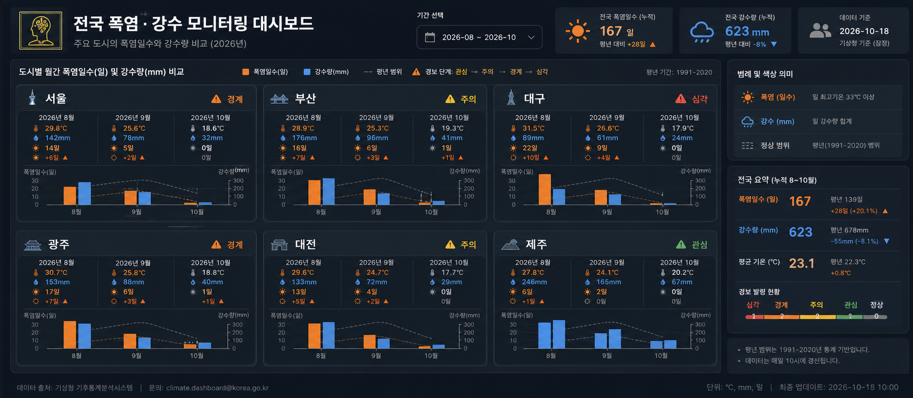
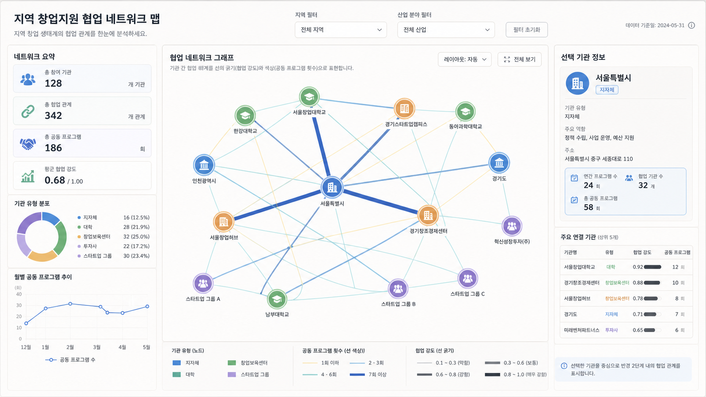
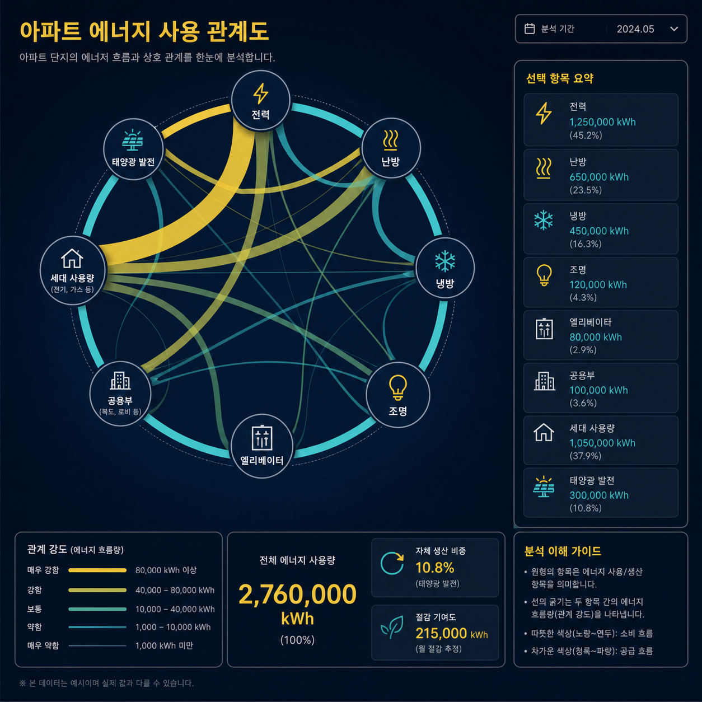
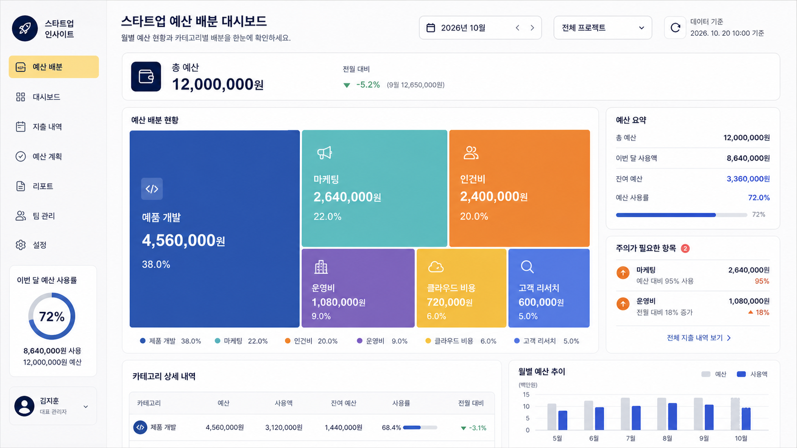

# 🖥️ UI·대시보드

파일: `gallery-data-visualization.md` · 5개 · 사이트 갤러리(index)의 실제 한국어 프롬프트

이 파일은 사이트 갤러리에 실제로 실린 완성 프롬프트를 담습니다. 공통 작성 규칙은 [`craft.md`](craft.md)와 함께 봅니다.

---

## 1. 전국 폭염·강수 모니터링 대시보드



- 카테고리: UI·대시보드
- 사이즈: UI·대시보드 · 와이드 · 2520x1080

```text
결과물 유형:
데이터 대시보드 화면(2048x1152). 주제는 "전국 폭염·강수 모니터링 대시보드"입니다. 완성 이미지는 한국 주요 도시의 기상 상황을 비교하는 보고서용 다크 모드 웹 대시보드처럼 보여야 합니다.

주 피사체:
서울, 부산, 대구, 광주, 대전, 제주 여섯 개 도시의 폭염일수와 강수량을 비교하는 2행 3열 스몰 멀티플 그리드. 각 도시 카드에는 2026년 8월, 9월, 10월의 월별 기온, 강수량, 폭염일수, 변화 지표가 표로 정리되고, 그 아래에 "폭염일수(일)" 막대와 "강수량(mm)" 막대, 회색 점선의 평년 범위가 함께 들어간 스몰 멀티플 그래프가 놓입니다. 각 카드 우상단에는 "경계", "주의", "심각", "관심" 같은 경보 배지가 붙습니다.

구도와 비율:
21:9 와이드 화면. 좌상단에는 뇌 아이콘과 제목 "전국 폭염 · 강수 모니터링 대시보드", 그 아래 부제 "주요 도시의 폭염일수와 강수량 비교 (2026년)"가 오고, 상단 우측에 기간 선택 필터와 전국 요약 KPI 카드 세 개가 나란히 놓입니다. 중앙은 같은 크기의 도시별 그래프 카드 여섯 개, 오른쪽 세로 사이드바에는 범례와 전국 요약, 경보 발령 현황이 배치됩니다. 모든 카드의 축과 간격은 동일해야 합니다.

맥락과 배경:
한국 여름과 초가을의 기상 리포트 맥락을 반영합니다. 폭염은 주황, 강수는 파랑, 평년(정상) 범위는 회색 점선으로 구분하고, 도시별 비교가 먼저 보이도록 장식은 최소화합니다. 어두운 남색 배경의 다크 UI입니다.

스타일과 매체:
실무형 데이터 대시보드 UI. 스몰 멀티플 그래프, 범례, 기간 필터, 요약 카드가 일관된 다크 디자인 시스템 안에서 정리되어야 합니다.

빛과 디테일:
평면 UI처럼 처리합니다. 인물은 등장하지 않습니다. 도시명, 월 라벨(8월/9월/10월), 좌우 이중 축, 범례, 기간 필터, 요약 숫자, 경보 배지를 실제 데이터처럼 배치합니다.

정확성 조건:
기간 필터는 "2026-08 ~ 2026-10"을 표시하고 그래프 라벨은 2026년 8월, 9월, 10월을 중심으로 구성합니다. 상단 KPI는 "전국 폭염일수 167일", "전국 강수량 623mm", "데이터 기준 2026-10-18"처럼 서로 정합적인 수치로 둡니다. 도시별 경보 배지는 서울 "경계", 부산 "주의", 대구 "심각", 광주 "경계", 대전 "주의", 제주 "관심"이며, 범례에는 "폭염일수(일)", "강수량(mm)", "평년 범위", 경보 단계 "관심 → 주의 → 경계 → 심각"이 들어갑니다. 축, 범례, 숫자, 색상 의미가 서로 맞아야 합니다. 읽을 수 없는 임의 문자, 실제 기관 로고, 겹친 텍스트는 피합니다.
```

---

## 2. 지역 창업지원 협업 네트워크 맵



- 카테고리: UI·대시보드
- 사이즈: UI·대시보드 · 가로형 · 1920x1080

```text
결과물 유형:
16:9 네트워크 데이터 시각화 대시보드. 주제는 "지역 창업지원 협업 네트워크 맵"입니다. 완성 이미지는 한국의 지자체, 대학, 창업보육센터, 투자사, 스타트업 그룹이 협업하는 관계를 분석하는 웹 화면처럼 보여야 합니다. 좌측에 요약 지표 패널, 중앙에 네트워크 그래프, 우측에 선택 기관 상세 패널을 둔 3열 구조입니다.

주 피사체:
지역 창업지원 생태계의 협업 관계를 보여주는 중앙 네트워크 그래프. 지자체, 대학, 창업보육센터, 투자사, 스타트업 그룹을 원형 아이콘 노드로 표시하고, 공동 프로그램 횟수는 선 색상으로, 협업 강도는 선 굵기로 구분합니다. 노드 라벨 예시는 "서울특별시", "경기도", "인천광역시", "서울창업대학교", "한강대학교", "동아과학대학교", "남부대학교", "경기스타트업캠퍼스", "서울창업허브", "경기창조경제센터", "혁신성장투자(주)", "스타트업 그룹 A", "스타트업 그룹 B", "스타트업 그룹 C"입니다. 중앙의 "서울특별시" 노드가 굵은 선으로 여러 기관과 강하게 연결됩니다. 인물은 등장하지 않습니다.

구도와 비율:
16:9 가로형 화면. 최상단에 제목 "지역 창업지원 협업 네트워크 맵"과 부제 "지역 창업 생태계의 협업 관계를 한눈에 분석하세요."를 두고, 상단 중앙에 "지역 필터"(전체 지역)와 "산업 분야 필터"(전체 산업), "필터 초기화" 버튼, 우상단에 "데이터 기준일: 2024-05-31"을 배치합니다. 왼쪽 열에는 요약 패널, 가운데 넓은 영역에 "협업 네트워크 그래프"와 우상단 "레이아웃: 자동"·"전체 보기" 컨트롤, 오른쪽 열에는 "선택 기관 정보" 상세 패널, 하단에는 범례를 배치합니다.

맥락과 배경:
한국 지역 창업지원 사업 자료처럼 차분한 파랑·초록·주황·보라 색과 얇은 선을 사용합니다. 왼쪽 요약 패널에는 "네트워크 요약"(총 참여 기관 128, 총 협업 관계 342, 총 공동 프로그램 186, 평균 협업 강도 0.68), "기관 유형 분포" 도넛 차트(지자체·대학·창업보육센터·투자사·스타트업 그룹 비율), "월별 공동 프로그램 추이" 선 차트(12월~5월)를 배치합니다. 노드가 너무 빽빽하지 않게 배치하고, 가장 중요한 연결이 먼저 읽히게 합니다.

스타일과 매체:
데이터 분석용 UI 대시보드. 네트워크 그래프, 좌측 요약 차트, 우측 상세 패널이 함께 작동하는 실제 제품 화면처럼 보여야 합니다.

빛과 디테일:
평면 UI처럼 처리합니다. 노드 아이콘 색상, 선 굵기, 선 색상은 데이터 의미를 구분하는 데만 사용합니다. 우측 상세 패널에는 선택된 "서울특별시"(지자체) 정보(기관 유형, 주요 역할, 주소, 연간 프로그램 수, 협업 기관 수, 총 공동 프로그램)와 "주요 연결 기관(상위 5개)" 표를 배치합니다. 하단 범례는 "기관 유형(노드)", "공동 프로그램 횟수(선 색상)", "협업 강도(선 굵기)" 세 묶음으로 구성합니다.

정확성 조건:
노드, 선, 범례, 좌측 요약 차트, 우측 상세 패널의 의미가 서로 맞아야 합니다. 실제 존재하는 기관명이나 실제 로고는 사용하지 않고 예시성 명칭만 씁니다. 읽을 수 없는 임의 문자, 겹친 라벨, 연결 방향 오류는 피합니다.
```

---

## 3. 아파트 에너지 사용 관계도



- 카테고리: UI·대시보드
- 사이즈: UI·대시보드 · 정사각형 · 1024x1024

```text
결과물 유형:
데이터 관계 다이어그램. 주제는 "아파트 에너지 사용 관계도"입니다. 완성 이미지는 한국 아파트 단지의 에너지 사용 구조를 설명하는 분석 보드처럼 보여야 하며, 항목 간 사용량과 비중이 한눈에 읽혀야 합니다.

주 피사체:
전력, 난방, 냉방, 조명, 엘리베이터, 공용부, 세대 사용량, 태양광 발전 총 8개 항목 사이의 에너지 관계를 보여주는 코드(chord) 다이어그램. 각 항목은 아이콘이 든 원형 노드로 원 둘레에 배치하고, 항목 사이의 관계는 곡선 밴드의 굵기와 색으로 표현합니다. 인물은 등장하지 않습니다.

구도와 비율:
1:1 정사각형 화면. 좌상단에 제목과 부제, 중앙 왼쪽에 관계 다이어그램을 크게 배치하고, 오른쪽 세로 패널에 선택 항목 요약 카드, 하단에 범례와 주요 수치, 우상단에 분석 기간 드롭다운을 배치합니다.

맥락과 배경:
한국 아파트 관리사무소나 에너지 절감 보고서에서 볼 법한 화면으로 구성합니다. 어두운 남색 배경, 선샤인 옐로우와 청록색 포인트, 얇은 보조선을 사용합니다.

스타일과 매체:
데이터 시각화 UI. 복잡한 관계를 아름답게 보여주되, 색상과 선 굵기의 의미가 분명해야 합니다.

빛과 디테일:
평면 UI처럼 처리합니다. 곡선 밴드의 겹침은 투명도와 색상 차이로 구분합니다. 항목명, 범례, 비중 수치, 보조 그리드, 요약 카드가 서로 겹치지 않게 배치합니다. 따뜻한 색(노랑~연두)은 소비 흐름, 차가운 색(청록~파랑)은 공급 흐름으로 구분합니다.

정확성 조건:
항목, 범례, 선 굵기, 수치의 의미가 서로 맞아야 합니다. 화면에는 제목 "아파트 에너지 사용 관계도"와 부제 "아파트 단지의 에너지 흐름과 상호 관계를 한눈에 분석합니다.", 우상단 "분석 기간 2024.05", 오른쪽 "선택 항목 요약" 카드에 "전력 1,250,000 kWh (45.2%)", "난방 650,000 kWh (23.5%)", "냉방 450,000 kWh (16.3%)", "조명 120,000 kWh (4.3%)", "엘리베이터 80,000 kWh (2.9%)", "공용부 100,000 kWh (3.6%)", "세대 사용량 1,050,000 kWh (37.9%)", "태양광 발전 300,000 kWh (10.8%)"를 표기합니다. 하단에는 "관계 강도 (에너지 흐름량)" 범례("매우 강함 80,000 kWh 이상", "강함 40,000~80,000 kWh", "보통 10,000~40,000 kWh", "약함 1,000~10,000 kWh", "매우 약함 1,000 kWh 미만"), "전체 에너지 사용량 2,760,000 kWh (100%)", "자체 생산 비중 10.8% (태양광 발전)", "절감 기여도 215,000 kWh (월 절감 추정)", "분석 이해 가이드", 하단 주의문구 "※ 본 데이터는 예시이며 실제 값과 다를 수 있습니다."를 배치합니다. 읽을 수 없는 임의 문자, 실제 브랜드 로고, 과도한 네온 효과, 겹친 라벨은 피합니다.
```

---

## 4. 스타트업 예산 배분 대시보드



- 카테고리: UI·대시보드
- 사이즈: UI·대시보드 · 가로형 · 1920x1080

```text
결과물 유형:
16:9 예산 배분 데이터 대시보드. 주제는 "스타트업 예산 배분 대시보드"입니다. 완성 이미지는 한국 스타트업의 월별 예산을 분석하는 실제 웹 대시보드처럼 보여야 하며, 항목별 비중이 즉시 비교되어야 합니다.

주 피사체:
제품 개발, 마케팅, 인건비, 운영비, 클라우드 비용, 고객 리서치 여섯 항목으로 나뉜 예산 배분 트리맵. 제품 개발 영역이 가장 크고, 각 영역에 원화 금액과 비율을 넣습니다. 오른쪽에는 총 예산, 이번 달 사용액, 잔여 예산, 예산 사용률을 정리한 "예산 요약" 패널과 "주의가 필요한 항목" 배지 패널을 둡니다.

구도와 비율:
16:9 가로형 화면의 3분할 웹 레이아웃. 왼쪽에는 로고와 메뉴, 도넛형 사용률 게이지, 사용자 프로필을 담은 세로 내비게이션 사이드바를 둡니다. 중앙에는 상단 총예산 카드, 그 아래 트리맵과 범례, 하단에 카테고리 상세 표와 월별 예산 추이 막대 차트를 배치합니다. 오른쪽에는 요약과 경고 패널을 세로로 쌓습니다.

맥락과 배경:
한국 스타트업의 재무 회의 자료처럼 명확하고 절제된 화면을 사용합니다. 기간 필터는 "2026년 10월"로 보이게 하고, 색상은 기능별로 구분하되 한눈에 비교되도록 채도와 대비를 통제합니다. 인물 사진은 없고 사용자 프로필은 아이콘형 아바타로만 표시합니다.

스타일과 매체:
실무형 데이터 대시보드 UI. 좌측 내비게이션, 트리맵, KPI 카드, 필터, 범례, 요약 패널, 상세 표, 막대 차트가 하나의 화면에서 자연스럽게 연결되어야 합니다.

빛과 디테일:
평면 UI처럼 처리합니다. 카드 그림자는 약하게 쓰고, 영역 구분은 색상과 얇은 선으로 표현합니다. 금액, 비율, 항목명, 기간 필터, 총액, 경고 배지, 도넛 게이지, 막대 차트를 실제 데이터처럼 배치합니다.

정확성 조건:
예산 기간, 회계 월, 보고서 날짜는 2026년 5월~10월 범위 안에서 표기합니다. 화면에는 총 예산 "12,000,000원", 전월 대비 "-5.2%", 제품 개발 "4,560,000원 38.0%", 마케팅 "2,640,000원 22.0%", 인건비 "2,400,000원 20.0%", 운영비 "1,080,000원 9.0%", 클라우드 비용 "720,000원 6.0%", 고객 리서치 "600,000원 5.0%", 예산 사용률 "72%"가 서로 정합되게 나타나야 합니다. 영역 크기, 금액, 비율의 의미가 서로 맞아야 합니다. 읽을 수 없는 임의 문자, 실제 브랜드 로고, 겹친 텍스트는 피합니다.
```

---

## 5. 지역 농산물 수확량 지도


- 카테고리: UI·대시보드
- 사이즈: UI·대시보드 · 와이드 · 2520x1080

```text
결과물 유형:
지리 데이터 대시보드. 주제는 "지역 농산물 수확량 지도"입니다. 완성 이미지는 농산물 수확량을 비교하는 실제 데이터 리포트 화면처럼 보여야 하며, 한국 시도별 차이가 바로 읽혀야 합니다.

주 피사체:
한국 시도별 농산물 수확량을 보여주는 단계 구분(코로플레스) 지도. 시도 지역을 수확량 단계에 따라 붉은 계열에서 옅은 노란 계열까지의 색으로 칠하고, 각 지역 위에 지역명과 수치를 함께 표기합니다. 예를 들어 "경북 128.7천", "강원 102.4천", "충북 75.1천", "경기 68.2천", "전북 63.3천", "제주 9.4천"처럼 표시합니다. 선택된 작물은 "사과"이며, 상단에서 사과, 배, 쌀, 고추 중 하나를 고를 수 있게 표현합니다. 인물은 등장하지 않습니다.

구도와 비율:
21:9 와이드 화면. 맨 왼쪽에는 어두운 남색 세로 사이드바 내비게이션(대시보드, 작물별 분석, 지역 비교, 데이터 테이블, 트렌드 분석, 보고서, 설정)을 두고, 그 오른쪽 중앙에 한국 지도와 범례를 배치합니다. 화면 오른쪽에는 요약 카드, 상위 5개 지역 표, 수확량 구간별 지역 수 도넛 차트를 세로로 쌓고, 상단에는 작물 선택 버튼과 기간 필터, 하단에는 월별 추세 선그래프와 막대 차트를 배치합니다.

맥락과 배경:
한국 농산물 리포트용 화면처럼 명확한 색상 단계, 얇은 경계선, 작은 라벨, 차분한 배경을 사용합니다. 지역 구분이 지도 위에서 선명하게 읽혀야 합니다. 왼쪽 하단에는 "데이터 출처 농림축산식품부 농업통계정보시스템", "업데이트 2026.10.20 10:00" 같은 출처 표기를 둡니다.

스타일과 매체:
실무형 지리 데이터 대시보드 UI. 지도, 범례, 필터, 요약 지표, 순위 표, 도넛 차트, 추세 그래프가 하나의 데이터 제품 화면처럼 정리되어야 합니다.

빛과 디테일:
평면 UI처럼 처리합니다. 색상 단계와 지역 경계선은 데이터 구분을 위해서만 사용합니다. 상단 제목은 "지역 농산물 수확량 지도", 부제는 "시도별 주요 농산물 수확량 비교 분석"으로 둡니다. 범례는 "120천 톤 이상 / 80~120천 톤 / 40~80천 톤 / 20~40천 톤 / 20천 톤 미만" 다섯 단계로, 요약 카드는 "전국 총 수확량 702.6천 톤", "전국 평균 수확량 43.9천 톤", "최대 수확량 지역 경북 128.7천 톤", "최소 수확량 지역 제주 9.4천 톤"처럼 배치합니다.

정확성 조건:
작물 필터는 "사과 · 배 · 쌀 · 고추", 기간 필터는 "2026.08 ~ 2026.10", 보고서 기준일은 "2026.10.20 기준"으로 표기합니다. 지도 경계, 범례, 색상 단계, 수치의 의미가 서로 맞아야 하며, 상위 5개 지역 순위와 지도 수치가 일치해야 합니다. 읽을 수 없는 임의 문자, 실제 브랜드 로고, 겹친 텍스트는 피합니다.
```
