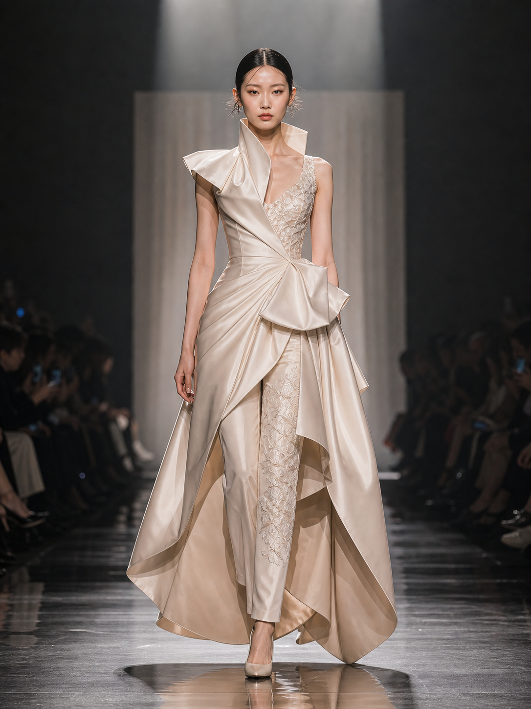
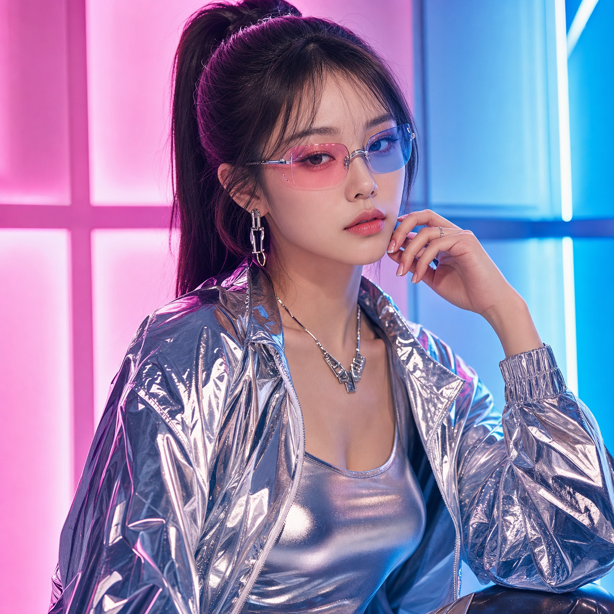
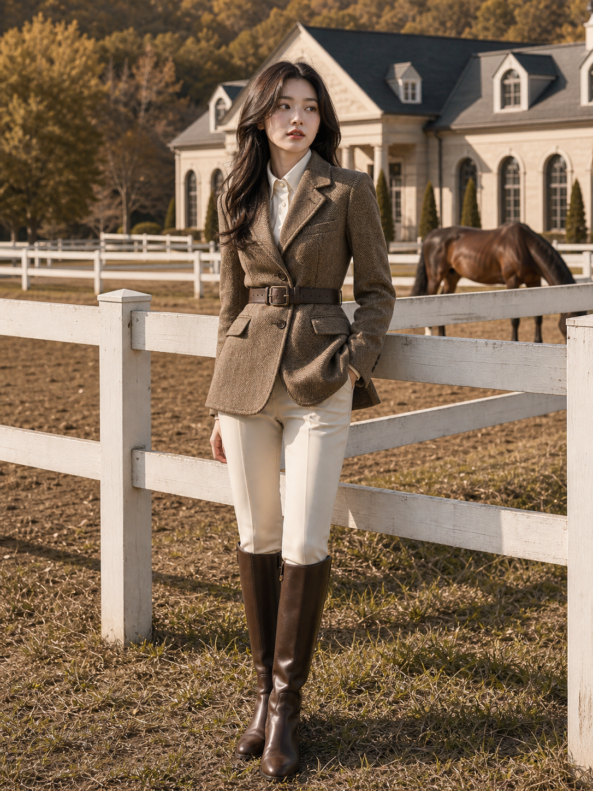
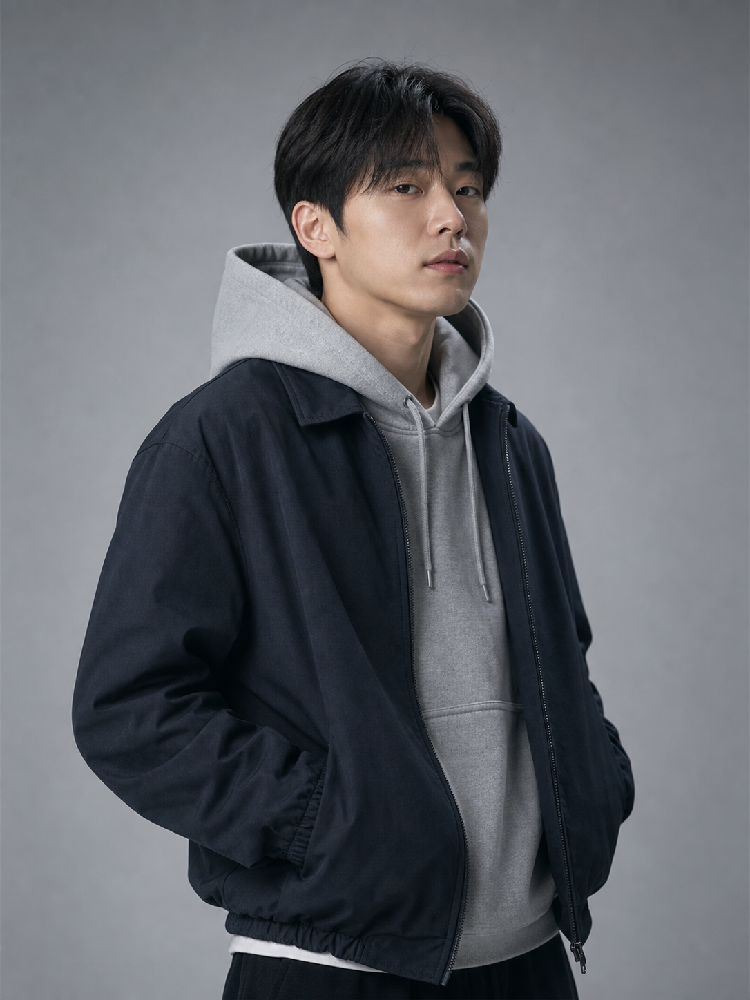
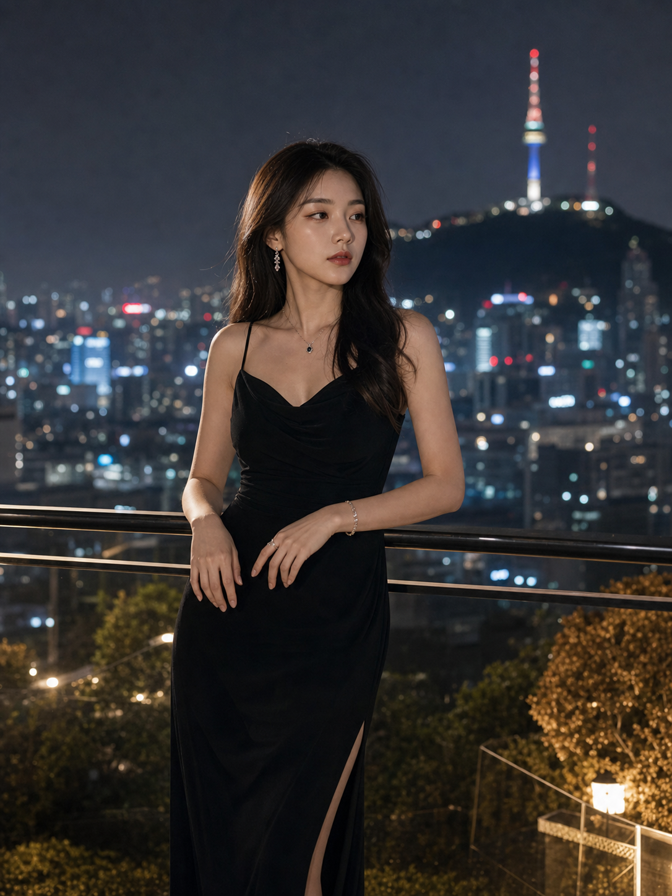

# 📷 인물 사진

파일: `gallery-fashion-editorial.md` · 6개 · 사이트 갤러리(index)의 실제 한국어 프롬프트

이 파일은 사이트 갤러리에 실제로 실린 완성 프롬프트를 담습니다. 공통 작성 규칙은 [`craft.md`](craft.md)와 함께 봅니다.

---

## 1. 오트쿠튀르 런웨이



- 카테고리: 인물 사진
- 사이즈: Fashion Editorial · tall · 1536x2048

```text
결과물 유형:
인물 사진 또는 패션 화보. 주제는 "오트쿠튀르 런웨이"입니다. 완성 이미지는 실제 카메라로 촬영한 한 장의 사진처럼 보여야 하며, 인물의 표정, 자세, 의상, 주변 맥락이 자연스럽게 연결되어야 합니다.

주 피사체:
패션쇼 런웨이 중앙을 걷는 한국인 여성 모델 1명. 모델은 샴페인빛 아이보리 새틴 광택 소재의 구조적인 오트쿠튀르 의상을 입고 전신으로 보입니다. 조형적인 비대칭 어깨와 세워진 하이 칼라, 허리에서 크게 드레이프된 랩 스커트, 그 사이로 드러나는 자수 레이스 패널과 슬림 팬츠가 겹쳐 보이며, 발에는 누드톤 하이힐을 신었습니다. 머리는 가운데 가르마로 매끈하게 넘겼고, 뒤쪽 관객은 어둡게 흐려집니다.

구도와 비율:
3:4 세로형. 런웨이 중앙선과 모델의 실루엣이 강하게 맞물리도록 세로 구도로 구성합니다. 모델의 전신, 의상 볼륨, 발걸음이 먼저 읽히게 합니다.

맥락과 배경:
패션쇼 현장. 강한 스포트라이트, 광택 있는 소재, 절제된 회색 무대, 어두운 관객석이 고급 패션쇼 분위기를 만듭니다. 좌우 관객은 어둠 속에서 휴대폰을 들어 촬영하며 화면에서 나오는 작은 빛 점들이 흩어져 보입니다.

스타일과 매체:
패션 런웨이 사진. 실제 쇼장에서 촬영한 듯한 카메라 질감, 명확한 의상 디테일, 자연스러운 움직임을 우선합니다.

빛과 디테일:
조명: 상단 스포트라이트와 약한 측면광을 사용합니다. 의상의 구조와 새틴 소재 광택이 보이되 피부톤이 과하게 번들거리지 않게 합니다.
카메라 시점: 런웨이 끝에서 정면으로 촬영한 낮은 미디엄 풀샷. 모델이 크게 보이고 무대 깊이가 함께 느껴지게 합니다.
디테일: 의상 봉제선, 드레이프 주름, 자수 패널, 신발, 손가락, 머리카락, 반사되는 무대 바닥, 관객석의 부드러운 흐림과 휴대폰 불빛을 현실적으로 표현합니다.

정확성 조건:
인물 비율, 손, 발, 의상 구조가 실제 런웨이 사진처럼 보여야 합니다. 실제 브랜드 로고, 왜곡된 얼굴, 과한 판타지 의상, 읽을 수 없는 큰 문자는 피합니다. 화면에 어떤 글자나 로고도 나타나지 않게 합니다.
```

---

## 2. 사이버 팝 스튜디오 패션 화보



- 카테고리: 인물 사진
- 사이즈: Fashion Editorial · square · 1024x1024

```text
결과물 유형:
인물 사진 또는 패션 화보. 주제는 "사이버 팝 스튜디오 패션 화보"입니다. 완성 이미지는 실제 카메라로 촬영한 한 장의 사진처럼 보여야 하며, 인물의 표정, 자세, 의상, 주변 맥락이 자연스럽게 연결되어야 합니다.

주 피사체:
사이버 팝 무드의 스튜디오에서 촬영한 한국인 여성 모델 1명. 모델은 높은 포니테일 머리에, 분홍에서 파랑으로 이어지는 그러데이션 틴트가 들어간 무테 선글라스를 착용합니다. 광택 있는 은색 재킷을 걸치고 그 안에 은색 메탈릭 탱크톱을 입었으며, 은색 목걸이와 금속 이어링을 하고 있습니다. 한 손을 얼굴 옆 턱 부근으로 부드럽게 올린 포즈이며, 배경에는 분홍과 파랑 조명 패널이 배치됩니다.

구도와 비율:
1:1 정사각형. 정사각형 프레임 중앙에 모델의 상반신을 크게 배치합니다. 얼굴, 의상 소재, 배경 조명 패널이 균형 있게 보이도록 구성합니다.

맥락과 배경:
미래적인 뷰티 촬영 스튜디오. 격자 형태의 분홍과 파랑 조명 패널, 강한 색 대비, 매끈한 소재, 네온빛 반사, 깨끗한 배경이 사이버 팝 분위기를 만듭니다.

스타일과 매체:
스튜디오 패션 화보. 피부와 의상 소재의 대비, 선명한 컬러 조명, 잡지 커버 수준의 정돈된 프레이밍을 사용합니다.

빛과 디테일:
조명: 분홍색과 파란색 컬러 조명을 좌우에서 사용하고, 얼굴에는 부드러운 키 라이트를 더합니다. 눈과 금속 소재에 작은 하이라이트가 보이게 합니다.
카메라 시점: 정면에 가까운 미디엄 클로즈업. 얼굴과 의상의 상단 디테일이 가장 먼저 읽히게 합니다.
디테일: 틴트 선글라스 렌즈의 반사, 광택 있는 은색 의상 표면의 주름과 반사, 머리카락 가장자리, 피부 질감, 얼굴 옆에 올린 손과 반지, 배경 패널의 색 번짐을 현실적으로 표현합니다.

정확성 조건:
한국인 모델의 얼굴과 손이 자연스러워야 합니다. 비현실적인 신체 왜곡, 과한 피부 보정, 실제 브랜드 로고, 읽을 수 없는 문자, 플라스틱 같은 질감은 피합니다. 화면에는 어떤 글자나 로고도 넣지 않습니다.
```

---

## 3. 승마 · 저택 패션 화보



- 카테고리: 인물 사진
- 사이즈: Fashion Editorial · 세로형 · 1536x2048

```text
결과물 유형:
인물 사진 또는 패션 화보. 주제는 "승마 · 저택 패션 화보"입니다. 완성 이미지는 실제 카메라로 촬영한 한 장의 사진처럼 보여야 하며, 인물의 표정, 자세, 의상, 주변 맥락이 자연스럽게 연결되어야 합니다.

주 피사체:
한국의 고급 승마 저택을 배경으로 한 한국인 여성 모델 1명. 모델은 헤링본 트위드 재킷 안에 흰 카라 셔츠를 받쳐 입고, 재킷 위로 갈색 가죽 벨트를 매고, 크림색 승마 브리치스와 무릎까지 오는 짙은 갈색 가죽 롱부츠를 착용했습니다. 흰 목재 승마 울타리에 살짝 기대어 한 손은 재킷 주머니에 넣고, 긴 웨이브 머리를 늘어뜨린 채 시선을 옆으로 둔 자세입니다.

구도와 비율:
3:4 세로형. 모델을 화면 왼쪽에 배치하고, 흰 목재 울타리가 화면을 가로지르며 앞쪽 깊이를 만들고, 오른쪽 배경에는 대형 석조 저택이 보이도록 구성합니다. 전신이 보이되 헤링본 재킷과 브리치스, 롱부츠의 소재감이 먼저 읽혀야 합니다.

맥락과 배경:
부드러운 오후빛, 베이지와 갈색 팔레트, 고급 원단 질감, 절제된 포즈가 승마 저택의 차분한 분위기를 만듭니다. 오른쪽 배경 목장 안에는 갈색 말 1마리가 고개를 숙이고 풀을 뜯고 있으며, 뒤로는 회색 지붕과 도머 창을 가진 크림색 석조 저택과 가을빛 나무들이 자리합니다.

스타일과 매체:
올드머니 패션 화보. 실제 야외 촬영처럼 자연스러운 피부톤, 의상 질감, 배경 거리감을 사용합니다.

빛과 디테일:
조명: 늦은 오후의 부드러운 자연광. 얼굴에는 따뜻한 빛이 닿고, 의상과 흰 목재 울타리에는 은은한 그림자가 생기게 합니다.
카메라 시점: 85mm 렌즈 느낌의 세로형 전신 화보. 배경(저택과 말)은 살짝 흐리고 모델의 자세와 의상을 선명하게 보여줍니다.
디테일: 헤링본 트위드 재킷의 직물, 가죽 벨트 버클, 흰 셔츠 카라, 크림색 브리치스, 롱부츠 가죽, 손 자세, 머리카락, 흰 목재 울타리, 배경 말의 갈색 털과 저택 창문을 자연스럽게 표현합니다.

정확성 조건:
인물 비율, 손, 얼굴, 의상 구조가 실제 화보처럼 보여야 합니다. 배경의 말은 장구 없이 자연스럽게 풀을 뜯는 모습이어야 하고, 실제 브랜드 로고, 과한 귀족풍 장식, 왜곡된 배경 원근은 피합니다.
```

---

## 4. 초현실주의 하이패션 화보


- 카테고리: 인물 사진
- 사이즈: Fashion Editorial · portrait · 1536x2048

```text
결과물 유형:
인물 사진 또는 패션 화보. 주제는 "초현실주의 하이패션 화보"입니다. 완성 이미지는 실제 카메라로 촬영한 한 장의 사진처럼 보여야 하며, 인물의 표정, 자세, 의상, 주변 맥락이 자연스럽게 연결되어야 합니다.

주 피사체:
초현실주의 콘셉트의 스튜디오 세트 중앙에 선 한국인 모델 1명. 모델은 조각 같은 의상을 입고, 주변에는 큰 식물 형태의 세트 조형물이 배치됩니다.

구도와 비율:
3:4 세로형. 세로형 프레임 중앙에 모델을 세우고, 의상의 실루엣과 식물 조형물이 모델을 감싸듯 배치합니다. 얼굴, 의상, 세트의 관계가 한눈에 읽혀야 합니다.

맥락과 배경:
비현실적이지만 세련된 패션 세트. 부드러운 스튜디오 조명, 피부와 의상 소재의 대비, 조각적인 배경 형태가 하이패션 분위기를 만듭니다.

스타일과 매체:
하이패션 에디토리얼 사진. 과장된 콘셉트라도 실제 촬영 세트처럼 보이게 하고, 의상과 인물의 존재감을 우선합니다.

빛과 디테일:
조명: 부드러운 키 라이트와 약한 림 라이트를 함께 사용합니다. 피부, 의상, 배경 조형물의 재질 차이가 선명하게 보이도록 합니다.
카메라 시점: 정면에 가까운 세로형 풀샷. 모델의 전신과 세트 구조가 함께 보이게 합니다.
디테일: 의상 가장자리, 피부 질감, 손가락, 머리카락, 세트 조형물의 표면, 바닥 그림자를 현실적으로 표현합니다.

정확성 조건:
초현실적 분위기여도 인물의 신체 구조는 자연스러워야 합니다. 손과 얼굴 왜곡, 과한 장식, 실제 브랜드 로고, 읽을 수 없는 큰 문자, 배경과 인물이 분리되지 않는 구도는 피합니다.
```

---

## 5. 스트리트웨어 스튜디오 초상



- 카테고리: 인물 사진
- 사이즈: Fashion Editorial · portrait · 1536x2048

```text
결과물 유형:
인물 사진 또는 패션 화보. 주제는 "스트리트웨어 스튜디오 초상"입니다. 완성 이미지는 실제 카메라로 촬영한 한 장의 사진처럼 보여야 하며, 인물의 표정, 자세, 의상, 주변 맥락이 자연스럽게 연결되어야 합니다.

주 피사체:
차분한 색감의 스트리트웨어를 입은 한국인 남성 모델 1명. 모델은 밝은 회색 후디 위에 짙은 네이비 블랙 지퍼업 재킷을 앞을 연 채 겹쳐 입고, 회색 그라데이션 단색 배경 앞에서 반신으로 서 있습니다. 양손은 재킷 주머니에 자연스럽게 넣고, 시선은 카메라에서 살짝 비껴 먼 곳을 봅니다.

구도와 비율:
3:4 세로형. 상반신 중심의 세로형 초상 사진. 얼굴, 어깨선, 후디와 재킷의 레이어가 먼저 읽히게 하고 배경은 단정하게 비워둡니다.

맥락과 배경:
조용한 스튜디오 초상 촬영. 부드러운 확산광, 절제된 포즈, 회색과 네이비 중심의 색감, 잡지 에디토리얼 같은 분위기를 사용합니다.

스타일과 매체:
스튜디오 패션 초상 사진. 실제 카메라로 촬영한 듯한 피부 질감, 직물 질감, 자연스러운 표정을 우선합니다.

빛과 디테일:
조명: 큰 소프트박스에서 오는 부드러운 확산광. 얼굴 윤곽과 의상 주름이 자연스럽게 보이도록 그림자를 약하게 둡니다.
카메라 시점: 85mm 렌즈 느낌의 미디엄 샷. 인물의 얼굴과 의상 디테일이 균형 있게 보이게 합니다.
디테일: 후디 끈, 재킷 지퍼 라인과 봉제선, 주머니에 넣은 손, 이마를 살짝 덮은 머리카락, 피부 질감, 배경의 미세한 그라데이션을 현실적으로 표현합니다.

정확성 조건:
한국인 남성 모델의 얼굴과 손이 자연스러워야 합니다. 밝은 회색 후디 위에 짙은 네이비 블랙 재킷을 열어 입은 레이어드 구조를 유지합니다. 비현실적인 신체 왜곡, 과한 피부 보정, 실제 브랜드 로고, 구겨진 의상 구조 오류는 피합니다.
```

---

## 6. 서울 야간 럭셔리 화보



- 카테고리: 인물 사진
- 사이즈: Fashion Editorial · portrait · 1536x2048

```text
결과물 유형:
인물 사진 또는 패션 화보. 주제는 "서울 야간 럭셔리 화보"입니다. 완성 이미지는 실제 카메라로 촬영한 한 장의 사진처럼 보여야 하며, 인물의 표정, 자세, 의상, 주변 맥락이 자연스럽게 연결되어야 합니다.

주 피사체:
서울 남산타워가 보이는 호텔 테라스에서 촬영한 한국인 여성 모델 1명. 모델은 얇은 스파게티 스트랩과 카울넥, 옆트임(하이 슬릿)이 있는 검은 슬립 드레스를 입고, 난간에 양손을 얹어 살짝 기댄 자세로 화면 오른쪽 옆을 응시합니다. 목에는 사파이어 펜던트 목걸이, 귀에는 드롭 귀걸이, 손목에는 팔찌를 착용했습니다. 배경 오른쪽에는 청색과 적색 조명으로 밝혀진 남산타워가, 그 주변으로 서울 야경이 흐릿한 보케로 펼쳐집니다.

구도와 비율:
3:4 세로형. 세로형 패션 화보 구도. 모델을 전경 중앙에 두고, 배경의 야경 보케가 인물 실루엣을 감싸도록 구성합니다. 얼굴, 드레스, 도시 조명이 순서대로 읽히게 합니다.

맥락과 배경:
서울의 고급 호텔 테라스, 도시 야경 보케, 따뜻한 조명, 고급 의상 질감이 세련된 야간 분위기를 만듭니다. 테라스 아래로 정원 식물과 램프 조명이 보입니다.

스타일과 매체:
럭셔리 패션 에디토리얼 사진. 실제 야간 촬영처럼 피부톤과 드레스 질감, 배경 보케가 자연스럽게 보이게 합니다.

빛과 디테일:
조명: 테라스의 따뜻한 보조광과 도시 야경을 함께 사용합니다. 얼굴에는 부드러운 빛을 두고, 배경 조명은 흐릿한 보케로 처리합니다.
카메라 시점: 85mm 렌즈 느낌의 세로형 미디엄 풀샷. 모델과 야경의 거리감이 자연스럽게 보이도록 합니다.
디테일: 드레스 원단, 손 자세, 머리카락, 난간 금속 질감, 주얼리 반짝임, 도시 조명 보케, 피부 하이라이트를 현실적으로 표현합니다.

정확성 조건:
서울 야간 화보처럼 보여야 합니다. 인물 비율, 손, 얼굴, 의상 구조, 배경 원근이 자연스러워야 하며, 실제 브랜드 로고, 과한 보정, 읽을 수 없는 큰 문자는 피합니다. 이미지 안에 읽을 수 있는 글자는 넣지 않습니다.
```
