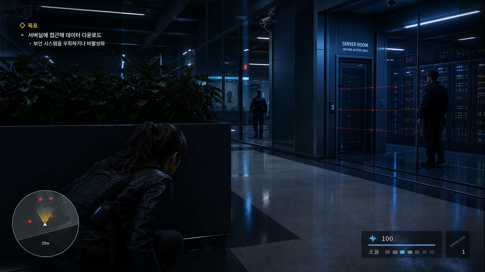
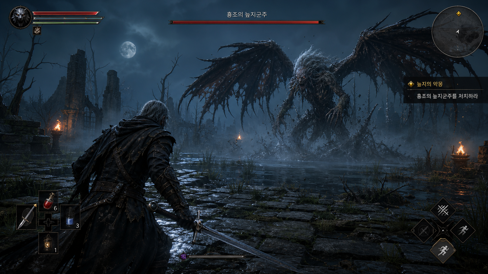
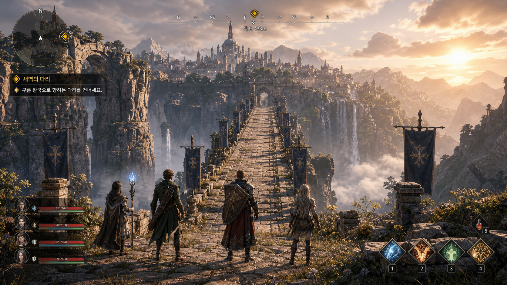
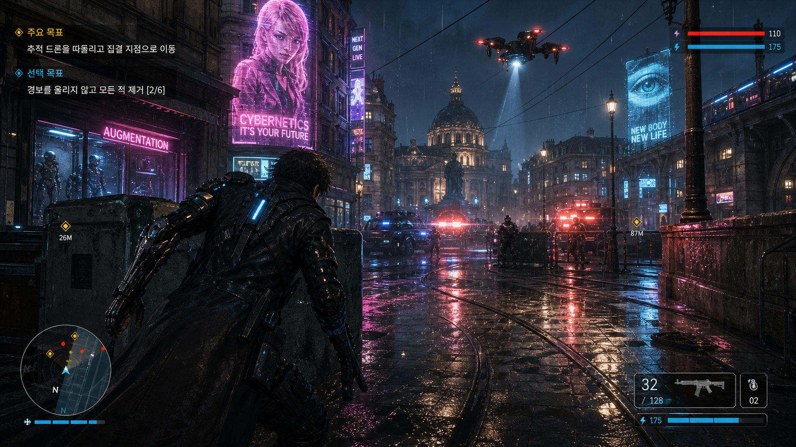
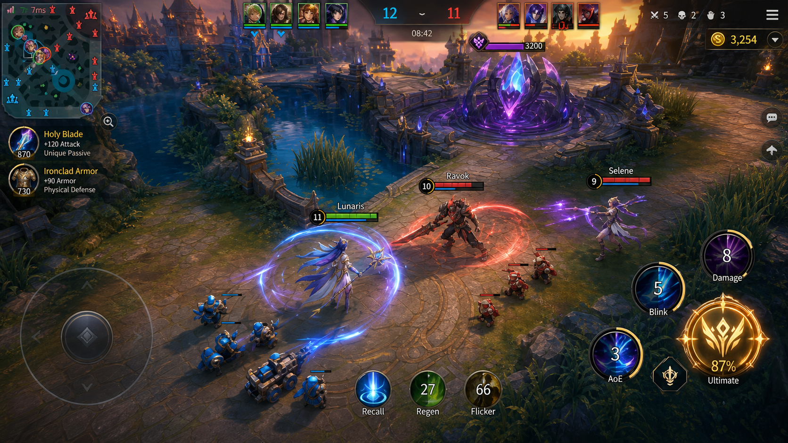
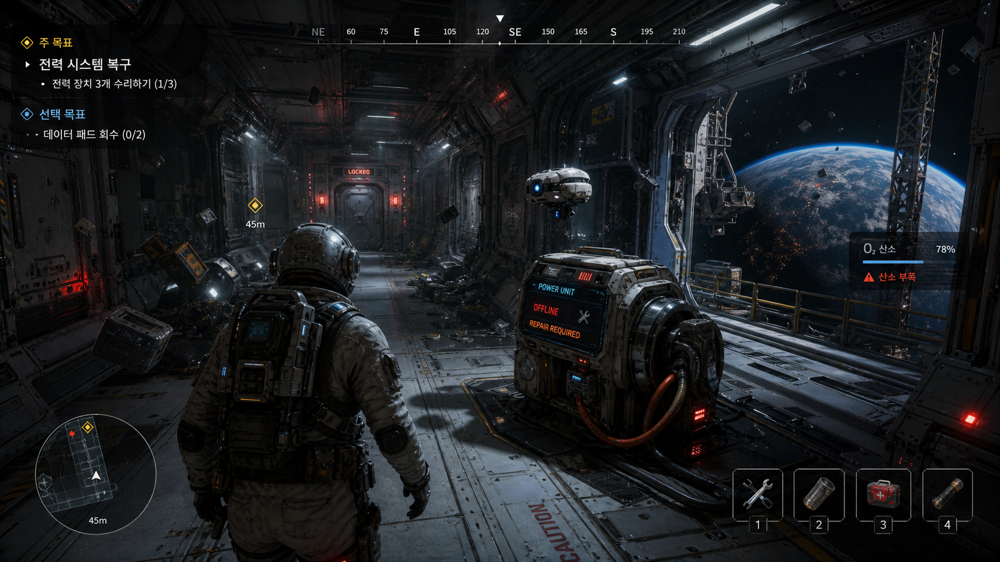
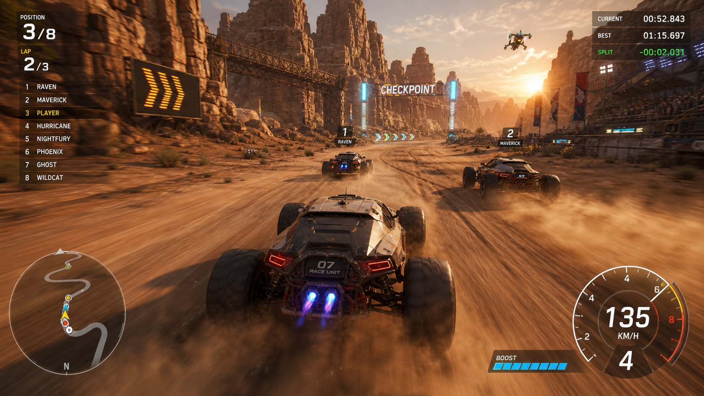

# 🎮 게임

파일: `gallery-gaming.md` · 10개 · 사이트 갤러리(index)의 실제 한국어 프롬프트

이 파일은 사이트 갤러리에 실제로 실린 완성 프롬프트를 담습니다. 공통 작성 규칙은 [`gpt-image-prompt-craft.md`](gpt-image-prompt-craft.md)와 함께 봅니다.

---

## 1. 비밀 임무 게임 플레이 장면



- 카테고리: 게임
- 사이즈: Gaming · landscape · 1920x1080

```text
결과물 유형:
실제 플레이 화면처럼 보이는 게임 스크린샷. 주제는 "비밀 임무 게임 플레이 장면"입니다. 완성 이미지는 홍보용 키아트가 아니라 플레이 중 캡처처럼 보여야 하며, 장면 안에서 목표와 위험 요소가 바로 구분되어야 합니다.

주 피사체:
포니테일 머리에 검은 가죽 재킷과 백팩을 멘 여성 잠입 요원이 어두운 연구 시설 복도에서 왼쪽 전경의 화분형 엄폐물 뒤에 몸을 낮추고 웅크린 채 서버실 쪽을 살피는 장면. 요원은 3인칭 뒤·측면 시점으로 잡히고, 오른쪽 중경에는 유리벽으로 둘러싸인 서버실과 금속 출입문, 그 앞에 선 경비원 한 명, 유리 너머 중경에 또 다른 경비원 한 명이 보입니다. 화면 구석에는 미니맵과 소음 게이지가 배치됩니다. 중심 피사체의 형태, 위치, 행동이 먼저 읽히고 보조 요소는 주제를 설명하는 단서로만 사용합니다.

구도와 비율:
16:9 가로형 실제 플레이 화면처럼 보이는 게임 스크린샷. 왼쪽 전경의 웅크린 플레이어, 오른쪽 중경의 서버실 문과 경비원, 배경의 유리벽 사무 공간으로 전경·중경·배경을 분리합니다. 시선은 조작 대상(요원)에서 목표 지점(서버실 문)으로 이어지게 하고, HUD는 화면 모서리에 작게 배치하되 장면을 가리지 않습니다.

맥락과 배경:
차가운 파란 비상등, 유리 벽 반사, 서버 랙의 작은 색색 불빛, 천장의 보안 카메라, 유리벽을 가로지르는 붉은 레이저 감지선이 긴장감을 만듭니다. 배경은 주 피사체를 설명하는 근거가 되어야 하며, 불필요한 장식으로 시선을 빼앗지 않습니다.

스타일과 매체:
상업용 게임 스크린샷 수준의 실시간 3D 렌더링. 장르에 맞는 UI, 미니맵, 소음/상태 표시, 조작 가능성이 읽히는 환경 디자인을 사용합니다.

빛과 디테일:
조명: 차가운 파란 비상등, 유리 벽 반사, 서버 랙의 작은 불빛, 붉은 레이저 감지선이 어두운 복도에서 긴장감을 만듭니다. 주 피사체의 윤곽이 어두운 배경에서 분리되도록 키 라이트와 반사광을 조절합니다.
카메라 시점: 실제 플레이 카메라처럼 3인칭 어깨 너머 추격 시점 하나만 유지합니다.
디테일: 광택 있는 바닥 반사, 가죽 재킷과 백팩 표면, 서버 랙 LED, 거리감, UI 아이콘의 크기를 정돈합니다.

정확성 조건:
화면 좌상단 목표 HUD에는 "목표", "서버실에 접근해 데이터 다운로드", "보안 시스템을 우회하거나 비활성화"가 그대로 보입니다. 서버실 출입문에는 "SERVER ROOM", "SECURE ACCESS ONLY" 표지가 있고, 좌하단 원형 미니맵에는 "25m"와 붉은 점·노란 시야 콘·흰색 화살표 표식이, 우하단에는 소음 게이지 "100"과 "소음" 세그먼트 바, 아이템 슬롯 숫자 "1"이 보입니다. 그 외 실존 게임 로고, 브랜드명, 읽히지 않는 임의 문자는 피합니다. 포스터나 컷신이 아니라 조작 가능한 실제 게임 화면처럼 보여야 하며, HUD와 장면의 원근이 서로 맞아야 합니다.
```

---

## 2. 해변 오픈월드 게임 화면


- 카테고리: 게임
- 사이즈: Gaming · landscape · 1920x1080

```text
결과물 유형:
실제 플레이 화면처럼 보이는 게임 스크린샷. 주제는 "해변 오픈월드 게임 화면"입니다. 완성 이미지는 홍보용 키아트가 아니라 플레이 중 캡처처럼 보여야 하며, 장면 안에서 목표와 위험 요소가 바로 구분되어야 합니다.

주 피사체:
여성 플레이어 캐릭터(흰색 반팔 티셔츠, 청 반바지, 하나로 묶은 갈색 머리, 흰 운동화)가 뒷모습으로 밝은 모래 해변을 걷고, 그 오른쪽에서 작은 갈색 푸들형 반려견이 따라 뛰는 오픈월드 탐험 장면. 해변, 야자수 늘어선 산책로, 바다, 해안 도시가 넓게 보이고 플레이어는 화면 중앙보다 약간 왼쪽에 배치됩니다. 중심 피사체의 형태, 위치, 행동이 먼저 읽히고 보조 요소는 주제를 설명하는 단서로만 사용합니다.

구도와 비율:
16:9 가로형 실제 플레이 화면처럼 보이는 게임 스크린샷. 플레이어가 실제로 조작 중인 화면처럼 보이도록 전경(모래와 발자국), 중경(해변과 산책로), 배경(도시 스카이라인과 산)을 분리합니다. 시선은 조작 대상에서 해변 저편의 목표 지점으로 이어지게 하고, HUD는 화면 모서리에 작게 배치하되 장면을 가리지 않습니다.

맥락과 배경:
강한 낮 햇빛, 모래 입자, 청록빛 바다 반사, 산책로의 차량(빨간 오픈카, 노란 스포츠카), 야자수, 인명구조탑, 관람차, 부두, 원경의 고층 도시와 산맥이 자연스럽게 들어갑니다. 배경은 주 피사체를 설명하는 근거가 되어야 하며, 불필요한 장식으로 시선을 빼앗지 않습니다.

스타일과 매체:
상업용 게임 스크린샷 수준의 실시간 3D 렌더링. 장르에 맞는 UI, 원형 미니맵, 상단 방위 나침반, 체력과 스태미나 상태 표시, 조작 가능성이 읽히는 환경 디자인을 사용합니다.

빛과 디테일:
조명: 강한 정오 햇빛과 선명한 그림자, 모래 입자, 바다 반사가 자연스럽게 들어갑니다. 주 피사체의 윤곽이 배경에서 분리되도록 키 라이트와 반사광을 조절합니다.
카메라 시점: 실제 플레이 카메라처럼 3인칭 추격 시점 하나만 유지합니다. 캐릭터 뒤에서 약간 높은 눈높이로 따라가는 앵글입니다.
디테일: 모래 재질과 발자국, 반려견 털, 바다 물결, HUD 아이콘의 크기와 거리감을 정돈합니다.

정확성 조건:
실존 게임 로고, 브랜드명은 피합니다. 이미지에 실제로 보이는 한글 HUD 문구를 그대로 반영합니다. 좌상단 퀘스트 표시는 "해안 도로 따라가기", "해변을 따라 선착장까지 이동", "1.2km"로, 좌하단 원형 미니맵 하단에는 "1.2km"로, 우하단 상태바에는 하트 아이콘 옆 "100"(빨간 바)과 번개 아이콘 옆 "100"(파란 바), 그 옆 발바닥 아이콘으로 표기합니다. 상단 나침반에는 방위와 각도 눈금(W, 300, N 등)이 들어갑니다. 포스터나 컷신이 아니라 조작 가능한 실제 게임 화면처럼 보여야 하며, HUD와 장면의 원근이 서로 맞아야 합니다.
```

---

## 3. 어두운 판타지 늪지 보스 사냥



- 카테고리: 게임
- 사이즈: Gaming · landscape · 1920x1080

```text
결과물 유형:
실제 플레이 화면처럼 보이는 게임 스크린샷. 주제는 "어두운 판타지 늪지 보스 사냥"입니다. 완성 이미지는 홍보용 키아트가 아니라 플레이 중 캡처처럼 보여야 하며, 장면 안에서 목표와 위험 요소가 바로 구분되어야 합니다.

주 피사체:
괴물 사냥꾼이 안개 낀 늪지에서 거대한 날개 달린 보스 몬스터와 대치하는 장면. 왼쪽 전경의 사냥꾼은 검을 뽑고, 오른쪽 중경의 몬스터는 늪물과 안개 속에서 솟아오릅니다. 중심 피사체의 형태, 위치, 행동이 먼저 읽히고 보조 요소는 주제를 설명하는 단서로만 사용합니다.

구도와 비율:
16:9 가로형 실제 플레이 화면처럼 보이는 게임 스크린샷. 플레이어가 실제로 조작 중인 화면처럼 보이도록 전경, 중경, 배경을 분리합니다. 시선은 조작 대상에서 목표 지점으로 이어지게 하고, HUD는 화면 모서리에 작게 배치하되 장면을 가리지 않습니다.

맥락과 배경:
차가운 달빛, 횃불, 젖은 돌길, 죽은 나무, 보스 체력바와 스태미나 인터페이스가 전투 직전의 긴장감을 만듭니다. 배경은 주 피사체를 설명하는 근거가 되어야 하며, 불필요한 장식으로 시선을 빼앗지 않습니다.

스타일과 매체:
상업용 게임 스크린샷 수준의 실시간 3D 렌더링. 장르에 맞는 UI, 미니맵, 체력 또는 상태 표시, 조작 가능성이 읽히는 환경 디자인을 사용합니다.

빛과 디테일:
조명: 차가운 달빛, 횃불, 젖은 돌길, 죽은 나무, 보스 체력바와 스태미나 인터페이스가 전투 직전의 긴장감을 만듭니다. 주 피사체의 윤곽이 배경에서 분리되도록 키 라이트와 반사광을 조절합니다.
카메라 시점: 실제 플레이 카메라처럼 한 가지 시점을 유지합니다. 이 장면은 사냥꾼의 등 뒤에서 어깨 너머로 잡는 3인칭 추격 시점입니다.
디테일: 바닥 재질, 장비 표면, 입자 효과, 거리감, UI 아이콘의 크기를 정돈합니다.

정확성 조건:
실존 게임 로고나 브랜드명은 피합니다. 다만 화면에 표시되는 한글 UI 텍스트는 또렷하게 읽히도록 렌더링합니다. 상단 중앙 보스 체력바 위에 보스명 "흥조의 늪지군주", 우측에 퀘스트명 "늪지의 악몽"과 그 아래 목표 "흥조의 늪지군주를 처치하라"를 표기합니다. 좌하단 아이템 슬롯에는 소지 수량 숫자 "6", "3", "1"이 각 아이콘에 붙습니다. 좌상단에는 플레이어 체력 바 묶음, 우상단에는 원형 미니맵을 배치합니다. 포스터나 컷신이 아니라 조작 가능한 실제 게임 화면처럼 보여야 하며, HUD와 장면의 원근이 서로 맞아야 합니다.
```

---

## 4. 원정대의 거대한 다리 접근 장면



- 카테고리: 게임
- 사이즈: Gaming · landscape · 1920x1080

```text
결과물 유형:
실제 플레이 화면처럼 보이는 게임 스크린샷. 주제는 "원정대의 거대한 다리 접근 장면"입니다. 완성 이미지는 홍보용 키아트가 아니라 플레이 중 캡처처럼 보여야 하며, 장면 안에서 목표와 위험 요소가 바로 구분되어야 합니다.

주 피사체:
4인 원정대가 거대한 고대 석조 다리 앞에 서서 구름 위 산악 도시로 향하는 판타지 모험 장면. 카메라는 원정대 뒤쪽에서 다리와 도시를 바라봅니다. 인물 넷은 화면 하단 중앙에 뒷모습으로 나란히 서 있으며, 왼쪽부터 파란빛이 도는 지팡이를 든 마법사, 녹색 망토에 활과 화살통을 멘 궁수, 대형 방패와 붉은 망토를 두른 전사, 금발의 여전사 순서입니다. 목적지인 도시는 먼 중앙에 크게 보입니다. 중심 피사체의 형태, 위치, 행동이 먼저 읽히고 보조 요소는 주제를 설명하는 단서로만 사용합니다.

구도와 비율:
16:9 가로형 실제 플레이 화면처럼 보이는 게임 스크린샷. 플레이어가 실제로 조작 중인 화면처럼 보이도록 전경, 중경, 배경을 분리합니다. 시선은 조작 대상인 원정대에서 다리를 따라 목표 도시로 이어지게 하고, HUD는 화면 모서리에 배치하되 장면을 가리지 않습니다.

맥락과 배경:
따뜻한 일출빛, 협곡을 타고 떨어지는 폭포, 구름과 안개가 깔린 깊은 계곡, 다리 양옆에 정렬된 금색 십자 문양의 짙은 파란 문장 깃발, 석조 난간과 기둥이 모험의 시작을 보여줍니다. 배경은 주 피사체를 설명하는 근거가 되어야 하며, 불필요한 장식으로 시선을 빼앗지 않습니다.

스타일과 매체:
상업용 게임 스크린샷 수준의 실시간 3D 렌더링. 장르에 맞는 UI, 좌상단 원형 미니맵과 나침반, 좌하단 4인 파티 체력바, 우하단 스킬 슬롯 등 조작 가능성이 읽히는 환경 디자인을 사용합니다.

빛과 디테일:
조명: 오른쪽에서 들어오는 따뜻한 일출빛이 다리와 도시를 감싸고, 폭포와 구름이 낀 계곡이 깊이감을 만듭니다. 주 피사체의 윤곽이 배경에서 분리되도록 키 라이트와 반사광을 조절합니다.
카메라 시점: 실제 플레이 카메라처럼 3인칭 추격 시점 하나만 유지합니다. 원정대 뒤쪽에서 다리 정면을 바라보는 낮은 시선을 고정합니다.
디테일: 석조 바닥 재질, 장비 표면, 마법 지팡이의 입자 효과, 거리감, UI 아이콘의 크기를 정돈합니다.

정확성 조건:
실존 게임 로고, 브랜드명, 읽히지 않는 임의 문자는 피합니다. 화면에 표시되는 한글 HUD 텍스트는 정확히 다음과 같이 표기합니다. 좌상단 퀘스트 제목 "새벽의 다리", 그 아래 안내문 "구름 왕국으로 향하는 다리를 건너세요.", 상단 나침반 바 아래 목표 거리 "목표 438m". 좌하단 4인 파티 체력바에는 각각 "1410/1420", "980/980", "820/820", "690/690" 수치가, 우하단에는 1~4 번호가 붙은 스킬 슬롯 네 개가, 오른쪽에는 개수 "5"가 표시된 물약 아이콘이 보입니다. 포스터나 컷신이 아니라 조작 가능한 실제 게임 화면처럼 보여야 하며, HUD와 장면의 원근이 서로 맞아야 합니다.
```

---

## 5. 사이버펑크 유럽 액션 화면



- 카테고리: 게임
- 사이즈: Gaming · landscape · 1920x1080

```text
결과물 유형:
실제 플레이 화면처럼 보이는 게임 스크린샷. 주제는 "사이버펑크 유럽 액션 화면"입니다. 완성 이미지는 홍보용 키아트가 아니라 플레이 중 캡처처럼 보여야 하며, 장면 안에서 목표와 위험 요소가 바로 구분되어야 합니다.

주 피사체:
비 오는 유럽풍 미래 도시에서 사이버 장비를 착용한 주인공이 왼쪽 전경 엄폐물 뒤에 낮게 웅크린 채 하늘의 추격 드론과 광장의 적을 살피는 장면. 주인공은 검은 머리에 사이버네틱 왼팔과 롱코트 차림으로 카메라를 등진 3인칭 오버숄더 자세이고, 서치라이트를 켠 드론과 적의 경광등은 중경과 하늘에 배치됩니다. 중심 피사체의 형태, 위치, 행동이 먼저 읽히고 보조 요소는 주제를 설명하는 단서로만 사용합니다.

구도와 비율:
16:9 가로형 실제 플레이 화면처럼 보이는 게임 스크린샷. 플레이어가 실제로 조작 중인 화면처럼 보이도록 전경(엄폐 중인 주인공), 중경(궤도가 깔린 젖은 광장과 적), 배경(돔형 성당과 기마 동상, 네온 고층부)을 분리합니다. 시선은 조작 대상에서 하늘의 드론과 광장 목표 지점으로 이어지게 하고, HUD는 화면 모서리에 작게 배치하되 장면을 가리지 않습니다.

맥락과 배경:
청록색과 자홍색 네온, 젖은 노면 반사, 트램 궤도, 돔형 성당과 기마 동상, 순찰차의 적청 경광등, 홀로그램 광고가 선명하게 보입니다. 자홍색 네온 옥외광고에는 여성 얼굴과 함께 "CYBERNETICS IT'S YOUR FUTURE", 상점에는 "AUGMENTATION" 네온, 우측에는 눈 형상 홀로그램과 "NEW BODY NEW LIFE", "NEXT GEN LIVE" 문구가 보입니다. 배경은 주 피사체를 설명하는 근거가 되어야 하며, 불필요한 장식으로 시선을 빼앗지 않습니다.

스타일과 매체:
상업용 게임 스크린샷 수준의 실시간 3D 렌더링. 장르에 맞는 UI, 좌하단 원형 미니맵과 나침반, 상단 체력 또는 상태 표시, 조작 가능성이 읽히는 환경 디자인을 사용합니다.

빛과 디테일:
조명: 청록색과 자홍색 네온, 젖은 노면 반사, 홀로그램, 드론 서치라이트, 순찰차 경광등이 선명하게 보입니다. 주 피사체의 윤곽이 배경에서 분리되도록 키 라이트와 반사광을 조절합니다.
카메라 시점: 실제 플레이 카메라처럼 3인칭 오버숄더 추격 시점 한 가지를 유지합니다.
디테일: 좌상단 목표 텍스트, 우상단 체력 게이지, 좌하단 나침반 미니맵, 우하단 탄약 위젯, 광장의 거리 표시 아이콘 등 HUD 요소의 크기와 원근을 정돈하고 바닥 재질, 장비 표면, 빗줄기 입자 효과를 다듬습니다.

정확성 조건:
좌상단에는 노란색 헤더로 "주요 목표"와 본문 "추적 드론을 따돌리고 집결 지점으로 이동", 그 아래 "선택 목표"와 "경보를 울리지 않고 모든 적 제거 [2/6]"가 보이고, 우상단 체력 바에는 "110"과 "175", 우하단 탄약 위젯에는 "32 / 128"과 수류탄 "02", 하단 상태 "175", 광장의 거리 표시로는 "26M"과 "87M"이 보입니다. 실존 게임 로고, 브랜드명, 읽히지 않는 임의 문자는 피합니다. 포스터나 컷신이 아니라 조작 가능한 실제 게임 화면처럼 보여야 하며, HUD와 장면의 원근이 서로 맞아야 합니다.
```

---

## 6. 모바일 전투 경기장 게임 화면



- 카테고리: 게임
- 사이즈: Gaming · landscape · 1920x1080

```text
결과물 유형:
실제 플레이 화면처럼 보이는 모바일 MOBA 게임 스크린샷. 주제는 "모바일 전투 경기장 게임 화면"입니다. 완성 이미지는 홍보용 키아트가 아니라 플레이 중 캡처처럼 보여야 하며, 장면 안에서 목표와 위험 요소가 바로 구분되어야 합니다.

주 피사체:
돌바닥 전장 하단 중앙에서 이름표가 붙은 세 영웅이 맞붙는 장면입니다. 왼쪽에 파란빛 마법진을 두른 마법사 "Lunaris", 가운데에 붉은 갑옷과 대검을 든 전사 "Ravok", 오른쪽에 보라빛 마법을 쓰는 마법사 "Selene"가 배치되고, 그 주위로 파란 아군 미니언과 붉은 적 미니언이 전진합니다. 화면 우상단에는 커다란 보라와 청록빛 수정 목표물이 놓여 있습니다. 중심 피사체의 형태, 위치, 행동이 먼저 읽히고 보조 요소는 주제를 설명하는 단서로만 사용합니다.

구도와 비율:
16:9 가로형, 약간 높은 3인칭 전술 카메라로 전장을 내려다보는 실제 플레이 화면 구도. 하단 왼쪽에 원형 가상 조이스틱, 하단 중앙과 우하단에 여러 개의 원형 스킬 및 아이템 버튼을 배치해 조작 중인 화면처럼 보이게 합니다. 전경의 조작 영웅에서 우상단 수정 목표물로 시선이 이어지도록 전경, 중경, 배경을 분리합니다.

맥락과 배경:
좌측에는 강과 다리, 폐허풍 석조 구조물이 있는 판타지 협곡 전장이 펼쳐집니다. 상단 중앙에 양 팀 4인 초상 로스터와 점수, 타이머가 배치되고, 좌상단에 미니맵과 핑 표시, 좌측에 아이템 정보 패널이 놓입니다. 배경은 주 피사체를 설명하는 근거가 되어야 하며, 불필요한 장식으로 시선을 빼앗지 않습니다.

스타일과 매체:
상업용 게임 스크린샷 수준의 실시간 3D 렌더링. 장르에 맞는 UI, 미니맵, 체력바, 이름표, 조작 가능성이 읽히는 환경 디자인을 사용합니다.

빛과 디테일:
조명: 금빛 저녁 노을 조명에 청록색과 보라색 스킬 이펙트가 어우러집니다. 주 피사체의 윤곽이 배경에서 분리되도록 키 라이트와 반사광을 조절합니다.
카메라 시점: 실제 플레이 카메라처럼 약간 높은 전술 시점 하나만 일관되게 유지합니다.
디테일: 돌바닥 재질, 갑옷과 무기 표면, 마법진 입자 효과, 거리감, HUD 아이콘의 크기를 정돈합니다.

정확성 조건:
화면에 보이는 텍스트는 영웅 이름 "Lunaris", "Ravok", "Selene", 아이템 "Holy Blade"와 "+120 Attack", "Ironclad Armor"와 "+90 Armor", 상단 점수 "12 - 11"과 타이머 "08:42", 우상단 골드 "3,254", 수정 게이지 "3200", 하단 버튼 "Recall", "Regen", "Flicker", "Damage", "Blink", "AoE", "Ultimate" 정도로 자연스럽게 배치합니다. 실존 게임 로고나 브랜드명, 읽히지 않는 임의 문자는 피합니다. 포스터나 컷신이 아니라 조작 가능한 실제 게임 화면처럼 보여야 하며, HUD와 장면의 원근이 서로 맞아야 합니다.
```

---

## 7. 어두운 판타지 세계관 아홉 장면


- 카테고리: 게임
- 사이즈: Gaming · square · 1024x1024

```text
결과물 유형:
다크 판타지 콘셉트 아트 보드. 주제는 "어두운 판타지 세계관 아홉 장면"입니다. 실제 플레이 화면이 아니라 저주받은 해안 왕국의 세계관을 아홉 컷으로 정리한 3×3 격자 무드보드이며, 각 칸이 하나의 장면 카드로 읽혀야 합니다.

주 피사체:
동일한 어두운 톤으로 통일된 아홉 개의 세로형 장면 패널을 3행 3열로 배치합니다. 각 패널 하단에는 번호와 한글 제목, 짧은 부제가 얹혀 있습니다. 순서대로 01 "해안 요새 / 바다의 방패, 왕국의 최후 방어선"(폭풍 치는 바다 절벽 위 성채와 부서진 범선), 02 "안개 낀 시장길 / 소문과 음모가 거래되는 곳"(등불 켜진 좁은 골목과 후드를 쓴 인물 몇), 03 "기사의 유물 / 잊힌 영웅의 힘이 깃든 성물"(제단 위 대검과 좌우로 선 두 갑옷 기사), 04 "낡은 지도 조각 / 진실을 향한 단서가 숨겨져 있다"(나침반과 열쇠가 놓인 해진 양피지 지도), 05 "괴물의 실루엣 / 저주받은 땅을 배회하는 공포"(보름달 아래 가지 달린 거대 괴물과 왜소한 인물 하나), 06 "촛불이 켜진 여관 / 여정의 쉼터이자 정보의 교차점"(샹들리에와 벽난로가 있는 실내와 후드 인물), 07 "연금술 도구 / 금지된 지식과 위험한 실험"(플라스크·해골·촛불이 놓인 실험대), 08 "달빛 항구 / 무역과 밀수, 탈출의 관문"(달빛 받은 젖은 부두와 범선, 실루엣 인물들), 09 "세력의 깃발 / 왕국을 둘러싼 권력의 충돌"(사자·독수리·용 등 문양이 새겨진 찢긴 세력 깃발 넉 장)을 배치합니다.

구도와 비율:
1:1 정사각형, 3×3 균등 격자. 아홉 패널은 얇은 여백으로 나뉘고 각 칸 안에서 중심 피사체가 먼저 읽히도록 구성합니다. 전체를 하나의 정돈된 콘셉트 시트처럼 정렬하되, 개별 칸은 세로 장면으로 완결됩니다.

맥락과 배경:
낮은 채도의 청록색, 녹슨 주황색, 뼈색 팔레트와 젖은 돌, 낡은 천, 금속 유물 질감을 아홉 칸에 공통으로 적용해 하나의 세계관으로 묶습니다. 각 배경은 해당 장면의 제목을 설명하는 근거가 되어야 하며 불필요한 장식으로 시선을 빼앗지 않습니다.

스타일과 매체:
고품질 디지털 컨셉 페인팅. 세밀한 명암과 질감, 영화적 라이팅을 사용한 다크 판타지 일러스트레이션이며, 게임 UI·HUD·미니맵은 넣지 않습니다.

빛과 디테일:
조명: 각 패널은 달빛, 등불, 벽난로, 촛불 같은 국소 광원으로 어둠 속에서 주 피사체를 떠오르게 하고, 낮은 채도의 청록·주황·뼈색으로 통일합니다. 키 라이트와 반사광으로 윤곽을 배경에서 분리합니다.
카메라 시점: 패널마다 장면에 맞는 시점을 쓰되, 보드 전체는 정면에서 바라본 균일한 격자 배열을 유지합니다.
디테일: 돌·천·금속·유리·양피지의 재질감, 안개와 입자, 촛불의 흔들리는 빛, 하단 텍스트의 가독성을 정돈합니다.

정확성 조건:
실존 게임 로고나 브랜드명은 넣지 않습니다. 각 패널 하단의 번호와 한글 제목·부제는 위에 지정한 문구 그대로 또렷하게 표기하고 오탈자나 읽히지 않는 임의 문자를 만들지 않습니다. 포스터 한 장이 아니라 아홉 칸이 명확히 구분되는 3×3 콘셉트 보드로 보여야 하며, 아홉 장면이 하나의 저주받은 해안 왕국 세계관으로 일관되게 묶여야 합니다.
```

---

## 8. 외계 밤 문화 콘셉트 그리드


- 카테고리: 게임
- 사이즈: Gaming · square · 1024x1024

```text
결과물 유형:
3×3 게임 콘셉트 아트 그리드. 주제는 "외계 밤 문화 콘셉트 그리드"입니다. 완성 이미지는 단일 플레이 화면이 아니라 아홉 개의 서로 다른 장면을 균일한 격자에 배치한 아트 시트로, 각 칸이 같은 세계관의 밤 문화 한 장면을 보여줍니다.

주 피사체:
먼 행성 위성 도시의 밤 문화 구역을 보여주는 3×3 콘셉트 그리드. 아홉 패널은 각각 네온 돔 도시 스카이라인과 먼 행성, 보라색 네온 아치의 클럽 입구와 줄 선 손님들, 우주선이 정박한 야간 항구, 홀로그램 작업대 앞의 정비소, 외계인 바텐더가 있는 네온 음료 바, 외계인 밴드가 연주하는 라이브 음악 무대와 관객, 갑옷과 장비가 진열된 장비 상점, 파충류형 외계인이 요리하는 거리 음식 부스, 촛불 켠 테이블에서 야경을 보는 테라스를 담습니다. 각 칸에서 중심 대상의 형태와 행동이 먼저 읽히고 배경은 그 장면을 설명하는 단서로만 쓰입니다.

구도와 비율:
1:1 정사각형 프레임을 균등한 3×3 격자로 나눕니다. 아홉 패널의 크기와 여백을 일정하게 맞추고, 각 칸 안에서 전경, 중경, 배경을 분리해 장면 깊이를 만듭니다. 격자 전체가 하나의 밤 문화 세계관으로 읽히도록 색조와 조명을 통일합니다.

맥락과 배경:
청록색과 자주색 네온, 유리 돔, 금속과 젖은 바닥의 반사, 매달린 조명과 외계 소품을 공통 요소로 사용합니다. 각 패널의 배경은 그 장면의 기능(항구, 클럽, 정비소, 바, 무대, 상점, 노점, 테라스)을 설명하는 근거가 되어야 하며, 불필요한 장식으로 시선을 빼앗지 않습니다.

스타일과 매체:
상업용 게임 콘셉트 아트 수준의 정밀한 디지털 페인팅과 실시간 3D 룩의 혼합. 인물 실루엣, 외계 종족 디자인, 조작 가능성이 느껴지는 환경 디테일을 유지하되 HUD나 게임 UI 오버레이는 넣지 않습니다.

빛과 디테일:
조명: 청록색과 자주색 네온, 유리 돔, 금속 바닥 반사, 매달린 전구와 스포트라이트를 각 패널에 맞게 배치합니다. 각 칸에서 주 피사체의 윤곽이 배경에서 분리되도록 키 라이트와 반사광을 조절합니다.
카메라 시점: 패널마다 장면에 맞는 시점을 자유롭게 선택하되(광각 조감, 아이레벨, 근접 등), 전체 그리드의 색조와 밤 분위기는 하나로 통일합니다.
디테일: 바닥과 벽의 재질, 장비와 소품 표면, 네온 입자와 김·연기 효과, 인물 의상, 원근을 각 패널에서 정돈합니다.

정확성 조건:
실존 게임 로고, 브랜드명, 읽히지 않는 임의 문자는 넣지 않습니다. 이미지에는 판독 가능한 텍스트가 없어야 합니다. 단일 플레이 화면이나 HUD 오버레이가 아니라 아홉 장면을 균일하게 배치한 3×3 콘셉트 아트 그리드로 보여야 하며, 모든 패널의 세계관과 조명 톤이 서로 맞아야 합니다.
```

---

## 9. 우주 정거장 탐사 게임 화면



- 카테고리: 게임
- 사이즈: Gaming · landscape · 1920x1080

```text
결과물 유형:
실제 플레이 화면처럼 보이는 게임 스크린샷. 주제는 "우주 정거장 탐사 게임 화면"입니다. 완성 이미지는 홍보용 키아트가 아니라 플레이 중 캡처처럼 보여야 하며, 장면 안에서 목표와 위험 요소가 바로 구분되어야 합니다.

주 피사체:
우주복을 입은 탐사자 한 명이 정전된 궤도 정거장 내부를 조사하는 3인칭 게임 화면. 플레이어 캐릭터는 화면 아래 중앙에서 약간 왼쪽에 뒷모습으로 서 있고, 복도는 정면으로 깊게 이어지며, 오른쪽 대형 창 너머로 행성이 보입니다. 통로 중앙에는 수리 대상 발전 장치가 놓여 있고, 그 위 공중에는 탐사용 드론 한 대가 떠 있습니다. 중심 피사체의 형태, 위치, 행동이 먼저 읽히고 보조 요소는 주제를 설명하는 단서로만 사용합니다.

구도와 비율:
16:9 가로형 실제 플레이 화면처럼 보이는 게임 스크린샷. 플레이어가 실제로 조작 중인 화면처럼 보이도록 전경(캐릭터 뒷모습), 중경(발전 장치와 드론), 배경(깊은 복도와 창밖 행성)을 분리합니다. 시선은 캐릭터에서 오른쪽 발전 장치와 창밖 행성으로 이어지게 하고, HUD는 화면 모서리에 배치하되 장면을 가리지 않습니다.

맥락과 배경:
붉은 비상등, 차가운 행성빛, 떠다니는 파편과 먼지, 잠긴 격벽 문, 흩어진 화물 상자, 산소 게이지와 목표 마커를 배치합니다. 배경은 주 피사체를 설명하는 근거가 되어야 하며, 불필요한 장식으로 시선을 빼앗지 않습니다.

스타일과 매체:
상업용 게임 스크린샷 수준의 실시간 3D 렌더링. 장르에 맞는 UI를 구성합니다. 좌상단에 목표 패널, 상단에 방위 나침반, 우측에 산소 게이지, 좌하단에 원형 미니맵, 우하단에 번호가 매겨진 퀵슬롯 아이콘을 배치하고, 조작 가능성이 읽히는 환경 디자인을 사용합니다.

빛과 디테일:
조명: 붉은 비상등, 차가운 행성빛, 떠다니는 먼지, 발전 장치와 드론의 국소 발광, 창밖 행성의 은은한 빛을 조합합니다. 주 피사체(캐릭터)의 윤곽이 배경에서 분리되도록 키 라이트와 반사광을 조절합니다.
카메라 시점: 캐릭터 뒤를 따라가는 3인칭 추격 시점 하나만 유지합니다.
디테일: 바닥 재질, 우주복과 장비 표면, 파편 입자 효과, 복도의 거리감, UI 아이콘의 크기를 정돈합니다.

정확성 조건:
실존 게임 로고와 브랜드명, 읽히지 않는 임의 문자는 피합니다. 대신 화면 안 텍스트는 또렷하게 읽히도록 합니다. 좌상단 목표 패널에 "주 목표", "전력 시스템 복구", "전력 장치 3개 수리하기 (1/3)", "선택 목표", "데이터 패드 회수 (0/2)", 우측 게이지에 "O₂ 산소 78%"와 "⚠ 산소 부족", 중앙 발전 장치 패널에 "POWER UNIT", "OFFLINE", "REPAIR REQUIRED", 잠긴 문에 "LOCKED", 목표 마커에 "45m"를 표기합니다. 포스터나 컷신이 아니라 조작 가능한 실제 게임 화면처럼 보여야 하며, HUD와 장면의 원근이 서로 맞아야 합니다.
```

---

## 10. 사막 협곡 레이싱 게임 화면



- 카테고리: 게임
- 사이즈: Gaming · landscape · 1920x1080

```text
결과물 유형:
실제 플레이 화면처럼 보이는 게임 스크린샷. 주제는 "사막 협곡 레이싱 게임 화면"입니다. 완성 이미지는 홍보용 키아트가 아니라 플레이 중 캡처처럼 보여야 하며, 장면 안에서 목표와 위험 요소가 바로 구분되어야 합니다.

주 피사체:
미래형 대형 오프로드 버기 차량들이 사막 협곡 트랙을 질주하는 레이싱 게임 화면. 낮은 추격 카메라로 플레이어 차량 후면을 화면 중앙에 크게 잡습니다. 플레이어 차량은 굵은 오프로드 타이어와 붉은 후미등, 옆면에 "07"과 "RACE UNIT" 표기, 파란 부스터 화염을 뿜는 형태입니다. 앞쪽 좌측에는 라벨 "1" "RAVEN"이 붙은 경쟁 차량, 앞쪽 우측에는 라벨 "2" "MAVERICK"이 붙은 경쟁 차량이 먼지를 일으키며 달립니다. 중경에는 "CHECKPOINT" 문구가 달린 아치형 게이트가 놓입니다. 중심 피사체의 형태, 위치, 행동이 먼저 읽히고 보조 요소는 주제를 설명하는 단서로만 사용합니다.

구도와 비율:
16:9 가로형 실제 플레이 화면처럼 보이는 게임 스크린샷. 플레이어가 실제로 조작 중인 화면처럼 보이도록 전경, 중경, 배경을 분리합니다. 시선은 조작 대상인 플레이어 차량 후면에서 앞쪽 경쟁 차량과 체크포인트 아치로 이어지게 하고, HUD는 화면 모서리에 배치하되 장면을 가리지 않습니다.

맥락과 배경:
석양, 모래 먼지, 붉은 암석 절벽, 관중석과 배너, 하늘의 소형 촬영 드론이 속도감과 대회 분위기를 만듭니다. 배경은 주 피사체를 설명하는 근거가 되어야 하며, 불필요한 장식으로 시선을 빼앗지 않습니다.

스타일과 매체:
상업용 게임 스크린샷 수준의 실시간 3D 렌더링. 장르에 맞는 UI, 좌하단 원형 미니맵과 나침반(N), 좌상단 순위·랩·리더보드, 우상단 랩타임, 우하단 원형 속도계, 하단 부스트 게이지 등 조작 가능성이 읽히는 레이싱 HUD를 사용합니다.

빛과 디테일:
조명: 지평선의 강한 석양 역광, 모래 먼지, 붉은 암석 절벽이 속도감을 만듭니다. 주 피사체의 윤곽이 배경에서 분리되도록 키 라이트와 반사광을 조절하고 부스터 화염의 푸른빛을 살립니다.
카메라 시점: 실제 플레이 카메라처럼 낮은 3인칭 추격 시점 하나만 유지합니다.
디테일: 흙길 재질, 차체 표면, 배기 입자 효과, 거리감, HUD 아이콘의 크기를 정돈합니다.

정확성 조건:
실존 게임 로고나 실제 브랜드명은 피하되, 화면의 HUD 텍스트는 또렷하게 읽히도록 합니다. 좌상단에 "POSITION 3/8"과 "LAP 2/3", 그 아래 리더보드 "1 RAVEN" "2 MAVERICK" "3 PLAYER" "4 HURRICANE" "5 NIGHTFURY" "6 PHOENIX" "7 GHOST" "8 WILDCAT", 우상단에 "CURRENT 00:52.843" "BEST 01:15.697" "SPLIT -00:02.031", 우하단 속도계에 "135" "KM/H"와 기어 "4", 하단에 "BOOST" 게이지를 배치합니다. 포스터나 컷신이 아니라 조작 가능한 실제 게임 화면처럼 보여야 하며, HUD와 장면의 원근이 서로 맞아야 합니다.
```
