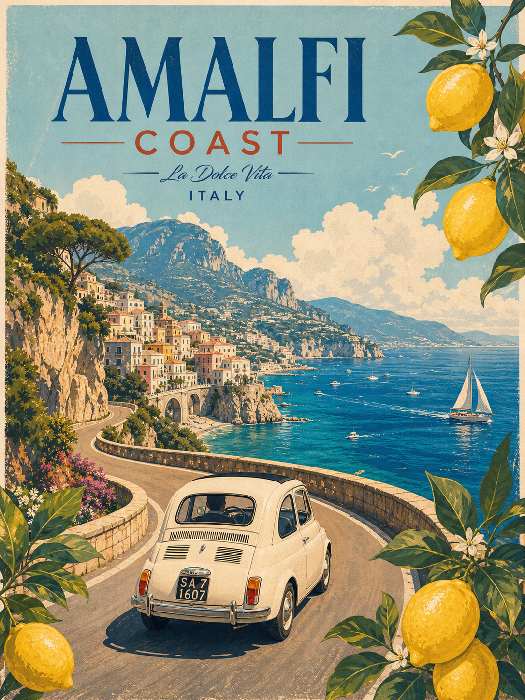
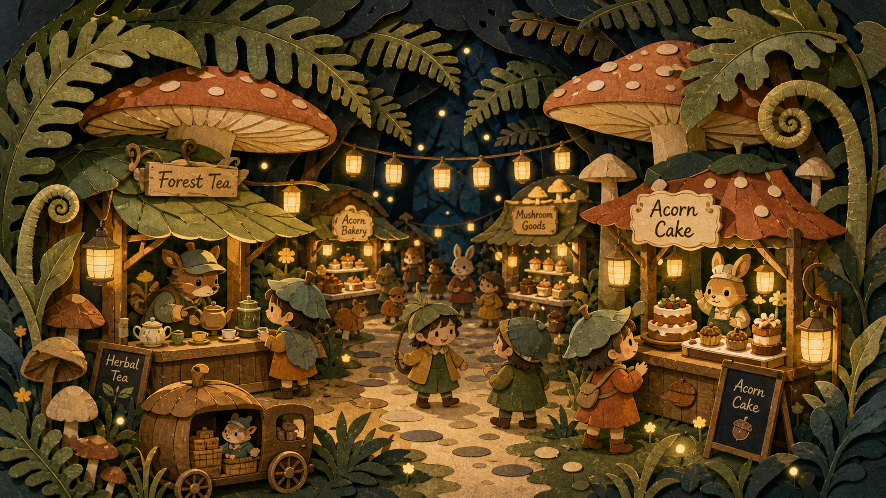

# 🎨 일러스트

파일: `gallery-illustration.md` · 2개 · 사이트 갤러리(index)의 실제 한국어 프롬프트

이 파일은 사이트 갤러리에 실제로 실린 완성 프롬프트를 담습니다. 공통 작성 규칙은 [`craft.md`](craft.md)와 함께 봅니다.

---

## 1. 빈티지 아말피 해안 여행 포스터



- 카테고리: 일러스트
- 사이즈: Illustration · portrait · 1536x2048

```text
결과물 유형:
완성형 여행 포스터 일러스트. 주제는 "빈티지 아말피 해안 여행 포스터"입니다. 완성 이미지는 하나의 매체로 끝까지 제작된 작품처럼 보여야 하며, 주 피사체의 형태가 장식보다 먼저 읽혀야 합니다.

주 피사체:
이탈리아 아말피 해안을 홍보하는 빈티지 여행 일러스트. 화면 하단 중앙에서 구불구불한 절벽 도로를 따라 달려가는 크림색 빈티지 소형차(피아트 500 형태)의 뒷모습을 중심에 둡니다. 그 너머로 절벽 위 파스텔 마을, 짙푸른 바다, 돛단배와 작은 보트들, 산과 구름을 배치합니다. 화면 상단 우측과 하단 좌우 모서리는 레몬 열매와 흰 꽃이 달린 레몬 가지가 프레임처럼 감쌉니다. 중심 피사체의 형태와 위치가 먼저 읽히고 보조 요소는 주제를 설명하는 단서로만 사용합니다.

구도와 비율:
3:4 세로형 완성형 일러스트. 도로 위 소형차의 실루엣을 화면 하단 중앙에 먼저 읽히게 배치하고, 굽이치는 해안 도로가 시선을 마을과 바다로 이끕니다. 상단에는 굵은 제목 영역을 두고 보조 요소는 형태와 색을 설명하는 역할에 머물게 합니다.

맥락과 배경:
오래된 여행 포스터 질감, 따뜻한 햇빛, 단순화된 색면, 굵은 제목 영역을 사용합니다. 배경은 주 피사체를 설명하는 근거가 되어야 하며, 불필요한 장식으로 시선을 빼앗지 않습니다.

스타일과 매체:
선택한 매체의 질감이 분명한 완성형 일러스트. 선, 색면, 질감, 장식, 여백이 하나의 제작 방식으로 통일되어야 합니다.

빛과 디테일:
조명: 오래된 여행 포스터 질감, 따뜻한 햇빛, 단순화된 색면, 굵은 제목 영역을 사용합니다. 형태가 무너지지 않도록 그림자와 하이라이트를 절제합니다.
카메라 시점: 장면 일러스트는 주 피사체가 가장 잘 읽히는 한 가지 시점으로 고정하며, 도로를 따라 멀어지는 자동차의 뒷모습을 살짝 높은 시점에서 담습니다.
디테일: 자동차의 형태와 번호판, 마을 건물, 레몬 열매와 꽃, 돛단배의 반복 규칙을 또렷하게 표현합니다.

정확성 조건:
주 피사체가 장식에 묻히지 않아야 합니다. 상단 제목 영역에 큰 파란색 "AMALFI", 그 아래 주황색 "COAST", 이어서 "La Dolce Vita"와 "ITALY" 문구를 정확히 표기하고, 자동차 번호판에는 "SA 7 1607"을 표기합니다. 글자 왜곡을 피하고 서로 다른 매체 질감을 섞지 않습니다. 원작이 없는 신규 장면으로 만듭니다.
```

---

## 2. 종이 접기 숲속 야시장



- 카테고리: 일러스트
- 사이즈: Illustration · landscape · 1920x1080

```text
결과물 유형:
완성형 장면 일러스트. 주제는 "종이 접기 숲속 야시장"입니다. 완성 이미지는 잘라 붙인 종이 콜라주 한 가지 매체로 끝까지 제작된 작품처럼 보여야 하며, 야시장 전체 장면의 형태가 장식보다 먼저 읽혀야 합니다.

주 피사체:
종이 접기 스타일의 숲속 야시장 장면. 거대한 빨간 점박이 버섯이 노점 지붕을 이루고, 그 아래 사슴·토끼 같은 의인화된 동물 상인이 차와 케이크를 팔며, 잎사귀 모자와 후드를 쓴 여러 명의 아이 손님이 오솔길을 따라 구경합니다. 나무 사이에는 줄에 매단 종이 등불이 늘어져 있고, 고사리와 버섯이 층층이 겹쳐 깊이를 만듭니다.

구도와 비율:
16:9 가로형. 화면 중앙에 밝은 흙길이 안쪽으로 이어지며 양옆으로 노점이 대칭에 가깝게 늘어선 원근 구도입니다. 왼쪽에는 차 노점, 오른쪽에는 케이크 노점을 배치하고, 아이와 동물 손님을 중경에 흩어 놓아 시선이 안쪽으로 흐르게 합니다.

맥락과 배경:
접힌 종이의 그림자, 겹친 레이어, 따뜻한 등불색, 짙은 밤 숲 배경을 사용합니다. 상단은 어두운 잎사귀와 밤하늘, 하단은 돌이 박힌 흙길로 채워 야시장 분위기를 설명합니다. 배경은 주 장면을 설명하는 근거가 되어야 하며, 불필요한 장식으로 시선을 빼앗지 않습니다.

스타일과 매체:
여러 겹의 색지를 오려 붙인 페이퍼 크래프트(종이 콜라주) 질감이 분명한 완성형 일러스트. 선, 색면, 종이 결, 그림자, 여백이 하나의 제작 방식으로 통일되어야 합니다.

빛과 디테일:
조명: 접힌 종이의 그림자, 겹친 레이어, 매달린 등불과 랜턴의 따뜻한 발광, 짙은 숲 배경을 사용합니다. 종이 형태가 무너지지 않도록 그림자와 하이라이트를 절제합니다.
카메라 시점: 장면이 가장 잘 읽히는 눈높이 정면 원근 한 가지 시점으로 고정합니다.
디테일: 동물 상인과 아이 손님의 얼굴·옷·소품, 버섯 갓의 점무늬, 종이 등불의 반복을 또렷하게 표현합니다.

정확성 조건:
간판 글자는 이미지대로 정확히 표기합니다. 왼쪽 차 노점에 "Forest Tea"와 "Herbal Tea", 중경 노점에 "Acorn Bakery"와 "Mushroom Goods", 오른쪽 노점에 "Acorn Cake"(간판과 아래 칠판에 두 번, 칠판에는 도토리 아이콘 포함)로 씁니다. 손, 얼굴, 패턴, 글자 왜곡을 피하고 서로 다른 매체 질감을 섞지 않습니다. 원작이 없는 신규 장면으로 만듭니다.
```
