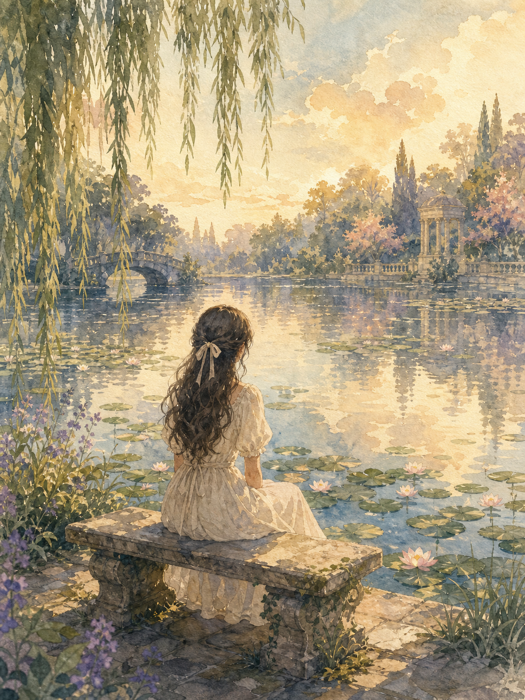
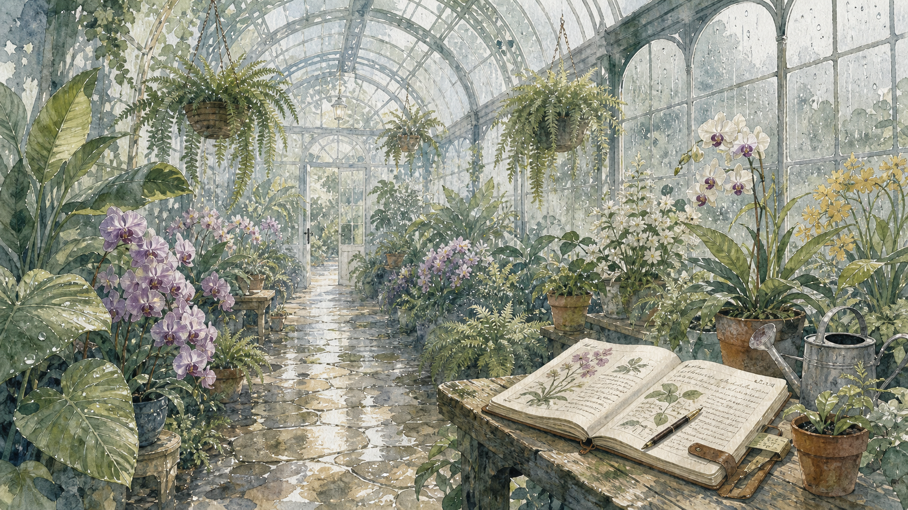
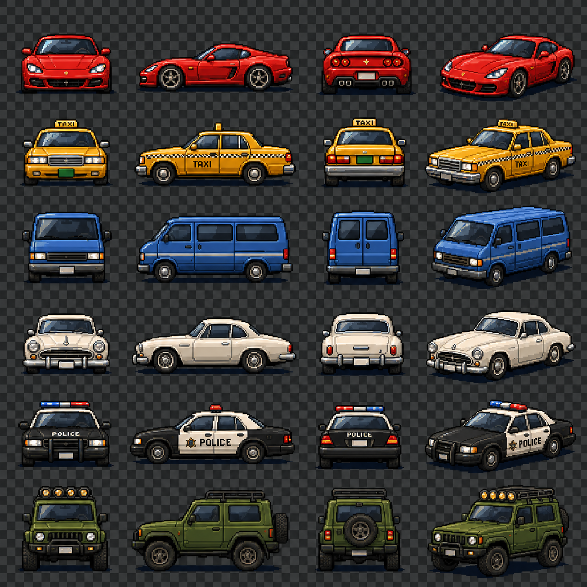
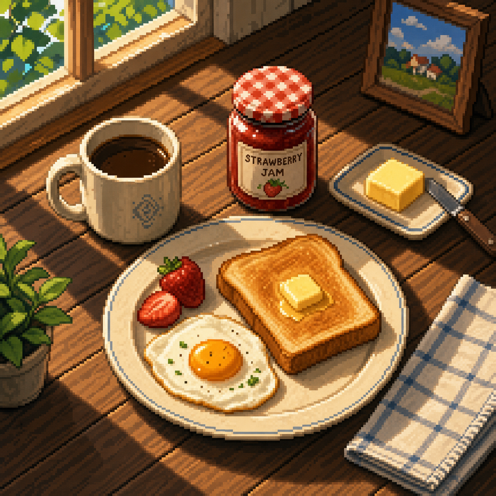
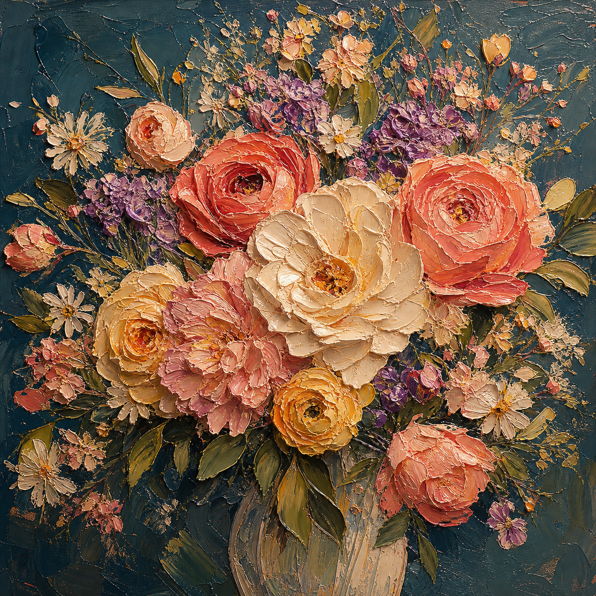

# 🎨 일러스트

파일: `gallery-illustration.md` · 10개 · 사이트 갤러리(index)의 실제 한국어 프롬프트

이 파일은 사이트 갤러리에 실제로 실린 완성 프롬프트를 담습니다. 공통 작성 규칙은 [`prompt-craft.md`](prompt-craft.md)와 함께 봅니다.

---

## 1. 공식 캐릭터 설정 시트


- 카테고리: 일러스트
- 사이즈: Character Design · landscape · 1920x1080

```text
결과물 유형:
완성형 캐릭터 설정 시트 일러스트. 주제는 "공식 캐릭터 설정 시트"입니다. 하나의 매체로 끝까지 제작된 애니메이션/망가풍 컬러 아트워크처럼 보여야 하며, 여러 뷰와 소품이 하나의 도큐먼트 레이아웃으로 정리되어야 합니다. 주 피사체의 형태가 장식보다 먼저 읽혀야 합니다.

주 피사체:
원작이 없는 신규 캐릭터의 공식 설정 시트. 망토를 두른 흑발 남성 탐험가 겸 지도 제작자 한 명(약 23세, 신장 178cm)이 주 피사체입니다. 낡은 진녹색 후드 망토, 흰 셔츠, 다수의 벨트와 파우치, 무릎까지 오는 갈색 가죽 부츠, 손가락 없는 장갑을 착용합니다. 화면 상단에는 정면·측면·후면 전신 턴어라운드 3포즈, 우측 상단에는 표정 네 가지, 우측 중단에는 장비 아이템, 하단에는 디테일 컷, 장갑, 부츠가 배치됩니다. 중심 피사체가 먼저 읽히고 보조 요소는 주제를 설명하는 단서로만 사용합니다.

구도와 비율:
16:9 가로형 완성형 캐릭터 아트워크. 좌측에 캐릭터 정보 패널, 중앙에 전신 턴어라운드, 우측에 표정과 장비, 아래 띠에 디테일 컷을 두는 그리드 레이아웃입니다. 주 피사체의 실루엣을 먼저 읽히게 배치하고, 각 칸의 크기와 간격을 일정하게 맞추며 얇은 구분선으로 영역을 나눕니다.

맥락과 배경:
따뜻한 아이보리 톤의 깨끗한 종이 배경, 얇은 구분선, 일관된 얼굴과 의상, 제작 자료처럼 읽히는 시트형 레이아웃을 사용합니다. 턴어라운드 옆에는 0에서 180까지의 신장 눈금선이 들어갑니다. 좌측에는 8칸짜리 갈색·크림·틸·짙은 남색 계열 컬러 팔레트가 놓입니다. 배경은 주 피사체를 설명하는 근거가 되어야 하며 불필요한 장식으로 시선을 빼앗지 않습니다.

스타일과 매체:
애니메이션/망가풍의 채색 일러스트. 또렷한 라인아트, 부드러운 셀 음영, 갈색과 진녹색 위주의 절제된 컬러가 하나의 제작 방식으로 통일되어야 합니다. 서로 다른 매체 질감을 섞지 않습니다.

빛과 디테일:
조명: 깨끗한 종이 배경 위 균일하고 부드러운 조명. 형태가 무너지지 않도록 그림자와 하이라이트를 절제합니다.
카메라 시점: 턴어라운드는 정면·측면·후면을 같은 높이로 맞추고, 표정과 장비 아이템은 정면 고정 뷰로 또렷하게 보여줍니다.
디테일: 손, 얼굴, 망토 주름, 벨트와 버클, 나침반 문양, 파우치, 부츠 끈, 장갑의 반복 규칙을 또렷하게 표현합니다.

정확성 조건:
주 피사체가 장식에 묻히지 않아야 합니다. 손, 얼굴, 패턴, 글자 왜곡을 피합니다. 이미지에 다음 텍스트를 정확히 표기합니다: 상단 좌측 "CHARACTER SHEET", 대형 제목 "LYSANDER"와 그 아래 "「라이샌더」", 소개 문구 "방랑하는 지도 제작자". 좌측 스탯 표에는 "연령 23세", "성별 남성", "신장 178cm", "직업 지도 제작자 / 탐험가", "소속 독립 탐험 길드", "성격", "무기 단검", "특기" 항목을 넣습니다. 섹션 제목은 "TURNAROUND", "EXPRESSIONS", "EQUIPMENT & ITEMS", "COLOR PALETTE", "DETAIL VIEW", "GLOVES & HANDS", "BOOTS"로 적고, 턴어라운드 하단에 "FRONT", "SIDE", "BACK", 표정 라벨에 "기본", "미소", "집중", "놀람"을 표기합니다. 원작이 없는 신규 캐릭터로 만듭니다.
```

---

## 2. 엘프 궁수 스케치북 설정 시트


- 카테고리: 일러스트
- 사이즈: Character Design · portrait · 1536x2048

```text
결과물 유형:
완성형 캐릭터 콘셉트 시트 일러스트. 주제는 "엘프 궁수 스케치북 설정 시트"입니다. 한 장의 스케치북 페이지처럼 끝까지 제작된 작품으로 보여야 하며, 중앙 전신 캐릭터의 형태가 주변 설명 요소보다 먼저 읽혀야 합니다.

주 피사체:
숲의 여성 엘프 궁수 1인을 다각도로 정리한 스케치북형 캐릭터 콘셉트 시트. 같은 캐릭터를 여러 컷으로 전개합니다. 좌상단에 "엘프 궁수" 제목과 설정 소개문, 종족·직업·성격·나이·신장·주요 능력 스탯 목록. 중앙에 활을 든 전신 정면 포즈, 우상단에 활을 당기는 액션 포즈. 좌측 얼굴 클로즈업과 귀 장식 주석, 우측 "표정 디자인" 네 컷(기본·미소·집중·경계). 하단에는 손 디테일, 의상 디테일 네 칸, 장비 구성(장궁·화살통·부적·허리 가방·단검·망토 클로스), 컬러 팔레트 스와치, 전신 삼면도(정면·측면·후면), 실루엣, 캐릭터 메모를 배치합니다. 페이지 왼쪽 가장자리에는 스케치북 스프링 제본 링이 보입니다.

구도와 비율:
3:4 세로형. 중앙 전신 실루엣을 먼저 읽히게 배치하고, 주변 컷과 라벨은 캐릭터의 형태·장비·색을 설명하는 역할에 머물게 합니다. 각 섹션의 칸 크기와 간격을 스케치북 배열답게 자연스럽게 정리합니다.

맥락과 배경:
연필 선과 옅은 수채 채색, 낡은 크림빛 종이 질감, 초록과 갈색 중심의 자연 팔레트를 사용합니다. 배경은 주 피사체를 설명하는 근거가 되어야 하며, 불필요한 장식으로 시선을 빼앗지 않습니다.

스타일과 매체:
선택한 매체의 질감이 분명한 완성형 일러스트. 선, 색면, 질감, 장식, 여백, 손글씨풍 라벨이 하나의 제작 방식으로 통일되어야 합니다.

빛과 디테일:
조명: 연필 선과 옅은 수채 채색, 낡은 종이 질감을 살립니다. 형태가 무너지지 않도록 그림자와 하이라이트를 절제합니다.
카메라 시점: 캐릭터 삼면도는 정면·측면·후면을 같은 높이로 맞추고, 메인 전신과 액션 컷은 각각 주 피사체가 가장 잘 읽히는 시점으로 고정합니다.
디테일: 손, 얼굴, 옷 주름, 가죽 갑옷, 부츠 끈, 나뭇잎 부적, 화살통의 반복 규칙을 또렷하게 표현합니다.

정확성 조건:
주 피사체가 장식에 묻히지 않아야 합니다. 손, 얼굴, 패턴 왜곡을 피하고 서로 다른 매체 질감을 섞지 않습니다. 이미지에 보이는 한글 텍스트를 자연스럽게 배치합니다. 제목 "엘프 궁수", 스탯 "종족 : 엘프", "직업 : 궁수 (레인저)", "성격 : 침착함 / 관찰력 / 자유로움", "나이 : 120세 (엘프 기준)", "신장 : 175cm", "주요 능력 : 활솔, 추적, 자연 감지", 섹션 제목 "표정 디자인", "장비 구성", "손 디테일", "의상 디테일", "전신 삼면도", "실루엣", "컬러 팔레트", "캐릭터 메모", 표정 라벨 "기본", "미소", "집중", "경계", 삼면도 라벨 "정면", "측면", "후면", 팔레트 라벨 "숲색", "이끼", "갈색", "가죽색", "크림", "회색", "은색"을 정확히 표기합니다. 원작이 없는 신규 캐릭터로 만듭니다.
```

---

## 3. 빈티지 아말피 해안 여행 포스터


- 카테고리: 일러스트
- 사이즈: Illustration · portrait · 1536x2048

```text
결과물 유형:
완성형 여행 포스터 일러스트. 주제는 "빈티지 아말피 해안 여행 포스터"입니다. 완성 이미지는 하나의 매체로 끝까지 제작된 작품처럼 보여야 하며, 주 피사체의 형태가 장식보다 먼저 읽혀야 합니다.

주 피사체:
이탈리아 아말피 해안을 홍보하는 빈티지 여행 일러스트. 화면 하단 중앙에서 구불구불한 절벽 도로를 따라 달려가는 크림색 빈티지 소형차(피아트 500 형태)의 뒷모습을 중심에 둡니다. 그 너머로 절벽 위 파스텔 마을, 짙푸른 바다, 돛단배와 작은 보트들, 산과 구름을 배치합니다. 화면 상단 우측과 하단 좌우 모서리는 레몬 열매와 흰 꽃이 달린 레몬 가지가 프레임처럼 감쌉니다. 중심 피사체의 형태와 위치가 먼저 읽히고 보조 요소는 주제를 설명하는 단서로만 사용합니다.

구도와 비율:
3:4 세로형 완성형 일러스트. 도로 위 소형차의 실루엣을 화면 하단 중앙에 먼저 읽히게 배치하고, 굽이치는 해안 도로가 시선을 마을과 바다로 이끕니다. 상단에는 굵은 제목 영역을 두고 보조 요소는 형태와 색을 설명하는 역할에 머물게 합니다.

맥락과 배경:
오래된 여행 포스터 질감, 따뜻한 햇빛, 단순화된 색면, 굵은 제목 영역을 사용합니다. 배경은 주 피사체를 설명하는 근거가 되어야 하며, 불필요한 장식으로 시선을 빼앗지 않습니다.

스타일과 매체:
선택한 매체의 질감이 분명한 완성형 일러스트. 선, 색면, 질감, 장식, 여백이 하나의 제작 방식으로 통일되어야 합니다.

빛과 디테일:
조명: 오래된 여행 포스터 질감, 따뜻한 햇빛, 단순화된 색면, 굵은 제목 영역을 사용합니다. 형태가 무너지지 않도록 그림자와 하이라이트를 절제합니다.
카메라 시점: 장면 일러스트는 주 피사체가 가장 잘 읽히는 한 가지 시점으로 고정하며, 도로를 따라 멀어지는 자동차의 뒷모습을 살짝 높은 시점에서 담습니다.
디테일: 자동차의 형태와 번호판, 마을 건물, 레몬 열매와 꽃, 돛단배의 반복 규칙을 또렷하게 표현합니다.

정확성 조건:
주 피사체가 장식에 묻히지 않아야 합니다. 상단 제목 영역에 큰 파란색 "AMALFI", 그 아래 주황색 "COAST", 이어서 "La Dolce Vita"와 "ITALY" 문구를 정확히 표기하고, 자동차 번호판에는 "SA 7 1607"을 표기합니다. 글자 왜곡을 피하고 서로 다른 매체 질감을 섞지 않습니다. 원작이 없는 신규 장면으로 만듭니다.
```

---

## 4. 종이 접기 숲속 야시장


- 카테고리: 일러스트
- 사이즈: Illustration · landscape · 1920x1080

```text
결과물 유형:
완성형 장면 일러스트. 주제는 "종이 접기 숲속 야시장"입니다. 완성 이미지는 잘라 붙인 종이 콜라주 한 가지 매체로 끝까지 제작된 작품처럼 보여야 하며, 야시장 전체 장면의 형태가 장식보다 먼저 읽혀야 합니다.

주 피사체:
종이 접기 스타일의 숲속 야시장 장면. 거대한 빨간 점박이 버섯이 노점 지붕을 이루고, 그 아래 사슴·토끼 같은 의인화된 동물 상인이 차와 케이크를 팔며, 잎사귀 모자와 후드를 쓴 여러 명의 아이 손님이 오솔길을 따라 구경합니다. 나무 사이에는 줄에 매단 종이 등불이 늘어져 있고, 고사리와 버섯이 층층이 겹쳐 깊이를 만듭니다.

구도와 비율:
16:9 가로형. 화면 중앙에 밝은 흙길이 안쪽으로 이어지며 양옆으로 노점이 대칭에 가깝게 늘어선 원근 구도입니다. 왼쪽에는 차 노점, 오른쪽에는 케이크 노점을 배치하고, 아이와 동물 손님을 중경에 흩어 놓아 시선이 안쪽으로 흐르게 합니다.

맥락과 배경:
접힌 종이의 그림자, 겹친 레이어, 따뜻한 등불색, 짙은 밤 숲 배경을 사용합니다. 상단은 어두운 잎사귀와 밤하늘, 하단은 돌이 박힌 흙길로 채워 야시장 분위기를 설명합니다. 배경은 주 장면을 설명하는 근거가 되어야 하며, 불필요한 장식으로 시선을 빼앗지 않습니다.

스타일과 매체:
여러 겹의 색지를 오려 붙인 페이퍼 크래프트(종이 콜라주) 질감이 분명한 완성형 일러스트. 선, 색면, 종이 결, 그림자, 여백이 하나의 제작 방식으로 통일되어야 합니다.

빛과 디테일:
조명: 접힌 종이의 그림자, 겹친 레이어, 매달린 등불과 랜턴의 따뜻한 발광, 짙은 숲 배경을 사용합니다. 종이 형태가 무너지지 않도록 그림자와 하이라이트를 절제합니다.
카메라 시점: 장면이 가장 잘 읽히는 눈높이 정면 원근 한 가지 시점으로 고정합니다.
디테일: 동물 상인과 아이 손님의 얼굴·옷·소품, 버섯 갓의 점무늬, 종이 등불의 반복을 또렷하게 표현합니다.

정확성 조건:
간판 글자는 이미지대로 정확히 표기합니다. 왼쪽 차 노점에 "Forest Tea"와 "Herbal Tea", 중경 노점에 "Acorn Bakery"와 "Mushroom Goods", 오른쪽 노점에 "Acorn Cake"(간판과 아래 칠판에 두 번, 칠판에는 도토리 아이콘 포함)로 씁니다. 손, 얼굴, 패턴, 글자 왜곡을 피하고 서로 다른 매체 질감을 섞지 않습니다. 원작이 없는 신규 장면으로 만듭니다.
```

---

## 5. 수련 연못의 몽환적 수채화



- 카테고리: 일러스트
- 사이즈: Watercolor · portrait · 1536x2048

```text
결과물 유형:
완성형 일러스트 또는 캐릭터 아트워크. 주제는 "수련 연못의 몽환적 수채화"입니다. 완성 이미지는 하나의 매체로 끝까지 제작된 작품처럼 보여야 하며, 주 피사체의 형태가 장식보다 먼저 읽혀야 합니다.

주 피사체:
수련이 핀 넓은 연못을 바라보며 돌 벤치에 앉아 있는 젊은 여성의 몽환적 수채화. 인물은 화면 중앙 하단에 크게 뒷모습으로 앉아 있고, 긴 흑갈색 웨이브 머리에 리본을 묶었으며 크림색 드레스를 입었습니다. 인물 앞으로는 분홍 수련과 수련 잎이 연못 전체에 넓게 펼쳐집니다. 중심 피사체의 형태, 위치, 행동이 먼저 읽히고 보조 요소는 주제를 설명하는 단서로만 사용합니다.

구도와 비율:
3:4 세로형 완성형 일러스트. 주 피사체의 실루엣을 화면 중앙 하단에서 먼저 읽히게 배치하고, 화면 상단 왼쪽에서 늘어진 수양버들 가지와 연못, 배경이 이를 감싸도록 합니다. 보조 요소는 형태와 색을 설명하는 역할에 머물게 합니다.

맥락과 배경:
황혼빛 정원 연못. 왼쪽에는 아치형 돌다리, 오른쪽에는 원형 석조 정자와 사이프러스 나무가 있고, 하늘은 황금빛 노을과 부드러운 구름으로 물듭니다. 연못에는 분홍 수련이 떠 있고, 전경 좌우에는 보라색 붓꽃이 피어 있습니다. 배경은 주 피사체를 설명하는 근거가 되어야 하며, 불필요한 장식으로 시선을 빼앗지 않습니다.

스타일과 매체:
선택한 매체의 질감이 분명한 완성형 수채화 일러스트. 선, 색면, 질감, 장식, 여백이 하나의 제작 방식으로 통일되어야 합니다.

빛과 디테일:
조명: 투명한 물감 번짐, 황금빛 노을과 옅은 분홍·녹색·보라, 수면의 부드러운 반사, 종이 질감을 살립니다. 형태가 무너지지 않도록 그림자와 하이라이트를 절제합니다.
카메라 시점: 인물을 뒤에서 바라보는 한 가지 시점으로 고정하고, 시선이 연못 너머 배경으로 자연스럽게 흐르도록 합니다.
디테일: 머리카락의 결과 리본, 드레스 주름, 수련과 수련 잎, 돌 벤치의 질감을 또렷하게 표현합니다.

정확성 조건:
주 피사체가 장식에 묻히지 않아야 합니다. 인물은 한 명이며 뒷모습입니다. 손, 얼굴, 패턴, 글자 왜곡을 피하고 서로 다른 매체 질감을 섞지 않습니다. 이미지 안에 문구나 텍스트는 넣지 않습니다. 원작이 없는 신규 캐릭터와 장면으로 만듭니다.
```

---

## 6. 비 오는 식물원 수채화



- 카테고리: 일러스트
- 사이즈: Watercolor · landscape · 1920x1080

```text
결과물 유형:
완성형 수채화 장면 일러스트. 주제는 "비 오는 식물원 수채화"입니다. 완성 이미지는 수채라는 하나의 매체로 끝까지 제작된 작품처럼 보여야 하며, 온실 공간의 깊이와 식물의 형태가 장식보다 먼저 읽혀야 합니다.

주 피사체:
비 오는 날 빅토리아풍 유리 온실(온실 정원) 내부를 그린 수채화. 아치형 철골과 젖은 유리 지붕 아래로 매달린 고사리 화분들이 늘어지고, 양옆으로 보라색 호접란, 흰색과 노란색 꽃, 큰 열대 잎(몬스테라·필로덴드론), 테라코타와 함석 화분들이 가득합니다. 오른쪽 전경에는 낡은 나무 테이블 위에 펼쳐진 식물 도감 노트(식물 스케치와 손글씨가 있는 펼침면), 펜 한 자루, 함석 물뿌리개 두 개가 놓여 있습니다. 인물은 등장하지 않습니다.

구도와 비율:
16:9 가로형 완성형 일러스트. 화면 중앙으로 소실점이 모이는 원근 구도로, 젖은 타일 통로가 안쪽 문을 향해 뻗어 나갑니다. 양옆 식물 무리가 통로를 감싸고, 오른쪽 아래 나무 테이블과 노트가 가까운 전경을 이룹니다.

맥락과 배경:
빗물 번짐, 녹색 농담, 흐릿한 배경, 종이 위 물감이 퍼지는 느낌을 사용합니다. 유리에 맺힌 빗방울과 김 서린 표면, 젖은 돌바닥의 반사가 비 오는 날의 습한 공기를 설명합니다. 배경은 주 공간을 설명하는 근거가 되어야 하며, 불필요한 장식으로 시선을 빼앗지 않습니다.

스타일과 매체:
수채 질감이 분명한 완성형 일러스트. 부드러운 번짐, 투명한 색면, 종이 결의 질감, 절제된 윤곽선이 하나의 제작 방식으로 통일되어야 합니다.

빛과 디테일:
조명: 지붕 유리를 통해 스며드는 흐린 자연광과 안쪽 문에서 새어 들어오는 밝은 빛을 사용합니다. 형태가 무너지지 않도록 그림자와 하이라이트를 절제합니다.
카메라 시점: 장면이 가장 잘 읽히는 한 가지 시점으로 고정합니다. 통로 눈높이에서 안쪽 문을 향해 바라보는 일점 투시 구도입니다.
디테일: 난초 꽃잎, 고사리 잎맥, 화분 질감, 물뿌리개 금속면, 노트의 식물 스케치를 또렷하게 표현합니다.

정확성 조건:
주 공간과 식물이 장식에 묻히지 않아야 합니다. 인물, 벤치, 우산은 넣지 않습니다. 화분과 식물의 형태 왜곡을 피하고 서로 다른 매체 질감을 섞지 않습니다. 노트에는 알아볼 수 있는 특정 문구 대신 흘림체 필기 느낌의 텍스처만 표현합니다. 원작이 없는 신규 장면으로 만듭니다.
```

---

## 7. 픽셀 자동차 스프라이트 시트



- 카테고리: 일러스트
- 사이즈: Pixel Art · square · 1024x1024

```text
결과물 유형:
완성형 일러스트 또는 캐릭터 아트워크. 주제는 "픽셀 자동차 스프라이트 시트"입니다. 완성 이미지는 하나의 매체로 끝까지 제작된 작품처럼 보여야 하며, 주 피사체의 형태가 장식보다 먼저 읽혀야 합니다.

주 피사체:
레트로 게임용 자동차 스프라이트 시트. 6행 4열 격자로, 각 행은 하나의 차종을 정면, 측면, 후면, 그리고 3/4 사선 뷰의 순서로 나란히 배치합니다. 위에서부터 빨간 스포츠카, 노란 택시 세단, 파란 밴, 크림색 클래식 쿠페, 흑백 경찰차, 녹색 오프로드 SUV 여섯 종을 담습니다. 중심 피사체의 형태와 위치가 먼저 읽히고 보조 요소는 주제를 설명하는 단서로만 사용합니다.

구도와 비율:
1:1 정사각형 완성형 일러스트 또는 캐릭터 아트워크. 주 피사체의 실루엣을 먼저 읽히게 배치하고, 보조 요소는 형태와 색을 설명하는 역할에 머물게 합니다. 시트형 결과물은 각 칸의 크기와 간격을 일정하게 맞추고, 같은 행의 네 뷰는 동일한 차종으로 통일합니다.

맥락과 배경:
제한된 16색 팔레트, 또렷한 픽셀 실루엣, 회색 체커보드 무늬로 표현된 투명 배경 작업용 보드로 만듭니다. 배경은 주 피사체를 설명하는 근거가 되어야 하며, 불필요한 장식으로 시선을 빼앗지 않습니다.

스타일과 매체:
선택한 매체의 질감이 분명한 완성형 픽셀 일러스트. 선, 색면, 질감, 장식, 여백이 하나의 제작 방식으로 통일되어야 합니다.

빛과 디테일:
조명: 제한된 16색 팔레트, 또렷한 픽셀 실루엣, 체커보드 투명 배경의 단순한 작업용 보드로 만듭니다. 형태가 무너지지 않도록 그림자와 하이라이트를 절제합니다.
카메라 시점: 각 차종을 정면, 측면, 후면, 3/4 사선의 네 시점으로 같은 높이에서 맞춰 정렬합니다.
디테일: 바퀴, 창문, 라이트, 경찰차의 지붕 경광등, SUV의 루프 라이트 같은 부품의 반복 규칙을 또렷하게 표현합니다.

정확성 조건:
주 피사체가 장식에 묻히지 않아야 합니다. 노란 택시 차체에는 "TAXI", 흑백 경찰차 차체에는 "POLICE" 문구가 픽셀 글자로 또렷하게 보여야 합니다. 손, 얼굴, 패턴, 글자 왜곡을 피하고 서로 다른 매체 질감을 섞지 않습니다. 원작이 없는 신규 차량 디자인으로 만듭니다.
```

---

## 8. 픽셀 아트 아침 식사 정물



- 카테고리: 일러스트
- 사이즈: Pixel Art · square · 1024x1024

```text
결과물 유형:
완성형 픽셀 아트 일러스트. 주제는 "픽셀 아트 아침 식사 정물"입니다. 완성 이미지는 하나의 매체로 끝까지 제작된 작품처럼 보여야 하며, 아침 식탁 정물의 형태가 장식보다 먼저 읽혀야 합니다.

주 피사체:
픽셀 아트로 표현한 아침 식사 정물. 중앙 앞쪽에 파란 테두리의 크림색 접시가 놓이고 그 위에 프라이드 에그(허브 조각이 올라간 노른자), 버터 조각이 녹아내리는 두툼한 토스트, 반으로 자른 딸기 두 조각이 담깁니다. 왼쪽에는 파란 기하 문양이 들어간 크림색 커피 머그가 김 없이 진한 커피를 담고 있고, 뒤쪽 중앙에는 빨강-흰색 깅엄 체크 뚜껑의 딸기잼 병이 놓입니다. 오른쪽에는 파란 테두리 접시 위에 버터 한 덩이와 버터나이프가 함께 놓입니다.

구도와 비율:
1:1 정사각형 완성형 일러스트. 식탁을 비스듬히 내려다보는 아이소메트릭 3/4 부감 시점으로, 접시 정물을 화면 중앙 하단에 배치하고 커피, 잼 병, 버터 접시를 뒤쪽에 여유 있게 배열합니다. 주 피사체인 접시 위 음식의 실루엣이 먼저 읽히게 하고, 보조 소품은 형태와 색을 설명하는 역할에 머물게 합니다.

맥락과 배경:
따뜻한 색감의 나무 널판 식탁 위 장면. 왼쪽 위에는 초록 잎이 보이는 창이 있고 오른쪽 위 벽에는 시골 풍경(집·언덕·하늘)을 담은 액자가 걸립니다. 왼쪽 아래에는 화분에 심긴 초록 잎 식물, 오른쪽 아래에는 파랑-흰 격자 무늬 천 냅킨이 식탁 모서리에 걸쳐 있습니다. 배경은 아늑한 아침 식탁 분위기를 설명하는 근거가 되어야 하며 시선을 과하게 빼앗지 않습니다.

스타일과 매체:
픽셀 질감이 분명한 완성형 픽셀 아트 일러스트. 선명한 픽셀 가장자리, 계단식 픽셀 디테일, 색면, 질감이 하나의 제작 방식으로 통일되어야 합니다.

빛과 디테일:
조명: 따뜻한 제한 팔레트에 창에서 들어오는 아침 햇살이 식탁에 부드러운 사선 그림자를 드리웁니다. 작은 하이라이트와 그림자를 절제해 각 사물의 형태가 무너지지 않게 합니다.
카메라 시점: 정물이 가장 잘 읽히는 아이소메트릭 3/4 부감 시점 하나로 고정합니다.
디테일: 잼 병 라벨의 딸기 그림, 접시 테두리 선, 토스트의 질감, 격자 냅킨 패턴 같은 반복 규칙을 또렷한 픽셀로 표현합니다.

정확성 조건:
주 피사체(접시 위 아침 식사)가 장식에 묻히지 않아야 합니다. 잼 병 라벨에는 "STRAWBERRY JAM" 문구를 정확히 표기하며, 글자 왜곡을 피하고 서로 다른 매체 질감을 섞지 않습니다. 인물은 등장하지 않습니다. 원작이 없는 신규 정물 장면으로 만듭니다.
```

---

## 9. 두꺼운 물감의 꽃 회화



- 카테고리: 일러스트
- 사이즈: Fine Art Painting · square · 1024x1024

```text
결과물 유형:
완성형 회화 작품. 주제는 "두꺼운 물감의 꽃 회화"입니다. 완성 이미지는 두꺼운 임파스토 유화 한 매체로 끝까지 제작된 작품처럼 보여야 하며, 꽃다발의 형태가 장식보다 먼저 읽혀야 합니다.

주 피사체:
두꺼운 물감 질감이 살아 있는 꽃 정물 회화. 장미와 라넌큘러스, 데이지, 라일락 등 다양한 꽃이 어우러진 풍성한 꽃다발을 화면 중앙에 꽉 차게 배치하고, 화면 하단에는 꽃다발을 담은 밝은 색 화병을 두어 정물 구도를 완성합니다. 산호빛 핑크, 크림 화이트, 노랑, 연보라 꽃들이 주역이며, 배경은 붓질 질감이 남은 어두운 청록 색면으로 처리합니다.

구도와 비율:
1:1 정사각형 정물화. 풍성한 꽃다발의 실루엣을 화면 가득 먼저 읽히게 배치하고, 화병은 하단에 자연스럽게 걸쳐 정물의 무게 중심을 잡습니다. 정면에서 살짝 위를 향한 한 가지 시점으로 고정하여 꽃 무리가 가장 잘 읽히게 합니다.

맥락과 배경:
두꺼운 붓질, 물감 덩어리(임파스토), 강한 색 대비, 캔버스 질감이 보이게 만듭니다. 어두운 청록 배경은 밝은 꽃들의 채도를 끌어올리는 근거가 되어야 하며, 불필요한 장식으로 시선을 빼앗지 않습니다.

스타일과 매체:
임파스토 유화의 질감이 분명한 완성형 회화. 팔레트 나이프와 붓질의 두께, 색면, 질감, 여백이 하나의 제작 방식으로 통일되어야 합니다.

빛과 디테일:
조명: 두꺼운 붓질, 물감 덩어리, 강한 색 대비, 캔버스 질감이 보이게 만듭니다. 형태가 무너지지 않도록 그림자와 하이라이트를 절제하고, 꽃잎 능선에 물감이 쌓인 하이라이트가 얹히게 합니다.
카메라 시점: 정면에서 살짝 위를 향한 한 가지 시점으로 고정합니다.
디테일: 꽃송이 하나하나의 겹친 꽃잎, 두터운 물감 능선, 잎사귀와 화병 표면의 붓 자국을 또렷하게 표현합니다.

정확성 조건:
주 피사체인 꽃다발이 배경에 묻히지 않아야 합니다. 인물, 글자, 반복 패턴은 넣지 않으며 서로 다른 매체 질감을 섞지 않습니다. 임파스토 유화라는 단일 매체로 통일하고, 원작이 없는 신규 정물 구성으로 만듭니다.
```

---

## 10. 해질녘 강가 인상주의 회화


- 카테고리: 일러스트
- 사이즈: Fine Art Painting · wide · 2520x1080

```text
결과물 유형:
완성형 인상주의 풍경 회화. 주제는 "해질녘 강가 인상주의 회화"입니다. 완성 이미지는 유화 한 매체로 끝까지 제작된 작품처럼 보여야 하며, 강과 노을이라는 주 장면이 장식보다 먼저 읽혀야 합니다.

주 피사체:
해질녘 강가 풍경을 그린 인상주의 유화. 화면 중앙에서 수평선 위로 낮게 걸린 붉은 태양과 물 위로 길게 뻗은 노을 반사가 중심이 됩니다. 강 건너에는 아치형 석교가 가로지르고, 오른쪽으로는 붉은 지붕 집들과 교회 첨탑이 있는 작은 마을이 실루엣으로 보입니다. 왼쪽 강변 산책로에는 모자 쓴 남녀 두 사람(정장 차림 남성과 흰 드레스에 챙 모자를 쓴 여성)이 걸어가며, 강변 좌측을 키 큰 나무들이 채웁니다.

구도와 비율:
21:9 와이드 가로 풍경 구도. 왼쪽 나무와 산책로가 근경을, 중앙의 태양과 강물 반사가 중경을, 강 건너 다리와 마을이 원경을 이루는 3단 깊이로 배치합니다. 시선은 물 위 노을 반사를 따라 태양으로 모이도록 고정합니다.

맥락과 배경:
짧고 두꺼운 붓터치(임파스토), 따뜻한 노을색, 물 위 반사, 부드러운 대기 원근을 표현합니다. 배경은 저녁 강가의 고요한 분위기를 설명하는 근거가 되어야 하며, 불필요한 장식으로 시선을 빼앗지 않습니다.

스타일과 매체:
두꺼운 임파스토 질감이 분명한 완성형 인상주의 유화. 색면, 붓터치, 질감, 여백이 하나의 유화 제작 방식으로 통일되어야 합니다.

빛과 디테일:
조명: 지는 해의 따뜻한 주황빛이 하늘과 물을 물들이고, 물 위로 태양 반사가 수직으로 길게 내려옵니다. 형태가 무너지지 않도록 그림자와 하이라이트를 절제합니다.
카메라 시점: 강변에서 수면과 노을을 바라보는 눈높이의 한 가지 시점으로 고정합니다.
디테일: 하늘과 물의 붓터치 리듬, 나뭇잎 덩어리, 마을 실루엣과 첨탑을 인상주의적 필치로 또렷하게 표현합니다.

정확성 조건:
주 장면(강, 노을, 다리, 마을)이 장식에 묻히지 않아야 합니다. 인물은 두 명(모자 쓴 남녀 한 쌍)만 작게 배치하고 군중으로 늘리지 않으며, 얼굴과 손의 과도한 디테일 대신 인상주의적 실루엣으로 처리합니다. 화면에 글자나 문구는 넣지 않습니다. 임파스토 유화 질감을 다른 매체와 섞지 않고, 원작이 없는 신규 장면으로 만듭니다.
```
