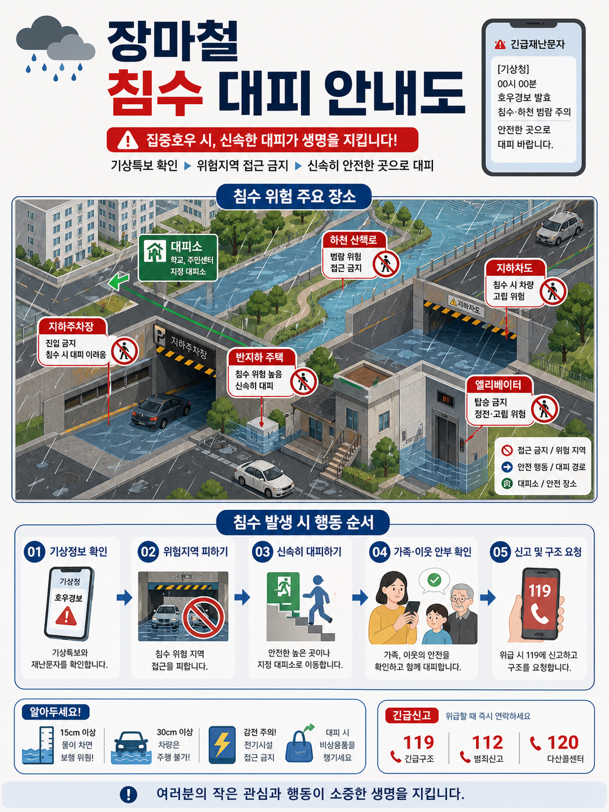
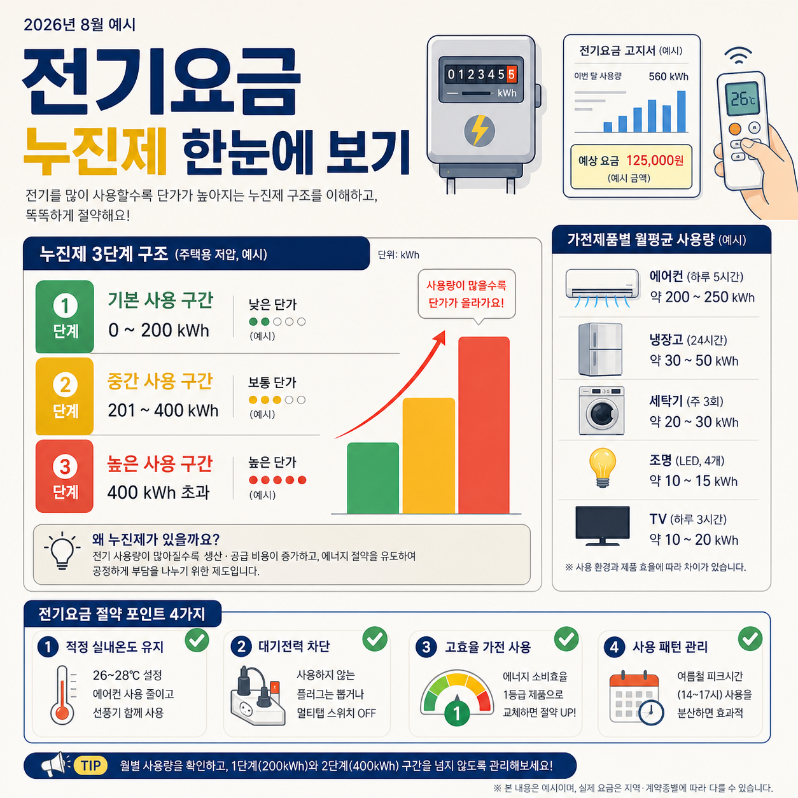
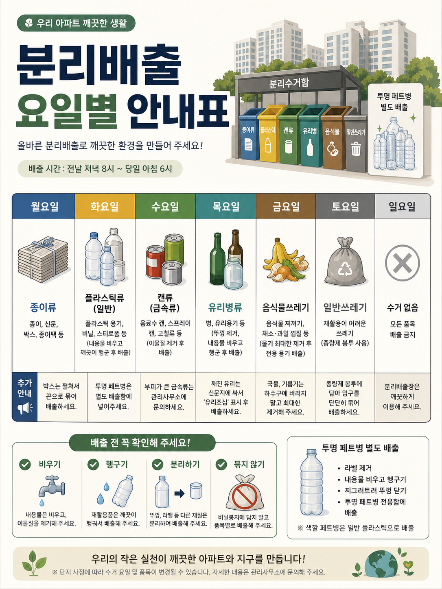
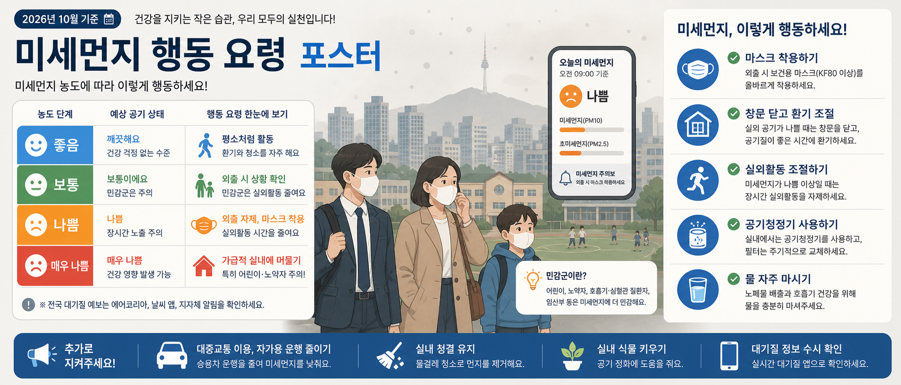
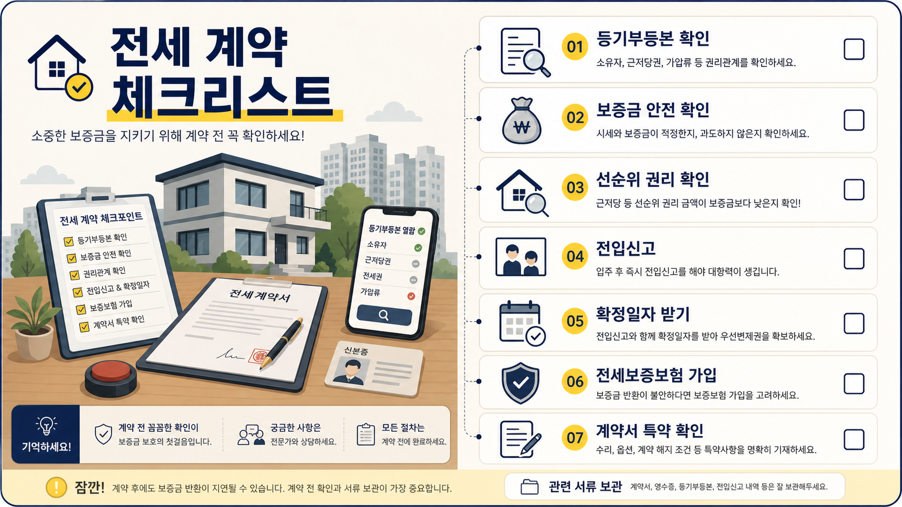
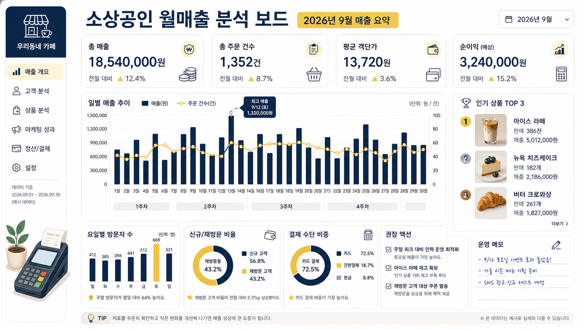
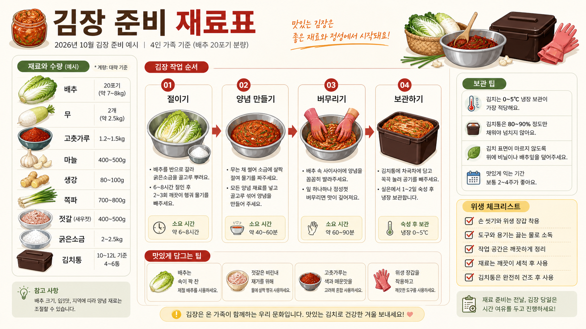
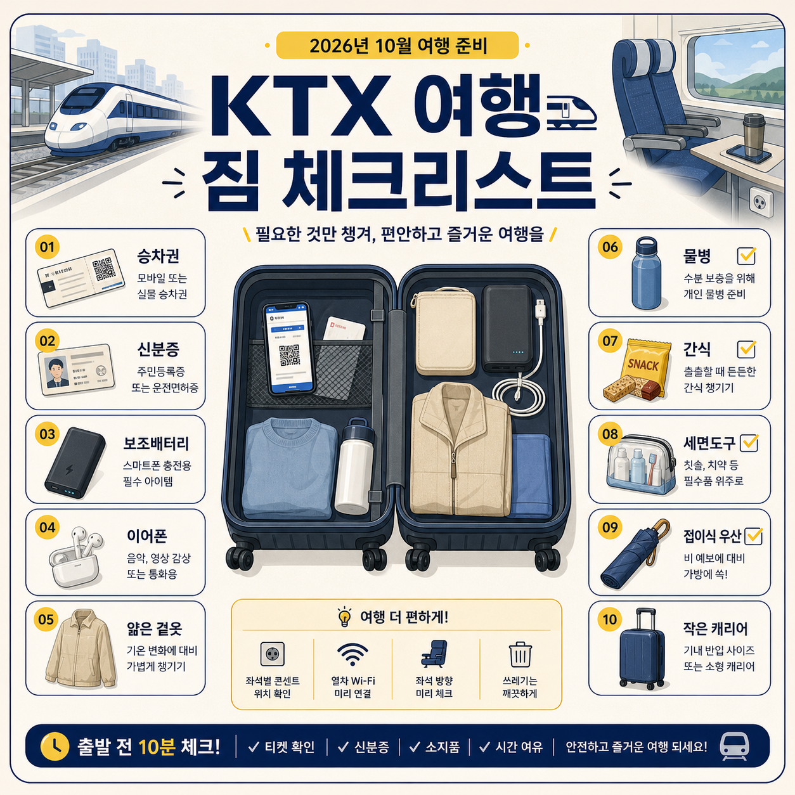

# 📊 인포그래픽

파일: `gallery-infographics-and-field-guides.md` · 10개 · 사이트 갤러리(index)의 실제 한국어 프롬프트

이 파일은 사이트 갤러리에 실제로 실린 완성 프롬프트를 담습니다. 공통 작성 규칙은 [`gpt-image-prompt-craft.md`](gpt-image-prompt-craft.md)와 함께 봅니다.

---

## 1. 장마철 침수 대피 안내도



- 카테고리: 인포그래픽
- 사이즈: 인포그래픽 · 세로형 · 1536x2048

```text
결과물 유형:
공공안전 인포그래픽. 주제는 "장마철 침수 대피 안내도"입니다. 완성 이미지는 주민센터, 아파트 게시판, 학교 가정통신문에 바로 붙일 수 있는 안내물처럼 보여야 하며, 위험 상황과 행동 순서가 먼저 읽혀야 합니다.

주 피사체:
한국 도심 주택가와 지하 공간을 기준으로 한 침수 대피 안내도. 아이소메트릭 도심 조감도 위에 지하주차장, 반지하 주택, 하천 산책로, 지하차도, 엘리베이터, 대피소를 배치하고 각 위험 장소에 붉은 접근 금지 아이콘과 짧은 경고 라벨을 답니다. 하단 "침수 발생 시 행동 순서" 04단계에만 여성 한 명, 아이 한 명, 노인 남성 한 명(총 3인)이 스마트폰으로 안부를 확인하는 일러스트를 넣고, 그 외 화면에는 인물을 넣지 않습니다.

구도와 비율:
3:4 세로형. 상단에는 제목과 핵심 경고 문구, 우상단에는 긴급재난문자 스마트폰 화면, 중앙에는 침수 위험 장소 아이소메트릭 지도, 하단에는 행동 순서 5단계와 참고 정보 박스를 배치합니다. 번호는 01부터 05까지 사용하고, 위험 장소는 붉은색, 안전 행동·대피 경로는 파란색, 대피소는 초록색으로 구분합니다.

맥락과 배경:
한국의 장마철 생활 환경이 느껴지게 합니다. 빗줄기, 아파트 단지, 지하주차장 경사로, 하천변 산책로, 물에 잠긴 도로와 차량, 맨홀, 긴급문자 화면을 넣습니다. 배경은 따뜻한 흰색 또는 연한 회색으로 두고 정보가 먼저 보이게 합니다.

스타일과 매체:
지자체 안내 포스터 수준의 깔끔한 벡터 인포그래픽. 두꺼운 제목, 짧은 라벨, 명확한 아이콘, 충분한 여백, 공공기관 안내물 같은 신뢰감 있는 편집 디자인을 사용합니다.

빛과 디테일:
평면 벡터 스타일로 그림자와 장식은 최소화합니다. 붉은 접근 금지 아이콘, 파란 대피 화살표, 초록 대피소 표식, 휴대폰 긴급재난문자 화면, 119 신고 아이콘을 명확히 표현하고 우측 하단에 아이콘 범례를 둡니다.

정확성 조건:
한국어 라벨은 짧고 읽기 쉬워야 합니다. 제목 "장마철 침수 대피 안내도"에서 "침수"는 붉은색으로 강조하고, 경고 배너 "집중호우 시, 신속한 대피가 생명을 지킵니다!"와 흐름 문구 "기상특보 확인 ▶ 위험지역 접근 금지 ▶ 신속히 안전한 곳으로 대피"를 넣습니다. 긴급재난문자에는 "[기상청] 00시 00분 호우경보 발효, 침수·하천 범람 주의, 안전한 곳으로 대피 바랍니다" 취지의 문구를 씁니다. 행동 순서는 "기상정보 확인 / 위험지역 피하기 / 신속히 대피하기 / 가족·이웃 안부 확인 / 신고 및 구조 요청"으로 하고, 하단 "알아두세요!" 박스에 "15cm 이상 물이 차면 보행 위험", "30cm 이상 차량은 주행 불가", "감전 주의", "비상용품 챙기기"를, "긴급신고" 박스에 "119 긴급구조", "112 범죄신고", "120 다산콜센터"를, 맨 아래에 "여러분의 작은 관심과 행동이 소중한 생명을 지킵니다"를 넣습니다. 의미 없는 글자, 중복 번호, 과장된 재난 장면, 실제 기관 로고, 공포를 조장하는 표현은 피합니다.
```

---

## 2. 서울 지하철 환승 안내 인포그래픽


- 카테고리: 인포그래픽
- 사이즈: 인포그래픽 · 세로형 · 1024x1536

```text
결과물 유형:
교통 안내 인포그래픽. 주제는 "서울 지하철 환승 안내 인포그래픽"입니다. 완성 이미지는 지하철역 안내판이나 여행 안내서에 들어갈 수 있는 실용적이고 정돈된 초보자용 안내물처럼 보여야 합니다.

주 피사체:
서울 지하철을 처음 이용하는 사람을 위한 환승 절차 안내. 상단 헤더에는 지하철 픽토그램 로고와 큰 제목 "서울 지하철 환승 안내 인포그래픽"(가운데 '환승 안내'는 초록색 강조), 그 아래 부제 "처음 이용하세요? 차근차근 따라오시면 쉽게 환승할 수 있어요!", 우상단 흰 박스에 전구 아이콘과 "환승 유의사항" 및 체크 항목 "기본운임 내 환승 (30분 이내)", "교통카드 태그 필수", "반대 방향 승강장 이용 주의"를 둡니다. 중앙에는 원근감 있는 역 내부 씬(도착 열차, 승강장, 환승 통로, 계단, 에스컬레이터, 엘리베이터·화장실 아이콘)에 파란 픽토그램 승객 6~7명이 환승 동선을 따라 걷는 장면을 배치합니다. 하단에는 "환승 4단계 체크리스트" 카드 4장(내리는 문 확인, 환승 통로 이동, 승강장 방향 확인, 출구 번호 확인)과, 맨 아래 "알아두면 좋아요!" 정보 스트립(환승 시간, 교통카드 필수, 혼잡 시간 주의, 도움이 필요할 때 등 아이콘)을 둡니다.

구도와 비율:
2:3 세로형. 상단 제목·유의사항, 중앙에는 "환승 동선 한눈에 보기" 라벨과 함께 입체 역 단면 씬에 1~4번 단계 번호(1호선 도착 / 환승 통로 이동 / 다른 노선 승강장 / 출구로 나가기)를 얹고, 노란 점선 화살표 동선이 승객을 따라 굽이쳐 이어지게 합니다. 하단에는 4단계 체크리스트 카드를 노란 화살표로 좌에서 우로 연결합니다. 각 단계 옆에는 짧은 한국어 라벨을 둡니다.

맥락과 배경:
서울 지하철 특유의 노선 색상 범례(1호선 초록, 3호선 주황, 5호선 보라, 환승 동선은 노란 점선 화살표), 방향 표지판, 출구 번호, 교통카드 단말기와 태그하는 손, 승강장, 열차를 단순화해 표현합니다. 복잡한 실제 지도를 그대로 그리지 말고 초보자가 동선을 따라갈 수 있는 안내 구조로 정리합니다. 표지판 문구는 "내리는 문 ↓", "갈아타는 곳 ②③⑤", "대화 방면 →", "방화 방면 →", "나가는 곳 2 → Exit"를 그대로 사용합니다.

스타일과 매체:
공공 교통 안내판과 여행 가이드 사이의 스타일. 짙은 남색 배경에 선명한 색상, 균일한 아이콘, 큰 글자, 고대비 라벨, 정돈된 카드 그리드를 사용합니다. 승객은 단색 파란 픽토그램으로 통일합니다.

빛과 디테일:
반평면 벡터 그래픽에 약간의 원근과 명암을 준 역 씬. 노선 색상은 서로 구분되게 하고, 환승 방향 노란 화살표, 개찰구 단말기, 승강장, 계단·에스컬레이터·엘리베이터, 화장실, 출구 번호 표지판을 작지만 명확하게 표현합니다. 태그 장면에는 "띠링!" 효과음 텍스트를 넣습니다.

정확성 조건:
환승 동선은 노란 점선 화살표로 한눈에 따라갈 수 있어야 합니다. 노선 색상은 1호선 초록, 3호선 주황, 5호선 보라로 일관되게 유지합니다. 의미 없는 문자, 실제와 혼동되는 잘못된 역명, 지나치게 복잡한 노선도, 중복 번호, 읽기 어려운 작은 글자는 피합니다.
```

---

## 3. 전기요금 누진제 한눈에 보기



- 카테고리: 인포그래픽
- 사이즈: 인포그래픽 · 정사각형 · 1024x1024

```text
결과물 유형:
생활 정보 인포그래픽. 주제는 "전기요금 누진제 한눈에 보기"입니다. 완성 이미지는 아파트 관리사무소 안내문이나 카드뉴스 첫 장처럼 핵심 구조가 빠르게 이해되어야 합니다.

주 피사체:
가정용 전기 사용량과 요금 구간을 설명하는 누진제 인포그래픽. 좌측에는 "누진제 3단계 구조 (주택용 저압, 예시)"를 3단계 색상 라벨(1단계 기본 사용 구간 0~200 kWh, 2단계 중간 사용 구간 201~400 kWh, 3단계 높은 사용 구간 400 kWh 초과)과 초록·노랑·빨강 3단 막대 그래프로 표현하고, 상승 화살표에 "사용량이 많을수록 단가가 올라가요!" 말풍선을 붙입니다. 우측에는 "가전제품별 월평균 사용량 (예시)" 표로 에어컨, 냉장고, 세탁기, 조명(LED), TV 아이콘과 사용량을 나열합니다. 요금이 올라가는 이유와 절약 포인트가 함께 보여야 합니다.

구도와 비율:
1:1 정사각형. 상단 왼쪽에는 제목, 상단 오른쪽에는 전기 계량기와 "전기요금 고지서 (예시)" 카드 및 에어컨 리모컨을 든 손을 둡니다. 중앙 왼쪽에는 3단계 사용량 구조와 막대 그래프, 중앙 오른쪽에는 가전제품별 사용량 표, 하단에는 절약 포인트 체크리스트 4개와 TIP 띠를 둡니다. 정보는 왼쪽에서 오른쪽, 위에서 아래로 자연스럽게 읽히게 배치합니다.

맥락과 배경:
한국 아파트 여름철 전기 사용 상황이 느껴지게 합니다. 에어컨 리모컨("26℃"), 월별 고지서, 계량기 숫자, 대기전력 플러그를 간단한 아이콘으로 넣습니다. 좌상단에 "2026년 8월 예시"로 표기합니다.

스타일과 매체:
금융·생활 카드뉴스 스타일의 편집 인포그래픽. 딥 인디고, 노란 강조색, 연한 회색 배경을 사용하고, 숫자와 구간은 굵고 명확하게 처리합니다.

빛과 디테일:
평면 그래픽으로 구성합니다. 막대 그래프 구간, 전기 아이콘, 고지서 카드, 체크 아이콘, 구간 라벨을 균일한 선 두께로 정리합니다.

정확성 조건:
구체적인 실제 요율을 단정하지 말고 예시 구조로 보여줍니다. 고지서 카드에는 "이번 달 사용량 560 kWh", "예상 요금 125,000원 (예시 금액)"처럼 예시임이 드러나게 표기하고, 하단 TIP은 "월별 사용량을 확인하고, 1단계(200kWh)와 2단계(400kWh) 구간을 넘지 않도록 관리해보세요!", 최하단에는 "※ 본 내용은 예시이며, 실제 요금은 지역·계약종별에 따라 다를 수 있습니다."를 넣습니다. 의미 없는 숫자, 잘못된 단위, 과도한 경고 문구, 실제 기관 로고는 피합니다.
```

---

## 4. 분리배출 요일별 안내표



- 카테고리: 인포그래픽
- 사이즈: 인포그래픽 · 세로형 · 1536x2048

```text
결과물 유형:
생활 안내 인포그래픽. 주제는 "분리배출 요일별 안내표"입니다. 완성 이미지는 아파트 엘리베이터 게시판이나 주민 안내문에 바로 붙일 수 있는 실용적인 안내표처럼 보여야 합니다.

주 피사체:
한국 공동주택의 분리배출 규칙을 정리한 요일별 안내표. 상단 우측에는 지붕이 있는 "분리수거함" 일러스트가 있고 종이류, 플라스틱, 캔류, 유리병, 음식물, 일반쓰레기 순으로 색이 다른 여섯 개의 배출함이 나란히 서 있습니다. 그 오른쪽에는 페트병 여러 개를 그린 "투명 페트병 별도 배출" 패널을 둡니다. 중앙의 큰 표는 요일별로 배출 품목 아이콘(신문 묶음, 플라스틱 용기, 캔, 유리병, 과일 껍질, 종량제 봉투, 금지 표시)을 배치합니다.

구도와 비율:
3:4 세로형. 상단에는 제목과 짧은 안내 문구, 배출 시간 문구를 두고, 중앙에는 월요일부터 일요일까지 7개 열의 요일표를 배치합니다. 각 요일 열 아래에 품목명과 배출 방법, 그리고 "추가 안내" 행을 둡니다. 하단에는 "비우기", "헹구기", "분리하기", "묶지 않기" 4개 확인 항목을 체크리스트로, 그 오른쪽에 투명 페트병 별도 배출 안내 박스를 배치합니다. 각 쓰레기 종류는 요일 헤더 색상과 아이콘으로 구분합니다.

맥락과 배경:
한국 아파트 분리수거장, 투명 페트병 별도 배출, 종량제 봉투, 음식물쓰레기 통이 떠오르도록 구성합니다. 배경에는 아파트 단지 건물과 나무를 옅게 배치합니다. 실제 지역명이 아니라 일반적인 공동주택 안내로 보이게 하고 인물은 등장시키지 않습니다.

스타일과 매체:
주민 안내문과 카드뉴스를 결합한 깔끔한 벡터 디자인. 큰 표, 선명한 아이콘, 충분한 행간, 멀리서도 읽히는 제목을 사용합니다. 배경은 밝은 크림색, 표 헤더는 요일마다 다른 채도의 색 띠로 구분합니다.

빛과 디테일:
평면 안내표 스타일. 요일 칸, 쓰레기 종류 아이콘, 초록색 체크 표시, 금지 표시, 안내 화살표를 정돈합니다. 색상은 과하지 않게 절제해 사용합니다.

정확성 조건:
지역별 세부 규정이 다를 수 있으므로 특정 지자체 규칙처럼 단정하지 않습니다. 이미지에 보이는 문구는 다음과 같이 정확히 표기합니다. 상단 배지 "우리 아파트 깨끗한 생활", 제목 "분리배출 요일별 안내표", 부제 "올바른 분리배출로 깨끗한 환경을 만들어 주세요!", "배출 시간 : 전날 저녁 8시 ~ 당일 아침 6시", 요일 헤더 "월요일 화요일 수요일 목요일 금요일 토요일 일요일", 품목명 "종이류", "플라스틱류(일반)", "캔류(금속류)", "유리병류", "음식물쓰레기", "일반쓰레기", "수거 없음", 체크리스트 제목 "배출 전 꼭 확인해 주세요!"와 항목 "비우기 헹구기 분리하기 묶지 않기", 우측 박스 "투명 페트병 별도 배출", 하단 슬로건 "우리의 작은 실천이 깨끗한 아파트와 지구를 만듭니다!". 의미 없는 문자, 과도하게 작은 글자, 실제 기관 로고, 잘못된 분리배출 상징은 피합니다.
```

---

## 5. 국민건강검진 절차 안내도


- 카테고리: 인포그래픽
- 사이즈: 인포그래픽 · 와이드 · 2520x1080

```text
결과물 유형:
건강 안내 인포그래픽. 주제는 "국민건강검진 절차 안내도"입니다. 상단 좌측에 방패형 로고와 함께 큰 제목 "국민건강검진 절차 안내도", 그 아래 부제 "건강한 삶을 위한 첫걸음, 정기적인 건강검진으로 시작하세요!"가 놓입니다. 완성 이미지는 병원 접수대, 회사 복지 안내, 사내 게시판에서 사용할 수 있는 절차 안내물처럼 보여야 합니다.

주 피사체:
한국에서 건강검진을 받는 과정을 설명하는 7단계 가로 도표. 왼쪽에서 오른쪽으로 "01 대상자 확인, 02 검진 예약, 03 문진표 작성, 04 검진 접수, 05 검진 실시, 06 결과 확인, 07 사후 상담"을 화살표로 연결합니다. 04 접수 단계와 07 사후 상담 단계에는 의료진과 대상자 인물 일러스트가 등장하고, 05 검진 실시 단계에는 "혈압 측정, 채혈, 시력·청력, 신장·체중, 흉부 X-ray, 소변 검사" 여섯 개의 세부 검사 아이콘이 배치됩니다. 각 단계 하단에는 파란 라벨의 요약 문구(예: "안내문, 문자, 앱으로 확인 가능", "신분증 지참 필수")가 붙습니다.

구도와 비율:
21:9 와이드. 가로 타임라인 구조로 7개 단계 카드를 균일하게 배치합니다. 상단 우측에는 "검진 대상" 안내 박스(지역가입자, 직장가입자, 의료급여수급권자 항목과 확인 안내 문구), 중앙에는 단계 아이콘과 화살표, 하단에는 준비물과 유의사항을 3개 카드로 정리합니다.

맥락과 배경:
한국 병원 검진센터의 차분한 분위기를 반영합니다. 건강보험, 신분증, 예약 문자, 금식 안내, 결과지 확인 같은 익숙한 요소를 실제 로고 없이 일반 아이콘으로 표현합니다. 하단 3개 카드는 "준비물"(신분증, 건강검진표, 복용 약 정보), "검진 전 유의사항"(전날 금식, 음주·과식 자제, 복용 약 문의), "검진 후 유의사항"(의사 상담, 정밀검사, 생활습관 관리)으로 구성하고, 맨 아래에 안내 문구를 한 줄 배치합니다.

스타일과 매체:
병원 안내판과 기업 복지 자료에 어울리는 신뢰감 있는 인포그래픽. 흰 배경, 파랑과 초록 포인트, 둥근 모서리의 단정한 카드, 읽기 쉬운 한국어 라벨을 사용합니다.

빛과 디테일:
평면 벡터 도표. 단계 번호, 아이콘, 연결 화살표, 준비물 카드, 유의사항 체크 배지를 균일한 크기로 정리합니다. 의료 정보는 차분하고 과장 없이 보여줍니다.

정확성 조건:
검진 항목과 대상자는 세부 조건이 다를 수 있으므로 일반 절차 안내로 구성합니다. 하단에는 "본 안내도는 일반적인 건강검진 절차를 설명한 것으로, 검진 항목과 내용은 연령, 성별, 대상자에 따라 다를 수 있습니다." 취지의 안내 문구를 넣습니다. 진단처럼 보이는 표현, 실제 기관 로고, 임의의 개인 정보, 읽기 어려운 작은 글자는 피합니다.
```

---

## 6. 미세먼지 행동 요령 포스터



- 카테고리: 인포그래픽
- 사이즈: 인포그래픽 · 와이드 · 2520x1080

```text
결과물 유형:
공공 건강 인포그래픽. 주제는 "미세먼지 행동 요령 포스터"입니다. 완성 이미지는 학교, 사무실, 지자체 홈페이지 배너에 사용할 수 있는 행동 안내 자료처럼 보여야 합니다. 상단 좌측에 "2026년 10월 기준" 배지와 "건강을 지키는 작은 습관, 우리 모두의 실천입니다!" 문구, 큰 제목 "미세먼지 행동 요령 포스터", 부제 "미세먼지 농도에 따라 이렇게 행동하세요!"를 둡니다.

주 피사체:
미세먼지 농도 단계와 행동 요령을 설명하는 포스터. 좌측에는 "좋음, 보통, 나쁨, 매우 나쁨" 4단계를 파랑·초록·주황·빨강 색으로 구분한 표를 두고, 각 행에 스마일 표정 아이콘과 "농도 단계 / 예상 공기 상태 / 행동 요령 한눈에 보기" 3열 정보를 담습니다. 우측에는 "미세먼지, 이렇게 행동하세요!" 제목 아래 원형 아이콘과 함께 "마스크 착용하기, 창문 닫고 환기 조절, 실외활동 조절하기, 공기청정기 사용하기, 물 자주 마시기" 5개 행동 체크리스트를 세로로 배치합니다.

구도와 비율:
21:9 와이드. 왼쪽에는 농도 단계 표, 중앙에는 도시 하늘과 마스크를 쓴 실사 스타일 일러스트 가족 3명(아버지, 어머니, 남자아이)과 대기질 알림 스마트폰 카드, 오른쪽에는 행동 요령 체크리스트를 둡니다. 핵심 행동은 5개로 정리하고, 하단에는 "추가로 지켜주세요!" 실천 바를 가로로 놓습니다.

맥락과 배경:
한국 도심의 봄·가을 미세먼지 상황이 떠오르게 합니다. N서울타워가 보이는 아파트 스카이라인, 학교 건물과 운동장에서 뛰노는 학생들, 마스크 쓴 출근·등굣길 가족, 휴대폰 대기질 알림을 표현합니다. 스마트폰 카드에는 "오늘의 미세먼지 / 오전 09:00 기준 / 나쁨 / 미세먼지(PM10) / 초미세먼지(PM2.5)" 정보와 주의보 알림을 담고, 날짜가 필요한 예시는 2026년 10월로 표기합니다.

스타일과 매체:
공공 안내 배너 스타일의 인포그래픽. 회색 안개 배경에 파랑, 초록, 주황, 빨강 단계를 명확히 구분하고, 라벨은 짧고 굵게 처리합니다. 하단 실천 바에는 확성기, 자동차, 빗자루, 화분, 스마트폰 아이콘과 함께 "대중교통 이용, 실내 청결 유지, 실내 식물 키우기, 대기질 정보 수시 확인" 문구를 담습니다.

빛과 디테일:
평면 벡터 아이콘과 부드러운 실사풍 인물 일러스트, 약한 대기감 표현을 함께 사용합니다. 색상 단계 표, 행동 아이콘, 체크 표시, 도시 실루엣, 알림 카드가 서로 겹치지 않게 배치합니다.

정확성 조건:
수치 기준은 실제 정책처럼 단정하지 말고 단계 안내 중심으로 구성합니다. 좌측 하단에 "전국 대기질 예보는 에어코리아, 날씨 앱, 지자체 알림을 확인하세요" 안내 문구와, 중앙 하단에 "민감군이란?" 설명 말풍선을 둡니다. 의미 없는 글자, 과장된 공포 이미지, 실제 기관 로고, 너무 작은 라벨은 피합니다.
```

---

## 7. 전세 계약 체크리스트



- 카테고리: 인포그래픽
- 사이즈: 인포그래픽 · 가로형 · 1920x1080

```text
결과물 유형:
생활 금융 인포그래픽. 주제는 "전세 계약 체크리스트"입니다. 완성 이미지는 부동산 상담 자료, 청년 주거 교육, 카드뉴스에 사용할 수 있는 실용적인 점검표처럼 보여야 합니다.

주 피사체:
전세 계약 전 확인해야 할 7개 항목을 정리한 체크리스트. 오른쪽에는 번호가 매겨진 카드형 목록으로 "01 등기부등본 확인", "02 보증금 안전 확인", "03 선순위 권리 확인", "04 전입신고", "05 확정일자 받기", "06 전세보증보험 가입", "07 계약서 특약 확인"을 배치하고 각 카드에 선 아이콘, 제목, 한 줄 설명, 오른쪽 끝 빈 체크박스를 넣습니다. 겁주는 장면보다 실제로 확인해야 할 순서가 먼저 보여야 합니다.

구도와 비율:
16:9 가로형. 왼쪽에는 집과 건물 일러스트, 그 앞에 "전세 계약 체크포인트" 클립보드(체크된 항목 목록), "전세 계약서" 서류와 펜, 도장, 인주, 신분증, 그리고 "등기부등본 열람" 조회 화면을 띄운 휴대폰을 모아 둡니다. 오른쪽에는 7개 체크 항목을 세로 카드 목록으로 배치하고, 왼쪽 아이콘 열과 점선으로 이어 흐름을 만듭니다. 상단 왼쪽에는 체크 표시가 든 집 로고와 큰 제목 "전세 계약 체크리스트", 그 아래 부제 "소중한 보증금을 지키기 위해 계약 전 꼭 확인하세요!"를 둡니다.

맥락과 배경:
한국의 원룸, 오피스텔, 아파트 전세 계약 상황이 떠오르게 합니다. 중개사무소 책상, 계약서, 도장, 신분증, 휴대폰 조회 화면을 일반적인 이미지로 표현하되 실제 인물(사진 인물)은 등장시키지 않습니다. 신분증 속 작은 얼굴과 전입신고 아이콘의 인물 기호 정도만 도식으로 처리합니다.

스타일과 매체:
금융 교육 자료와 공공 캠페인 카드뉴스 사이의 디자인. 딥 인디고 텍스트, 노란 강조색, 연한 종이색 배경, 얇은 선 아이콘을 사용합니다.

빛과 디테일:
평면 벡터 인포그래픽. 체크박스, 문서 아이콘, 돋보기, 집 아이콘, 방패 아이콘, 달력 아이콘, 원형 단계 번호를 선명하게 표현합니다. 하단에는 "기억하세요!" 안내 띠와 "잠깐!" 주의 문구, "관련 서류 보관" 안내를 배치합니다. 정보 밀도는 높지만 답답하지 않게 여백을 둡니다.

정확성 조건:
법률 자문처럼 단정하지 말고 확인 항목 안내로 구성합니다. 화면 텍스트는 제목 "전세 계약 체크리스트", 부제 "소중한 보증금을 지키기 위해 계약 전 꼭 확인하세요!", 7개 항목 명칭, 클립보드 "전세 계약 체크포인트", 서류 "전세 계약서", 휴대폰 "등기부등본 열람" 정도로 유지합니다. 실제 기관 로고, 실제 주소, 주민등록번호 같은 개인정보, 의미 없는 작은 글자, 과도한 경고 문구는 피합니다.
```

---

## 8. 소상공인 월매출 분석 보드



- 카테고리: 인포그래픽
- 사이즈: 인포그래픽 · 가로형 · 1920x1080

```text
결과물 유형:
비즈니스 대시보드형 인포그래픽. 주제는 "소상공인 월매출 분석 보드"입니다. 완성 이미지는 동네 카페나 작은 매장 사장이 한 달 실적을 한 화면으로 설명할 때 쓰는 관리자 대시보드처럼 보여야 합니다.

주 피사체:
한국 소상공인 매장의 월매출을 요약한 분석 보드. 상단에 핵심 수치 카드 4개(총 매출 "18,540,000원", 총 주문 건수 "1,352건", 평균 객단가 "13,720원", 순이익(예상) "3,240,000원", 각 카드에 "전월 대비 ▲" 증감률), 중앙에 일별 매출 추이 콤보 차트(막대는 매출, 선은 주문 건수, "최고 매출 9/12(토) 1,320,000원" 강조 툴팁), 오른쪽에 "인기 상품 TOP 3", 하단에 요일별 방문자 수 막대, 신규/재방문 비율 도넛, 결제 수단 비중 도넛, 권장 액션 체크리스트, 손글씨풍 운영 메모를 배치합니다. 왼쪽에는 다크 네이비 세로 내비게이션 사이드바를 두고 상점 아이콘과 브랜드명 "우리동네 카페", 메뉴 항목(매출 개요, 고객 분석, 상품 분석, 마케팅 성과, 정산/결제, 설정)을 넣습니다. 인물은 등장하지 않습니다.

구도와 비율:
16:9 가로형. 맨 위 헤더에 메인 제목 "소상공인 월매출 분석 보드"와 노란 배지 "2026년 9월 매출 요약", 우측 상단에 "2026년 9월" 날짜 선택기를 둡니다. 왼쪽 세로 사이드바, 그 오른쪽 넓은 본문 영역에 상단 수치 카드 → 중앙 그래프 → 하단 보조 지표 순으로 시선이 위에서 아래로 흐르게 합니다. 인기 상품 순위는 오른쪽 세로 열에 정리합니다.

맥락과 배경:
한국 동네 카페의 운영 관리 화면처럼 느껴지게 합니다. 사이드바 하단에 화분, "THANK YOU" 영수증, 카드 결제 단말기 일러스트를 보조 요소로 넣고, 사이드바에 "데이터 기준 2026.09.01 ~ 2026.09.30 (예시 데이터)" 안내를 둡니다.

스타일과 매체:
보고서형 인포그래픽과 관리자 대시보드 사이의 디자인. 흰 배경, 딥 네이비/인디고 텍스트와 사이드바, 노란 강조색, 얇은 격자선, 정돈된 차트를 사용합니다. 인기 상품 TOP 3에는 아이스 라떼, 뉴욕 치즈케이크, 버터 크로와상의 작은 실사풍 사진 썸네일과 판매량·매출 수치를 함께 넣습니다.

빛과 디테일:
평면 그래픽 기반. 막대그래프, 선 그래프, 도넛(퍼센트) 차트, 순위 카드, 체크리스트, 작은 범례를 균일한 선 두께로 정리합니다. 도넛에는 재방문율과 카드 결제 비중 같은 퍼센트를 표기하고, 숫자는 예시 데이터처럼 자연스럽게 보이게 합니다.

정확성 조건:
수치는 실제 업체 데이터처럼 보이면 안 되며 예시 자료로 보이게 구성하고, 하단에 "※ 본 데이터는 예시로 실제와 다를 수 있습니다." 문구를 둡니다. 축, 범례, 단위(원/건/명/%)가 서로 맞아야 합니다. 인기 상품에는 "아이스 라떼", "뉴욕 치즈케이크", "버터 크로와상"을 넣되 실제 브랜드 로고는 쓰지 않습니다. 의미 없는 숫자, 깨진 표, 지나치게 복잡한 차트는 피합니다.
```

---

## 9. 김장 준비 재료표



- 카테고리: 인포그래픽
- 사이즈: 인포그래픽 · 가로형 · 1920x1080

```text
결과물 유형:
식생활 인포그래픽. 주제는 "김장 준비 재료표"입니다. 완성 이미지는 가족 단체 채팅방, 지역 문화센터 안내문, 요리 클래스 자료에 넣을 수 있는 준비표처럼 보여야 합니다. 화면 어디에도 사람 인물은 등장하지 않으며, 버무리기 단계에만 고무장갑을 낀 손이 보입니다.

주 피사체:
4인 가족 기준 김장 준비 재료와 작업 순서를 정리한 인포그래픽. 왼쪽 "재료와 수량 (예시)" 표에는 배추, 무, 고춧가루, 마늘, 생강, 쪽파, "젓갈(새우젓)", "굵은소금", 김치통 아이콘을 수량과 함께 세로로 배치하고, 중앙에는 절이기, 양념 만들기, 버무리기, 보관하기 4단계를 보여줍니다. 상단 큰 제목은 "김장 준비 재료표"이며 '재료표'는 빨강으로 강조합니다.

구도와 비율:
16:9 가로형. 왼쪽에는 재료 아이콘과 수량 예시 표, 중앙에는 번호 01~04가 붙은 작업 순서 4단계를 빨간 화살표로 연결하고, 오른쪽에는 위쪽 "보관 팁"과 아래쪽 "위생 체크리스트"를 세로로 둡니다. 중앙 하단에는 "맛있게 담그는 팁" 4칸(배추, 젓갈, 고춧가루, 위생 장갑) 행을 배치합니다. 제목 아래에는 부제 "2026년 10월 김장 준비 예시 | 4인 가족 기준 (배추 20포기 분량)"를 작은 글자로 넣습니다.

맥락과 배경:
한국 가정의 김장 준비 분위기가 느껴지게 합니다. 우상단에는 배추, 무, 쪽파, 고춧가루 양념을 담은 스테인리스 대야, 갈색 김치통, 분홍 고무장갑을 사실적인 소품 일러스트로 모아 배치합니다. 우상단에는 "맛있는 김장은 좋은 재료와 정성에서 시작돼요!"라는 손글씨풍 문구를 넣습니다.

스타일과 매체:
요리 클래스 교재와 생활 카드뉴스 사이의 따뜻한 인포그래픽. 고춧가루 빨강, 배추 초록, 크림색 배경, 짧은 한국어 라벨을 사용합니다.

빛과 디테일:
평면 일러스트 기반 인포그래픽. 재료 아이콘은 구분이 쉬워야 하고, 단계 화살표와 체크리스트 항목은 한눈에 따라갈 수 있어야 합니다. 각 단계 카드 하단에는 시계·아이콘과 함께 소요 시간(약 6~8시간, 약 40~60분, 약 60~90분, 냉장 0~5℃)을 표기합니다.

정확성 조건:
수량은 예시로 보이게 구성하고 특정 레시피의 절대 기준처럼 단정하지 않습니다. 하단 안내 문구 "김장은 온 가족이 함께하는 우리 문화입니다. 맛있는 김치로 건강한 겨울 보내세요!"를 넣습니다. 의미 없는 글자, 과도한 장식, 실제 브랜드 로고, 음식 재료의 형태 오류는 피합니다.
```

---

## 10. KTX 여행 짐 체크리스트



- 카테고리: 인포그래픽
- 사이즈: 인포그래픽 · 정사각형 · 1024x1024

```text
결과물 유형:
여행 준비 인포그래픽. 주제는 "KTX 여행 짐 체크리스트"입니다. 완성 이미지는 여행 앱, 블로그 썸네일, 카드뉴스에 넣을 수 있는 실용적인 준비 자료처럼 보여야 합니다.

주 피사체:
KTX로 국내 여행을 떠나는 사람을 위한 짐 체크리스트. 좌우로 10개 항목 카드를 번호와 함께 배치합니다. 왼쪽은 01 승차권(모바일 또는 실물 승차권), 02 신분증(주민등록증 또는 운전면허증), 03 보조배터리(스마트폰 충전용 필수 아이템), 04 이어폰(음악, 영상 감상 또는 통화용), 05 얇은 겉옷(기온 변화에 대비 가볍게 챙기기), 오른쪽은 06 물병(수분 보충을 위해 개인 물병 준비), 07 간식(출출할 때 든든한 간식 챙기기), 08 세면도구(칫솔, 치약 등 필수품 위주로), 09 접이식 우산(비 예보에 대비 가방에 쏙!), 10 작은 캐리어(기내 반입 사이즈 또는 소형 캐리어)입니다. 각 카드에는 체크 아이콘이 붙습니다.

구도와 비율:
1:1 정사각형. 상단 배지에 "2026년 10월 여행 준비", 그 아래 두 줄 대형 제목 "KTX 여행"과 "짐 체크리스트", 그리고 부제 "필요한 것만 챙겨, 편안하고 즐거운 여행을"을 넣습니다. 중앙에는 뚜껑을 연 캐리어 일러스트가 크게 놓이고 그 안에 스마트폰, 티켓, 옷, 텀블러, 보조배터리, 파우치가 정리되어 담겨 있습니다. 캐리어를 감싸며 좌우로 준비물 카드 10개가 배치됩니다. 중앙 하단에는 "여행 더 편하게!" 팁 박스를 두어 좌석별 콘센트 위치 확인, 열차 Wi-Fi 미리 연결, 좌석 방향 미리 체크, 쓰레기는 깨끗하게 4개 팁을 아이콘과 함께 넣습니다.

맥락과 배경:
한국 고속철 여행의 맥락이 느껴지게 합니다. 좌측 상단에는 역 플랫폼과 정차한 고속열차, 우측 상단에는 열차 좌석, 창밖 풍경, 콘센트, 컵홀더에 놓인 텀블러를 단순화한 배경 요소로 넣습니다.

스타일과 매체:
친근하지만 정돈된 여행 카드뉴스 스타일. 딥 인디고 선, 노란 포인트, 연한 종이색 배경, 균일한 아이콘을 사용합니다.

빛과 디테일:
평면 벡터 인포그래픽. 준비물 아이콘, 체크박스, 캐리어, 티켓, 배지 요소가 서로 겹치지 않게 정리합니다. 작은 글자는 최소화하고 라벨은 짧게 유지합니다.

정확성 조건:
실제 KTX 로고나 특정 철도사 로고를 넣지 않습니다. 하단에는 화면 전체 폭의 네이비 바를 두고 시계 아이콘과 함께 "출발 전 10분 체크!" 문구, 이어서 "티켓 확인", "신분증", "소지품", "시간 여유", "안전하고 즐거운 여행 되세요!" 항목과 열차 아이콘을 배치합니다. 준비물은 일반적인 국내 여행 기준으로 구성합니다. 의미 없는 문자, 깨진 아이콘, 과도하게 많은 항목, 읽기 어려운 작은 글자는 피합니다.
```
