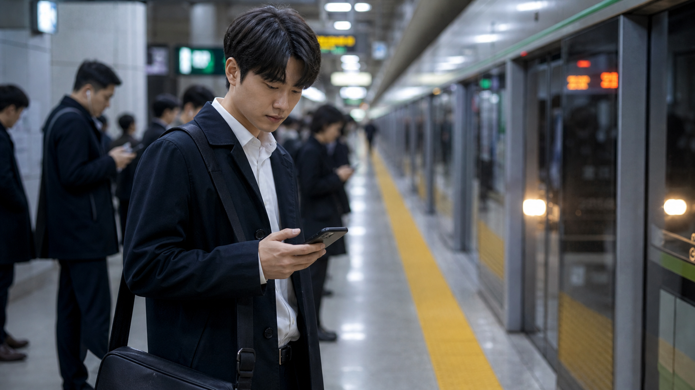
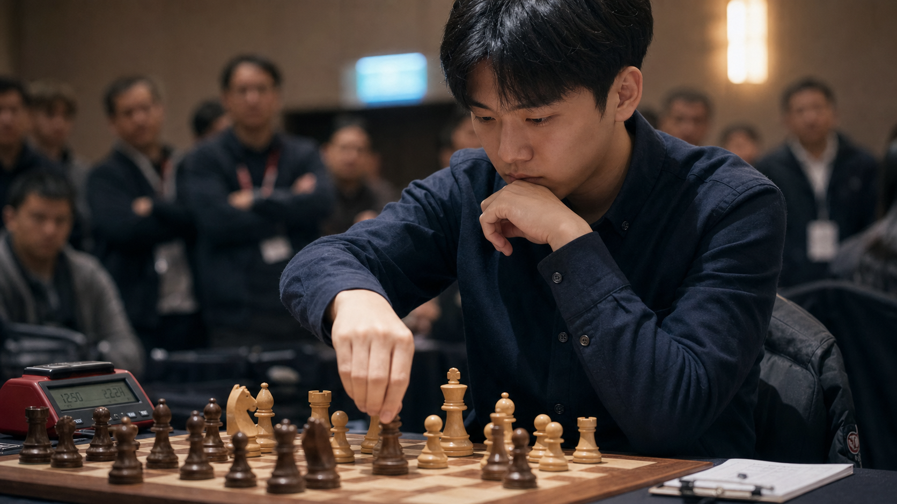

# 📷 인물 사진

파일: `gallery-photography.md` · 4개 · 사이트 갤러리(index)의 실제 한국어 프롬프트

이 파일은 사이트 갤러리에 실제로 실린 완성 프롬프트를 담습니다. 공통 작성 규칙은 [`craft.md`](craft.md)와 함께 봅니다.

---

## 1. 서울 지하철 출근길 인물 사진



- 카테고리: 인물 사진
- 사이즈: Photography · landscape · 1920x1080

```text
결과물 유형:
인물 사진 또는 패션 화보. 주제는 "서울 지하철 출근길 인물 사진"입니다. 완성 이미지는 실제 카메라로 촬영한 한 장의 사진처럼 보여야 하며, 인물의 표정, 자세, 의상, 주변 맥락이 자연스럽게 연결되어야 합니다.

주 피사체:
서울 지하철 플랫폼에서 열차를 기다리며 고개를 숙여 휴대폰을 보는 젊은 한국인 남성 직장인 1명. 인물은 화면 중앙보다 약간 왼쪽에 서 있고, 검은 트렌치코트에 흰 셔츠 차림입니다. 오른손으로 검은 스마트폰을 쥐고 있으며, 검은 크로스백(사이드백)을 어깨에 대각선으로 메고 있습니다. 주변에는 정장을 입고 휴대폰을 보는 흐릿한 승객 여러 명, 오른쪽의 스크린도어와 진입 중인 열차, 바닥의 노란 안전선이 보입니다.

구도와 비율:
16:9 가로형. 휴대폰으로 찍은 다큐멘터리 사진처럼 플랫폼 깊이와 열차 방향이 자연스럽게 보이게 구성합니다. 인물의 얼굴과 상반신이 먼저 읽히고, 스크린도어와 열차, 다른 승객은 출근길 맥락을 설명하는 배경으로 둡니다.

맥락과 배경:
아침 출근 시간의 서울 지하철역. 형광등 빛, 약간의 움직임 번짐, 플랫폼 바닥 반사, 현실적인 노이즈가 실제 현장감을 만듭니다. 오른쪽 열차에는 헤드라이트 두 개가 켜져 있고, 왼쪽에는 정장 차림 승객들의 흐릿한 실루엣이 줄지어 있습니다.

스타일과 매체:
현실적인 거리 사진 스타일. 과한 보정 없이 실제 휴대폰 카메라로 촬영한 듯한 질감, 자연스러운 피부톤, 생활감 있는 배경을 우선합니다.

빛과 디테일:
조명: 지하철역 형광등과 열차 헤드라이트가 섞인 차가운 실내광을 사용합니다. 얼굴이 너무 어둡지 않게 하고, 배경의 빛은 부드럽게 번지게 합니다.
카메라 시점: 사람 눈높이의 휴대폰 스냅 시점. 약간 넓은 렌즈 느낌을 사용하되 인물 얼굴이 왜곡되지 않게 합니다.
디테일: 코트와 셔츠의 주름, 어깨에 걸친 크로스백 끈, 휴대폰 가장자리, 플랫폼 노란 안전선, 스크린도어 유리 반사를 자연스럽게 표현합니다.

정확성 조건:
한국 지하철처럼 보여야 합니다. 인물의 손가락, 얼굴, 의상 구조, 배경 원근이 어색하지 않아야 하며, 실제 브랜드 로고, 읽을 수 없는 큰 간판 문자, 과한 AI 광택은 피합니다. 열차 상단 붉은 LED 전광판, 벽면 노란 전광판, 초록색 비상구 픽토그램 같은 배경 표시는 판독 불가한 흐릿한 형태로만 남기고 구체적인 문구나 숫자를 지어내지 않습니다.
```

---

## 2. 손글씨 노트 작업 인물 사진


- 카테고리: 인물 사진
- 사이즈: Photography · landscape · 1920x1080

```text
결과물 유형:
인물 사진 또는 라이프스타일 화보. 주제는 "손글씨 노트 작업 인물 사진"입니다. 완성 이미지는 실제 카메라로 촬영한 한 장의 사진처럼 보여야 하며, 인물의 표정, 자세, 의상, 주변 맥락이 자연스럽게 연결되어야 합니다.

주 피사체:
창가 나무 책상에서 손글씨 노트를 쓰는 한국인 여성 창작자 1명. 긴 검은 머리를 뒤로 넘기고 크림색 니트 스웨터를 입은 채 옆얼굴을 아래로 향해 집중합니다. 오른손은 검은 펜을 쥐고 스프링 제본 노트에 글을 쓰고, 왼손은 펼친 노트 위에 가볍게 놓여 있습니다. 노트에는 손글씨가 여러 줄 채워져 있고, 곁에는 흰 세라믹 커피잔(블랙커피)이 함께 보입니다.

구도와 비율:
16:9 가로형. 인물 어깨 너머에서 책상 위를 완만하게 내려다보는 하이 사이드앵글로, 손글씨를 쓰는 손과 인물의 집중한 옆얼굴이 함께 읽히게 구성합니다. 펼친 노트는 화면 중앙, 인물은 오른쪽 절반을 크게 차지하며 시선을 이끕니다.

맥락과 배경:
오전의 조용한 작업 공간. 왼쪽 창가에는 화분 몇 개와 유리병에 담긴 새싹, 붓과 펜이 꽂힌 금속 컵, 쌓인 책들이 놓여 있습니다. 전경에는 또 다른 펼친 노트와 그 위에 놓인 검은 펜이 보이고, 종이 질감, 잉크, 따뜻한 그림자, 작은 문구류가 창작자의 일상적인 작업 분위기를 만듭니다.

스타일과 매체:
라이프스타일 에디토리얼 사진. 실제 촬영처럼 자연스러운 색감과 부드러운 배경 초점을 사용하고, 소품은 인물의 작업을 설명하는 정도로 자연스럽게 배치합니다.

빛과 디테일:
조명: 왼쪽 창문에서 들어오는 따뜻한 자연광을 사용합니다. 손과 노트에는 빛이 선명하게 닿고, 얼굴과 니트에는 부드러운 반사광이 들어오게 합니다.
카메라 시점: 인물 어깨 너머의 완만한 하이 사이드앵글, 35mm 렌즈 느낌. 손, 노트, 얼굴의 거리감이 자연스럽게 보이도록 합니다.
디테일: 손가락 자세, 펜촉, 노트의 종이 결과 스프링 제본, 커피잔의 작은 반사, 니트 소매 주름, 머리카락 가장자리, 창가 화분의 잎을 현실적으로 표현합니다.

정확성 조건:
인물이 실제로 글을 쓰는 자세처럼 보여야 합니다. 손가락 수와 펜 잡는 방식이 어색하지 않아야 하며, 노트의 손글씨는 실제 필기처럼 흐르는 커시브 느낌으로, 읽을 수 있는 특정 문장이나 브랜드 로고 없이 자연스럽게 처리합니다. 장식처럼 과하게 커진 글자나 판독 가능한 큰 문자는 피합니다.
```

---

## 3. 체스 토너먼트 선수 인물 사진



- 카테고리: 인물 사진
- 사이즈: Photography · landscape · 1920x1080

```text
결과물 유형:
인물 사진 또는 패션 화보. 주제는 "체스 토너먼트 선수 인물 사진"입니다. 완성 이미지는 실제 카메라로 촬영한 한 장의 사진처럼 보여야 하며, 인물의 표정, 자세, 의상, 주변 맥락이 자연스럽게 연결되어야 합니다.

주 피사체:
체스 토너먼트 중반에 깊이 생각하는 한국인 남성 선수 1명. 짙은 남색 셔츠 차림으로, 한 손은 턱을 괴어 생각에 잠기고 다른 손은 체스말 근처로 뻗어 다음 수를 고민합니다. 전경에는 나무 체스판과 붉은 디지털 체스 시계가 있고, 뒤쪽 관중은 흐릿한 실루엣으로만 보입니다.

구도와 비율:
16:9 가로형. 낮은 테이블 높이에서 체스판을 전경에 크게 두고, 선수의 얼굴과 두 손이 중경에서 읽히도록 구성합니다. 체스말, 손, 아래로 향한 시선 방향이 긴장감을 만들게 합니다. 우측 하단에는 기보 용지와 펜이 살짝 걸칩니다.

맥락과 배경:
조용한 실내 경기장, 나무 체스말의 질감, 얕은 심도, 집중된 분위기를 표현합니다. 배경에는 팔짱을 낀 채 지켜보는 관중과 흐릿한 파란 모니터가 경기의 긴장감을 보조합니다.

스타일과 매체:
다큐멘터리 스포츠 사진. 자연스러운 피부톤, 실제 경기장의 빛, 약한 필름 질감을 사용합니다.

빛과 디테일:
조명: 선수 얼굴과 체스판 위에 집중되는 따뜻한 실내 조명. 배경은 살짝 어둡게 두어 주 피사체가 분리되게 합니다.
카메라 시점: 체스판 높이에 가까운 낮은 미디엄 샷. 얕은 심도로 체스말과 선수의 표정이 순서대로 읽히게 합니다.
디테일: 손가락, 체스말의 나무 질감, 붉은 디지털 시계의 숫자 표시, 선수의 셔츠 주름, 관중의 부드러운 배경 흐림, 우측 하단 기보 용지를 자연스럽게 표현합니다.

정확성 조건:
체스판 배열, 손가락, 얼굴, 시계의 위치가 실제 경기처럼 보여야 합니다. 비현실적인 체스말, 가짜 브랜드 로고, 과한 연출 조명, 왜곡된 손은 피합니다.
```

---

## 4. 숲속 탐험가 인물 사진


- 카테고리: 인물 사진
- 사이즈: Photography · wide · 2520x1080

```text
결과물 유형:
인물 사진 또는 패션 화보. 주제는 "숲속 탐험가 인물 사진"입니다. 완성 이미지는 실제 카메라로 촬영한 한 장의 사진처럼 보여야 하며, 인물의 표정, 자세, 의상, 주변 맥락이 자연스럽게 연결되어야 합니다.

주 피사체:
울창한 숲 가장자리에서 지도를 확인하는 한국인 탐험가 1명. 인물은 화면 왼쪽 전경에 서 있고, 넓은 숲, 물웅덩이, 덩굴, 멀리 보이는 폭포가 배경으로 펼쳐집니다.

구도와 비율:
21:9 와이드. 와이드 파노라마 구도. 인물을 작지만 분명한 주 피사체로 두고, 배경의 숲과 물길이 시선 방향을 만들어야 합니다. 인물의 자세와 지도는 탐험 상황을 설명합니다.

맥락과 배경:
습한 공기, 자연광, 넓은 시야, 잎사귀와 물 반사가 살아 있는 숲속 탐사 장면입니다. 배경은 인물의 목적지를 설명하는 역할을 합니다.

스타일과 매체:
현실적인 야외 인물 사진. 다큐멘터리 여행 사진처럼 자연스러운 색감, 실제 렌즈 질감, 현장감 있는 거리감을 사용합니다.

빛과 디테일:
조명: 나뭇잎 사이로 들어오는 확산 자연광. 얼굴과 손에는 부드러운 빛이 닿고, 배경은 습도감이 느껴지게 표현합니다.
카메라 시점: 넓은 환경을 담는 와이드 렌즈 시점. 인물의 얼굴이 심하게 왜곡되지 않도록 적당한 거리에서 촬영합니다.
디테일: 재킷의 젖은 질감, 지도 접힌 부분, 등산 가방, 젖은 잎, 물 반사, 배경의 깊이를 현실적으로 표현합니다.

정확성 조건:
인물과 배경의 스케일이 맞아야 합니다. 손, 얼굴, 장비 구조가 어색하지 않아야 하며, 판타지 생물, 실제 브랜드 로고, 과한 모험 영화식 연출은 피합니다.
```
