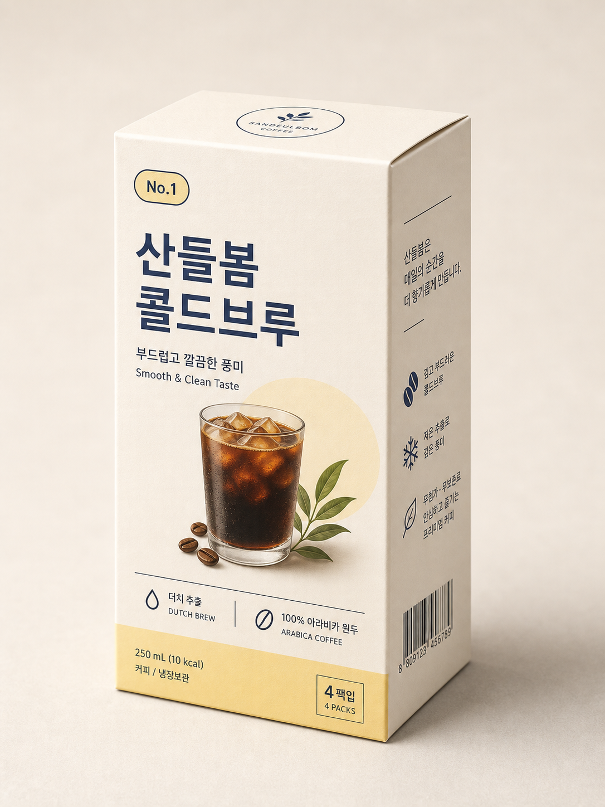
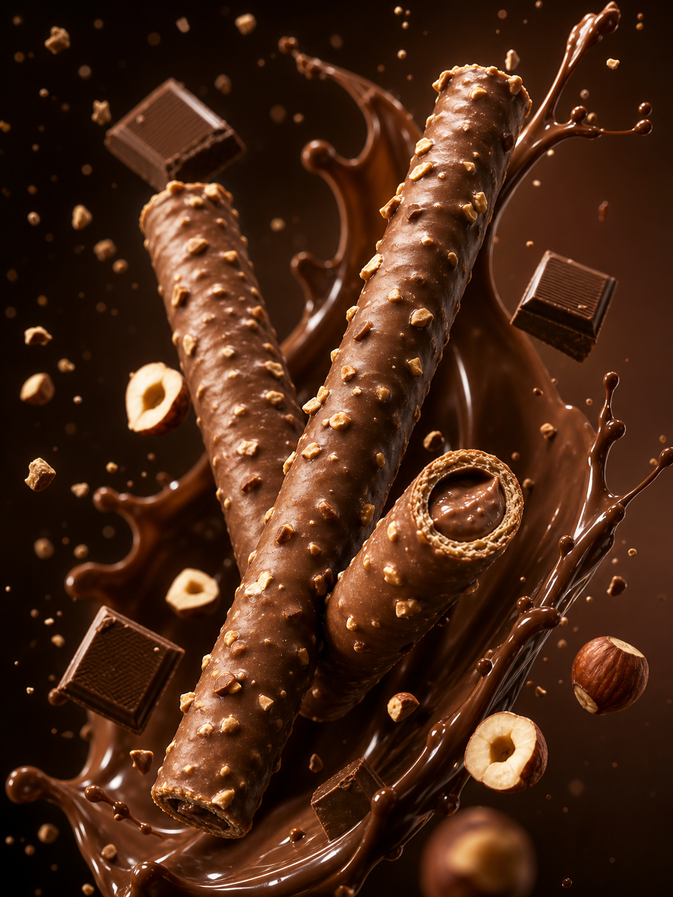
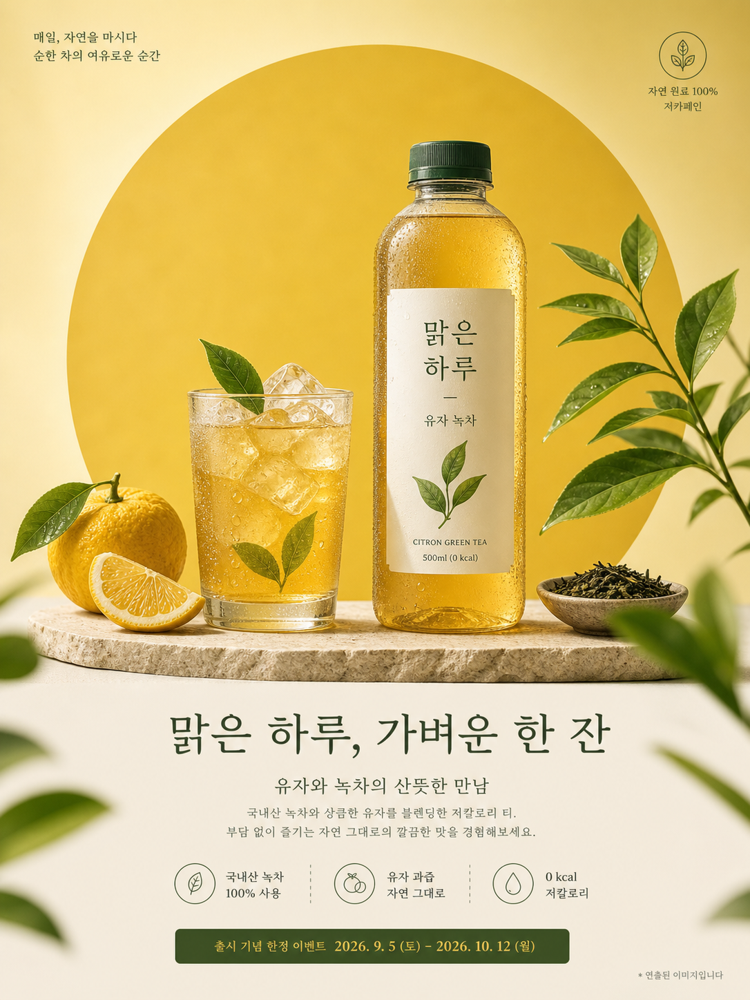
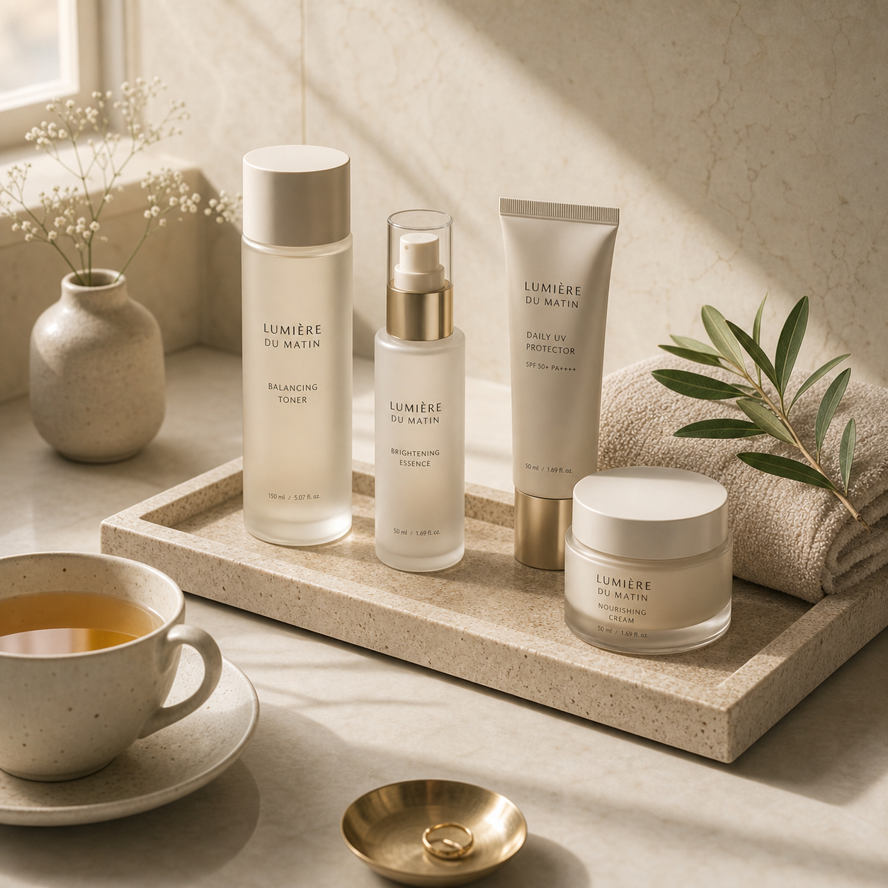
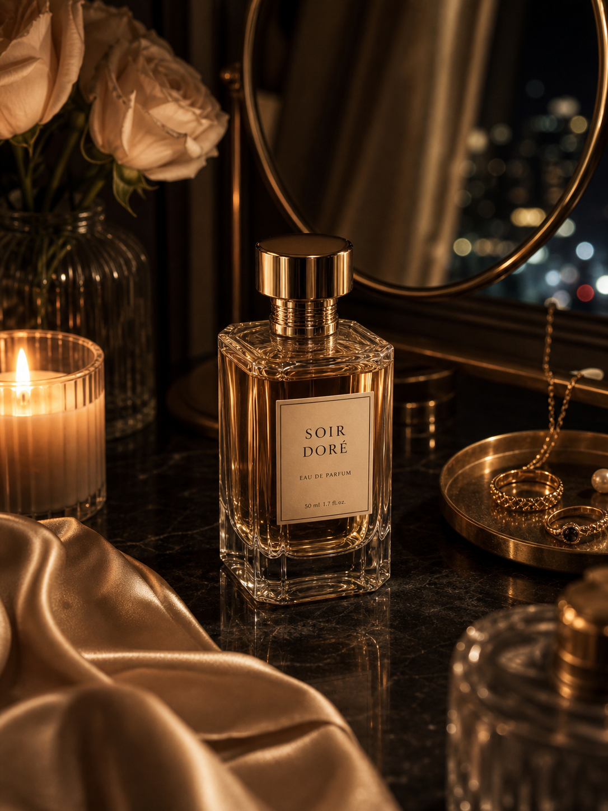
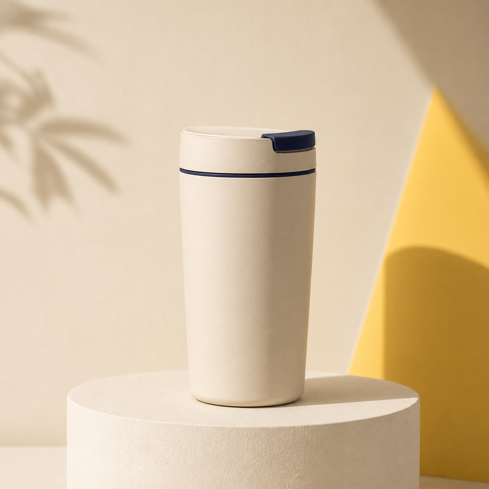
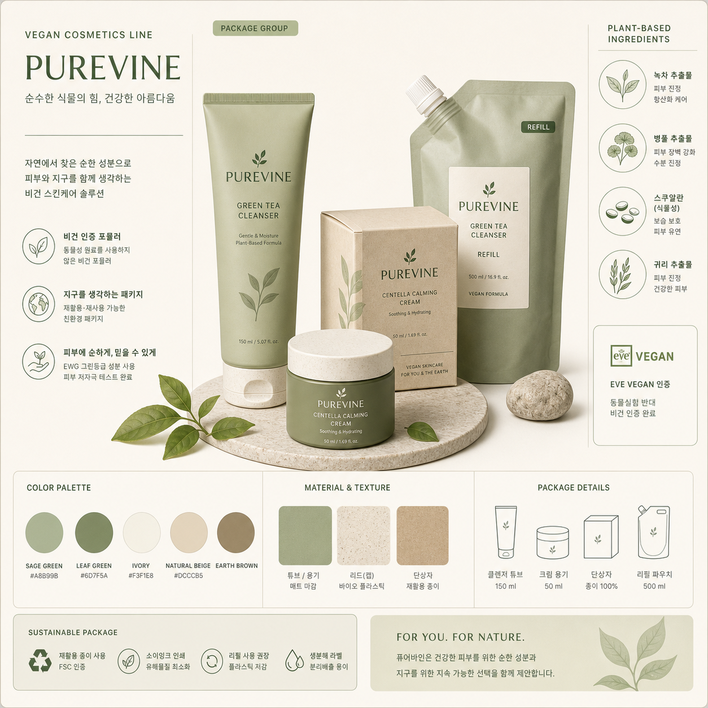
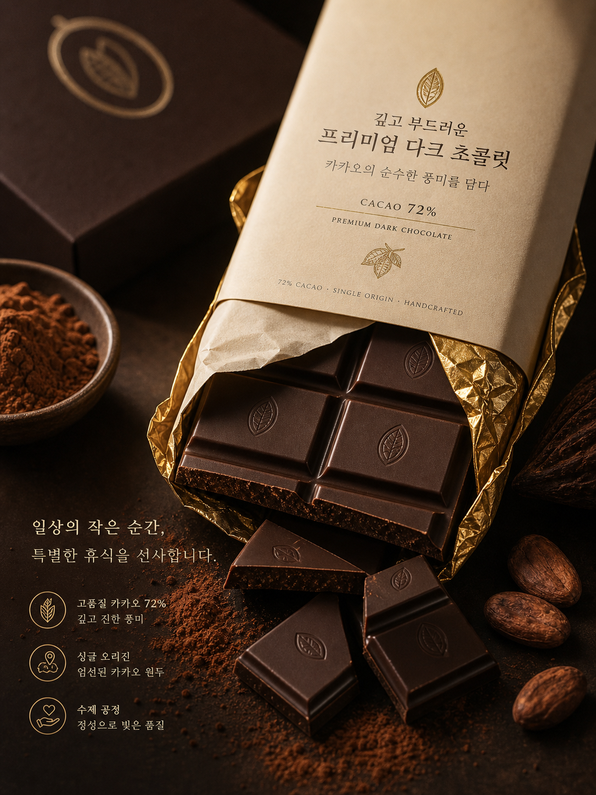

# 📦 제품 · 브랜드

파일: `gallery-product-and-brand.md` · 10개 · 사이트 갤러리(index)의 실제 한국어 프롬프트

이 파일은 사이트 갤러리에 실제로 실린 완성 프롬프트를 담습니다. 공통 작성 규칙은 [`prompt-craft.md`](prompt-craft.md)와 함께 봅니다.

---

## 1. 전개도 기반 입체 제품 상자



- 카테고리: 제품 · 브랜드
- 사이즈: Product & Food · portrait · 1536x2048

```text
결과물 유형:
상업용 제품 이미지 또는 브랜드 비주얼. 주제는 "입체 커피 패키지 상자 목업"입니다. 완성 이미지는 제품 판매 또는 브랜드 제안서에 바로 넣을 수 있는 품질이어야 하며, 형태와 재질을 오해 없이 보여야 합니다.

주 피사체:
낮은 3/4 앵글로 세워진 완성된 입체 커피 패키지 상자 하나. 정면에는 로고 배지 "SANDEUL BOM COFFEE", 상단 라벨 "No.1", 큰 한글 제품명 "산들봄 콜드브루", 그 아래 "부드럽고 깔끔한 풍미 / Smooth & Clean Taste"가 배치되고, 중앙에는 얼음이 담긴 아이스 콜드브루 커피 잔 일러스트와 커피 원두, 초록 잎 장식이 그려집니다. 하단 정보 영역에는 "더치 추출 / DUTCH BREW", "100% 아라비카 원두 / ARABICA COFFEE", 노란 띠 위 "250 mL (10 kcal)", "커피 / 냉장보관", "4 팩입 / 4 PACKS"가 있습니다. 상자는 하나만 등장하며 펼친 전개도나 별도 완성 상자는 두지 않습니다.

구도와 비율:
3:4 세로형 상업용 제품 이미지. 상자가 화면 중앙에서 약간 위로 정면과 우측면이 함께 보이는 낮은 3/4 시점으로 세워지고, 바닥에 부드러운 받침 그림자를 둡니다. 우측면 패널에는 브랜드 설명 문구 "산들봄은 매일의 순간을 더 향기롭게 만듭니다."와 아이콘이 붙은 3개의 짧은 특징 문구, 하단의 바코드가 세로로 이어집니다.

맥락과 배경:
따뜻한 베이지·크림 톤의 매끄러운 스튜디오 배경. 정확한 모서리와 무광 종이 질감으로 인쇄 디자인이 실제 패키지처럼 보이게 합니다. 배경은 제품을 차분히 받쳐 주며 불필요한 장식으로 시선을 빼앗지 않습니다.

스타일과 매체:
상업용 제품 사진 또는 제품 렌더 수준의 마감. 정확한 재질, 은은한 반사, 또렷한 모서리, 포장 구조, 크림·네이비·연노랑을 쓴 브랜드 무드를 광고 이미지처럼 정리합니다.

빛과 디테일:
조명: 부드러운 확산광으로 무광 종이 질감을 살리고 정면과 측면의 밝기 차로 입체감을 만듭니다. 상자의 모서리, 표면 질감, 그림자 접지감이 과장되지 않게 조절됩니다.
카메라 시점: 낮은 3/4 시점 하나로 정면과 우측면을 함께 보여 상자 형태가 가장 정확히 읽히게 합니다.
디테일: 아이스커피 잔의 얼음과 물방울, 커피 원두 질감, 초록 잎맥, 인쇄 텍스트의 선명함, 우측 바코드 "8809123 456789"를 또렷하게 표현합니다.

정확성 조건:
상자 정면과 측면의 텍스트는 한 이미지 안에서 일관되어야 합니다. 이미지에 보이는 문구 "산들봄 콜드브루", "부드럽고 깔끔한 풍미", "Smooth & Clean Taste", "No.1", "SANDEUL BOM COFFEE", "더치 추출 / DUTCH BREW", "100% 아라비카 원두 / ARABICA COFFEE", "250 mL (10 kcal)", "커피 / 냉장보관", "4 팩입 / 4 PACKS"를 정확히 반영합니다. 의미 없는 글자, 어긋난 로고, 비현실적인 재질, 과장된 반사, 실제 브랜드와 혼동되는 표기는 피합니다.
```

---

## 2. 초콜릿 웨이퍼 제품 렌더



- 카테고리: 제품 · 브랜드
- 사이즈: Product & Food · portrait · 1536x2048

```text
결과물 유형:
상업용 제품 이미지 또는 브랜드 비주얼. 주제는 "초콜릿 웨이퍼 롤 제품 렌더"입니다. 완성 이미지는 제품 판매 또는 브랜드 제안서에 바로 넣을 수 있는 품질이어야 하며, 형태와 재질을 오해 없이 보여야 합니다.

주 피사체:
헤이즐넛 조각이 촘촘히 박힌 초콜릿 코팅의 원통형 웨이퍼 롤(스틱) 3개를 프리미엄 제품으로 렌더합니다. 두 개의 긴 롤이 X자로 교차하듯 비스듬히 놓이고, 세 번째 롤은 정면을 향한 잘린 단면을 보여 웨이퍼 나선층과 중앙의 초콜릿 헤이즐넛 크림 필링이 드러납니다. 중심 피사체의 형태, 위치, 단면 구조가 먼저 읽히고 보조 요소는 주제를 설명하는 단서로만 사용합니다.

구도와 비율:
3:4 세로형 상업용 제품 이미지 또는 브랜드 비주얼. 롤들이 화면 중앙을 대각선으로 가로지르며 가장 먼저 보이도록 배치하고, 공중에 떠오른 듯한 다이내믹한 부양 연출을 사용합니다. 인물은 등장하지 않으며, 포장이나 라벨, 글자 없이 제품 자체와 재료만으로 화면을 구성합니다.

맥락과 배경:
어두운 갈색 그라데이션 배경 위에서, 롤들을 감싸며 크게 튀어 오르는 윤기 있는 액체 초콜릿 스플래시가 중심을 이룹니다. 공중에는 초콜릿 사각 조각, 통 헤이즐넛과 반으로 쪼갠 헤이즐넛, 견과 부스러기가 흩날립니다. 배경은 주 피사체를 설명하는 근거가 되어야 하며, 불필요한 장식으로 시선을 빼앗지 않습니다.

스타일과 매체:
상업용 식품 광고 사진 또는 고급 제품 렌더 수준의 마감. 정확한 재질, 반사, 모서리, 웨이퍼 단면 구조, 브랜드 무드를 다이내믹한 광고 이미지처럼 정리합니다.

빛과 디테일:
조명: 극적인 방향성 조명으로 윤기 있는 초콜릿, 바삭한 웨이퍼 단면, 어두운 갈색과 카라멜 톤을 강조합니다. 튀는 초콜릿의 하이라이트와 헤이즐넛 조각의 질감이 과장되지 않게 보이도록 조절합니다.
카메라 시점: 정면에 가까운 클로즈업으로, 롤의 형태와 정면 단면이 가장 정확히 보이는 시점을 사용합니다.
디테일: 초콜릿 표면의 광택, 박힌 헤이즐넛 입자, 웨이퍼 나선층과 크림 필링, 튀는 액체 초콜릿의 흐름과 방울, 공중 재료의 순간 포착을 선명하게 표현합니다.

정확성 조건:
제품 형태와 재질은 한 이미지 안에서 일관되어야 합니다. 이미지에는 어떤 포장, 라벨, 글자, 로고도 넣지 않습니다. 의미 없는 글자, 비현실적인 재질, 과장된 반사, 실제 브랜드와 혼동되는 표기는 피합니다.
```

---

## 3. 샐러드 재료가 흩어지는 음식 사진


- 카테고리: 제품 · 브랜드
- 사이즈: Product & Food · portrait · 1536x2048

```text
결과물 유형:
상업용 음식 광고 이미지. 주제는 "샐러드 재료가 흩어지는 음식 사진"입니다. 완성 이미지는 식품 브랜드 제안서나 메뉴 비주얼에 바로 넣을 수 있는 품질이어야 하며, 재료의 형태와 신선함을 오해 없이 보여야 합니다.

주 피사체:
무광 검정 볼에서 신선한 샐러드 재료가 위쪽으로 폭발하듯 흩어지는 광고용 음식 사진. 볼은 둥근 나무 도마 위에 놓이고, 프릴 상추와 바질 잎이 볼을 가득 채운 채 위로 솟구칩니다. 방울토마토(반으로 자른 것과 통째), 검정 올리브, 흰 페타 치즈 큐브, 오이 슬라이스, 브로콜리 송이가 공중에서 회전하듯 배치되고, 중앙에는 노란 레몬 슬라이스 한 조각이 정면으로 보입니다. 견과류나 포장 요소는 넣지 않습니다.

구도와 비율:
3:4 세로형 상업용 음식 이미지. 검정 볼과 나무 도마를 화면 하단에 안정적으로 두고, 흩어지는 재료가 세로 축을 따라 위로 뻗어 올라가는 다이내믹한 수직 구도로 정리합니다. 받침 그림자를 정돈하고, 배경 소품은 재질과 상황을 설명하는 정도로만 제한합니다.

맥락과 배경:
따뜻한 베이지·크림 톤의 부드러운 스튜디오 배경을 사용하고, 화면 왼쪽 아래에 리넨 천을 살짝 배치합니다. 배경은 재료의 신선함을 돋보이게 하는 근거가 되어야 하며, 불필요한 장식으로 시선을 빼앗지 않습니다.

스타일과 매체:
고급 식품 광고 사진 수준의 마감. 정확한 재료 질감, 잎맥, 오일의 반짝임, 그림자 접지감을 실제 촬영한 광고 이미지처럼 정리합니다.

빛과 디테일:
조명: 따뜻하고 선명한 스튜디오 조명으로 재료 하나하나에 하이라이트를 살립니다. 공중을 나는 올리브 오일 방울과 튀는 오일 줄기를 흩뿌리되 과장되지 않게 조절합니다.
카메라 시점: 정면에 가까운 눈높이 시점으로, 검정 볼과 솟구치는 재료가 가장 정확히 보이도록 합니다.
디테일: 상추 잎맥, 페타 치즈 표면의 허브 조각, 방울토마토 단면의 씨, 오이 슬라이스의 투명도, 오일 방울의 광택을 선명하게 표현합니다.

정확성 조건:
재료의 형태와 색은 한 이미지 안에서 일관되어야 합니다. 인물은 등장하지 않으며, 이미지 안에 글자나 로고는 넣지 않습니다. 비현실적인 재질, 과장된 반사, 실제 브랜드와 혼동되는 표기는 피합니다.
```

---

## 4. 상업 포스터 범용 템플릿



- 카테고리: 제품 · 브랜드
- 사이즈: Product & Food · portrait · 1536x2048

```text
결과물 유형:
상업용 제품 포스터. 주제는 "상업 포스터 범용 템플릿"이며, 차 음료 브랜드의 완성형 광고 비주얼입니다. 제품 판매나 브랜드 제안서에 바로 넣을 수 있는 품질이어야 하며, 병의 형태와 투명 재질, 라벨 문구가 오해 없이 읽혀야 합니다.

주 피사체:
초록색 뚜껑을 씌운 투명 PET 병이 화면 중앙 오른쪽에 서 있고, 라벨에는 "맑은 하루", 그 아래 "유자 녹차", 하단에 초록 찻잎 일러스트와 "CITRON GREEN TEA", "500ml (0 kcal)"가 세로로 정렬됩니다. 병 안에는 맑은 황금빛 유자 녹차가 담겨 있습니다. 보조로 왼쪽에는 얼음과 녹차 잎 한 장을 띄운 아이스티 유리잔, 그 앞에 유자 통과일과 반달로 자른 유자 조각, 오른쪽에는 마른 녹차 잎을 담은 작은 돌 종지, 병 뒤로 뻗은 찻잎 가지를 배치합니다.

구도와 비율:
3:4 세로형 구도. 상단 약 3분의 2는 제품 촬영 영역, 하단 3분의 1은 카피 편집 영역으로 나눕니다. 병과 소품은 둥근 베이지색 돌 받침 위에 올려 정면 낮은 3/4 시점으로 담고, 병 라벨이 정면에서 또렷이 읽히도록 중심 축을 정리합니다.

맥락과 배경:
제품 뒤에는 큰 노란색 원형 색면을 두고, 전체 배경은 따뜻한 노란색에서 크림색으로 이어지는 그러데이션입니다. 하단 편집 영역은 옅은 크림색 바탕이며, 화면 가장자리에는 초점이 흐려진 녹차 잎이 프레임처럼 걸칩니다. 넉넉한 편집 여백을 유지합니다.

스타일과 매체:
상업용 제품 사진 수준의 마감에 편집 그래픽을 결합한 광고 포스터. 정확한 유리·플라스틱 재질, 물방울, 반사, 라벨 인쇄감을 사실적으로 정리하고, 노랑과 초록을 축으로 한 단정하고 산뜻한 무드를 유지합니다.

빛과 디테일:
조명: 따뜻한 자연광 톤으로 병 표면의 물방울과 얼음의 투명도, 유자 과육의 결, 마른 찻잎의 질감이 과장 없이 살아나게 합니다. 카메라 시점: 정면 낮은 3/4 한 가지로 통일합니다. 디테일: 라벨 위치, 뚜껑 나사산, 유리잔 결로, 돌 받침의 그림자 접지감, 잎맥까지 선명하게 표현합니다.

정확성 조건:
포스터에 들어가는 한글 카피를 정확히 반영합니다. 좌상단 "매일, 자연을 마시다", "순한 차의 여유로운 순간", 우상단 배지 "자연 원료 100%", "저카페인", 중앙 헤드라인 "맑은 하루, 가벼운 한 잔", 서브 "유자와 녹차의 산뜻한 만남", 본문 "국내산 녹차와 상큼한 유자를 블렌딩한 저칼로리 티.", "부담 없이 즐기는 자연 그대로의 깔끔한 맛을 경험해보세요.", 세 개 아이콘 문구 "국내산 녹차 100% 사용", "유자 과즙 자연 그대로", "0 kcal 저칼로리", 초록 이벤트 바 "출시 기념 한정 이벤트 2026. 9. 5 (토) - 2026. 10. 12 (월)", 우하단 "* 연출된 이미지입니다"를 표기합니다. 인물은 등장하지 않습니다. 글자는 또렷하고 오탈자 없이, 실제 브랜드와 혼동되지 않게 하며, 병 라벨과 카피의 문구가 한 이미지 안에서 일관되게 유지되도록 합니다.
```

---

## 5. 휴대용 라디오 브랜드 아이덴티티 보드


- 카테고리: 제품 · 브랜드
- 사이즈: Brand Systems & Identity · square · 1024x1024

```text
결과물 유형:
브랜드 아이덴티티 보드. 주제는 "휴대용 라디오 브랜드 아이덴티티 보드"입니다. 편집 디자인처럼 여러 칸으로 나뉜 평면 레이아웃으로, 제품 제안서나 브랜드 발표 자료에 바로 넣을 수 있는 정돈된 원페이지 보드처럼 보여야 합니다.

주 피사체:
가상의 휴대용 라디오 브랜드 "WAVEPORT"(부제 "PORTABLE RADIO", 모델명 "WP-01")를 위한 아이덴티티 구성물. 산과 태양, 방송 전파를 결합한 로고 마크, 로고 카드, 3/4 투시로 렌더링한 크림색 레트로 휴대용 라디오(전면 스피커 그릴, 원형 금속 튜닝 다이얼, FM·AM 주파수 눈금, TUNE·POWER 버튼, 전면 "WAVEPORT" 네임플레이트, 노란 직물 스트랩), 색상 팔레트, 타이포그래피 견본, 패키지 박스, 명함 2종, 소재 샘플 3종을 하나의 보드 안에 배치합니다. 우측 상단의 라디오 제품 렌더가 시선의 중심이 되고, 나머지 요소는 브랜드 성격을 설명하는 보조 자료로 배치합니다.

구도와 비율:
1:1 정사각형 화면을 얇은 선으로 여러 구획으로 나눈 그리드 레이아웃. 맨 위에는 좌측 "BRAND IDENTITY", 우측 "FOR EVERY JOURNEY, YOUR SOUND" 헤더를 얹습니다. 좌상단에 네이비 로고 카드, 그 아래 브랜드 소개 문단과 COLOR PALETTE·TYPOGRAPHY 블록을 세로로 쌓고, 우측 큰 영역에 라디오 제품 렌더와 LOGO CONCEPT·모델 표기를 둡니다. 하단 행은 좌측부터 PACKAGE(패키지 박스), BUSINESS CARD(명함), MATERIAL(소재 샘플) 세 칸으로 나누고, 맨 아래에 VISUAL MOTIF - FREQUENCY SCALE 눈금 스트립을 배치합니다. 각 요소 사이에 충분한 여백을 두어 정보가 한눈에 읽히게 구성합니다.

맥락과 배경:
따뜻한 크림색 종이 배경 위에 딥 인디고, 선샤인 옐로우, 웜 그레이를 핵심 색상으로 사용합니다. COLOR PALETTE 칩은 네 개로, 각각 "INDIGO #1F2A44", "SUNSHINE #FFC43D", "WARM GRAY #B8B6AE", "CREAM #F6F1E6"로 이름과 색상 코드를 붙입니다. 산·태양·전파 로고, 주파수 눈금, 직물 스트랩의 질감으로 여행과 야외의 순간을 함께하는 라디오 브랜드의 성격을 보여줍니다.

스타일과 매체:
상업용 브랜드 시스템 보드와 제품 렌더를 결합한 스타일. 편집 디자인처럼 정갈한 배열, 얇은 구획선, 명확한 색상 칩, 실제 제품 목업 같은 재질 표현을 사용합니다. 라디오 제품은 스톤 재질의 원형 받침 위에 올려 스튜디오에서 촬영한 것처럼 렌더링합니다.

빛과 디테일:
조명: 부드러운 스튜디오 조명. 라디오의 크림색 플라스틱 본체, 금속 다이얼, 직물 스트랩, 종이 패키지의 재질 차이가 분명하게 보이도록 합니다.
카메라 시점: 보드 자체는 정면 평면 뷰로 읽히고, 우측의 메인 라디오 제품만 약간 높은 3/4 투시로 두께와 버튼 디테일이 보이게 합니다.
디테일: 스피커 그릴의 촘촘한 구멍, 다이얼 눈금, FM(88~108 MHz)·AM(530~1600 kHz) 주파수 스케일, 스트랩 박음질, 패키지 접힘선, 색상 팔레트 칩, 명함 모서리를 선명하게 표현합니다.

정확성 조건:
가상의 브랜드처럼 보이게 구성하되 텍스트는 또렷하게 표기합니다. 브랜드명 "WAVEPORT", 부제 "PORTABLE RADIO", 모델명 "WP-01", 슬로건 "FOR EVERY JOURNEY, YOUR SOUND"와 한글 헤드라인 "작지만 선명한, 나만의 주파수", 타이포그래피 라벨 "WAVEPORT SANS", LOGO CONCEPT의 "여정 + 사운드 + 자유", 소재 라벨 "SOFT TOUCH PLASTIC / 바디", "ALUMINUM DIAL / 다이얼", "WOVEN STRAP / 스트랩", 명함 문구 "Explore. Listen. Connect."와 연락처 "waveport.audio"를 정확히 표기합니다. 인물은 등장하지 않습니다. 라디오 형태와 다이얼 위치는 제품 렌더·패키지 일러스트·명함 로고에서 일관되어야 합니다. 깨진 로고, 실제 브랜드와 혼동되는 표기, 의미 없는 글자, 과도한 장식, 제품 구조를 흐리는 반사는 피합니다.
```

---

## 6. 조용한 럭셔리 스킨케어 아침 트레이



- 카테고리: 제품 · 브랜드
- 사이즈: Beauty & Lifestyle · 정사각형 · 1024x1024

```text
결과물 유형:
상업용 제품 이미지 또는 브랜드 비주얼. 주제는 "조용한 럭셔리 스킨케어 아침 트레이"입니다. 완성 이미지는 제품 판매 또는 브랜드 제안서에 바로 넣을 수 있는 품질이어야 하며, 형태와 재질을 오해 없이 보여야 합니다.

주 피사체:
조용한 럭셔리 무드의 스킨케어 라인업 정물 사진. 크림색 스톤 트레이 위에 네 가지 제품을 나란히 배치합니다. 왼쪽부터 원통형 불투명 유리 토너 병, 골드 펌프가 달린 반투명 에센스 병, 골드 캡의 자외선차단제 튜브, 그리고 트레이 앞쪽에 낮은 크림 용기입니다. 모든 제품은 "LUMIÈRE DU MATIN" 브랜드의 미니멀한 아이보리 라벨을 공유합니다. 중심 제품군의 형태와 배치가 먼저 읽히고 주변 소품은 아침 무드를 설명하는 단서로만 사용합니다.

구도와 비율:
1:1 정사각형 상업용 제품 이미지 또는 브랜드 비주얼. 네 제품이 트레이 위에서 리듬 있게 정렬되어 가장 먼저 보이도록 하고, 받침 그림자와 반사를 정리합니다. 라벨 영역은 정면에서 읽히게 두고, 화병·찻잔·수건 같은 보조 소품은 재질과 사용 상황을 설명하는 정도로 프레임 가장자리에 제한합니다.

맥락과 배경:
크림색 대리석 벽과 왼쪽 위 창문에서 들어오는 부드러운 아침 자연광, 절제된 고급감을 표현합니다. 왼쪽에는 안개꽃을 꽂은 세라믹 화병, 앞쪽에는 따뜻한 차가 담긴 세라믹 컵과 받침, 금반지가 놓인 작은 황동 접시, 오른쪽에는 말린 수건과 올리브 가지를 배치해 조용한 아침 장면을 완성합니다. 배경은 주 피사체를 설명하는 근거가 되어야 하며, 불필요한 장식으로 시선을 빼앗지 않습니다.

스타일과 매체:
상업용 제품 사진 또는 제품 렌더 수준의 마감. 정확한 재질, 반사, 모서리, 포장 구조, 브랜드 무드를 광고 이미지처럼 정리합니다.

빛과 디테일:
조명: 창을 통한 부드러운 아침 자연광, 반투명 유리, 크림색 배경, 절제된 고급감을 표현합니다. 제품의 모서리, 표면 질감, 유리 투명도, 골드 캡의 금속 반사 하이라이트가 과장되지 않게 보이도록 조절합니다.
카메라 시점: 살짝 위에서 비스듬히 내려다보는 낮은 3/4 앵글을 사용해 제품 라벨과 트레이 배치가 함께 읽히게 합니다.
디테일: 라벨 문구와 용량 표기, 그림자 접지감, 스톤 트레이의 입자 질감, 찻잔 속 액체와 안개꽃·올리브 잎의 상태를 선명하게 표현합니다.

정확성 조건:
제품 형태와 라벨은 한 이미지 안에서 일관되어야 합니다. 라벨 문구는 "LUMIÈRE DU MATIN" 브랜드 아래 각각 "BALANCING TONER 150 ml / 5.07 fl. oz.", "BRIGHTENING ESSENCE 50 ml / 1.69 fl. oz.", "DAILY UV PROTECTOR SPF 50+ PA++++ 50 ml / 1.69 fl. oz.", "NOURISHING CREAM 50 ml / 1.69 fl. oz."로 읽히게 합니다. 의미 없는 글자, 어긋난 로고, 비현실적인 재질, 과장된 반사, 실제 브랜드와 혼동되는 표기는 피합니다.
```

---

## 7. 향수와 저녁 의식 화장대



- 카테고리: 제품 · 브랜드
- 사이즈: Beauty & Lifestyle · portrait · 1536x2048

```text
결과물 유형:
상업용 제품 이미지 또는 브랜드 비주얼. 주제는 "향수와 저녁 의식 화장대"입니다. 완성 이미지는 제품 판매 또는 브랜드 제안서에 바로 넣을 수 있는 품질이어야 하며, 형태와 재질을 오해 없이 보여야 합니다.

주 피사체:
저녁 의식 분위기의 향수 제품 화장대 사진. 앰버빛 액체가 담긴 직사각 컷글라스 향수병을 화면 중앙 하단에 세우고, 원통형 금색 캡과 정면 라벨이 또렷이 읽히게 배치합니다. 라벨에는 "SOIR DORÉ", "EAU DE PARFUM", "50 ml 1.7 fl. oz." 문구가 들어갑니다. 왼쪽에는 리브드 유리 홀더의 켜진 촛불과 크림빛 장미가 담긴 유리 꽃병, 오른쪽에는 반지·진주·금목걸이가 놓인 금색 원형 트레이, 전경 하단에는 샴페인색 새틴 천 주름을 부재료로 둡니다. 중심 피사체의 형태와 위치가 먼저 읽히고 보조 요소는 주제를 설명하는 단서로만 사용합니다.

구도와 비율:
3:4 세로형 상업용 제품 이미지 또는 브랜드 비주얼. 제품이 가장 먼저 보이도록 중앙 축과 대리석 위 반사 그림자를 정리하고, 촛불·장미·트레이·새틴 같은 보조 소품은 재질과 사용 상황을 설명하는 정도로 제한합니다. 라벨 영역은 정면에서 읽히게 둡니다.

맥락과 배경:
검은 대리석 화장대 위, 낮은 따뜻한 조명과 유리·금속 반사로 고급스러운 밤 분위기를 만듭니다. 배경 우측에는 금테 원형 거울이 도시 야경의 보케 불빛을 담고, 배경은 주 피사체를 설명하는 근거가 되어야 하며 불필요한 장식으로 시선을 빼앗지 않습니다.

스타일과 매체:
상업용 제품 사진 또는 제품 렌더 수준의 마감. 정확한 유리 재질, 금속 캡 반사, 라벨 모서리, 병 구조, 브랜드 무드를 광고 이미지처럼 정리합니다.

빛과 디테일:
조명: 촛불에서 번지는 낮고 따뜻한 조명, 유리 반사, 금속 캡 하이라이트, 깊은 그림자로 고급스러운 밤 분위기를 만듭니다. 병의 모서리, 유리 투명도, 액체 색, 반사 하이라이트가 과장되지 않게 보이도록 조절합니다.
카메라 시점: 낮은 3/4 시점에서 병 형태와 라벨이 가장 정확히 보이게 합니다.
디테일: 라벨 위치와 문구, 유리 컷 면, 대리석 위 그림자 접지감, 금속·새틴·꽃잎의 재질 입자, 촛불 불꽃의 상태를 선명하게 표현합니다.

정확성 조건:
제품 형태와 라벨 문구 "SOIR DORÉ / EAU DE PARFUM / 50 ml 1.7 fl. oz."는 한 이미지 안에서 일관되어야 합니다. 인물은 등장하지 않습니다. 의미 없는 글자, 어긋난 로고, 비현실적인 재질, 과장된 반사, 실제 브랜드와 혼동되는 표기는 피합니다.
```

---

## 8. 미니멀 텀블러 제품 컷



- 카테고리: 제품 · 브랜드
- 사이즈: 준비 중 · 빈 카드

```text
결과물 유형:
상업용 제품 이미지 또는 브랜드 비주얼. 주제는 "미니멀 텀블러 제품 컷"입니다. 완성 이미지는 제품 판매 또는 브랜드 제안서에 바로 넣을 수 있는 품질이어야 하며, 형태와 재질을 오해 없이 보여야 합니다.

주 피사체:
무광 크림/아이보리색 텀블러의 미니멀 제품 컷. 길게 테이퍼진 텀블러 하나를 화면 중앙에 세워 두고, 상단에는 남색(네이비) 플립 뚜껑 탭과 뚜껑 아래를 두르는 얇은 네이비 링 라인을 배치합니다. 텀블러는 크림색 원통형 받침대 위에 놓여 부드러운 그림자를 드리웁니다. 중심 피사체의 형태, 위치가 먼저 읽히고 보조 요소는 주제를 설명하는 단서로만 사용합니다.

구도와 비율:
1:1 정사각형 상업용 제품 이미지 또는 브랜드 비주얼. 제품이 가장 먼저 보이도록 중앙 축과 받침 그림자를 정리하고, 텀블러는 정면에 가까운 시점으로 세로로 길게 화면 중앙을 채웁니다. 보조 소품은 재질과 사용 상황을 설명하는 정도로 제한합니다.

맥락과 배경:
따뜻한 베이지 톤 스튜디오 배경. 우측에는 각진 노란색 컬러블록 패널이 사선으로 들어오고, 좌측 벽면에는 은은한 야자수 잎 그림자가 드리웁니다. 매끈한 무광 세라믹 질감, 제품 윤곽이 선명한 광고 사진으로 만듭니다. 배경은 주 피사체를 설명하는 근거가 되어야 하며, 불필요한 장식으로 시선을 빼앗지 않습니다.

스타일과 매체:
상업용 제품 사진 또는 제품 렌더 수준의 마감. 정확한 재질, 반사, 모서리, 뚜껑 구조, 브랜드 무드를 광고 이미지처럼 정리합니다.

빛과 디테일:
조명: 따뜻한 스튜디오 조명, 매끈한 무광 세라믹 질감, 베이지 배경과 노란 패널이 만드는 부드러운 색 대비, 제품 윤곽이 선명한 광고 사진으로 만듭니다. 제품의 모서리, 표면 질감, 반사 하이라이트가 과장되지 않게 보이도록 조절합니다.
카메라 시점: 정면에 가까운 눈높이 시점으로 텀블러 형태가 가장 정확히 보이게 합니다.
디테일: 뚜껑의 네이비 플립 탭, 상단 네이비 링 라인, 무광 표면의 미세한 질감, 받침대와 텀블러 사이의 그림자 접지감을 선명하게 표현합니다.

정확성 조건:
제품 형태와 색상(크림색 몸체, 네이비 뚜껑 탭과 링)은 한 이미지 안에서 일관되어야 합니다. 텀블러 표면에는 글자나 로고가 없습니다. 의미 없는 글자, 어긋난 로고, 비현실적인 재질, 과장된 반사, 실제 브랜드와 혼동되는 표기는 피합니다.
```

---

## 9. 비건 화장품 패키지 보드



- 카테고리: 제품 · 브랜드
- 사이즈: 준비 중 · 빈 카드

```text
결과물 유형:
상업용 비건 화장품 브랜드 보드 인포그래픽. 주제는 "비건 화장품 패키지 보드"입니다. 상단의 제품 연출 컷과 좌우, 하단의 정보 패널이 하나의 화면에 통합된 브랜드 제안서용 비주얼로, 제품 형태와 재질, 브랜드 무드, 패키지 정보가 오해 없이 함께 읽혀야 합니다.

주 피사체:
비건 스킨케어 라인 "PUREVINE"의 패키지 군을 원형 재생지 받침 위에 연출합니다. 왼쪽에 초록 매트 마감의 클렌저 튜브 "GREEN TEA CLEANSER", 중앙 앞쪽에 뚜껑을 연 초록 크림 용기 "CENTELLA CALMING CREAM", 그 뒤에 베이지 종이 상자, 오른쪽에 초록 리필 파우치 "REFILL"을 배치하고, 받침 주변에 녹차 잎 몇 장과 매끈한 자갈 하나를 곁들입니다. 인물은 없습니다.

구도와 비율:
1:1 정사각형. 상단 왼쪽에 브랜드 타이포 블록("VEGAN COSMETICS LINE", 대형 "PUREVINE", 태그라인, 아이콘 소개), 중앙 상단에 제품 연출 컷과 "PACKAGE GROUP" 라벨, 오른쪽에 "PLANT-BASED INGREDIENTS" 성분 아이콘 리스트와 "eve VEGAN" 인증 박스, 하단에 "COLOR PALETTE", "MATERIAL & TEXTURE", "PACKAGE DETAILS", 맨 아래에 "SUSTAINABLE PACKAGE"와 "FOR YOU. FOR NATURE." 섹션이 정렬된 멀티 패널 레이아웃입니다. 제품이 시선의 중심이 되도록 축과 받침 그림자를 정리하고, 정보 패널은 얇은 라운드 박스로 단정하게 구획합니다.

맥락과 배경:
연한 아이보리 바탕에 세이지 그린과 리프 그린, 재생지 질감, 단정한 라벨, 친환경 브랜드 무드를 사용합니다. 배경과 패널은 제품과 브랜드 메시지를 뒷받침하는 근거가 되어야 하며, 불필요한 장식으로 시선을 빼앗지 않습니다.

스타일과 매체:
상단 제품 컷은 상업용 제품 사진 또는 제품 렌더 수준의 마감으로, 정확한 재질, 반사, 모서리, 포장 구조를 광고 이미지처럼 정리합니다. 정보 패널은 미니멀한 라인 아이콘과 깔끔한 산세리프 타이포로 구성한 브랜드 가이드 무드로 마감합니다.

빛과 디테일:
조명: 부드럽고 고른 스튜디오 광으로 연한 아이보리와 그린 톤, 재생지 질감, 매트 표면을 자연스럽게 살립니다. 제품의 모서리, 표면 질감, 캡의 광택, 받침의 접지 그림자가 과장되지 않게 보이도록 조절합니다.
카메라 시점: 제품 연출 컷은 정면에 가까운 낮은 3/4 시점으로 형태가 가장 정확히 보이게 하고, 전체 보드는 정면 평면 레이아웃으로 읽히게 합니다.
디테일: 라벨 위치, 파우치 접힘과 스파우트 캡, 상자 모서리, 크림 용기의 열린 뚜껑, 녹차 잎맥, 재생지 입자, 자갈의 질감을 선명하게 표현합니다.

정확성 조건:
제품 형태와 라벨은 한 이미지 안에서 일관되어야 하며, 실제로 보이는 문구는 다음과 같이 표기합니다: 브랜드명 "PUREVINE", 태그라인 "순수한 식물의 힘, 건강한 아름다움", "VEGAN COSMETICS LINE", 제품명 "GREEN TEA CLEANSER"와 "CENTELLA CALMING CREAM", "REFILL", 성분 항목 "녹차 추출물 / 병풀 추출물 / 스쿠알란(식물성) / 귀리 추출물", 인증 "eve VEGAN", 컬러 팔레트 "SAGE GREEN #A8B99C / LEAF GREEN #6D7F5A / IVORY #F3F1E8 / NATURAL BEIGE #DCCCB5 / EARTH BROWN", 하단 문구 "FOR YOU. FOR NATURE.". 의미 없는 글자, 어긋난 로고, 비현실적인 재질, 과장된 반사, 실제 시판 브랜드와 혼동되는 표기는 피합니다.
```

---

## 10. 프리미엄 초콜릿 브랜드 이미지



- 카테고리: 제품 · 브랜드
- 사이즈: 제품 · 브랜드 · 세로형 · 1536x2048

```text
결과물 유형:
세로형 상업용 브랜드 광고 키비주얼. 주제는 "프리미엄 초콜릿 브랜드 이미지"입니다. 제품 사진 위에 한글·영문 카피와 로고가 함께 얹힌 완성형 포스터로, 제품 판매 페이지나 브랜드 제안서에 바로 넣을 수 있는 품질이어야 하며, 형태와 재질을 오해 없이 보여야 합니다.

주 피사체:
크래프트 크림색 종이 포장과 금박 포일에 싸인 프리미엄 다크 초콜릿바. 포장을 절반쯤 벗겨 안쪽의 사각 칸이 나뉜 다크 초콜릿바가 드러나고, 각 칸에는 카카오 잎 음각 문양이 찍혀 있습니다. 포장 앞면에는 금색 카카오 잎 로고와 함께 "깊고 부드러운", "프리미엄 다크 초콜릿", "카카오의 순수한 풍미를 담다", "CACAO 72%", "PREMIUM DARK CHOCOLATE", "72% CACAO · SINGLE ORIGIN · HANDCRAFTED" 문구가 놓입니다. 중심 피사체가 먼저 읽히고 보조 요소는 주제를 설명하는 단서로만 사용합니다.

구도와 비율:
3:4 세로형 프레임. 초콜릿바를 오른쪽 상단에서 왼쪽 하단으로 비스듬히 눕혀 대각선 흐름을 만들고, 앞쪽에는 잎사귀 음각이 찍힌 깨진 초콜릿 조각들을 흩뿌립니다. 왼쪽 상단 배경에는 어두운 갈색 선물 상자와 금색 원형 카카오 꼬투리 로고, 왼쪽 중단에는 코코아 파우더를 담은 도기 그릇, 오른쪽 하단에는 카카오 원두와 카카오 열매 꼬투리를 배치합니다. 하단 왼쪽 빈 공간에는 카피와 불릿 텍스트를 얹을 여백을 둡니다.

맥락과 배경:
어두운 갈색 테이블 위, 따뜻한 하이라이트와 고급스러운 반사, 흩뿌려진 코코아 파우더로 진한 무드를 만듭니다. 배경은 주 피사체를 설명하는 근거가 되어야 하며, 불필요한 장식으로 시선을 빼앗지 않습니다.

스타일과 매체:
상업용 제품 사진 위에 타이포그래피와 로고를 얹은 광고 키비주얼 마감. 정확한 재질, 포일 주름, 종이 결, 초콜릿 음각, 브랜드 무드를 광고 이미지처럼 정리합니다.

빛과 디테일:
조명: 어두운 배경, 따뜻한 하이라이트, 금박의 은은한 반사, 진한 갈색 질감을 사용합니다. 초콜릿 표면 광택, 포일 주름, 코코아 파우더 입자, 카카오 원두의 결이 과장되지 않게 보이도록 조절합니다.
카메라 시점: 낮은 3/4 각도로 제품 형태와 흩어진 조각이 가장 정확히 보이는 시점을 사용합니다.
디테일: 하단 왼쪽에 카피 "일상의 작은 순간,", "특별한 휴식을 선사합니다."와 세 개의 금색 아이콘 불릿 "고품질 카카오 72% 깊고 진한 풍미", "싱글 오리진 엄선된 카카오 원두", "수제 공정 정성으로 빚은 품질"을 정갈하게 배치합니다. 라벨 위치, 포장 접힘, 그림자 접지감, 재질 입자를 선명하게 표현합니다.

정확성 조건:
제품 형태와 라벨은 한 이미지 안에서 일관되어야 합니다. 위에 지정한 한글·영문 문구를 정확히 표기하고, 의미 없는 글자, 어긋난 로고, 비현실적인 재질, 과장된 반사, 실제 브랜드와 혼동되는 표기는 피합니다.
```
