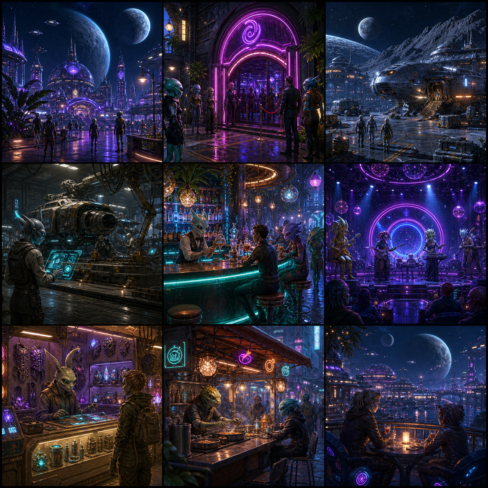

# 🎮 게임

파일: `gallery-retro-and-cyberpunk.md` · 1개 · 사이트 갤러리(index)의 실제 한국어 프롬프트

이 파일은 사이트 갤러리에 실제로 실린 완성 프롬프트를 담습니다. 공통 작성 규칙은 [`craft.md`](craft.md)와 함께 봅니다.

---

## 1. 외계 밤 문화 콘셉트 그리드



- 카테고리: 게임
- 사이즈: Gaming · square · 1024x1024

```text
결과물 유형:
3×3 게임 콘셉트 아트 그리드. 주제는 "외계 밤 문화 콘셉트 그리드"입니다. 완성 이미지는 단일 플레이 화면이 아니라 아홉 개의 서로 다른 장면을 균일한 격자에 배치한 아트 시트로, 각 칸이 같은 세계관의 밤 문화 한 장면을 보여줍니다.

주 피사체:
먼 행성 위성 도시의 밤 문화 구역을 보여주는 3×3 콘셉트 그리드. 아홉 패널은 각각 네온 돔 도시 스카이라인과 먼 행성, 보라색 네온 아치의 클럽 입구와 줄 선 손님들, 우주선이 정박한 야간 항구, 홀로그램 작업대 앞의 정비소, 외계인 바텐더가 있는 네온 음료 바, 외계인 밴드가 연주하는 라이브 음악 무대와 관객, 갑옷과 장비가 진열된 장비 상점, 파충류형 외계인이 요리하는 거리 음식 부스, 촛불 켠 테이블에서 야경을 보는 테라스를 담습니다. 각 칸에서 중심 대상의 형태와 행동이 먼저 읽히고 배경은 그 장면을 설명하는 단서로만 쓰입니다.

구도와 비율:
1:1 정사각형 프레임을 균등한 3×3 격자로 나눕니다. 아홉 패널의 크기와 여백을 일정하게 맞추고, 각 칸 안에서 전경, 중경, 배경을 분리해 장면 깊이를 만듭니다. 격자 전체가 하나의 밤 문화 세계관으로 읽히도록 색조와 조명을 통일합니다.

맥락과 배경:
청록색과 자주색 네온, 유리 돔, 금속과 젖은 바닥의 반사, 매달린 조명과 외계 소품을 공통 요소로 사용합니다. 각 패널의 배경은 그 장면의 기능(항구, 클럽, 정비소, 바, 무대, 상점, 노점, 테라스)을 설명하는 근거가 되어야 하며, 불필요한 장식으로 시선을 빼앗지 않습니다.

스타일과 매체:
상업용 게임 콘셉트 아트 수준의 정밀한 디지털 페인팅과 실시간 3D 룩의 혼합. 인물 실루엣, 외계 종족 디자인, 조작 가능성이 느껴지는 환경 디테일을 유지하되 HUD나 게임 UI 오버레이는 넣지 않습니다.

빛과 디테일:
조명: 청록색과 자주색 네온, 유리 돔, 금속 바닥 반사, 매달린 전구와 스포트라이트를 각 패널에 맞게 배치합니다. 각 칸에서 주 피사체의 윤곽이 배경에서 분리되도록 키 라이트와 반사광을 조절합니다.
카메라 시점: 패널마다 장면에 맞는 시점을 자유롭게 선택하되(광각 조감, 아이레벨, 근접 등), 전체 그리드의 색조와 밤 분위기는 하나로 통일합니다.
디테일: 바닥과 벽의 재질, 장비와 소품 표면, 네온 입자와 김·연기 효과, 인물 의상, 원근을 각 패널에서 정돈합니다.

정확성 조건:
실존 게임 로고, 브랜드명, 읽히지 않는 임의 문자는 넣지 않습니다. 이미지에는 판독 가능한 텍스트가 없어야 합니다. 단일 플레이 화면이나 HUD 오버레이가 아니라 아홉 장면을 균일하게 배치한 3×3 콘셉트 아트 그리드로 보여야 하며, 모든 패널의 세계관과 조명 톤이 서로 맞아야 합니다.
```
