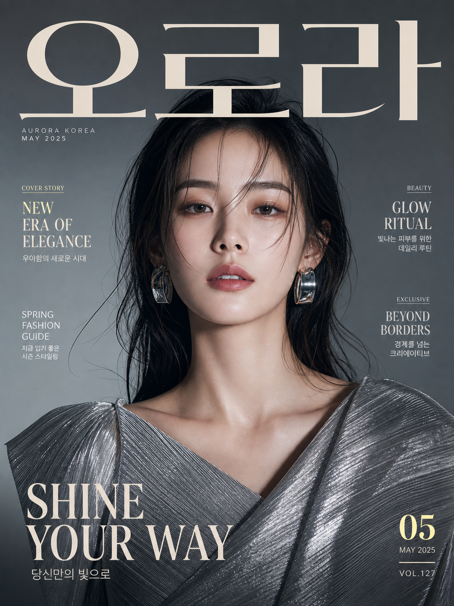
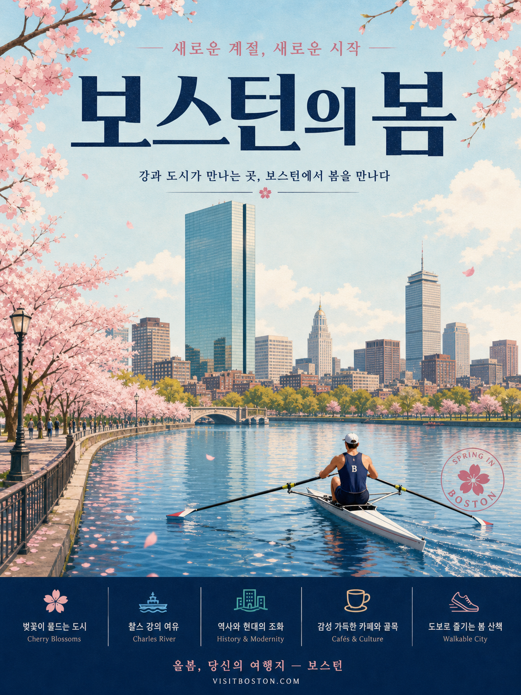
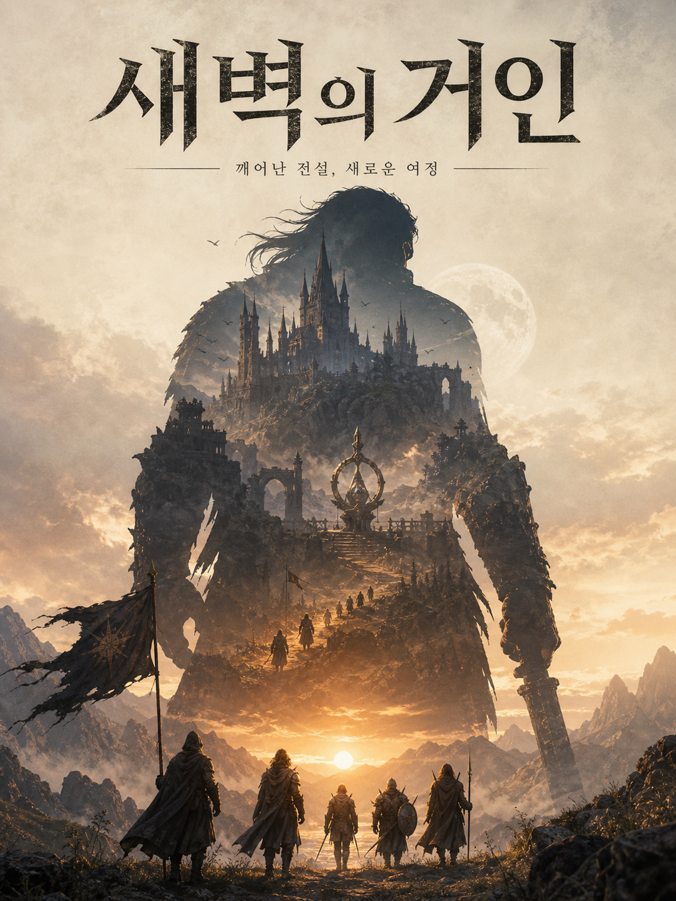
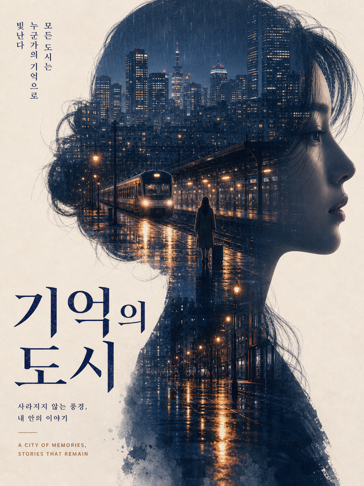
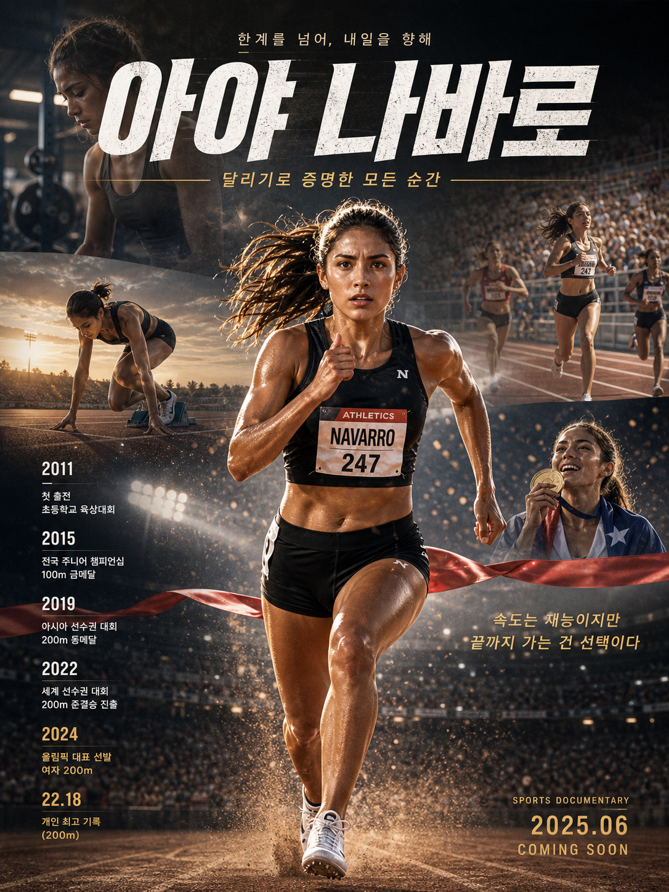

# 📝 포스터

파일: `gallery-typography-and-posters.md` · 6개 · 사이트 갤러리(index)의 실제 한국어 프롬프트

이 파일은 사이트 갤러리에 실제로 실린 완성 프롬프트를 담습니다. 공통 작성 규칙은 [`craft.md`](craft.md)와 함께 봅니다.

---

## 1. 미니멀 스릴러 영화 포스터


- 카테고리: 포스터
- 사이즈: Typography & Posters · portrait · 1536x2048

```text
결과물 유형:
인쇄용 포스터 또는 표지 디자인. 주제는 "미니멀 스릴러 영화 포스터"입니다. 완성 이미지는 실제 인쇄물로 사용할 수 있는 단일 포스터여야 하며, 제목과 핵심 이미지를 먼저 읽히게 합니다.

주 피사체:
제목 "마지막 문"이 들어간 미니멀 스릴러 영화 포스터. 칠흑 같은 검은 배경 정중앙에 아주 좁게 열린 문틈과 그 사이로 위에서 아래로 곧게 새어 나오는 얇은 노란빛을 배치합니다. 노란색 스텐실 질감의 제목은 이 세로 빛줄기를 사이에 두고 갈라져, 화면 왼쪽에 "마지막", 오른쪽에 "문"이 같은 눈높이로 놓입니다. 문틈 오른쪽에는 어둠 속에 잠긴 문손잡이가 희미하게 보입니다. 중심 피사체의 형태, 위치, 행동이 먼저 읽히고 보조 요소는 주제를 설명하는 단서로만 사용합니다.

구도와 비율:
3:4 세로형 인쇄용 포스터 또는 표지 디자인. 제목은 가장 먼저 읽히게 하고, 얇은 세로 빛줄기와 제목 글자의 크기 대비를 분명히 둡니다. 인쇄물처럼 가장자리 여백과 정중앙 세로 축을 안정적으로 맞춥니다.

맥락과 배경:
강한 여백, 제한된 색상, 날카로운 세로 구도의 깨끗한 인쇄 포스터로 만듭니다. 배경은 문틈 노란빛을 제외하면 거의 완전한 검은색으로 채워, 주 피사체를 설명하는 근거가 되어야 하며, 불필요한 장식으로 시선을 빼앗지 않습니다.

스타일과 매체:
편집 디자인 완성도가 높은 인쇄 포스터. 큰 제목, 세로 빛줄기, 여백, 은은한 벽 질감을 명확한 시각 위계로 정리합니다.

빛과 디테일:
조명: 문틈에서 새어 나오는 따뜻한 노란빛이 유일한 광원으로, 위쪽은 가늘게 시작해 아래로 갈수록 번져 바닥에 노란 빛 웅덩이처럼 반사됩니다. 이미지 요소와 글자가 겹치지 않도록 대비를 확보합니다.
카메라 시점: 문을 정면에서 바라보는 평면 시점으로 고정하고, 타이포그래피는 평면 인쇄물처럼 반듯하게 유지합니다.
디테일: 제목의 스텐실 획, 자간, 벽의 미세한 질감, 문손잡이 실루엣, 바닥에 번지는 빛 반사, 세로 빛줄기의 경계를 정돈합니다.

정확성 조건:
따옴표 안의 문구 "마지막 문"은 철자와 띄어쓰기를 정확히 유지하며, 세로 빛줄기를 사이에 두고 "마지막"과 "문"으로 갈라지되 두 덩어리 모두 노란색으로 통일합니다. 의미 없는 글자, 깨진 글자, 가짜 협찬 로고, 과한 장식은 피하고 멀리서도 핵심 문구가 읽혀야 합니다.
```

---

## 2. 패션 잡지 표지 디자인



- 카테고리: 포스터
- 사이즈: Typography & Posters · portrait · 1536x2048

```text
결과물 유형:
인쇄용 포스터 또는 표지 디자인. 주제는 "패션 잡지 표지 디자인"입니다. 완성 이미지는 실제 인쇄물로 사용할 수 있는 단일 잡지 표지여야 하며, 대형 제호와 모델 얼굴이 먼저 읽히게 합니다.

주 피사체:
한글 제호 "오로라"가 화면 상단을 가로지르는 초대형 세리프 타이포로 놓인 패션 잡지 표지. 정면에 가까운 여성 모델 한 명(총 1명)의 상반신을 중앙에 크게 배치하고, 실버 메탈릭 플리츠(주름) 질감의 드레이프 상의와 큰 실버 후프 귀걸이를 착용시킵니다. 헤드라인 문구들은 좌우 가장자리 여백에 정돈합니다. 중심 피사체의 형태와 위치가 먼저 읽히고 보조 문구는 표지를 설명하는 단서로만 사용합니다.

구도와 비율:
3:4 세로형 인쇄용 표지 디자인. 제호를 가장 먼저 읽히게 하고, 모델 얼굴, 헤드라인, 부제, 발행 정보의 크기 차이를 분명히 둡니다. 모델은 정면 또는 약한 3/4 시점으로 고정하고, 인쇄물처럼 가장자리 여백과 중앙 축을 안정적으로 맞춥니다.

맥락과 배경:
고급 스튜디오 조명, 매끈한 피부 표현, 실버 의상 질감, 선명한 제호와 균형 잡힌 타이포그래피를 사용합니다. 배경은 차분한 그레이 그라디언트로 모델을 부각시키며, 불필요한 장식으로 시선을 빼앗지 않습니다.

스타일과 매체:
편집 디자인 완성도가 높은 인쇄 잡지 표지. 큰 제호, 보조 문구, 인물 사진, 여백을 명확한 시각 위계로 정리합니다.

빛과 디테일:
조명: 고급 스튜디오 조명, 매끈한 피부 표현, 실버 의상의 광택과 주름 질감, 선명한 제호와 균형 잡힌 타이포그래피를 사용합니다. 이미지 요소와 글자가 겹치지 않도록 대비를 확보합니다.
카메라 시점: 정면 또는 약한 3/4 시점으로 상반신을 고정하고, 타이포그래피는 평면 인쇄물처럼 반듯하게 유지합니다.
디테일: 제호의 획, 자간, 색면 경계, 헤드라인 밀도를 정돈합니다.

정확성 조건:
따옴표 안의 문구는 철자와 띄어쓰기를 정확히 유지합니다. 제호는 "오로라", 상단 소제목은 "AURORA KOREA"와 "MAY 2025"입니다. 왼쪽 헤드라인은 "COVER STORY", "NEW ERA OF ELEGANCE", "우아함의 새로운 시대"와 "SPRING FASHION GUIDE", "지금 입기 좋은 시즌 스타일링"입니다. 오른쪽 헤드라인은 "BEAUTY", "GLOW RITUAL", "빛나는 피부를 위한 데일리 루틴"과 "EXCLUSIVE", "BEYOND BORDERS", "경계를 넘는 크리에이티브"입니다. 하단에는 대형 문구 "SHINE YOUR WAY"와 "당신만의 빛으로", 우측 하단에 "05", "MAY 2025", "VOL.127"이 들어갑니다. 의미 없는 글자, 깨진 글자, 가짜 협찬 로고, 과한 장식은 피하고 멀리서도 제호와 핵심 문구가 읽혀야 합니다.
```

---

## 3. 보스턴 봄맞이 도시 포스터



- 카테고리: 포스터
- 사이즈: Typography & Posters · portrait · 1536x2048

```text
결과물 유형:
인쇄용 여행 홍보 포스터. 주제는 "보스턴 봄맞이 도시 포스터"입니다. 완성 이미지는 실제 인쇄물로 사용할 수 있는 단일 포스터여야 하며, 큰 제목과 강변 도시 풍경을 먼저 읽히게 합니다.

주 피사체:
제목 "보스턴의 봄"이 들어간 도시 홍보 포스터. 화면 중앙 하단에서는 찰스 강 위를 노 젓는 조정 선수 한 명(1인)을 핵심 시각 초점으로 배치합니다. 선수는 네이비 민소매 유니폼에 'B' 표시, 흰 모자를 쓴 채 뒷모습으로 하얀 스컬 보트에 앉아 강 위쪽을 향해 노를 젓습니다. 그 뒤로 벚꽃이 만개한 강변 산책로, 아치형 다리, 유리 고층 빌딩과 프루덴셜 타워형 스카이라인이 세로 포스터 안에 정돈되어 펼쳐집니다.

구도와 비율:
3:4 세로형 인쇄용 포스터. 상단에는 큰 제목, 중앙에는 강과 도시와 조정 선수의 풍경, 하단에는 네이비 정보 밴드를 두어 크기 위계를 분명히 합니다. 우측 강 위에는 원형 도장형 엠블럼을 겹쳐 배치하고, 좌우 상단 모서리는 벚꽃 가지로 프레이밍합니다. 인쇄물처럼 가장자리 여백과 중앙 축을 안정적으로 맞춥니다.

맥락과 배경:
산뜻한 하늘색, 연분홍 벚꽃, 짙은 남색을 사용하고 여행 포스터처럼 여백과 큰 제목을 살립니다. 하늘의 옅은 구름, 강물에 떠다니는 꽃잎, 강변의 가로등과 걷는 사람들이 봄의 도시 분위기를 설명하는 배경으로 작동합니다.

스타일과 매체:
편집 디자인 완성도가 높은 일러스트풍 인쇄 포스터. 큰 제목, 보조 문구, 강변 도시 일러스트, 하단 아이콘 밴드, 여백을 명확한 시각 위계로 정리합니다.

빛과 디테일:
조명: 산뜻한 하늘색, 연분홍, 짙은 남색을 사용하고 여행 포스터처럼 밝고 화창한 봄 낮의 빛을 살립니다. 이미지 요소와 글자가 겹치지 않도록 대비를 확보합니다.
카메라 시점: 강 수면에 가까운 낮은 정면 시점으로, 조정 선수의 뒷모습과 도시 스카이라인이 원근으로 이어지게 하고 타이포그래피는 평면 인쇄물처럼 반듯하게 유지합니다.
디테일: 제목의 획, 자간, 벚꽃 꽃잎, 물결, 하단 아이콘 라인, 색면 경계의 밀도를 정돈합니다.

정확성 조건:
따옴표 안의 문구는 철자와 띄어쓰기를 정확히 유지합니다. 상단 아이라인 "새로운 계절, 새로운 시작", 대제목 "보스턴의 봄", 부제 "강과 도시가 만나는 곳, 보스턴에서 봄을 만나다", 우측 원형 도장의 "SPRING IN BOSTON"을 정확히 표기합니다. 하단 네이비 밴드에는 5개 항목을 왼쪽부터 "벚꽃이 물드는 도시 / Cherry Blossoms", "찰스 강의 여유 / Charles River", "역사와 현대의 조화 / History & Modernity", "감성 가득한 카페와 골목 / Cafés & Culture", "도보로 즐기는 봄 산책 / Walkable City" 순으로 배치하고, 맨 아래 푸터에 "올봄, 당신의 여행지 — 보스턴"과 "VISITBOSTON.COM"을 넣습니다. 의미 없는 글자, 깨진 글자, 가짜 협찬 로고, 과한 장식은 피하고 멀리서도 핵심 문구가 읽혀야 합니다.
```

---

## 4. 거대한 실루엣 판타지 포스터



- 카테고리: 포스터
- 사이즈: Typography & Posters · portrait · 1536x2048

```text
결과물 유형:
인쇄용 포스터 또는 표지 디자인. 주제는 "거대한 실루엣 판타지 포스터"입니다. 완성 이미지는 실제 인쇄물로 사용할 수 있는 단일 포스터여야 하며, 제목과 핵심 이미지를 먼저 읽히게 합니다.

주 피사체:
제목 "새벽의 거인"과 부제 "깨어난 전설, 새로운 여정"이 들어간 판타지 포스터. 새벽 산맥 앞에 머리카락이 휘날리는 거대한 인물 실루엣을 세우되, 실루엣 내부는 성채와 첨탑, 계단과 아치, 고리 모양 문장, 달빛이 이중노출로 채워진 하나의 세계로 표현합니다. 실루엣 아래에는 후드 망토를 두른 다섯 명의 작은 원정대가 떠오르는 태양을 향해 걸어갑니다. 중심 피사체의 형태, 위치, 행동이 먼저 읽히고 보조 요소는 주제를 설명하는 단서로만 사용합니다.

구도와 비율:
3:4 세로형 인쇄용 포스터 또는 표지 디자인. 제목은 가장 먼저 읽히게 하고, 핵심 이미지, 부제, 보조 정보의 크기 차이를 분명히 둡니다. 인쇄물처럼 가장자리 여백과 중앙 축을 안정적으로 맞춥니다.

맥락과 배경:
따뜻한 새벽빛, 큰 스케일 대비, 실루엣 중심 구도, 고전 판타지 소설 표지 같은 질감을 사용합니다. 왼쪽에는 나침반 문양이 든 찢어진 깃발을 두고, 배경은 주 피사체를 설명하는 근거가 되어야 하며, 불필요한 장식으로 시선을 빼앗지 않습니다.

스타일과 매체:
편집 디자인 완성도가 높은 인쇄 포스터. 큰 제목, 보조 문구, 이미지, 여백, 종이 질감을 명확한 시각 위계로 정리합니다.

빛과 디테일:
조명: 따뜻한 새벽빛, 중앙에서 떠오르는 태양의 역광, 큰 스케일 대비, 실루엣 중심 구도, 고전 판타지 소설 표지 같은 질감을 사용합니다. 이미지 요소와 글자가 겹치지 않도록 대비를 확보합니다.
카메라 시점: 정면 로우앵글에 가까운 평면 구도로 고정하고, 타이포그래피는 평면 인쇄물처럼 반듯하게 유지합니다.
디테일: 제목의 획, 자간, 종이 질감, 색면 경계, 작은 장식의 밀도를 정돈합니다.

정확성 조건:
따옴표 안의 문구 "새벽의 거인"과 "깨어난 전설, 새로운 여정"은 철자와 띄어쓰기를 정확히 유지합니다. 의미 없는 글자, 깨진 글자, 가짜 협찬 로고, 과한 장식은 피하고 멀리서도 핵심 문구가 읽혀야 합니다.
```

---

## 5. 이중 노출 서사 포스터



- 카테고리: 포스터
- 사이즈: Typography & Posters · portrait · 1536x2048

```text
결과물 유형:
인쇄용 포스터 또는 표지 디자인. 주제는 "이중 노출 서사 포스터"입니다. 완성 이미지는 실제 인쇄물로 사용할 수 있는 단일 포스터여야 하며, 제목과 핵심 이미지를 먼저 읽히게 합니다.

주 피사체:
제목 "기억의 도시"가 들어간 이중 노출 포스터. 오른쪽을 바라보는 젊은 여성의 정측면 옆얼굴 실루엣 안에 밤 도시 스카이라인, 불 밝힌 기차역과 도착하는 열차, 비에 젖은 거리 장면을 겹쳐 넣습니다. 역 플랫폼에는 여행가방을 든 인물 실루엣 한 명이 홀로 서 있습니다. 중심 피사체의 형태, 위치, 행동이 먼저 읽히고 보조 요소는 주제를 설명하는 단서로만 사용합니다.

구도와 비율:
3:4 세로형 인쇄용 포스터 또는 표지 디자인. 옆얼굴은 화면 오른쪽에 크게 배치하고 하단 왼쪽에 큰 제목을 둡니다. 제목은 가장 먼저 읽히게 하고, 핵심 이미지, 부제, 보조 정보의 크기 차이를 분명히 둡니다. 인쇄물처럼 가장자리 여백과 중앙 축을 안정적으로 맞춥니다.

맥락과 배경:
절제된 파랑과 주황, 부드러운 필름 그레인, 크림색 종이 바탕, 얼굴 윤곽과 도시 이미지가 자연스럽게 연결되도록 구성합니다. 배경은 주 피사체를 설명하는 근거가 되어야 하며, 불필요한 장식으로 시선을 빼앗지 않습니다.

스타일과 매체:
편집 디자인 완성도가 높은 인쇄 포스터. 큰 제목, 보조 문구, 이미지, 여백, 종이 질감을 명확한 시각 위계로 정리합니다.

빛과 디테일:
조명: 절제된 파랑과 주황, 부드러운 필름 그레인, 얼굴 윤곽과 도시 이미지가 자연스럽게 연결되도록 구성합니다. 젖은 노면에 번지는 따뜻한 가로등 반사광으로 깊이를 만들고, 이미지 요소와 글자가 겹치지 않도록 대비를 확보합니다.
카메라 시점: 옆얼굴은 오른쪽을 향한 정측면 프로필로 고정하고, 타이포그래피는 평면 인쇄물처럼 반듯하게 유지합니다.
디테일: 제목의 획, 자간, 종이 질감, 색면 경계, 작은 장식의 밀도를 정돈합니다.

정확성 조건:
따옴표 안의 문구는 철자와 띄어쓰기를 정확히 유지합니다. 하단 왼쪽 큰 제목은 세로 배열의 "기억의 도시", 그 아래 부제는 "사라지지 않는 풍경, 내 안의 이야기", 영문 태그라인은 "A CITY OF MEMORIES, STORIES THAT REMAIN", 좌측 상단 세로쓰기 문구는 "모든 도시는 누군가의 기억으로 빛난다"로 정확히 표기합니다. 의미 없는 글자, 깨진 글자, 가짜 협찬 로고, 과한 장식은 피하고 멀리서도 핵심 문구가 읽혀야 합니다.
```

---

## 6. 여성 운동선수 여정 포스터



- 카테고리: 포스터
- 사이즈: Typography & Posters · portrait · 1536x2048

```text
결과물 유형:
인쇄용 포스터 또는 표지 디자인. 주제는 "여성 운동선수 여정 포스터"입니다. 완성 이미지는 실제 인쇄물로 사용할 수 있는 단일 포스터여야 하며, 제목과 핵심 이미지를 먼저 읽히게 합니다. 스포츠 다큐멘터리 티저 포스터 톤으로 구성합니다.

주 피사체:
제목 "아야 나바로"가 상단 대형 그런지 화이트 타이포로 들어간 여성 육상 선수 여정 포스터. 중앙에는 붉은 결승 테이프를 끊고 들어오는 여성 스프린터가 땀에 젖은 채 카메라를 향해 전신으로 질주하며, 검은 스포츠 브라와 검은 쇼츠 차림에 가슴 배번 "ATHLETICS", "NAVARRO", "247"이 보입니다. 배경과 인서트에는 훈련(바벨 웨이트) 장면, 노을 진 트랙의 출발 블록 스타팅 장면, 우측 상단 스타디움에서 경쟁하는 다른 주자들, 우측 하단 국기를 두르고 금메달을 든 시상 장면을 레이어로 배치합니다. 중심 피사체가 먼저 읽히고 보조 인서트는 여정을 설명하는 단서로만 사용합니다.

구도와 비율:
3:4 세로형 인쇄용 포스터. 제목은 가장 먼저 읽히게 하고, 중앙의 질주 인물, 좌측 세로 타임라인, 부제와 카피의 크기 차이를 분명히 둡니다. 왼쪽에는 연도별 업적을 정렬한 세로 타임라인 컬럼을 두고, 인쇄물처럼 가장자리 여백과 중앙 축을 안정적으로 맞춥니다.

맥락과 배경:
강한 조명과 흩날리는 먼지, 땀과 운동복 질감, 대담한 스포츠 타이포그래피, 결승선을 끊는 승리의 순간을 표현합니다. 배경 스타디움과 관중, 인서트 장면은 주 피사체의 여정을 설명하는 근거가 되어야 하며, 불필요한 장식으로 시선을 빼앗지 않습니다.

스타일과 매체:
편집 디자인 완성도가 높은 인쇄 포스터. 큰 제목, 태그라인, 타임라인 텍스트, 이미지, 여백, 어둡고 골드 톤이 감도는 질감을 명확한 시각 위계로 정리합니다.

빛과 디테일:
조명: 강한 역광과 스포트라이트, 땀과 근육의 하이라이트, 대담한 스포츠 타이포그래피, 승리 직전의 긴장감을 표현합니다. 이미지 요소와 글자가 겹치지 않도록 대비를 확보합니다.
카메라 시점: 중앙 인물은 정면 로우앵글로 질주감을 강조하고, 타이포그래피는 평면 인쇄물처럼 반듯하게 유지합니다.
디테일: 제목의 거친 텍스처 획, 자간, 종이·먼지 질감, 색면 경계, 타임라인 항목의 밀도를 정돈합니다.

정확성 조건:
따옴표 안의 문구는 철자와 띄어쓰기를 정확히 유지합니다. 제목 위 태그라인 "한계를 넘어, 내일을 향해", 대형 제목 "아야 나바로", 부제 "달리기로 증명한 모든 순간", 좌측 타임라인 "2011 첫 출전 초등학교 육상대회", "2015 전국 주니어 챔피언십 100m 금메달", "2019 아시아 선수권 대회 200m 동메달", "2022 세계 선수권 대회 200m 준결승 진출", "2024 올림픽 대표 선발 여자 200m", "22.18 개인 최고 기록 (200m)", 우측 카피 "속도는 재능이지만 끝까지 가는 건 선택이다", 하단 정보 "SPORTS DOCUMENTARY", "2025.06", "COMING SOON", 배번 "ATHLETICS", "NAVARRO", "247"을 그대로 표기합니다. 의미 없는 글자, 깨진 글자, 가짜 협찬 로고, 과한 장식은 피하고 멀리서도 핵심 문구가 읽혀야 합니다.
```
