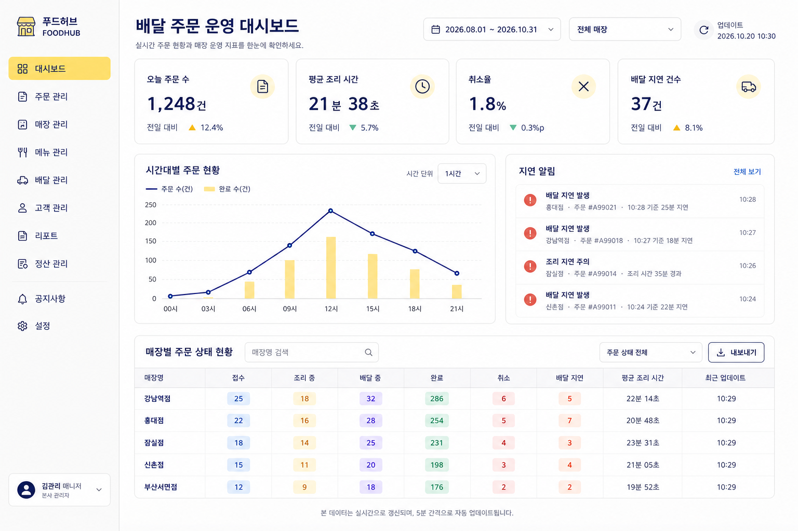
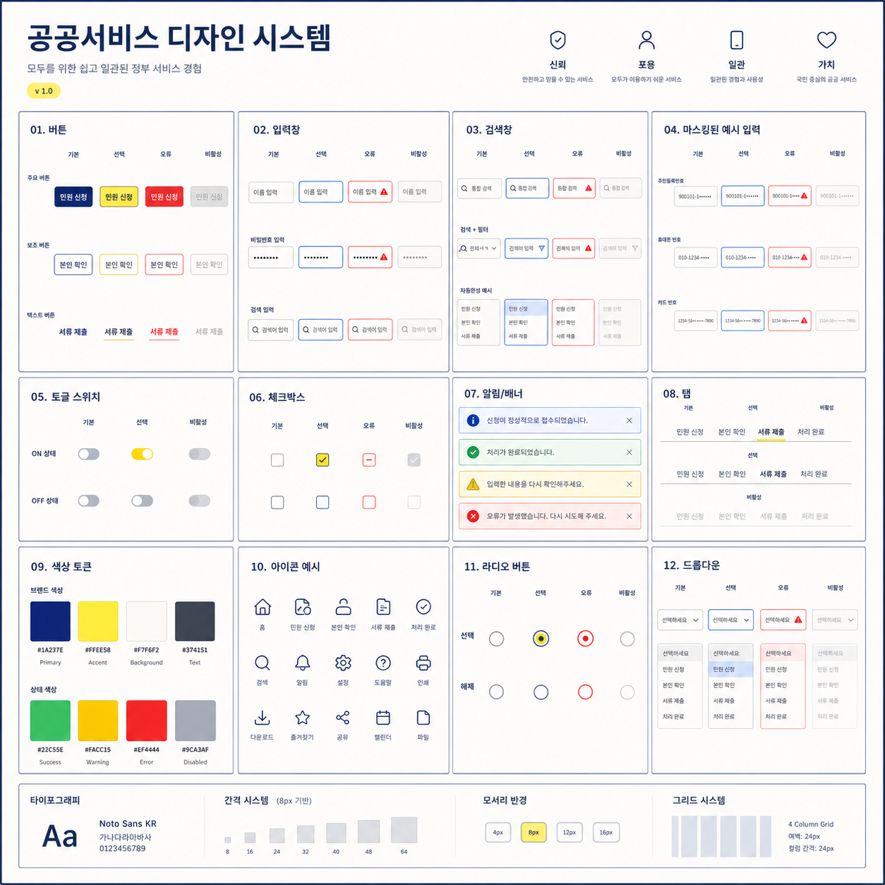
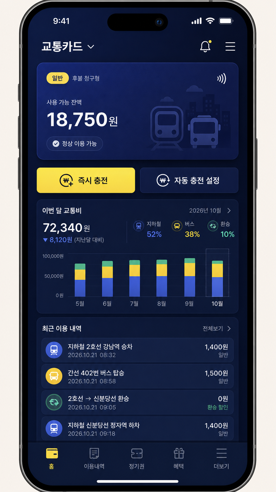
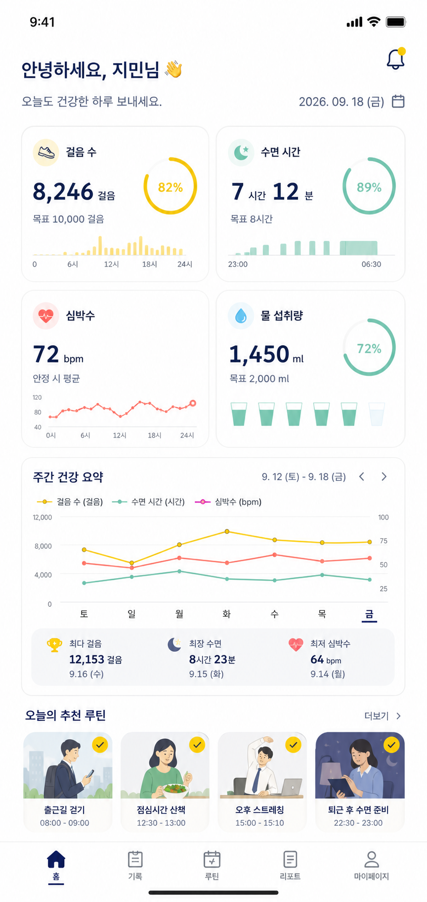

# 🖥️ UI·대시보드

파일: `gallery-ui-ux-mockups.md` · 5개 · 사이트 갤러리(index)의 실제 한국어 프롬프트

이 파일은 사이트 갤러리에 실제로 실린 완성 프롬프트를 담습니다. 공통 작성 규칙은 [`craft.md`](craft.md)와 함께 봅니다.

---

## 1. 월급 관리 가계부 앱


- 카테고리: UI·대시보드
- 사이즈: UI·대시보드 · 세로형 · 1080x1920

```text
결과물 유형:
9:16 모바일 가계부 앱 UI 목업. 주제는 "월급 관리 가계부 앱"입니다. 완성 이미지는 한국 직장인이 월급일 이후 지출, 저축, 카드값을 한 화면에서 확인하는 실제 금융 앱처럼 보여야 합니다.

주 피사체:
한국 직장인을 위한 월급 관리 앱 홈 화면. 상단 인사 영역에는 노란 원형 아바타 일러스트와 "안녕하세요, 김지훈님", "오늘도 현명한 소비 습관을 이어가요!", 알림 벨(노란 점 배지)을 둡니다. 그 아래 딥 인디고 월급 요약 카드, 지출 카테고리 목록, 저축 목표 도넛 링, 카드 결제 예정 배너, 최근 거래 목록, 하단 탭 내비게이션을 배치합니다. 사용자는 남은 생활비와 다음 결제일을 가장 먼저 파악할 수 있어야 합니다.

구도와 비율:
9:16 세로형 스마트폰 화면. 상단에는 "2026년 9월 월급 관리" 딥 인디고 요약 카드(수령액과 남은 금액을 큰 숫자로, 지출·저축·카드 결제 예정 3분할 진행바로), 중앙에는 왼쪽 "지출 카테고리" 막대 목록과 오른쪽 "저축 목표" 68% 도넛 링을 나란히, 하단에는 카드 결제 예정 배너와 최근 거래 5건, 세 개의 액션 버튼을 배치합니다. 버튼과 카드 높이는 실제 모바일 앱처럼 터치 가능한 크기로 정리합니다.

맥락과 배경:
원화 금액, 월급일, 통신비, 교통비, 점심값, 구독료처럼 한국 직장인이 익숙한 지출 항목을 사용합니다. 최근 거래에는 통신비(SKT), 교통카드 충전, 점심값(회사 근처 식당), 넷플릭스, 스타벅스 커피처럼 실제 서비스명과 작은 브랜드 아이콘이 함께 나타납니다. 색상은 흰색과 연한 회색 바탕에 딥 인디고, 노란 포인트를 적용합니다.

스타일과 매체:
실무형 핀테크 모바일 UI 목업. 카드, 그래프, 목록, 버튼, 탭 바의 위계가 분명해야 하며, 정보 가독성과 조작 가능성이 장식보다 먼저 보여야 합니다.

빛과 디테일:
평면 UI처럼 처리합니다. 카드 그림자는 약하게 쓰고, 선택 상태와 알림 배지는 얇은 선과 색상 차이로 구분합니다. 원화 금액, 결제 예정일, 카테고리명, 저축 목표 진행률 링(68%), 하단 5개 탭(홈, 내역, 중앙 노란 + 기록 버튼, 분석, 더보기) 아이콘을 실제 앱처럼 정돈합니다.

정확성 조건:
요약 카드는 "2026년 9월 월급 관리", "월급일 9. 25 (금)", "이번 달 수령액 3,450,000원", "이번 달 남은 금액 1,287,500원"으로 표기하고, 지출 1,362,500원 39%·저축 800,000원 23%·카드 결제 예정 549,000원 16%를 보여줍니다. 카드 결제 예정 배너는 "다음 결제일 2026. 10. 5 (월)", 저축 목표는 "비상금 모으기 1,000,000원 목표", "680,000원 모음", "목표 달성일 2026. 12. 31"로 씁니다. 거래일과 예산 기간은 2026년 9월 범위 안에서 표기합니다. 숫자, 버튼, 카드 제목은 겹치지 않아야 하며, 실제 은행 로고와 읽을 수 없는 임의 문자, 과도한 장식은 피합니다.
```

---

## 2. 배달 주문 운영 대시보드



- 카테고리: UI·대시보드
- 사이즈: UI·대시보드 · 가로형 · 1536x1024

```text
결과물 유형:
16:9 데스크톱 운영 분석 대시보드. 주제는 "배달 주문 운영 대시보드"입니다. 완성 이미지는 한국 프랜차이즈 본사나 매장 관리자가 주문 상태를 확인하는 실제 업무용 웹 화면처럼 보여야 합니다.

주 피사체:
배달 주문 운영 현황을 관리하는 대시보드. 좌측에는 가상 브랜드 로고 "푸드허브 FOODHUB"와 세로 내비게이션 메뉴("대시보드", "주문 관리", "매장 관리", "메뉴 관리", "배달 관리", "고객 관리", "리포트", "정산 관리", "공지사항", "설정"), 하단에 사용자 "김관리 매니저 / 본사 관리자"를 둡니다. 상단 KPI 카드에는 오늘 주문 수, 평균 조리 시간, 취소율, 배달 지연 건수를 배치합니다. 중앙에는 시간대별 주문 그래프, 오른쪽에는 지연 알림 패널, 하단에는 매장별 주문 상태 테이블을 둡니다.

구도와 비율:
3:2 가로형 웹 화면. 좌측 메뉴는 고정 폭으로 두고, 중앙 데이터 영역을 가장 크게 구성합니다. KPI 카드, 그래프, 표의 정렬 기준을 통일해 실제 SaaS 관리 화면처럼 보이게 합니다.

맥락과 배경:
한국 배달 매장의 운영 맥락이 느껴지게 합니다. 매장명은 실제 브랜드가 아닌 가상의 지점명("강남역점", "홍대점", "잠실점", "신촌점", "부산서면점")으로 표기하고, 접수, 조리 중, 배달 중, 완료, 취소, 배달 지연 상태를 색상 배지로 구분합니다.

스타일과 매체:
실무형 웹 대시보드 UI. 데이터 카드, 선 그래프(주문 수), 막대그래프(완료 수), 상태 배지, 필터 버튼, 표가 하나의 제품 디자인 시스템 안에서 통일되어야 합니다.

빛과 디테일:
평면 UI처럼 처리합니다. 카드 그림자는 약하게 쓰고, 색 대비는 정보 우선순위를 구분하는 데 사용합니다. 기간 필터, 표 헤더, 정렬 상태, 상태 배지, 숫자 단위, 축 라벨, 범례를 실제 데이터처럼 배치합니다. 시간대별 주문 현황 차트는 00시부터 21시까지 X축 라벨을 두고 "주문 수(건)" 선과 "완료 수(건)" 막대를 겹쳐 표기합니다.

정확성 조건:
기간 필터는 "2026.08.01 ~ 2026.10.31", 매장 필터는 "전체 매장", 업데이트 시각은 "2026.10.20 10:30"으로 2026년 8~10월 범위 안에서 표기합니다. KPI 카드에는 "오늘 주문 수 1,248건 / 전일 대비 12.4%", "평균 조리 시간 21분 38초 / 전일 대비 5.7%", "취소율 1.8% / 전일 대비 0.3%p", "배달 지연 건수 37건 / 전일 대비 8.1%"를 표기합니다. 제목은 "배달 주문 운영 대시보드", 부제는 "실시간 주문 현황과 매장 운영 지표를 한눈에 확인하세요.", 하단 안내는 "본 데이터는 실시간으로 갱신되며, 5분 간격으로 자동 업데이트됩니다."로 둡니다. 숫자, 축, 범례, 버튼, 표가 실제 인터페이스처럼 정리되어야 합니다. 실제 배달 플랫폼 로고, 겹친 텍스트, 의미 없는 문자는 피합니다.
```

---

## 3. 공공서비스 디자인 시스템 보드



- 카테고리: UI·대시보드
- 사이즈: UI·대시보드 · 정사각형 · 1024x1024

```text
결과물 유형:
UI 디자인 시스템 보드. 주제는 "공공서비스 디자인 시스템 보드"입니다. 완성 이미지는 한국 공공 웹서비스 개편 제안서에 바로 넣을 수 있는 컴포넌트 쇼케이스처럼 보여야 합니다. 좌상단에 굵은 제목 "공공서비스 디자인 시스템", 그 아래 부제 "모두를 위한 쉽고 일관된 정부 서비스 경험", 작은 "v 1.0" 배지를 둡니다. 우상단에는 방패·사람·모바일·하트 아이콘과 함께 "신뢰", "포용", "일관", "가치" 4개 원칙과 짧은 설명 문구를 나란히 배치합니다.

주 피사체:
공공서비스용 디자인 시스템을 설명하는 번호 매긴 컴포넌트 섹션 세트(인물 없음). 01 버튼, 02 입력창, 03 검색창, 04 마스킹된 예시 입력, 05 토글 스위치, 06 체크박스, 07 알림/배너, 08 탭, 09 색상 토큰, 10 아이콘 예시, 11 라디오 버튼, 12 드롭다운을 정리하고, 대부분의 컴포넌트는 기본·선택·오류·비활성 상태를 열로 구분해 보여줍니다.

구도와 비율:
1:1 정사각형 보드. 상단 헤더 행 아래에 컴포넌트 섹션을 4열 모듈 그리드로 3줄 배치하고, 맨 아래에는 타이포그래피, 간격 시스템, 모서리 반경, 그리드 시스템을 담은 파운데이션 행을 가로로 둡니다. 각 섹션의 번호·제목·상태 라벨은 같은 위치에 정렬합니다.

맥락과 배경:
한국어 행정 서비스 화면에서 쓰일 법한 문구를 사용합니다. 예시는 "민원 신청", "본인 확인", "서류 제출", "처리 완료"처럼 짧게 구성하고, 마스킹 입력은 주민등록번호·휴대폰 번호·카드 번호를 뒷자리를 가린 형태로 보여주며, 실제 기관명이나 로고는 넣지 않습니다.

스타일과 매체:
정돈된 UI 키트 프레젠테이션. 밝은 배경에 카드와 여백을 넉넉히 두고, 컴포넌트가 실제 서비스에 적용 가능한 크기와 간격으로 보여야 하며, 장식보다 재사용성과 접근성이 먼저 보여야 합니다.

빛과 디테일:
평면 보드처럼 처리합니다. 카드 경계와 상태 차이는 선, 색, 배지로 구분합니다. 버튼 높이, 입력창 라벨, 토글 상태, 색상 칩, 아이콘 정렬, 컴포넌트 간격을 실제 디자인 시스템처럼 정리합니다. 색상 토큰은 브랜드 색상 "#1A237E Primary", "#FFEE58 Accent", "#F7F6F2 Background", "#374151 Text"와 상태 색상 "#22C55E Success", "#FACC15 Warning", "#EF4444 Error", "#9CA3AF Disabled"로 표기하고, 타이포그래피 샘플은 "Noto Sans KR", "Aa 가나다라마바사 0123456789"로 보여줍니다.

정확성 조건:
컴포넌트 이름과 상태 라벨은 짧고 읽기 쉬워야 합니다. 헤더 문구 "공공서비스 디자인 시스템", "v 1.0", 원칙 "신뢰·포용·일관·가치", 마스킹 예시(예: "900101-1●●●●●●", "010-1234-●●●●", "1234-56●●-●●●●-7890"), 색상 토큰 값과 상태 라벨은 정확히 표기합니다. 실제 기관 로고, 읽을 수 없는 임의 문자, 서로 다른 스타일의 컴포넌트 혼합, 겹친 텍스트, 과도한 장식은 피합니다.
```

---

## 4. 모바일 교통카드 지갑 앱



- 카테고리: UI·대시보드
- 사이즈: UI·대시보드 · 세로형 · 1080x1920

```text
결과물 유형:
9:16 모바일 디지털 지갑 앱 UI 목업. 주제는 "모바일 교통카드 지갑 앱"입니다. 완성 이미지는 한국 사용자가 교통카드 잔액, 충전, 이용 내역을 확인하는 실제 다크 테마 모바일 앱처럼 보여야 하며, 아이폰 프레임(상단 노치, 9:41 시계, 신호·와이파이·배터리 아이콘) 안에 담깁니다.

주 피사체:
한국 사용자를 위한 남색 계열 다크 테마 교통카드 지갑 홈 화면. 상단 헤더에 "교통카드" 드롭다운, 알림 벨, 햄버거 메뉴. 그 아래 잔액 카드에는 "일반" 노란 배지와 "후불 청구형" 라벨, NFC 무선 아이콘, "사용 가능 잔액" 라벨과 큰 금액 "18,750원", 체크 아이콘이 붙은 "정상 이용 가능" 상태, 그리고 지하철·버스 실루엣 일러스트를 배치합니다. 잔액 카드가 화면의 시각적 중심입니다.

구도와 비율:
9:16 세로형 스마트폰 화면. 상단에 헤더와 잔액 카드, 그 아래 노란색 "즉시 충전" 버튼과 남색 테두리 "자동 충전 설정" 버튼을 좌우로 나란히, 중앙에 "이번 달 교통비" 요약과 누적 세로 막대 차트, 하단에 "최근 이용 내역" 리스트와 5개 항목 탭 내비게이션(홈·이용내역·정기권·혜택·더보기)을 배치합니다.

맥락과 배경:
지하철, 버스, 환승, 정기권, 교통비 같은 한국 대중교통 맥락을 사용합니다. 금액은 원화로 표기하고, 날짜는 2026년 10월 기준으로 자연스럽게 보이게 합니다.

스타일과 매체:
프리미엄 핀테크 모바일 UI, 남색 다크 배경에 노란색 포인트 컬러. 카드, 버튼, 거래 목록, 상태 배지, 아이콘이 하나의 디자인 시스템으로 통일되어야 합니다.

빛과 디테일:
평면 UI처럼 처리하되 잔액 카드 표면에는 아주 약한 깊이감을 줍니다. "이번 달 교통비" 섹션에는 "2026년 10월" 라벨, 큰 금액 "72,340원", "▼ 8,120원 (지난달 대비)" 감소 표기, "지하철 52%", "버스 38%", "환승 10%" 비율, 그리고 5월·6월·7월·8월·9월·10월 6개 막대(파랑·노랑·초록 누적, 0원~100,000원 눈금, 10월 막대는 점선으로 강조)를 그립니다. "최근 이용 내역"에는 "지하철 2호선 강남역 승차 1,400원", "간선 402번 버스 탑승 1,500원", "2호선 → 신분당선 환승 0원(환승 할인)", "지하철 신분당선 정자역 하차 1,400원"처럼 2026.10.21 시각과 함께 배치합니다.

정확성 조건:
실제 교통카드 브랜드나 철도사 로고는 넣지 않습니다. 화면에 사람은 등장하지 않습니다. 읽을 수 없는 임의 문자, 겹친 숫자, 작동 불가능해 보이는 버튼 배치, 과한 네온 효과는 피합니다.
```

---

## 5. 직장인 건강 루틴 앱



- 카테고리: UI·대시보드
- 사이즈: UI·대시보드 · 세로형 · 1080x1920

```text
결과물 유형:
9:16 모바일 건강 기록 앱 UI 목업. 주제는 "직장인 건강 루틴 앱"입니다. 완성 이미지는 한국 직장인이 출퇴근과 근무 중 건강 습관을 관리하는 실제 웰니스 앱 대시보드처럼 보여야 합니다.

주 피사체:
직장인을 위한 건강 루틴 앱 홈 화면. 상단 인사 "안녕하세요, 지민님"과 안내 문구 "오늘도 건강한 하루 보내세요."를 두고, 그 아래 핵심 건강 카드 4개(걸음 수, 수면 시간, 심박수, 물 섭취량)를 2×2로 배치합니다. 각 카드에는 수치와 목표, 진행률 링 또는 작은 그래프를 넣습니다. 하단에는 주간 건강 요약 선그래프와 인물 일러스트가 들어간 "오늘의 추천 루틴" 카드 4개를 배치합니다.

구도와 비율:
9:16 세로형 스마트폰 화면. 상단에 사용자 인사와 날짜 및 알림 벨, 중앙에 핵심 건강 카드 4개, 그 아래 주간 그래프, 맨 아래 추천 루틴 카드 가로 스크롤과 하단 탭 바를 배치합니다.

맥락과 배경:
한국 직장인의 생활 패턴이 느껴지게 합니다. 추천 루틴 카드는 "출근길 걷기 08:00 - 09:00", "점심시간 산책 12:30 - 13:00", "오후 스트레칭 15:00 - 15:10", "퇴근 후 수면 준비 22:30 - 23:00"처럼 하루 흐름을 담고, 각 카드에는 해당 상황의 직장인 일러스트와 완료 체크 표시를 넣습니다. 숫자 단위는 걸음, 시간, bpm, ml처럼 실제 앱에서 쓰는 단위를 사용합니다.

스타일과 매체:
실무형 웰니스 앱 UI. 건강 데이터는 친근하지만 과장되지 않게 표현하고, 카드 간격과 버튼 상태는 실제 모바일 제품 수준으로 정돈합니다. 추천 루틴 카드의 인물 일러스트는 부드러운 파스텔 톤 플랫 일러스트로 통일합니다.

빛과 디테일:
평면 UI처럼 처리합니다. 색 대비는 건강 상태와 목표 달성률을 구분하는 데 사용합니다. 날짜, 건강 수치, 진행률 링, 작은 그래프, 알림 배지, 탭 바 아이콘을 실제 데이터처럼 배치합니다.

정확성 조건:
건강 기록, 운동 기록, 주간 요약 날짜는 2026년 8월~10월 범위 안에서 표기합니다(예: 상단 날짜 "2026. 09. 18 (금)"). 핵심 카드 수치는 "8,246 걸음"과 "목표 10,000 걸음"(82%), "7 시간 12 분"과 "목표 8시간"(89%), "72 bpm" "안정 시 평균", "1,450 ml"와 "목표 2,000 ml"(72%)처럼 표기하고, 주간 건강 요약에는 "최다 걸음 12,153 걸음", "최장 수면 8시간 23분", "최저 심박수 64 bpm"를 넣습니다. 하단 탭 바 라벨은 "홈", "기록", "루틴", "리포트", "마이페이지"로 합니다. 숫자와 단위가 서로 맞아야 합니다. 실제 브랜드 로고, 읽을 수 없는 임의 문자, 겹친 텍스트, 과도한 장식은 피합니다.
```
