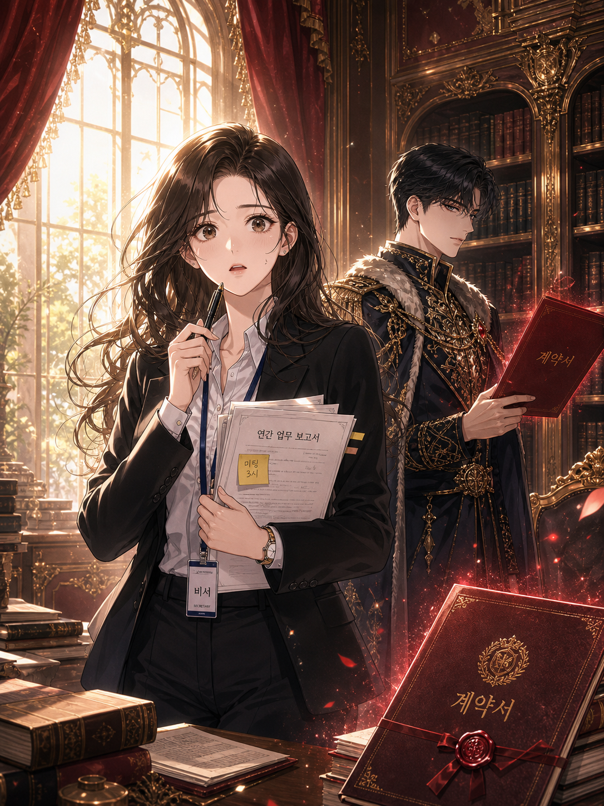
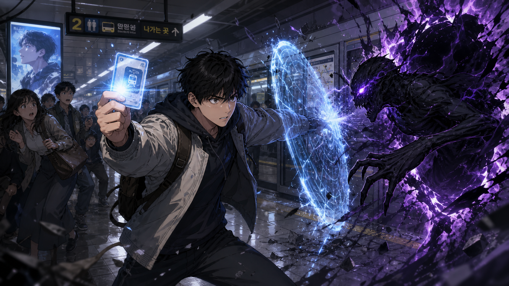
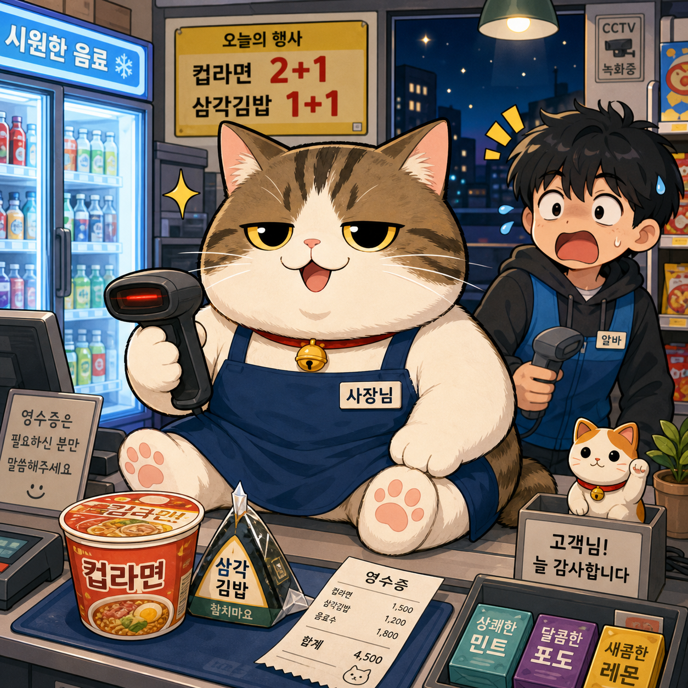
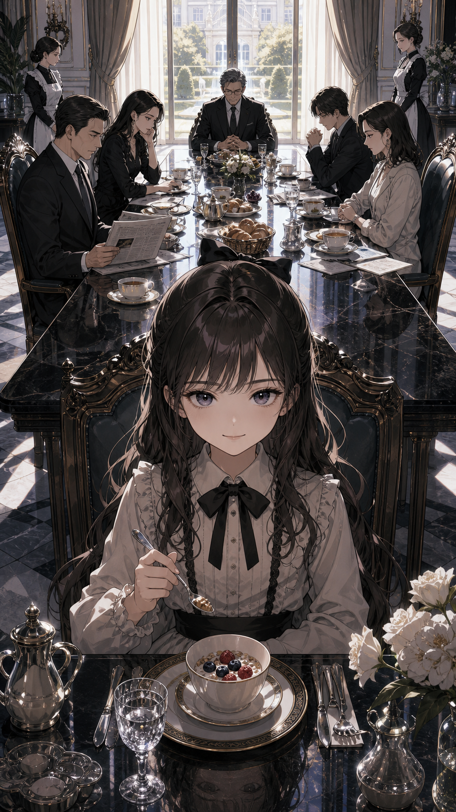
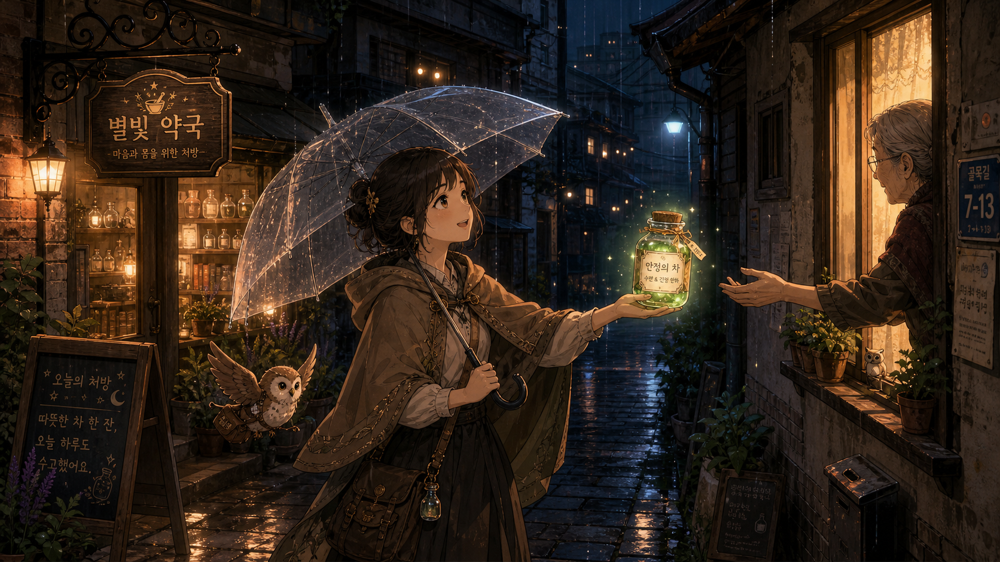
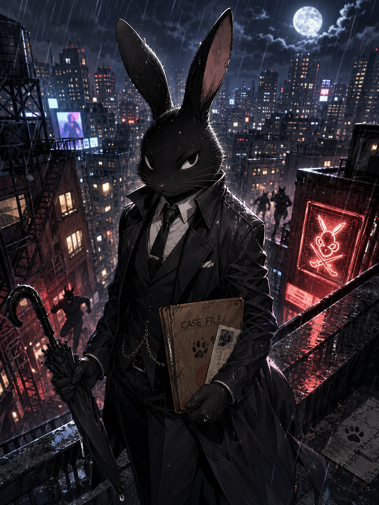
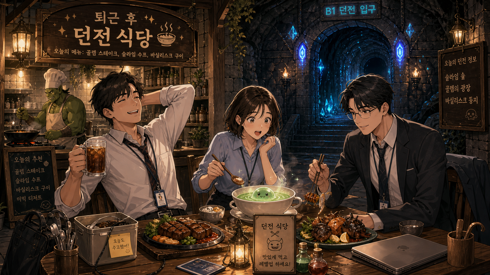
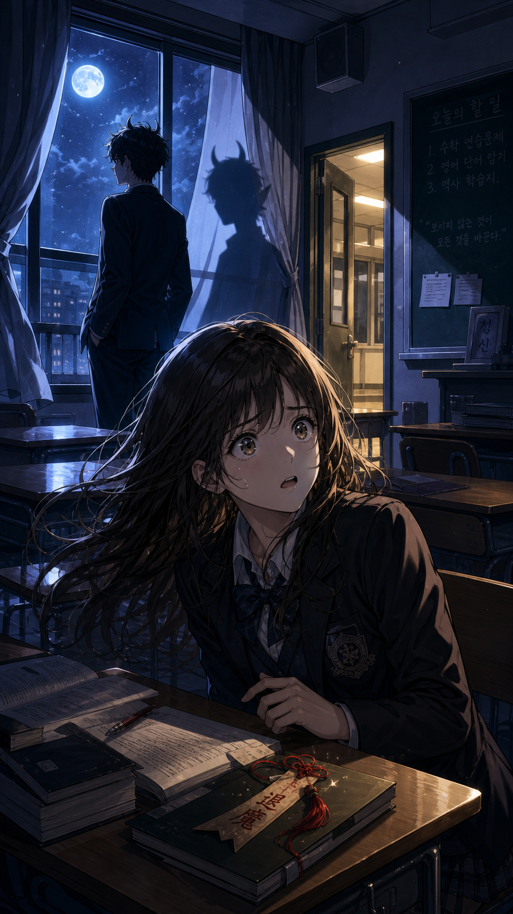

# 🗯️ 웹툰

파일: `gallery-webtoon.md` · 10개 · 사이트 갤러리(index)의 실제 한국어 프롬프트

이 파일은 사이트 갤러리에 실제로 실린 완성 프롬프트를 담습니다. 공통 작성 규칙은 [`craft.md`](craft.md)와 함께 봅니다.

---

## 1. 용을 깨운 신입 기사


- 카테고리: 웹툰
- 사이즈: 웹툰 · 세로형 · 1080x1920

```text
결과물 유형:
웹툰 대표 컷. 주제는 "용을 깨운 신입 기사"입니다. 완성 이미지는 모바일 웹툰 썸네일과 1화 첫 장면 사이의 완성도 높은 컷처럼 보여야 합니다.

주 피사체:
검은 망토를 두른 젊은 남자 주인공이 무너진 성문 앞에 뒷모습으로 홀로 서서, 성벽 위로 얼굴을 들이민 거대한 푸른 용을 올려다보는 장면. 주인공은 오른손에 검 한 자루를 아래로 늘어뜨려 쥐고 있습니다. 주인공은 화면 아래쪽 전경에 작게 배치하고, 푸르게 빛나는 두 눈을 가진 용의 얼굴과 좌우로 펼쳐진 거대한 날개가 화면 상단을 가득 채우게 합니다.

구도와 비율:
9:16 세로형. 아래에서 위를 올려다보는 낮은 앵글로 구성합니다. 주인공의 뒷모습 실루엣, 용의 빛나는 눈, 부서진 성문 아치, 흩날리는 먼지 입자가 한눈에 읽혀야 합니다.

맥락과 배경:
게임 판타지 분위기의 왕국 기사단 시험장. 새벽 안개, 깨진 성벽과 아치형 성문, 바닥에 흩어진 검과 부서진 투구·방패, 성문 아치 너머로 노을 지는 성채와 펄럭이는 깃발들을 배경 단서로 넣습니다.

스타일과 매체:
한국 모바일 웹툰 판타지 액션 스타일. 선명한 선화, 깊은 채색, 강한 명암, 컷 안에서 이야기가 바로 시작되는 연출을 사용합니다.

빛과 디테일:
푸른 용의 눈에서 나오는 차가운 빛과 성문 너머 새벽의 금빛 역광을 함께 사용합니다. 용 비늘의 질감, 주인공 망토 끝, 공중의 먼지, 성벽 균열을 또렷하게 표현합니다.

정확성 조건:
원작이 없는 신규 웹툰 장면으로 만듭니다. 화면 안에 읽히는 글자나 로고, 말풍선, UI는 넣지 않습니다. 손과 얼굴의 왜곡은 피합니다.
```

---

## 2. 황궁에 떨어진 계약 비서



- 카테고리: 웹툰
- 사이즈: 웹툰 · 세로형 · 1536x2048

```text
결과물 유형:
로맨스 판타지 웹툰 표지 컷. 주제는 "황궁에 떨어진 계약 비서"입니다. 완성 이미지는 로맨스 판타지 신작의 메인 커버처럼 보여야 합니다.

주 피사체:
현대식 검은 정장에 흰 셔츠, 목에 사원증 목걸이를 건 여자 주인공이 황궁 서재 전경에 서서 펜을 턱에 대고 서류 뭉치를 안고 있습니다. 사원증에는 "비서"와 "SECRETARY", 서류 맨 위에는 "연간 업무 보고서"와 노란 포스트잇의 "미팅 3시"가 보입니다. 뒤쪽 오른쪽에는 금장 자수와 모피 트림이 있는 흑금색 제국 예복을 입은 차가운 표정의 황태자가 붉은 "계약서"를 들고 있습니다. 두 인물의 시선과 거리감이 긴장과 호기심을 동시에 만들어야 합니다.

구도와 비율:
3:4 세로형. 여자 주인공은 화면 중앙 전경, 황태자는 오른쪽 뒤편 중경에 배치합니다. 오른쪽 아래 전경 책상에는 금장 문장과 붉은 밀랍 인장이 찍힌 큰 "계약서" 표지를 하나 더 놓아, 두 개의 계약서와 인물, 책장이 삼각형 구도를 이루게 합니다.

맥락과 배경:
로맨스 판타지 황궁 서재. 금장 책장, 붉은 커튼, 큰 아치형 창문, 쌓인 고서와 서류 더미, 낯선 세계에 떨어진 현대인의 당황한 표정을 넣습니다.

스타일과 매체:
한국 로맨스 판타지 웹툰 표지 스타일. 깨끗한 얼굴 작화, 화려하지만 절제된 의상 디테일, 부드러운 색 보정, 서사 중심의 커버 구성을 사용합니다.

빛과 디테일:
창문에서 들어오는 따뜻한 오후빛과 계약서 주변의 붉은 포인트 빛, 공중에 흩날리는 붉은 꽃잎을 사용합니다. 눈빛, 손가락, 종이 질감, 금장 장식, 머리카락 하이라이트를 섬세하게 표현합니다.

정확성 조건:
원작이 없는 신규 캐릭터로 만듭니다. 이미지 속 글자는 "비서", "SECRETARY", "연간 업무 보고서", "미팅 3시", "계약서"만 정확히 들어가야 하며, 실제 작품 로고, 과한 노출, 읽을 수 없는 제목 텍스트, 손가락 왜곡, 얼굴 비대칭은 피합니다.
```

---

## 3. 지하철역 각성자



- 카테고리: 웹툰
- 사이즈: 웹툰 · 가로형 · 1920x1080

```text
결과물 유형:
액션 판타지 웹툰 전투 컷. 주제는 "지하철역 각성자"입니다. 완성 이미지는 웹툰 1화 중반의 큰 액션 컷처럼 보여야 합니다.

주 피사체:
평범한 대학생 남자 주인공이 퇴근길 지하철역 플랫폼에서 검은 균열을 막기 위해 처음 힘을 쓰는 장면. 위로 뻗은 한 손에는 열차 그래픽이 인쇄된 빛나는 교통카드를 쥐고, 앞으로 내민 다른 손에서는 룬 문양이 도는 원형 푸른 에너지 방벽이 생겨납니다. 검은 후드 위에 밝은 베이지색 재킷을 걸치고 한쪽 어깨에 백팩을 멘 모습입니다.

구도와 비율:
16:9 가로형. 왼쪽에는 놀라 도망치는 승객들, 중앙에는 역동적으로 자세를 잡은 주인공, 오른쪽에는 균열에서 튀어나오는 괴물 실루엣을 배치합니다. 시선은 주인공 손의 빛에서 균열로 이어져야 합니다.

맥락과 배경:
한국 대도시 지하철역. 안전문, 노선 안내판, 광고판, 젖은 바닥의 반사, 멈춰 선 열차를 배경으로 넣습니다. 실제 상업 로고는 쓰지 않되, 안내판은 한국 지하철 특유의 픽토그램과 방향 안내로 구성합니다.

스타일과 매체:
현대 액션 판타지 웹툰 스타일. 빠른 속도감, 선명한 이펙트, 컷 가장자리의 긴장감, 캐릭터 표정 중심의 연출을 사용합니다.

빛과 디테일:
역사의 형광등과 균열의 보라색 빛, 주인공 손의 푸른 빛을 대비시킵니다. 흩날리는 먼지, 깨진 타일과 파편, 흔들리는 머리카락, 옷 주름, 에너지 파편을 또렷하게 표현합니다.

정확성 조건:
원작이 없는 신규 장면으로 만듭니다. 안내판에는 '나가는 곳'과 출구 화살표, 노선 번호 '2', 버스 픽토그램 정도의 한국어 안내만 또렷이 넣고, 실제 지하철 상업 로고나 읽을 수 없는 뭉개진 문구, 과도한 공포 표현, 손과 얼굴의 왜곡은 피합니다.
```

---

## 4. 편의점 고양이 사장님



- 카테고리: 웹툰
- 사이즈: 웹툰 · 정사각형 · 1024x1024

```text
결과물 유형:
코미디 웹툰 썸네일. 주제는 "편의점 고양이 사장님"입니다. 완성 이미지는 동물 주인공이 나오는 일상 코미디 웹툰의 대표 이미지처럼 보여야 합니다.

주 피사체:
"사장님" 명찰이 붙은 남색 앞치마를 두르고 빨간 목걸이에 금색 방울을 단 통통한 갈색 태비 고양이 사장님이 편의점 계산대 위에 앉아 한 손으로 빨간 레이저가 켜진 바코드 스캐너를 들고 있습니다. 오른쪽 뒤에는 검은 머리의 남자 아르바이트생이 입을 벌리고 놀란 표정으로 땀을 흘리며 역시 바코드 스캐너를 들고 있고, 머리 옆에는 노란 놀람 효과선이 있습니다. 그의 조끼에는 "알바" 이름표가 붙어 있습니다.

구도와 비율:
1:1 정사각형. 고양이 사장님을 중앙에 크게 배치하고, 계산대와 상품을 아래쪽에 둡니다. 아르바이트생은 오른쪽 뒤에서 표정이 보이게 배치합니다. 오른쪽 아래 구석에는 앞발을 든 마네키네코풍 복고양이 인형과 작은 화분을 둡니다.

맥락과 배경:
한국 동네 편의점 밤 근무 시간. 왼쪽에는 음료가 채워진 냉장고와 파란 "시원한 음료" 간판, 위쪽에는 노란 "오늘의 행사 / 컵라면 2+1 / 삼각김밥 1+1" 안내판, 오른쪽 위에는 "CCTV 녹화중" 표지와 밤 도시 야경 창문을 배경으로 넣습니다. 계산대 위에는 컵라면, 삼각김밥, 영수증, 껌 진열, 소품을 배치합니다.

스타일과 매체:
밝은 일상 개그 웹툰 스타일. 둥근 캐릭터 비율, 귀여운 표정, 깔끔한 색면, 과장된 리액션과 애니풍 효과선을 사용합니다.

빛과 디테일:
편의점 형광등의 밝은 빛과 냉장고의 차가운 빛을 섞습니다. 고양이 수염, 발바닥, 앞치마 주름, 상품 패키지의 단순한 형태를 또렷하게 표현합니다.

정확성 조건:
실제 편의점 브랜드나 상표 로고는 넣지 않습니다. 대신 다음 한글 문구를 또렷하게 넣습니다. 앞치마에 "사장님", 아르바이트생 이름표에 "알바", 냉장고 간판에 "시원한 음료", 행사 안내판에 "오늘의 행사 컵라면 2+1 삼각김밥 1+1", "CCTV 녹화중", 왼쪽 안내판에 "영수증은 필요하신 분만 말씀해주세요", 상품에 "컵라면"과 "삼각김밥 참치마요", 영수증에 "영수증 / 컵라면 1,500 / 삼각김밥 1,200 / 음료수 1,800 / 합계 4,500", 오른쪽 안내판에 "고객님! 늘 감사합니다", 껌 상자 세 개에 "상쾌한 민트", "달콤한 포도", "새콤한 레몬"을 표기합니다. 불필요한 말풍선과 과도한 배경 복잡도는 피합니다.
```

---

## 5. 회귀한 재벌가 막내딸



- 카테고리: 웹툰
- 사이즈: 웹툰 · 세로형 · 1080x1920

```text
결과물 유형:
현대물 웹툰 드라마 컷. 주제는 "회귀한 재벌가 막내딸"입니다. 완성 이미지는 회귀물 웹툰의 결정적인 첫 장면처럼 보여야 합니다.

주 피사체:
어린 시절로 돌아온 여자 주인공이 대저택 식탁 앞에서 차분하게 옅은 미소를 짓고 있습니다. 프릴 블라우스에 검은 리본을 매고, 한 손에 작은 은스푼을 들고 앞에 놓인 베리를 얹은 시리얼 볼을 향합니다. 주변 어른들은 각자 아침에 몰두해 그녀를 응시하지 않지만, 주인공의 눈빛은 이미 모든 상황을 알고 있는 사람처럼 단단해야 합니다.

구도와 비율:
9:16 세로형. 주인공은 화면 아래 중앙 전경에 정면으로 크게, 긴 식탁과 가족 인물들은 위쪽 배경으로 원근감 있게 배치합니다. 식탁의 길이와 상석 구도가 권력 관계를 보여주게 합니다.

맥락과 배경:
한국 재벌가 저택의 아침 식사 장면. 상석에 앉은 회색 머리 중년 남성, 좌우에 정장 차림 남녀 어른 넷, 뒤편에 서 있는 하녀 둘을 배치합니다. 큰 창 너머 정원과 저택, 긴 검은 대리석 식탁, 은식기와 은주전자, 신문, 크루아상 바구니, 흰 꽃, 차가운 대리석 바닥을 배경으로 넣습니다.

스타일과 매체:
현대 드라마 웹툰 스타일. 깨끗한 인물 작화, 미묘한 표정, 절제된 고급스러움, 드라마 포스터 같은 긴장감을 사용합니다.

빛과 디테일:
아침 햇살은 부드럽지만 인물 사이 그림자는 차갑게 처리합니다. 주인공의 눈동자, 손에 쥔 작은 스푼, 대리석 식탁의 반사, 유리잔과 은식기의 광택, 의상 질감을 섬세하게 표현합니다.

정확성 조건:
원작이 없는 신규 장면으로 만듭니다. 실제 기업명, 읽을 수 없는 신문 글자, 과한 장신구, 손과 얼굴의 왜곡은 피합니다.
```

---

## 6. 마법 약국의 밤 배달



- 카테고리: 웹툰
- 사이즈: 웹툰 · 가로형 · 1920x1080

```text
결과물 유형:
판타지 일상 웹툰 장면. 주제는 "마법 약국의 밤 배달"입니다. 완성 이미지는 따뜻한 힐링 판타지 웹툰의 한 컷처럼 보여야 합니다.

주 피사체:
작은 마법 약국 앞 비 오는 골목에서, 투명한 비닐 우산을 든 젊은 여자 주인공이 은은한 초록빛으로 빛나는 약병을 오른손으로 건네는 장면. 주인공은 후드 달린 갈색 로브와 가죽 크로스백을 착용하고 있습니다. 왼쪽 아래에는 작은 부엉이 배달 조수가 날개를 펴고 날고 있고, 화면 오른쪽 창문에서는 안경을 쓴 노년의 인물이 손을 내밀어 약병을 받고 있습니다. 등장인물은 주인공과 노인 두 명입니다.

구도와 비율:
16:9 가로형. 왼쪽에는 따뜻한 불빛의 약국 간판과 약병 진열장, 중앙에는 우산을 들고 약병을 건네는 주인공, 오른쪽에는 창문에서 손을 내밀어 약병을 받는 노인이 있는 낡은 주택을 배치합니다. 시선의 흐름은 왼쪽 약국에서 오른쪽 창문으로 이어집니다.

맥락과 배경:
한국 오래된 동네 골목과 판타지 요소가 섞인 밤 풍경. 젖은 보도블록, 작은 화분, 오래된 벽돌, 빗방울, 가로등, 은은하게 빛나는 약병을 넣습니다.

스타일과 매체:
힐링 판타지 웹툰 스타일. 부드러운 선화, 따뜻한 색감, 아기자기한 소품, 과장되지 않은 마법 연출을 사용합니다.

빛과 디테일:
약국의 주황빛, 비 오는 밤의 푸른빛, 약병의 작은 초록빛을 균형 있게 사용합니다. 빗방울, 우산 위 물방울, 부엉이 깃털, 약병 라벨의 단순한 형태를 표현합니다.

정확성 조건:
실제 상업 브랜드 간판은 넣지 않습니다. 이미지에 보이는 글자는 다음과 같이 정확히 표기합니다. 약국 간판 "별빛 약국"과 그 아래 "마음과 몸을 위한 처방", 약병 라벨 "안정의 차", 왼쪽 칠판 입간판 "오늘의 처방"과 "따뜻한 차 한 잔, 오늘 하루도 수고했어요.", 오른쪽 벽 주소판 "골목길 7-13". 읽을 수 없는 긴 글자, 과한 마법 효과, 인물 손 왜곡, 동물 형태 오류는 피합니다.
```

---

## 7. 검은 토끼 해결사



- 카테고리: 웹툰
- 사이즈: 웹툰 · 세로형 · 1536x2048

```text
결과물 유형:
동물 주인공 액션 웹툰 표지. 주제는 "검은 토끼 해결사"입니다. 완성 이미지는 동물 캐릭터가 주인공인 도시 누아르 액션 웹툰의 커버처럼 보여야 합니다.

주 피사체:
검은 정장과 롱코트를 입은 검은 토끼 해결사가 비 오는 옥상에 서서 정면을 응시합니다. 왼손에는 접힌 검은 우산을 들고, 오른팔에는 'CASE FILE'이라 적힌 낡은 갈색 사건 파일을 안고 있습니다. 사건 파일에는 발자국(발바닥) 도장과 붉은 봉인 자국이 붙어 있습니다.

구도와 비율:
3:4 세로형. 토끼 주인공을 화면 중앙에 크게 배치하고, 옥상 난간은 오른쪽으로 대각선으로 지나가게 두어 긴장감을 만듭니다. 도시 배경은 좌우로 넓게 내려다보이는 하이앵글로 펼칩니다.

맥락과 배경:
현대 도시 누아르 분위기. 젖은 콘크리트 옥상, 비상계단, 물탱크, 네온 간판의 반사, 창문 불빛을 배경에 넣습니다. 뒤쪽 건물 위와 골목에는 토끼를 쫓는 늑대형 추격자들의 실루엣 여럿이 뛰어오고, 바닥에는 젖은 발자국이 단서로 남습니다.

스타일과 매체:
동물 의인화 액션 웹툰 스타일. 귀여움보다 날카로운 실루엣과 사건물 분위기를 우선합니다. 선명한 선화, 제한된 색상, 강한 표정 연출을 사용합니다.

빛과 디테일:
하늘에는 밝은 보름달과 구름, 화면 우측에는 붉은 네온 간판(토끼 해골에 교차한 칼 문양)이 젖은 바닥에 붉게 반사됩니다. 붉은 간판빛과 차가운 달빛을 대비시키고, 젖은 털, 정장 주름, 우산 손잡이, 사건 파일 모서리, 도시의 작은 불빛과 빗줄기를 표현합니다.

정확성 조건:
사건 파일에는 "CASE FILE" 글자를 정확히 넣고, 그 외 실제 로고나 브랜드명은 넣지 않습니다. 과도한 폭력 표현, 읽을 수 없는 말풍선, 손과 발 형태 오류, 동물 얼굴 왜곡은 피합니다.
```

---

## 8. 퇴근 후 던전 식당



- 카테고리: 웹툰
- 사이즈: 웹툰 · 가로형 · 1920x1080

```text
결과물 유형:
현대 판타지 웹툰 단체 컷. 주제는 "퇴근 후 던전 식당"입니다. 완성 이미지는 직장인 판타지 코미디 웹툰의 대표 장면처럼 보여야 합니다.

주 피사체:
퇴근한 한국 직장인 세 명이 지하 던전 입구 옆 작은 식당에서 몬스터 재료로 만든 저녁을 먹는 장면. 왼쪽 남자는 흰 셔츠에 넥타이를 느슨하게 풀고 사원증 목걸이를 건 채 뒤통수에 손을 얹고 웃으며 얼음이 든 음료 머그를 듭니다. 가운데 짧은 단발 여성은 하늘색 셔츠에 사원증을 걸고, 귀여운 얼굴이 떠 있는 초록빛 슬라임 수프를 숟가락으로 조심스럽게 뜹니다. 오른쪽 남자는 어두운 정장과 안경 차림에 넥타이와 사원증을 하고 젓가락으로 꼬치 요리를 집습니다. 배경 주방에는 초록 피부에 요리사 모자와 앞치마를 두른 오크 요리사가 프라이팬으로 요리합니다.

구도와 비율:
16:9 가로형. 긴 나무 테이블을 화면 아래쪽에 두고, 인물 세 명을 좌우로 균형 있게 배치합니다. 뒤쪽에는 파란 결정이 빛나는 던전 입구와 왼쪽 식당 주방이 함께 보이게 합니다.

맥락과 배경:
현대 회사원 일상과 판타지 던전이 섞인 공간. 사원증, 도시락 가방, 서류 가방, 닫힌 노트북, 메뉴 간판, 돌벽, 마법 랜턴, 파란 던전 크리스털, 수프 김을 배경 단서로 넣습니다.

스타일과 매체:
현대 판타지 일상 웹툰 스타일. 음식의 따뜻함, 캐릭터 리액션, 판타지 소품의 재미가 함께 보이게 합니다.

빛과 디테일:
왼쪽 식당의 따뜻한 조명과 오른쪽 던전 입구의 푸른빛을 나눠 사용합니다. 음식 김, 그릇, 넥타이, 사원증, 메뉴판, 돌벽 질감을 또렷하게 표현합니다.

정확성 조건:
간판과 메뉴 문구는 또렷한 한글로 표기합니다. 상단 간판 "퇴근 후 던전 식당", 그 아래 "오늘의 메뉴: 골렘 스테이크, 슬라임 수프, 바실리스크 구이", 우상단 파란 표지판 "B1 던전 입구", 오른쪽 칠판 "오늘의 던전 정보 / 슬라임 숲 / 골렘의 광장 / 바실리스크 둥지", 왼쪽 칠판 "오늘의 추천 / 골렘 스테이크 / 슬라임 수프 / 바실리스크 구이 / 미믹 디저트", 테이블 위 팻말 "던전 식당 / 맛있게 먹고 레벨업 하세요!", 도시락에 붙은 메모 "오늘도 수고했어!"를 넣습니다. 실제 회사명이나 실존 식당 브랜드는 넣지 않습니다. 과도한 괴물 표현, 음식 형태 오류, 손 왜곡은 피합니다.
```

---

## 9. 달빛 아래 도깨비 전학생



- 카테고리: 웹툰
- 사이즈: 웹툰 · 세로형 · 1080x1920

```text
결과물 유형:
학원 판타지 웹툰 감정 컷. 주제는 "달빛 아래 도깨비 전학생"입니다. 완성 이미지는 학원 판타지 웹툰에서 주인공의 정체가 처음 드러나는 장면처럼 보여야 합니다.

주 피사체:
여자 주인공이 밤 교실 책상에 앉아, 창가에 등을 돌리고 선 남자 전학생의 그림자에 작은 뿔이 비치는 것을 발견하는 장면. 전학생은 창문 앞에 서 있고, 그의 실루엣 옆 벽으로 드리운 그림자에 뿔이 돋아 있습니다. 주인공은 전경 책상에서 눈을 크게 뜬 놀란 표정으로 그림자를 올려다봅니다. 인물은 두 명(전학생, 주인공)입니다.

구도와 비율:
9:16 세로형. 전학생의 실루엣과 뿔 달린 그림자를 화면 상단에 두고, 주인공의 표정을 화면 중앙, 부적이 놓인 책상을 하단 전경에 배치합니다. 뿔 그림자가 장면의 핵심 단서가 되어야 합니다.

맥락과 배경:
한국 고등학교 밤 교실. 오른쪽에 칠판, 열린 복도 문의 노란 불빛, 책상들, 흰 커튼, 창밖 보름달과 별밤 하늘, 전경 책상 위의 책과 노트, 펜, 붉은 끈 매듭과 붉은 술이 달린 청록색 부적을 배경 및 소품으로 넣습니다.

스타일과 매체:
학원 판타지 웹툰 스타일. 섬세한 표정, 긴장감 있는 조명, 과하지 않은 초자연 요소, 감정 중심의 컷 연출을 사용합니다.

빛과 디테일:
푸른 달빛과 복도의 노란빛을 대비시킵니다. 창문 커튼, 흩날리는 머리카락, 교복 주름과 리본, 책상 모서리, 부적의 붉은 끈과 술을 또렷하게 표현합니다.

정확성 조건:
실제 학교명이나 교표는 넣지 않습니다. 칠판에는 읽히는 한글로 "오늘의 할 일", "1. 수학 연습문제", "2. 영어 단어 암기", "3. 역사 학습지"와 인용구 "보이지 않는 것이 모든 것을 바꾼다."를 적고, 칠판 옆 작은 판에는 "청신"과 붉은 인장 문양을 둡니다. 과도한 공포 표현, 손과 얼굴 왜곡은 피합니다.
```

---

## 10. 바다 마을의 기계 심장


- 카테고리: 웹툰
- 사이즈: 웹툰 · 와이드 · 2520x1080

```text
결과물 유형:
웹툰 파노라마 컷. 주제는 "바다 마을의 기계 심장"입니다. 완성 이미지는 모험 판타지 웹툰의 장대한 챕터 오프닝처럼 보여야 합니다.

주 피사체:
어린 남매 주인공과 낡은 로봇 강아지가 바다 위 절벽 마을을 바라보는 장면. 마을 중심에는 거대한 톱니바퀴 등대가 천천히 빛나고, 바다 위에는 작은 배들이 떠 있습니다.

구도와 비율:
21:9 와이드. 주인공 일행은 왼쪽 전경에 작게 두고, 절벽 마을과 기계 등대를 오른쪽과 중앙에 크게 배치합니다. 넓은 바다와 하늘이 모험의 규모를 보여줘야 합니다.

맥락과 배경:
스팀펑크와 해안 마을이 섞인 판타지 세계. 낡은 배, 바람개비, 녹슨 파이프, 빨랫줄, 갈매기, 바다 안개를 배경 단서로 넣습니다.

스타일과 매체:
모험 판타지 웹툰 스타일. 따뜻한 색감, 섬세한 배경, 캐릭터 실루엣, 챕터 오프닝 같은 스케일을 사용합니다.

빛과 디테일:
노을빛과 등대의 금빛을 함께 사용합니다. 파도, 절벽, 녹슨 금속, 로봇 강아지의 귀, 남매의 작은 가방, 마을 창문의 빛을 표현합니다.

정확성 조건:
원작이 없는 신규 장면으로 만듭니다. 실제 로고, 읽을 수 없는 표지판, 과도하게 복잡한 기계 구조, 캐릭터 손과 얼굴 왜곡은 피합니다.
```
